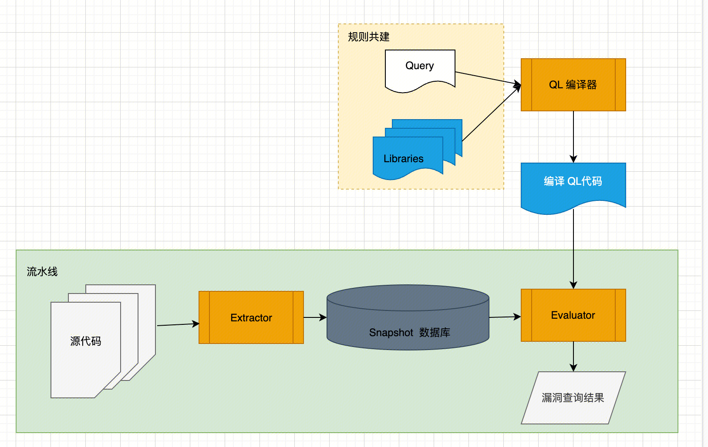
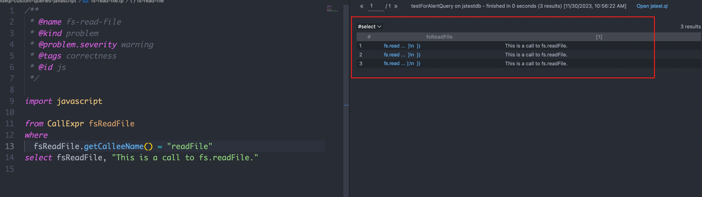
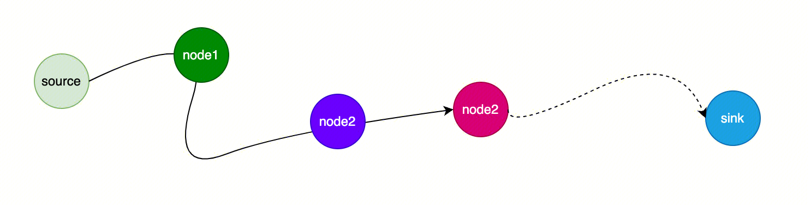
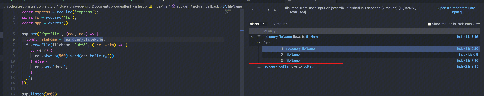
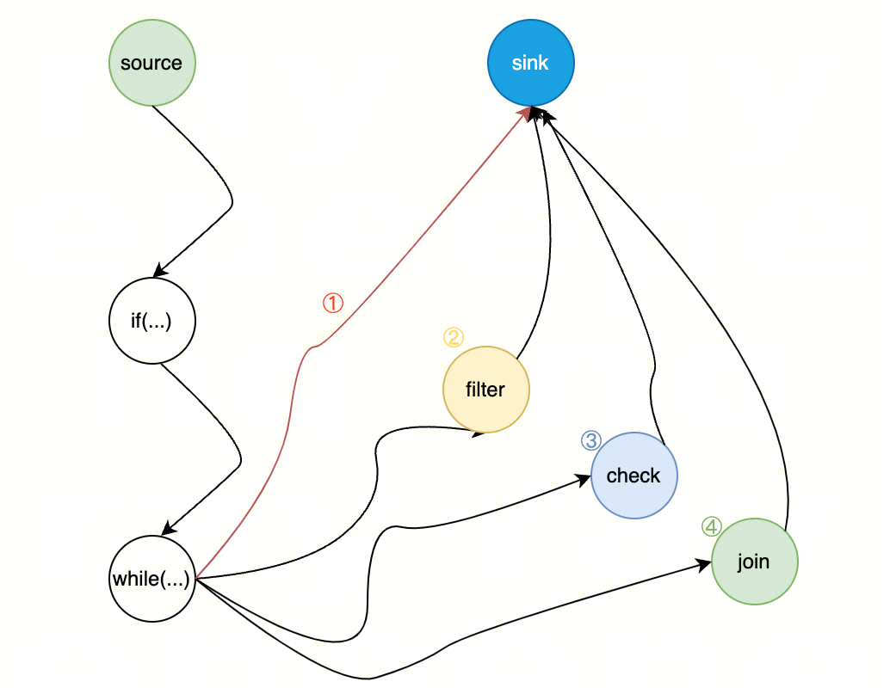
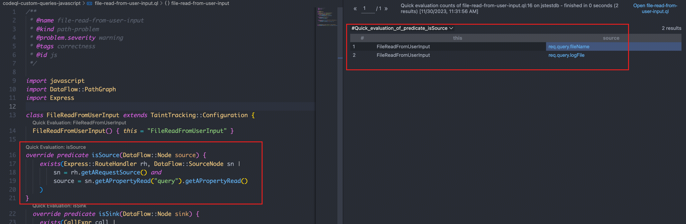
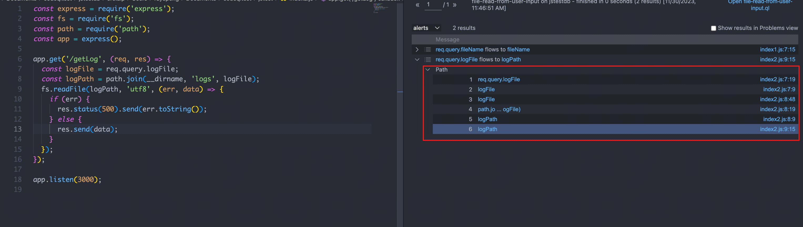

 Codeql 原理分析（一）


 Codeql原理概述

codeql整个漏洞扫描可以分为两部分：

- AST数据库创建，通过命令行工具即可
- 规则编写，类似SQL的语法来编写漏洞查询规则

<!--  -->


分为编译型语言和非编译型语言

- 非编译型语言，如python、js

```bash
codeql database create --language=javascript --source-root <folder-to-extract> databaseName
```

- 编译型语言，如cpp、go

```bash
codeql database create "xxx" --language=cpp -c "gcc main.c"
```


编译出来的数据库长这样：

```bash
.
├── baseline-info.json
├── codeql-database.yml
├── db-javascript
│   ├── default
│   ├── semmlecode.javascript.dbscheme
│   └── semmlecode.javascript.dbscheme.stats
├── diagnostic
│   ├── cli-diagnostics-add-20231128T030607.340Z.json
│   ├── extractors
│   └── tracer
├── log
│   └── database-create-20231128.110453.457.log
└── src.zip
```

- 重点是 `db-javascript` 文件夹，包含了对应的AST结构数据库结构
- `log` 目录和日志相关
- `src.zip`是源代码的备份

	 

 规则编写——打点

 一个简单的规则

比如任意文件读取漏洞，如下 `fs.readFile` 函数存在任意文件读取漏洞

```js
const express = require('express');
const fs = require('fs');
const app = express();

app.get('/getFile', (req, res) => {
  const fileName = req.query.fileName;
  fs.readFile(fileName, 'utf8', (err, data) => {
    if (err) {
      res.status(500).send(err.toString());
    } else {
      res.send(data);
    }
  });
});

app.listen(3000);
```


我们可以将代码中含有 `fs.readFile` 函数的代码都提取出来，编写规则如下：

```js
/**
 * @name fs-read-file
 * @kind problem
 * @problem.severity warning
 * @tags correctness
 * @id js
 */

import javascript

from CallExpr fsReadFile
where
  fsReadFile.getCalleeName() = "readFile"
select fsReadFile, "This is a call to fs.readFile."
```

codeql查询本质是通过AST树来查找的，写法类似SQL的写法

- from 定义变量，比如我们想查询 `readFile` ，这是一个函数调用表达式 `CallExpr`
- 还有一些限制条件，这个函数调用表达式的被调用函数名称，类似 sql 的where条件写法
- 最后select出查询的结果

当然很明显，存在大量的误报，所有的 `fs.readFile` 函数都会被认为是存在漏洞

<!--  -->


所以我们面临一个问题，即如何区分正常的代码和有污点的代码 **sink**

 污点分析原理


<!--  -->

 

如图，我们定义

- source：数据源，代表直接引入不受信任的数据或者机密数据到系统中
- sink：污点汇聚点，代表直接产生安全敏感操作或者泄露隐私数据到外界

至于其中经过的一个个Node，可以认为是词法分析里最小的一个个Token，代表着if、while、for、函数调用等

污点分析的步骤：

只要我们标记了source和sink，
codeql会判断只要满足有一条路径能够从 source 流向 sink ，就会认为这是一个漏洞

<!--  -->


 

 污点分析的局限

官方没有公开原理，但是经过多轮测试我们发现codeql追踪最准的还是赋值语句，**路径**更多的是形式上的，并且没有考虑到语言特性：


**代码1：**

```js
let x = process.argv[0]
let ctrl = 1
let y

if(ctrl > 0){
    y = 1
}else{
    y = x
}
eval(y)
```

- source 定义为 `process.argv[0]`
- sink 定义为 `eval(y)`

尽管 ctrl 永远是大于0的，但codeql还是会判断存在从source到sink的路径


**代码2**

```js
let x = process.argv[0]
Object.prototype.a = x

let y = {}
eval(y.a)

// 或者
let x = process.argv[0]

let c = {}
c.a = x

let y = {
    b:c
}
eval(y.b.a)
```

实际上这里都存在问题，但codeql均无法召回


 细化污点规则

codeql的判断是比较有限的，如果仅仅标记source和sink会出现大量的误报和漏报情况

分析这些情况，大致可以归纳从 source 到 sink 所经过的代码路径为如下四种（代码特性的除外需要额外做判断）

1. 经过一系列正常的 if、while 等正常流程到达 sink
2. 经过一个filter函数过滤到达sink
3. 经过一个check函数，如果不满足条件，则无法到达sink，但形式上还是可以流向sink的
4. 经过一个正常的join等函数到达sink

<!--  -->


- 数据源通过无害处理到达污点sink

```js
const express = require('express');
const fs = require('fs');
const app = express();
  
function sanitizePath(path) {
  // 简单的清理逻辑，例如移除路径导航字符
  return path.replace(/(\.\.\/|\/\.\.)/g, '');
}
  
  
app.get('/getFile', (req, res) => {
  const fileName = req.query.fileName;
  const safeFileName = sanitizePath(fileName);
  fs.readFile(safeFileName, 'utf8', (err, data) => {
    if (err) {
      res.status(500).send(err.toString());
    } else {
      res.send(data);
    }
  });
});
  
app.listen(3000);
```

  

- 数据源检查不通过直接返回

```js
const express = require('express');
const fs = require('fs');
const app = express();
  
  
const SAFE_DIRECTORY = '/path/to/safe/directory';
  
app.get('/getFile', (req, res) => {
  const fileName = req.query.fileName;
  if (!fileName.startsWith(SAFE_DIRECTORY)) {
    // 不允许读取
    return res.status(403).send('Access denied');
  }
  fs.readFile(fileName, 'utf8', (err, data) => {
    if (err) {
      res.status(500).send(err.toString());
    } else {
      res.send(data);
    }
  });
});
  
app.listen(3000);
```

  

- 数据源直接到达污点，或者经过多个处理到达污点（实际是两种）

```js
const express = require('express');
const fs = require('fs');
const path = require('path');
const app = express();

app.get('/getLog', (req, res) => {
  const logFile = req.query.logFile;
  const logPath = path.join(__dirname, 'logs', logFile); // 经过path.join 
  fs.readFile(logPath, 'utf8', (err, data) => {
    if (err) {
      res.status(500).send(err.toString());
    } else {
      res.send(data);
    }
  });
});

app.listen(3000);
```

 

因此我们需要做额外的处理，除了定义source和sink之外，还需要增加 barrier、sanitizer、AdditionTaintStep

- filter：无害处理(sanitizer)，代表通过数据加密或者移除危害操作等手段使数据传播不再对软件系统的信息安全产生危害
- barrier：屏障，不同于sanitizer，barrier不清理或改变数据，而是作为条件检查或决策点，阻止数据流的某些路径。
- AdditionTaintStep: source在传递的过程中可能断开，这时需要手动连接


 编写污点分析规则

codeql中提供了两种方式来分析

- 静态规则，即AST树查询，以AST树节点的方式呈现，属于静态分析
- 动态规则，即数据流DataFlow查询，抽象为 `DataFlow::Node` 基类，属于动态分析

AST树很好理解，`DataFlow` 会有点抽象，主要分为几种不同的节点

- `DataFlow::Node` 可以表示程序里的任何元素，基类，即词法分析里的Token

```js
var x = 10; // 'x' 和 '10' 都可以是 DataFlow::Node 的实例
var y = x + 5; // 'y', 'x + 5', 'x', 和 '5' 也都是 DataFlow::Node 的实例
```

- `DataFlow::ValueNode` 用于表示程序中的值或者表达式

```js
var name = "Alice"; // 'name' 和 "Alice" 都是 DataFlow::ValueNode 的实例
function greet() {
    return "Hello, " + name; // 'return "Hello, " + name;' 是 DataFlow::ValueNode 的实例
}
```


- `DataFlow::SourceNode` 表示程序的输入点，如用户输入，文件读取等
- `DataFlow::SinkNode` 表示可能存在sink的点
- `DataFlow::PathNode` 用于敏感数据分析的变量，没有特殊的用途了

编写规则一般的流程是：

- 定义source，即输入数据源是什么，可以理解为是外部输入的数据
- 定义sink，即污点代码，比如 `readFile`
- 定义isBarrier、isSanitizer、isAdditionalTaintStep （非必需，只是为了减少误报和漏报）

一般框架如下：

```js
import javascript
import DataFlow::PathGraph
import Express

class FileReadFromUserInput extends TaintTracking::Configuration {
  FileReadFromUserInput() { this = "FileReadFromUserInput" }

  override predicate isSource(DataFlow::Node source) {
		// 定义Source
  }
  override predicate isSink(DataFlow::Node sink) {
		// 定义Sink
  }
}
```

codeql通过类似函数的写法，结合AST语法树的查询来打点标记，比如标记eval处的sink点

```js
   override predicate isSink(DataFlow::Node sink) {
    // Eval is a sink
    exists(CallExpr call |
        call.getCalleeName() = "eval" and
        sink.asExpr() = call.getArgument(0)
      )
   }
```


最后查询：

```js
from FileReadFromUserInput cfg, DataFlow::PathNode source, DataFlow::PathNode sink
where cfg.hasFlowPath(source, sink)
select sink.getNode(), source, sink, "$@ flows to $@ ", source.getNode(), source.toString(), sink.getNode(), sink.toString()
```

 Source

express框架里，Source一般比较固定，即 `req.query.xxxx` 就是外部输入的数据

Source的编写本质也是通过AST语法树来查找，对于现成的框架如express，codeql有编写好的规则可以直接用

```sql
override predicate isSource(DataFlow::Node source) {
    exists(Express::RouteHandler rh, DataFlow::SourceNode sn |
        sn = rh.getARequestSource() and
        source = sn.getAPropertyRead("query").getAPropertyRead()
    )
}
```

 

- `exists` 也是一个谓词，这里是为了简单地引入临时变量
- `Express::RouteHandler` 是内置的一个规则，能查找出express对应的路由处理代码

注意这里的 `=` 要从右到左看，本质上是赋值的意思

写完之后就可以马上select一下看看结果：

<!--  -->


 Sink

由于是处理任意文件读取漏洞，sink就是我们最开始编写的查找 `readFile` 调用。额外注意的是，还需要标注对应的sink点

`fs.readFile` 的第一个参数是可能被控制的点，因此通过

`sink.asExpr() = call.getArgument(0)` (这里的sink要做下数据类型转换，DataFlow和AST节点是两个模型）

```sql
  override predicate isSink(DataFlow::Node sink) {
    exists(CallExpr call |
        call.getCalleeName() = "readFile" and
        sink.asExpr() = call.getArgument(0)
      )
  }
```

 AdditionalTaintStep

但是这种情况下会存在漏洞，比如这个就无法找到，因为经过了 `path.join` ，source被传递了

```js
const express = require('express');
const fs = require('fs');
const path = require('path');
const app = express();

app.get('/getLog', (req, res) => {
  const logFile = req.query.logFile;
  const logPath = path.join(__dirname, 'logs', logFile);
  fs.readFile(logPath, 'utf8', (err, data) => {
    if (err) {
      res.status(500).send(err.toString());
    } else {
      res.send(data);
    }
  });
});

app.listen(3000);
```

所以需要额外编写一个 `isAdditionalTaintStep`，即如果遇到了 `join` 这种函数，可以视作source经过了一次传递，后继节点可以继续连接上

```sql
  override predicate isAdditionalTaintStep(DataFlow::Node pred, DataFlow::Node succ) {
    exists(CallExpr call |
        call.getCalleeName() = "join" and (
            pred.asExpr() = call.getAnArgument() and succ.asExpr() = call
        )
    )
  }
```


 最终汇总的规则与结果分析

最后的规则汇总，不过还是存在一些误报，即没有处理 sanitizer

```sql
/**
 * @name file-read-from-user-input
 * @kind path-problem
 * @problem.severity warning
 * @tags correctness
 * @id js
 */

import javascript
import DataFlow::PathGraph
import Express

class FileReadFromUserInput extends TaintTracking::Configuration {
  FileReadFromUserInput() { this = "FileReadFromUserInput" }

  override predicate isSource(DataFlow::Node source) {
      exists(Express::RouteHandler rh, DataFlow::SourceNode sn |
          sn = rh.getARequestSource() and
          source = sn.getAPropertyRead("query").getAPropertyRead()
      )
  }
  override predicate isSink(DataFlow::Node sink) {
    exists(CallExpr call |
        call.getCalleeName() = "readFile" and
        sink.asExpr() = call.getArgument(0)
      )
  }

  override predicate isAdditionalTaintStep(DataFlow::Node pred, DataFlow::Node succ) {
    exists(CallExpr call |
        call.getCalleeName() = "join" and (
            pred.asExpr() = call.getAnArgument() and succ.asExpr() = call
        )
    )
  }

}

from FileReadFromUserInput cfg, DataFlow::PathNode source, DataFlow::PathNode sink
where cfg.hasFlowPath(source, sink)
select sink.getNode(), source, sink, "$@ flows to $@ ", source.getNode(), source.toString(), sink.getNode(), sink.toString()
```

Select的结果中也可以看到数据流向

<!--  -->

