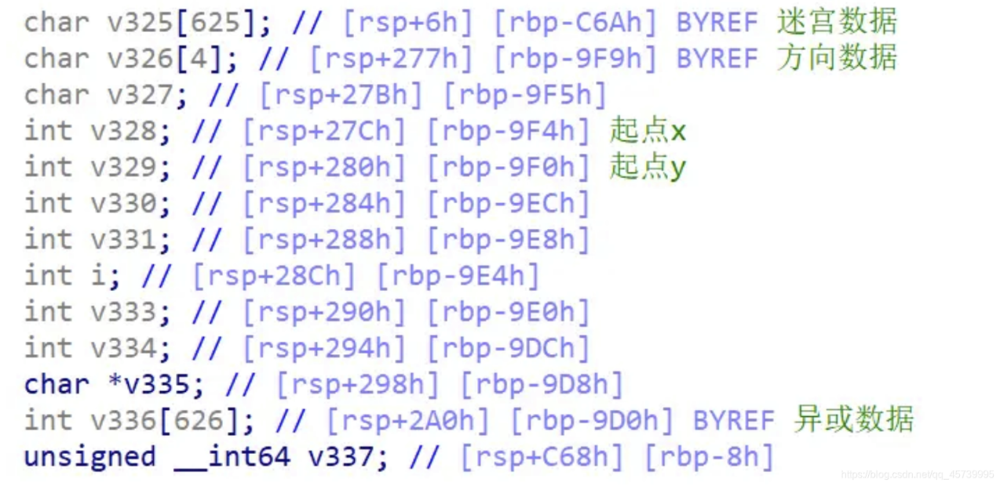
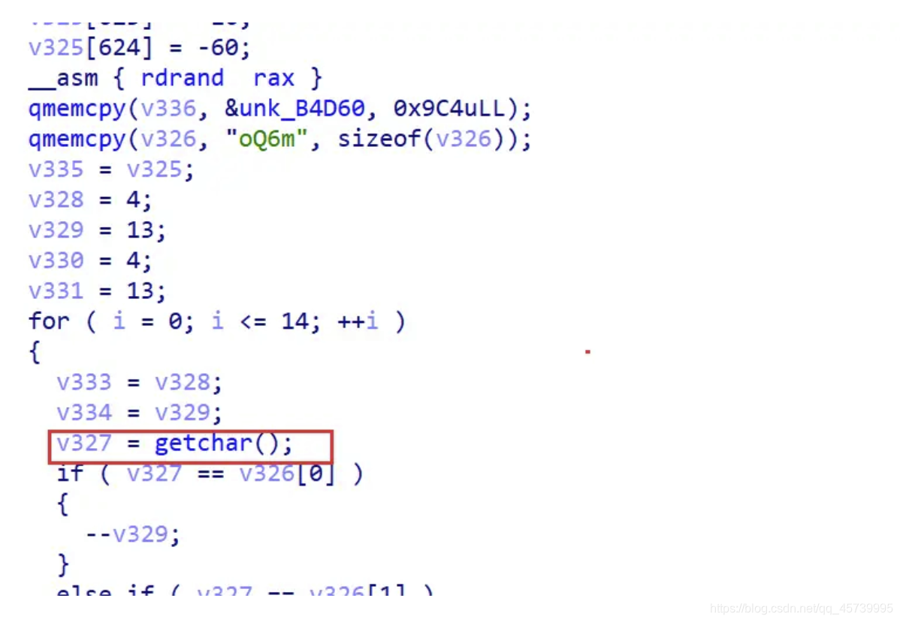

  Unicorn 模拟执行工具使用


<!--  -->


 认识模拟执行

我们很多时候都喜欢用真机来调试，因为真机环境是最好的，但有时候我们找不到一个真机环境，或者环境很难复现（比如路由器分析等），此时自然而然就会想到模拟器，类似Windows上的夜神模拟器，Linux的qemu模拟器

但是模拟器还是存在一定的局限性，比如夜神模拟器其实是只能运行x86\_64的指令集，此时模拟执行框架就应运而出了。

Unicorn 就是一款非常优秀的跨平台模拟执行框架，该框架可以跨平台执行Arm, Arm64 (Armv8), M68K, Mips, Sparc, & X86 (include X86\_64)等指令集的原生程序。

 使用unicorn

我比较喜欢开门见山地直接演示代码执行，安装的话比较简单，pip install就好

那么在使用unicorn的过程中，需要有几个步骤：

- step1: `mu = Uc(UC_ARCH_ARM, UC_MODE_THUMB)` 初始化一个虚拟机，选择你的指令集和架构
- step2: `mu.mem_map(ADDRESS, 2 * 0x10000)` 映射一段内存区域
- step3: `mu.mem_write(ADDRESS, ARM_CODE)` 往内存区域中写入一段代码
- step4: `mu.reg_write` 设置寄存器的值，即运行代码上下文的环境
- step5: `mu.emu_start` 开机模拟
- step6: 监控运行过程中的状态，比如单条指令执行结果，寄存器值的变化，类似gdb调试一样

了解了上述过程，我想模拟执行的大致流程就出来了，如下是实际运行一段代码

```python
from unicorn import *
from unicorn.arm_const import *
ARM_CODE   = b"\x37\x00\xa0\xe3\x03\x10\x42\xe0"
 mov r0, 0x37;
 sub r1, r2, r3
 Test ARM
 
 callback for tracing instructions
def hook_code(uc, address, size, user_data):
    print(">>> Tracing instruction at 0x%x, instruction size = 0x%x" %(address, size))
 
def test_arm():
    print("Emulate ARM code")
    try:
         Initialize emulator in ARM mode
        mu = Uc(UC_ARCH_ARM, UC_MODE_THUMB)
 
         map 2MB memory for this emulation
         uc_mem_map 映射的内存 address和size都要和0x1000对齐
        ADDRESS = 0x10000
        mu.mem_map(ADDRESS, 2 * 0x10000)
        mu.mem_write(ADDRESS, ARM_CODE)
 
        mu.reg_write(UC_ARM_REG_R0, 0x1234)
        mu.reg_write(UC_ARM_REG_R2, 0x6789)
        mu.reg_write(UC_ARM_REG_R3, 0x3333)

         hook UC_HOOK_CODE 是指令级别的hook
        mu.hook_add(UC_HOOK_CODE, hook_code, begin=ADDRESS, end=ADDRESS)
         emulate machine code in infinite time
        mu.emu_start(ADDRESS, ADDRESS + len(ARM_CODE))
        r0 = mu.reg_read(UC_ARM_REG_R0)
        r1 = mu.reg_read(UC_ARM_REG_R1)
        print(">>> R0 = 0x%x" % r0)
        print(">>> R1 = 0x%x" % r1)
    except UcError as e:
        print("ERROR: %s" % e)

test_arm()
```


如上代码，我们想要模拟执行一段 arm 的代码，当然代码很简单，你可以一眼就看出运行结果

```python
mov r0, 0x37
sub r1, r2, r3
```

此时我们要做的就是按照 step1~step6 的过程来编写代码，然后这里重点讲一下是如何监控调试的

Unicorn 提供了指令级别的hook，只需要编写回调的函数，就能监控上下文

```python
 callback for tracing instructions
def hook_code(uc, address, size, user_data):
    print(">>> Tracing instruction at 0x%x, instruction size = 0x%x" %(address, size))
         

... 省略代码
		 hook UC_HOOK_CODE 是指令级别的hook
        mu.hook_add(UC_HOOK_CODE, hook_code, begin=ADDRESS, end=ADDRESS)
```

最后我们读取执行完这段代码后的寄存器结果如下：

```python
❯ python unicorn_t2.py
Emulate ARM code
>>> Tracing instruction at 0x10000, instruction size = 0x4
>>> R0 = 0x37
>>> R1 = 0x3456
```


 unicorn能做什么？


既然用了如此强大的模拟执行框架，那么我们就可以用来… 写汇编！

笑死，以前我想模拟跑一个x86或者arm汇编的时候，还会为环境模拟而头疼，此时有了unicorn，那就可以很轻松地写任何语言的汇编了嘛！

比如我们用arm来写一个计算斐波那契数列的汇编，学习一下arm的指令

三个寄存器就够了，互相做加法，最后的代码：

```
.global main
main:
    MOV R0, 10          // 设置斐波那契数列的长度为10
    MOV R1, 0           // 初始化第一个斐波那契数为0
    MOV R2, 1           // 初始化第二个斐波那契数为1
loop:
    CMP R0, 0           // 检查计数器是否为0
    BEQ end              // 如果计数器为0，则跳转到end
    ADD R3, R1, R2       // 计算下一个斐波那契数
    MOV R1, R2           // 更新第一个斐波那契数为当前第二个斐波那契数
    MOV R2, R3           // 更新第二个斐波那契数为刚计算出的数
    SUB R0, R0, 1       // 计数器减1
    B loop               // 跳转回循环开始处
end:
    // 结束程序
```


 arm汇编指令学习

记录下常见的arm汇编指令如下：

1. `MOV`: 数据传输指令。用于将立即数或另一个寄存器的值移动到一个寄存器。例如，`MOV R0, 10` 将10移动到寄存器R0。
2. `CMP`: 比较指令。用于比较两个寄存器的值。结果不存储，但影响状态寄存器（设置条件标志）。例如，`CMP R0, 0` 比较R0和0。
3. `BEQ`: 条件分支指令。如果最近的 `CMP` 结果为相等，则跳转到标签。例如，`BEQ end` 如果条件满足（相等）则跳转到 `end`。
4. `ADD`: 加法指令。将两个寄存器的值相加并存储到另一寄存器。例如，`ADD R3, R1, R2` 把R1和R2的值相加，结果存储在R3。
5. `SUB`: 减法指令。从一个寄存器的值中减去另一个寄存器的值或立即数。例如，`SUB R0, R0, 1` 是将R0的值减1。
6. `B`: 无条件跳转指令。跳转到指定的标签。例如，`B loop` 无条件跳转回 `loop` 标签。
7. `LDR/STR` (Load/Store): 用于从内存加载数据到寄存器或将数据从寄存器存储到内存。 
   - 示例：`LDR R3, [R1]` 从由R1指定的内存地址加载数据到R3。
   - 示例：`STR R3, [R1]` 将R3的数据存储到由R1指定的内存地址。
8.  `BL/BLX` (Branch with Link/Branch with Link and Exchange): 用于函数调用，保存返回地址到链接寄存器（LR）。
   - 示例：`BL function_name` 调用名为 `function_name` 的函数，并将返回地址保存在LR中。
9. `PUSH/POP` (Stack Push/Stack Pop): 用于操作堆栈，通常在函数调用中保存和恢复寄存器。
   - 示例：`PUSH {R0, R1, LR}` 将R0, R1, 和链接寄存器LR压栈。
   - 示例：`POP {R0, R1, LR}` 从堆栈中弹出数据到R0, R1, 和LR。
10.  `BNE, BGT, BLE, etc.` (Branch if Not Equal, Branch if Greater Than, Branch if Less or Equal, etc.): 条件分支指令，基于CMP指令设置的标志进行分支。
   - 示例：`BNE somewhere` 如果最后一次比较结果不相等，则跳转到 `somewhere`。


  模拟执行

这里因为我们是直接写的arm汇编代码，机器其实是不认识的，因此还需要借助 keystone 工具来将其转为机器码，转为机器码之后就可以模拟执行了

```
from unicorn import *
from unicorn.arm_const import *
from keystone import *

 ARM汇编代码
arm_code = """
.global main
main:
    MOV R0, 10          // 设置斐波那契数列的长度为10
    MOV R1, 0           // 初始化第一个斐波那契数为0
    MOV R2, 1           // 初始化第二个斐波那契数为1
loop:
    CMP R0, 0           // 检查计数器是否为0
    BEQ end              // 如果计数器为0，则跳转到end
    ADD R3, R1, R2       // 计算下一个斐波那契数
    MOV R1, R2           // 更新第一个斐波那契数为当前第二个斐波那契数
    MOV R2, R3           // 更新第二个斐波那契数为刚计算出的数
    SUB R0, R0, 1       // 计数器减1
    B loop               // 跳转回循环开始处
end:
    // 结束程序
"""

 初始化Keystone引擎
ks = Ks(KS_ARCH_ARM, KS_MODE_ARM)

 将ARM汇编代码编译为二进制代码
arm_code_binary, _ = ks.asm(arm_code.encode())

 设置模拟器
mu = Uc(UC_ARCH_ARM, UC_MODE_ARM)

 分配内存空间并将ARM代码加载到内存中
ADDRESS = 0x1000000
mu.mem_map(ADDRESS, 0x1000)
mu.mem_write(ADDRESS, bytes(arm_code_binary))

 设置寄存器初始值
mu.reg_write(UC_ARM_REG_SP, 0x7fffffff)

 定义hook函数，在每条指令执行后输出寄存器的值
def hook_code(uc, address, size, user_data):
    print(f"Instruction at 0x{address:x} executed")
     寄存器名称映射
    reg_names = {
        UC_ARM_REG_R0: 'R0',
        UC_ARM_REG_R1: 'R1',
        UC_ARM_REG_R2: 'R2',
        UC_ARM_REG_R3: 'R3',
    }
    for reg in [UC_ARM_REG_R0, UC_ARM_REG_R1, UC_ARM_REG_R2, UC_ARM_REG_R3]:
        reg_value = mu.reg_read(reg)
        reg_name = reg_names.get(reg, 'Unknown')
        print(f"{reg_name}: {reg_value}")
    print()

 添加hook函数，在每条指令执行后触发
mu.hook_add(UC_HOOK_CODE, hook_code)

 开始模拟执行
try:
    mu.emu_start(ADDRESS, ADDRESS + len(arm_code_binary))
except UcError as e:
    print(f"Error: {e}")

 输出寄存器值
print("R1:", mu.reg_read(UC_ARM_REG_R1))
print("R2:", mu.reg_read(UC_ARM_REG_R2))
print("最终结果 R3:", mu.reg_read(UC_ARM_REG_R3))
```


 解题

网上能找到的比较有意思的题目应该就是这道 100mazes了，参考： [ 例题：MTCTF2021 100mazes ](https://yaoxixixi.github.io/2021/08/03/unicorn/)

题目的要求是： 有100个迷宫，需要给出每个迷宫的路线，最后提交这些路线的md5结果作为flag

那肯定是不能直接手动求解啊，于是观察每个迷宫的代码：


<!--  -->


然后每个函数其实都是读取迷宫数据，再根据你的输入路线判断能否到达终点： 


<!--  -->


那么就可以编写代码，提取到迷宫数据，然后再通过dfs搜索能否走到迷宫了（其实不用模拟执行也不是不行？毕竟你也可以通过写脚本比如idapython提取迷宫数据，然后再编写代码走迷宫）


这里就重点分析下他是如何用unicorn去模拟执行代码的，虽然unicorn是能直接模拟指令层面的，但是对于类似printf这类函数就无能为力了，因此需要做额外处理

另外就是这里除了寄存器，还需要模拟一个栈

关键代码就是这个，
```python
def hook_code(uc, address, size, user_data):
    global map_data, str_map, ans_map, ans, all_input
     print('>>> Tracing instruction at 0x%x, instruction size = 0x%x' % (address, size))
    assert isinstance(uc, Uc)
    code = uc.mem_read(address, 4)
    if code == b"\x48\x0F\xC7\xF0":
        uc.reg_write(UC_X86_REG_RIP, address + 4)        遇见rdrand rax直接跳过

    if address == 0x640:                                 遇见printf ret
        rsp = uc.reg_read(UC_X86_REG_RSP)
        retn_addr = u64(uc.mem_read(rsp, 8))
        uc.reg_write(UC_X86_REG_RIP, retn_addr)
    elif address == 0x650:                               遇见getchar  读取迷宫
        rbp = uc.reg_read(UC_X86_REG_RBP)
        maze_data = uc.mem_read(rbp - 0xC6A, 0x625)      迷宫数据
        step_data = uc.mem_read(rbp - 0x9F9, 4).decode() 方向数据
        xor_data = uc.mem_read(rbp - 0x9D0, 0x9C4)       异或数据
        lr_val = u32(uc.mem_read(rbp - 0x9F4, 4))        起点x
        ur_val = u32(uc.mem_read(rbp - 0x9F0, 4))        起点y

        maze_data = list(maze_data)                      异或
        for i in range(0, 0x9C4, 4):
            maze_data[i // 4] ^= u32(xor_data[i: i + 4])

        for i in range(25):                              合成最终的迷宫
            line_data = ""
            for j in range(25):
                line_data += chr(maze_data[i * 25 + j])
             print(line_data)

        map_data = maze_data
        str_map = step_data
        ans = ""
        assert dfs(0, -1, -1, lr_val, ur_val)           深搜
         print(ans)
        all_input += ans

                                                        leave;ret
        rbp = uc.reg_read(UC_X86_REG_RBP)
        new_rbp = u64(uc.mem_read(rbp, 8))
        retn_addr = u64(uc.mem_read(rbp + 8, 8))
        uc.reg_write(UC_X86_REG_RBP, new_rbp)
        uc.reg_write(UC_X86_REG_RSP, rbp + 0x18)
        uc.reg_write(UC_X86_REG_RIP, retn_addr)
```


