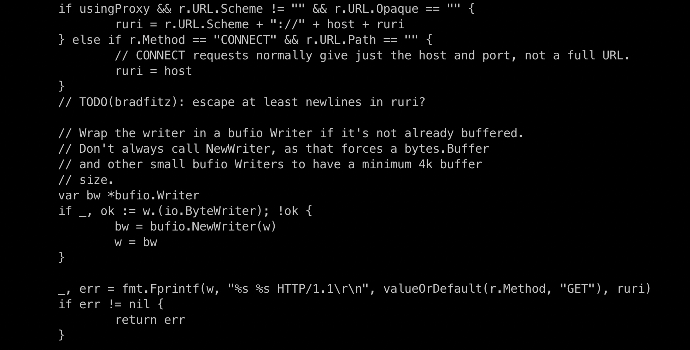

 golang 安全问题


 net/http CRLF漏洞

没有判断：

<!--  -->


```bash
docker pull golang:1.11.5-alpine3.7
```


```go
ruri := r.URL.RequestURI()
if usingProxy && r.URL.Scheme != "" && r.URL.Opaque == "" {
	ruri = r.URL.Scheme + "://" + host + ruri
} else if r.Method == "CONNECT" && r.URL.Path == "" {
	// CONNECT requests normally give just the host and port, not a full URL.
	ruri = host
	if r.URL.Opaque != "" {
		ruri = r.URL.Opaque
	}
}
if stringContainsCTLByte(ruri) {
	return errors.New("net/http: can't write control character in Request.URL")
}
```


移除掉CRLF

```go
// stringContainsCTLByte reports whether s contains any ASCII control character.
func stringContainsCTLByte(s string) bool {
	for i := 0; i < len(s); i++ {
		b := s[i]
		if b < ' ' || b == 0x7f {
			return true
		}
	}
	return false
}
```


[]()