 pipedream免费自动化工作流使用教程


<!-- 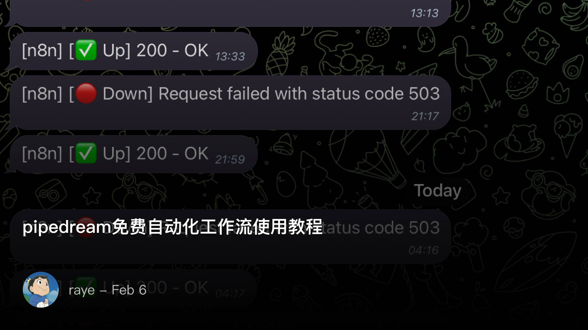 -->


日常的n8n其实经常要崩，看通知我都看烦了（

<!-- 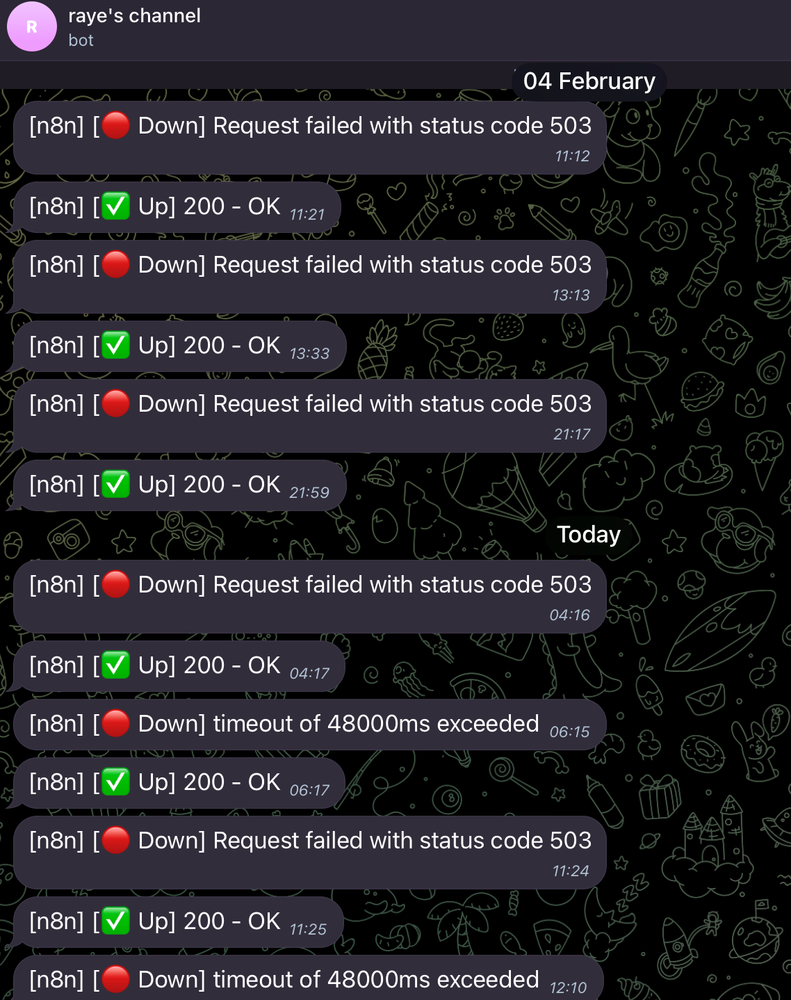 -->


IFTTT虽然好用，但还是稍显简陋，免费版最多支持两个，于是搜索了下还有一个免费的平台叫 pipedream（貌似可以同时运行5个工作流，只是限制了每天调用100次数，不过这也够了）

整体体验下来，pipedream还是缺失了还能多功能的，比如n8n经常会用到的：

- 导出工作流为json保存
- 批量处理多个item（n8n是可以支持针对一个数组里的每个item都运行一遍工作流节点的）
- 搭建一个工作流略微繁琐，但是很geek，对程序员还比较友好

 创建一个rss工作流

这里就纯粹靠自己摸索出来的经验了，不一定是最优解：

1. rss的节点，只需要提供一个url，自动解析其中的数据

<!-- 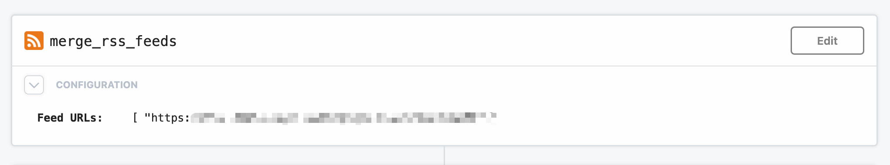 -->

1. 对数据去重，这里需要写点代码，比较繁琐，放到后面专门讲

<!-- 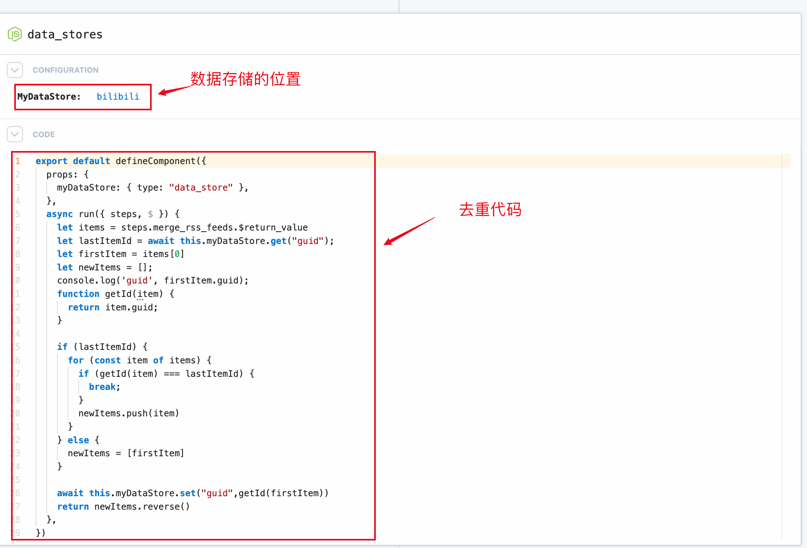 -->


1. 条件判断，针对去重后的数据判断是否有值，如果没有直接返回

<!-- 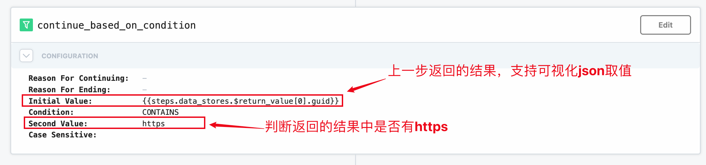 -->


1. 发送tg消息

<!-- 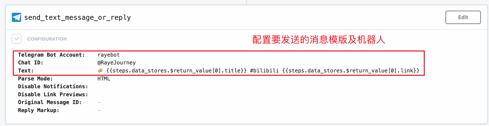 -->


 数据存储及去重

pipedream提供了一个专门用于存储数据的页面，可以可视化地查看存储的数据，这一点比n8n要好

<!-- 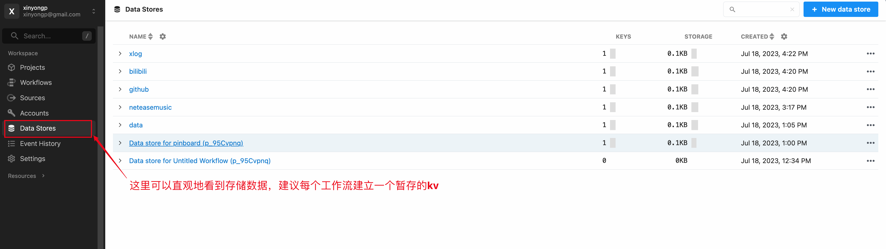 -->

<!-- 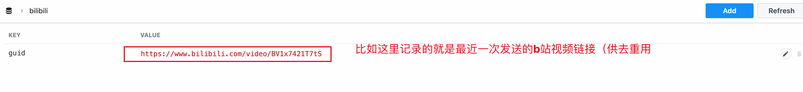 -->


推荐每个工作流都有一个数据存储位置，你可以将其理解为一个简单的kv缓存

接下来解释下我这里去重的代码，本质上和n8n里的很相似

- 我们要编写的代码位于run函数中，其他的不用动
- `steps.merge_rss_feeds.$return_value`  是自动解析rss节点返回的json数据
- `let lastItemId = await this.myDataStore.get("guid");`  去kv中取出最近一次的记录，是个异步操作，需要加await
- `getId`  函数就是获得每个节点的guid
- `newItems`  存储要发送的最新item，是通过循环比对获得的
- `await this.myDataStore.set("guid",getId(firstItem))`  覆盖最近一次的记录

> 不过要注意的是，pipedream似乎不支持批量发送，即如果 `newItems`  有多个，也只能发送
> 

```js
export default defineComponent({
  props: {
    myDataStore: { type: "data_store" },
  },
  async run({ steps, $ }) {
    let items = steps.merge_rss_feeds.$return_value
    let lastItemId = await this.myDataStore.get("guid");
    let firstItem = items[0]
    let newItems = [];
    function getId(item) {
      return item.guid;
    }

    if (lastItemId) {
      for (const item of items) {
        if (getId(item) === lastItemId) {
          break;
        }
        newItems.push(item)
      }
    } else {
      newItems = [firstItem]
    }

    await this.myDataStore.set("guid",getId(firstItem))
    return newItems.reverse() // 先发送老的消息，再发送最新的
  },
})
```

 解决pipedream无法批量发送消息

原本只是为了解决无法批量发送消息的问题，我想到直接用自定义代码的方式来循环发送就好了，于是写出了如下代码：

```js
import { axios } from "@pipedream/platform"
export default defineComponent({
  props: {
    telegram_bot_api: {
      type: "app",
      app: "telegram_bot_api",
    },
    chat_id: {
      type: "string",
      label: "Chatid",
      default: "@RayeJourney",
    },
  },
  async run({steps, $}) {
    const items = steps.data_stores.$return_value 
    const results = []; // 用于存储每个消息发送操作的结果
    for (const item of items) {
      // 构造要发送的消息内容
      const message = `📝 ${item.title} blog\n\n${item.url}`;

      // 发送消息
      const result = await axios($, {
        url: `https://api.telegram.org/bot${this.telegram_bot_api.$auth.token}/sendMessage`,
        method: ,
        headers: {
          'Content-Type': 'application/json',
        },
        data: {
          chat_id: `${this.chatid}`, 
          text: message,
          parse_mode: 'HTML', // 如果消息内容包含 HTML，可以设置这个参数
        },
      });

      // 将每次发送操作的结果添加到结果数组中
      results.push(result.data);
    }

    // 返回所有发送操作的结果
    return results;
  },
})
```

这也是低代码平台常见的解决方案了，通过在代码中自定义的方式来增加新的field，比如这里就可以给当前节点增加选择tg机器人，以及一个填写chat_id 的field

```js
telegram_bot_api: {
  type: "app",
  app: "telegram_bot_api",
},
chat_id: {
  type: "string",
  label: "Chatid",
  default: "@RayeJourney",
},
```

写到这里，我突然意识到可以直接把所有步骤合并到一起了…，索性干脆合并到一起写得了，简单易懂还不需要折腾那么多，最终代码如下：

每次只需要改动几个点：

- 几个必选项是需要填的
- message_template需要修改下，我这里是把item当做feed，然后replace替换的，所以代码中也需要做下修改

```js
import { axios } from "@pipedream/platform"
export default defineComponent({
  props: {
    my_data_store: { 
      type: "data_store",
      label: "MyDataStore"
    },
    my_data_key: {
      type: "string",
      label: "MyDataKey",
      default: "xlog"
    },
    telegram_bot_api: {
      type: "app",
      app: "telegram_bot_api",
    },
    chat_id: {
      type: "string",
      label: "Chatid",
      default: "@RayeJourney",
    },
    message_template: { // 由于 message 需要动态填充，改为 message_template
      type: "string",
      label: "Message",
      default: "📝 ${item.title} blog\n\n${item.link}"
    }
  },
  async run({steps, $}) {
    const items = steps.merge_rss_feeds.$return_value // 直接获取rss拉到的信息，最新的在最前面
    // 获取db
    let lastItem = await this.my_data_store.get(`${this.my_data_key}`) // 确保使用正确的数据存储访问方式
    
    const results = []; // 移动到 run 方法的顶部
    let newItem = []; // 存储要发送的消息
    const getId = (item) => {
      return item.link;
    };

    const sendMsg = async (item) => { // 确保 sendMsg 是异步的
      // 动态构造消息内容
      const message = this.message_template.replace('${item.title}', item.title).replace('${item.link}', item.link);
      try {
        const result = await axios($, {
          url: `https://api.telegram.org/bot${this.telegram_bot_api.$auth.token}/sendMessage`,
          method: ,
          headers: {
            'Content-Type': 'application/json',
          },
          data: {
            chat_id: this.chat_id, // 直接使用 this.chat_id
            text: message,
            parse_mode: 'HTML',
          },
        });
        results.push(result.data); // 添加结果到 results 数组
      } catch (error) {
        console.error("Error sending message:", error);
        // 处理错误，例如添加错误信息到 results
        results.push({error: "Failed to send message", details: error.toString()});
      }
    };

    // 确保遍历的逻辑正确处理最新和最旧的项
    for(const item of items){ // 不能优先处理最老的，一定要从最新的开始，因为会把旧的也加进来..
      if(lastItem && getId(item) === getId(lastItem)){
        break; // 如果找到了上次处理的最后一个项，则停止处理
      }
      newItem.push(item)
    }

    for(const item of newItem.reverse()){
      await sendMsg(item); // 等待发送消息
    } 
    // 更新数据存储中的 lastItem 为本次处理的最新项
    if (items.length > 0) {
      await this.my_data_store.set(this.my_data_key, items[0]); // 假设 items[0] 是最新的项
    }

    // 返回所有发送操作的结果
    return results;
  },
})
```

 最终的部署举例

如果你恰巧是通过rsshub获取的链接，然后想推送到tg，那么就很简单了（话说都已经用rsshub，为啥不直接用rss to tg呢🤣）

以xlog的博客推送举例，现在只需要三个部分：

1. 触发时间，两个小时检查一次足矣
2. 拉取rss信息，比如我的 [`https://rayepeng.net/feed`](https://rayepeng.net/feed)
3. 然后添加一个code节点，将上文的代码粘贴过去

点一下刷新field

<!-- 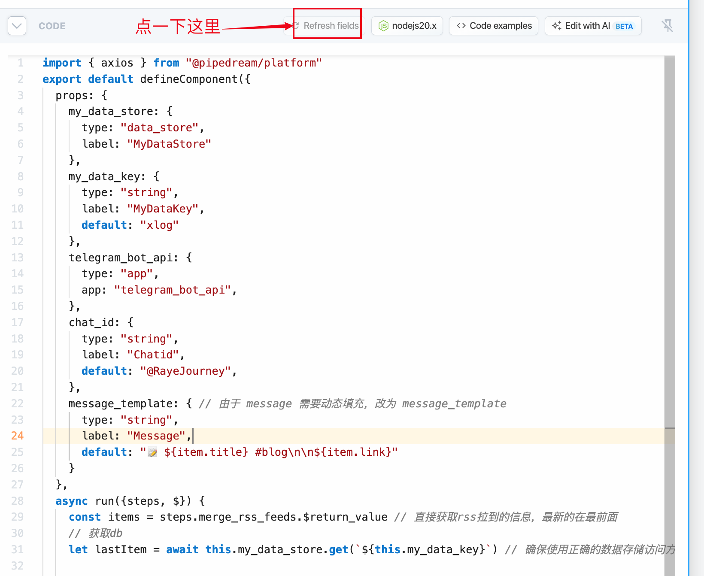 -->

然后上方就出现了这些框框，自行编辑
<!-- 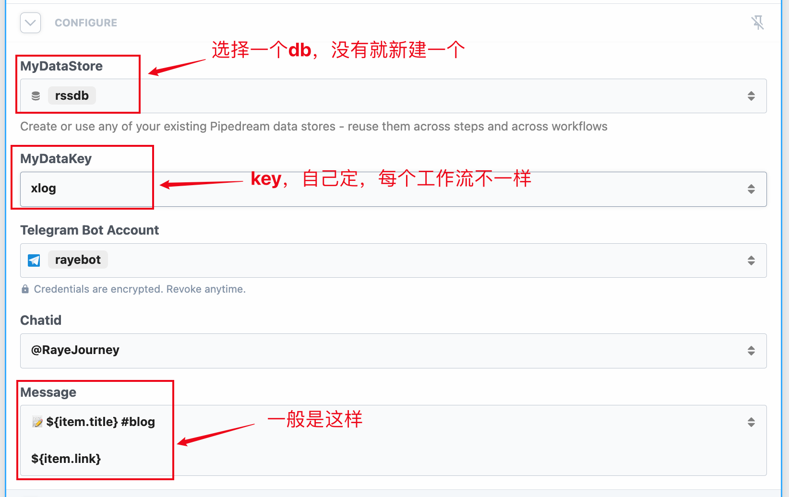 -->


1. 第一次启动工作流

第一次启动工作里的时候，由于此时还没有任何数据，如果你直接运行的话会导致大量历史消息全部发送出去

于是，建议这样

<!-- 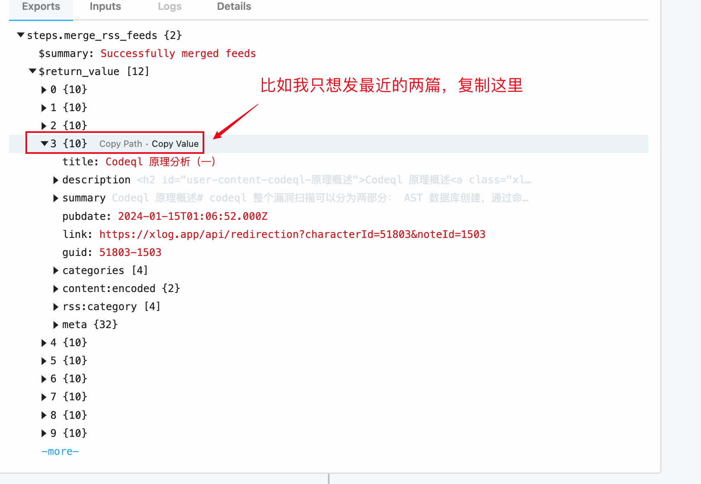 -->


在db中，手动粘贴下这个值（因为批量发送的时候会对比，如果和db里的一样就不会再发送了）

<!-- 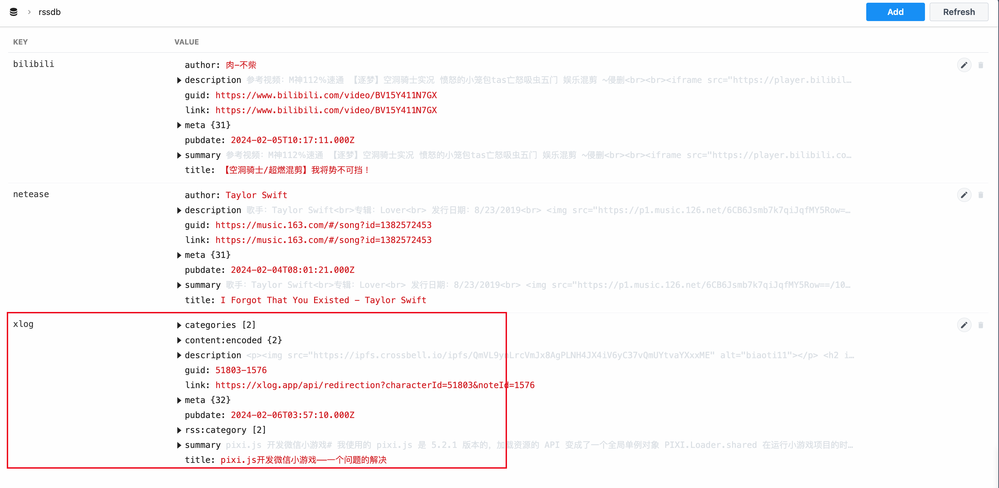 -->


好了，现在就大功告成了，不得不说运行速度还是比n8n要快多了（