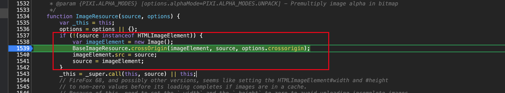
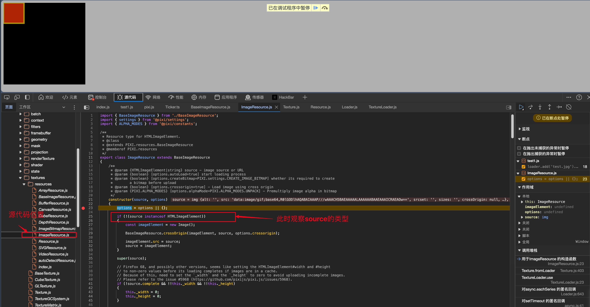
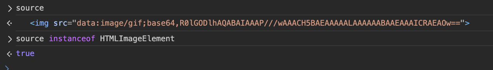
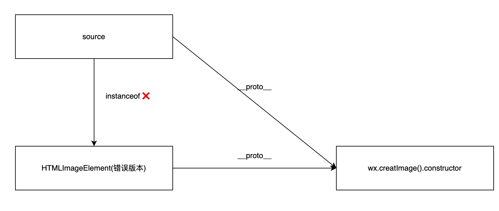

 pixi.js开发微信小游戏——一个问题的解决


<!--  -->


 pixi.js 开发微信小游戏

我使用的 `pixi.js`  是5.2.1版本的，加载资源的API变成了一个全局单例对象 `PIXI.Loader.shared`  

在运行小游戏项目的时候，加载图片资源是这样写的：

```jsx
let loader = PIXI.Loader.shared
loader.add('bg', 'static/textures/bg.png');
```

但是微信开发者工具一直报错，提示没有 `indexOf`  方法，于是开始追踪报错信息，定位到报错栈的上一层，在调用 `crossOrigin`  方法前有一个 if 判断

判断 source 类型，如果不是继承自 `HTMLImageElement`  ，则会将 source 当做一个字符串，进入到后续方法，并且调用 indexOf 方法报错

但问题就出在 source 已经是一个image对象了，自然没有 **indexOf** 方法，所以就报错了

<!--  -->

那为啥 `instanceof`  判断会失败了，于是在浏览器环境下测试

<!--  -->

控制台输入下，很明显返回是true

<!--  -->

那为啥小游戏环境下就返回false呢，那就估计是 adapter 的问题了

我这里用的adapter是别人重新修改的 `@iro/wechat-adapter`  （微信原来提供的版本有很多问题），发现如下一处代码写得有问题：

```jsx
export class HTMLImageElement extends wx.createImage().constructor {

}
```

经过我测试发现，`wx.createImage().construcotr` 本身就已经是 `HTMLImageElement` ,这里又多了个 `extends`  ，原型链上多了一层，自然就有问题了

不熟悉原型链的朋友，可以看下这个图简单理解下（我理解的 instanceof 和 extends 本质就是原型链的查找）

<!--  -->

所以我们直接改成等于就好，不需要 `extends` 

```jsx
export const HTMLImageElement = wx.createImage().constructor
```

如果只是想临时修改代码，我们可以git clone 到本地后，修改代码，然后在项目的依赖中，指向本地即可：

```jsx
"@iro/wechat-adapter": "file:/Users/rayepeng/Documents/OpenSource/MyFrontEndCode/wechat-adapter/src/",
```

这样就项目就成功运行起来了

ps. 修改后的 wechat-adapter 包已发布： [https://www.npmjs.com/package/@rayepeng/wechat-adapter](https://www.npmjs.com/package/@rayepeng/wechat-adapter)