 surge入坑指南（一）

<!-- 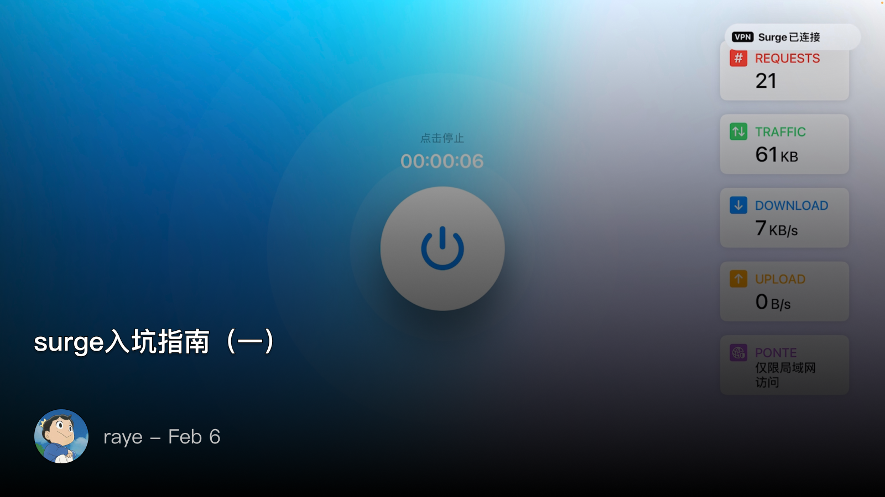 -->

 为什么要使用surge呢？

作为surge的三端用户，mac端+手机端+Apple tv端

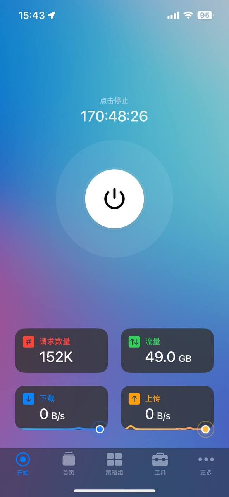
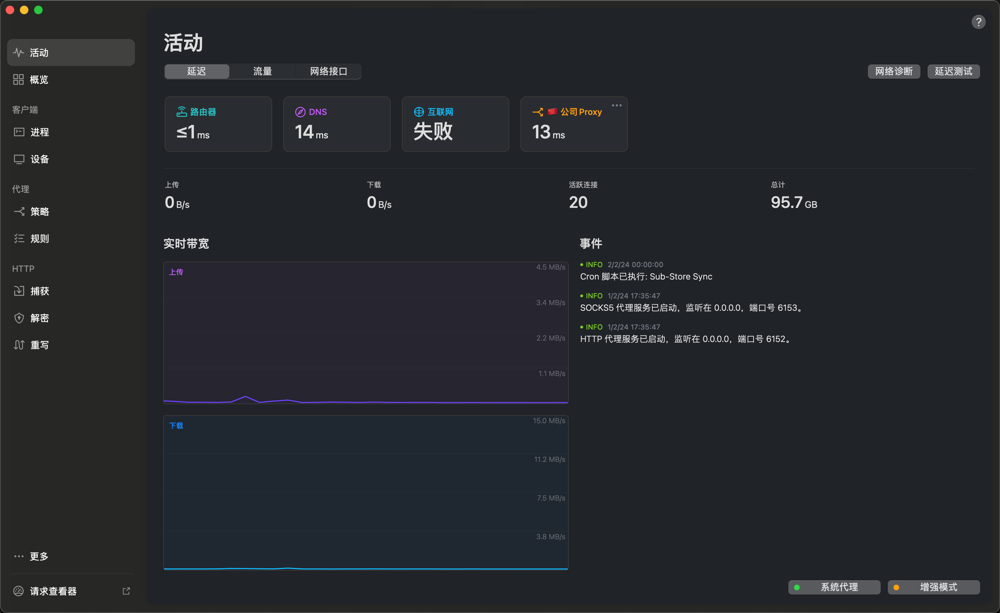
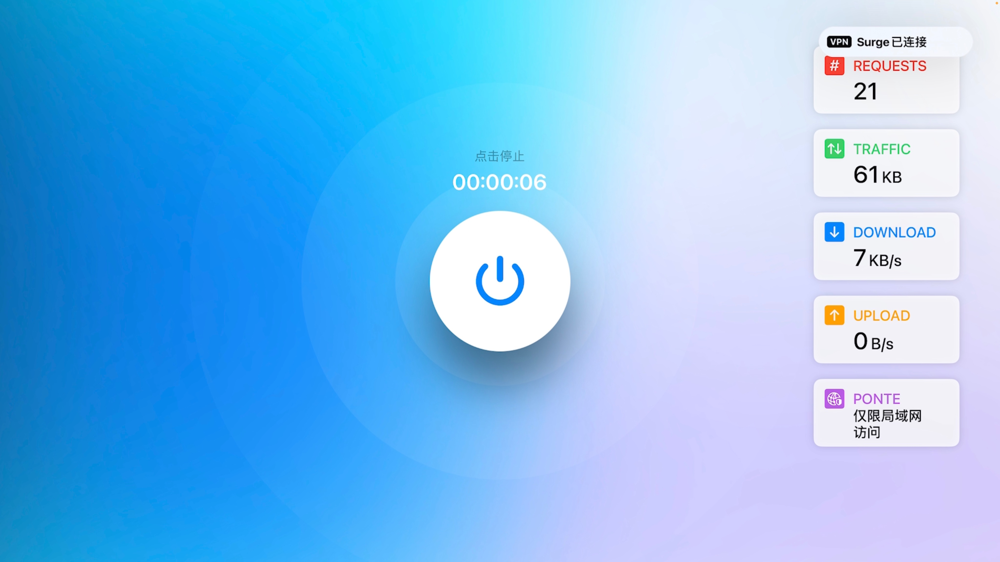

不得不说surge的界面确实很美（

- 最主要的用途：流媒体观看 + 国外app使用 + ChatGPT
- 其次：京东比价，阿里云盘自动签到，B站ui修改等多种module
- 开发用途：抓包，会员破解

当然实际上我这里用到的功能远不及surge包含的，高级功能如网关配置、内网穿透，DHCP服务器等，也有过折腾，但日常很少涉及到就不细说了

当然上述能力，其实QuanX、clashX、小火箭也都可以作为替代品，而且价格也还算便宜（clashX免费）。如果打定主意要头铁入坑surge，就准备好氪金吧哈哈

如何入坑surge呢？

- mac端购买链接 [Surge Mac - Advanced Web Debugging Proxy for Mac & iOS (nssurge.com)](https://nssurge.com/buy_now)
- ios端购买链接 [Surge Mac - Advanced Web Debugging Proxy for Mac & iOS (nssurge.com)](https://nssurge.com/payment?product=surge-ios-3-pro&title=Surge%20iOS%20Pro%20Personal%20License&price=49.99)
- 如果购买了ios端，则Apple tv端免费赠送（前提是账号需要绑定到同一个iCloud账户上）

强烈建议网页端购买而不是App Store内购，你会感谢我的（因为外区Apple id账号很容易被ban，也难以共享给他人使用）

网页端购买推荐买支持多台设备的套餐，可以共享出去来回点本，单人购买有点亏🥹

有了surge后，还没完，你需要购买机场服务（自建节点也是可以的，但比较麻烦容易被封），推荐我一直用的机场（通过我的链接注册可以获得优惠😄）

[https://rabbitpro.net/auth/register?code=JEBu](https://rabbitpro.net/auth/register?code=JEBu) 

好了，下一步就是导入配置，机场提供了自带的配置，开箱可用

<!-- 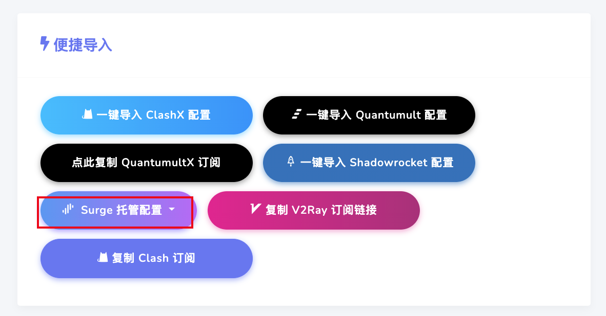 -->

导入配置后，最好创建一份当前配置的副本方便我们后续编辑（当前配置无法修改）

surge的基础界面我也介绍下：

  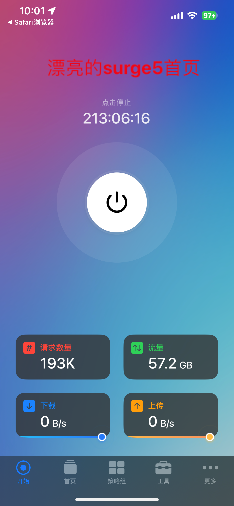
  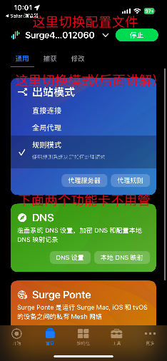
  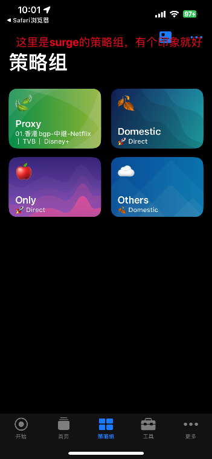
  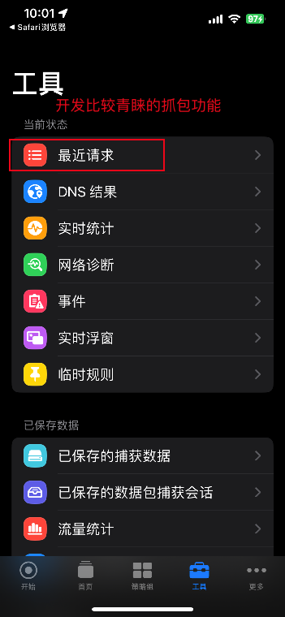
  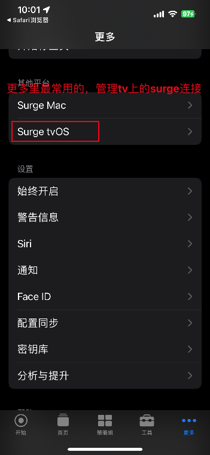

好了，你已经正式入门了，接下来就是见证surge的魔力了

 基础分流规则

首先需要理解下什么是分流，关于这一点似乎没有统一的定义，个人理解如下：

上网本质就是和服务器传输数据，传输的数据按照字节数来统计就是多少流量（插一句，推荐去看《上传新生》这部剧，会对流量有更深的理解）

我们和服务器之间是有很多条连接的，这些连接可以简单分个类，比如国内的服务，国外没有被墙的服务，国外被墙的服务

而分流，就是将国外被墙的服务统统走机场代理，从而绕过墙的封锁，此处应该有图（但实际没有🐶）

简单小结下：

- 国内的服务
- 国外没有被墙的服务
- 国外被墙的服务

这其中，国外被墙的服务又因为地域的限制，加上了一堵无形的墙，比如OpenAI的服务就墙掉了香港的ip

于是，我们又需要进一步分流，将国外的服务分流到不同地区的节点，比如常见的香港、美国、印度、尼日利亚、土耳其、阿根廷（我是精神阿根廷人！）等

上一个小节中，导入的surge配置文件，其中有很大一部分就是做这个分流的

此时打开surge，我们需要切换到“规则模式”，三个模式分别理解如下：

- 直接连接：surge变身**小透明**，所有流量一股脑的放过
- 全局模式：surge变身**大魔王**，所有的流量都被surge代理
- 规则模式：surge变身**检查员**，按照我们配置好的分流规则来分流

切换到规则模式后，此时的策略组还比较简单，只分成了四类：国内，国外，苹果，其他

比如我们想访问ChatGPT服务的话，此时我们需要的将ChatGPT的服务都通过美国节点来访问，因此我们需要几个事情：

- ChatGPT的服务器有哪些
- 美国节点
- 分流规则

那么ChatGPT的服务有哪些呢，已经有人帮忙整理好了，搜索 `surge rule chatgpt github` 就能找到： [ios_rule_script/rule/Surge/OpenAI/OpenAI.list at master · blackmatrix7/ios_rule_script (github.com)](https://github.com/blackmatrix7/ios_rule_script/blob/master/rule/Surge/OpenAI/OpenAI.list)

这里列出的就是我们需要获得原始的raw链接

[https://raw.githubusercontent.com/blackmatrix7/ios_rule_script/master/rule/Surge/OpenAI/OpenAI.list](https://raw.githubusercontent.com/blackmatrix7/ios_rule_script/master/rule/Surge/OpenAI/OpenAI.list)

当然更推荐用jsdelivr加速后的（因为raw.github的链接被墙了，后续更新资源容易导致报错连不上）：

> jsdelivr加速方法，只需要把github的域名替换为 `cdn.jsdelivr.net/gh` 拼接下就好
> 

[https://cdn.jsdelivr.net/gh/blackmatrix7/ios_rule_script/rule/Surge/OpenAI/OpenAI.list](https://cdn.jsdelivr.net/gh/blackmatrix7/ios_rule_script/rule/Surge/OpenAI/OpenAI.list)

<!-- 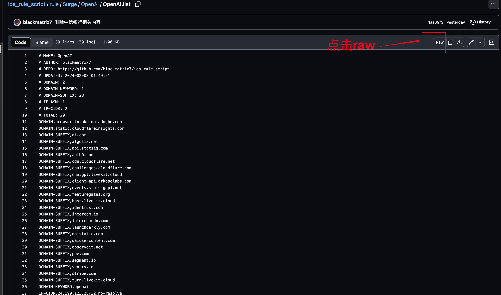 -->

第一步准备好，第二步我们准备美国相关的节点，如果你是通过机场导入的配置，已经自动添加了很多节点，当然也可以手动去添加你的vps节点

我们可以对这些节点做一个归类，比如按照地域来划分，点击【代理服务器】，拖到最底下，新增一个策略组：

> surge把代理服务器和策略组（即代理服务器的聚合）都视作代理服务器看待
> 

将美国节点都拖进去（其他地区解锁OpenAI稳定性一般，美国节点最稳定）

 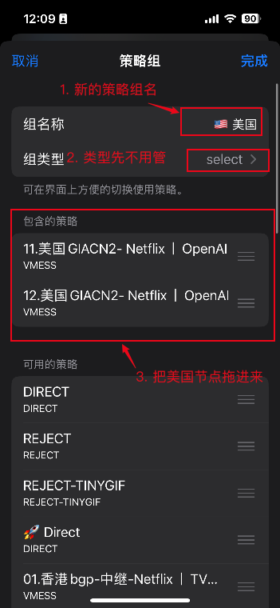

第三步，设定分流规则，此时就可以直接添加一条分流到ChatGPT的规则了

  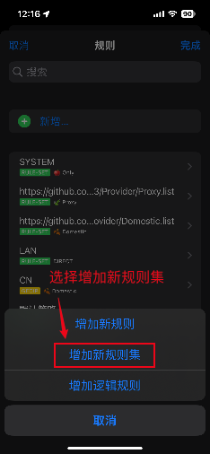
  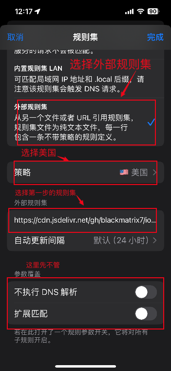

好了，已经成功了，访问ChatGPT试试

 补充

机场的节点并不是稳定的，可能出现短暂无法使用

此时可以切换到策略组，点击测速，切换到连接畅通的节点（人工负载均衡了属于是🤣）

嫌手工切麻烦的话，也可以在策略组中，选择这两个

- URL延迟自动测试：自动选择延迟最低的
- URL可用性自动测试：不可用时随机选择一个可用的
- 负载均衡：每次随机切换

  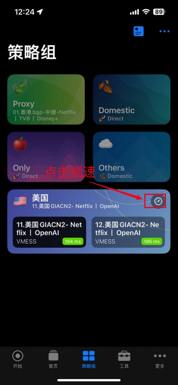
  

 进阶分流规则

既然已经添加了第一条规则，那肯定要摩拳擦掌，试试添加一堆的规则了，比如Netflix、HBO、pornhub（大雾）

> 折腾之前别忘了，我们添加这些规则本质上为了实现无感知的上网，即不管是访问国内还是国外的服务，surge都自动为我们选择代理或者是不代理
> 

这些规则都可以在这里找到：https://github.com/blackmatrix7/ios_rule_script.git， 慢慢折腾就好了

 规则微调

有些规则可能是过期的，比如HBO的规则，网上搜到的基本都过期了，于是可以这么做：

1. 先切换到全局模式，我们选择节点为美国，此时surge大魔王就会强制要求所有流量都通过美国节点（注意这时就别去刷国内的剧了，速度又慢又浪费流量）
2. 此时打开HBO MAX app，在【最近请求】页面观察下都访问了什么域名（surge也贴心地提供了浮窗可以实时观察）
3. 选择你觉得需要添加规则的域名，一般都很有特征的，比如 `[hbo.com](http://hbo.com)` 或者是 `[max.com](http://max.com)` 之类的，一般我们会选择 `DOMAIN-SUFFIX` （后面说这是什么）

可以选择临时规则或者永久规则，这是为了测试考虑

  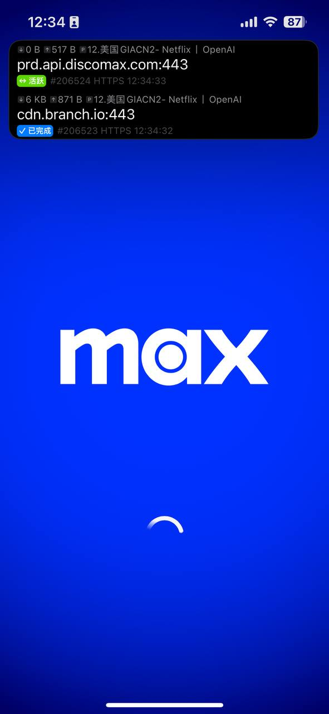
  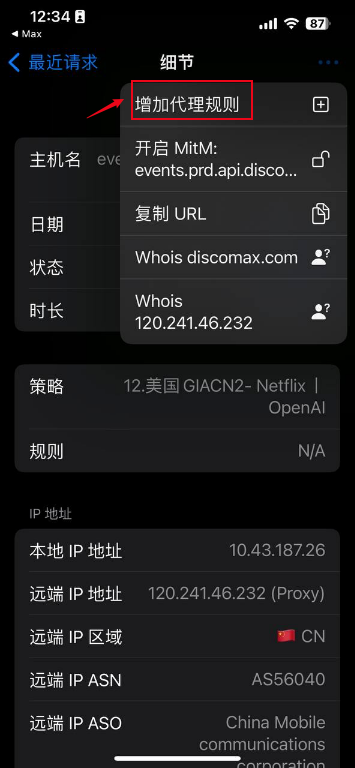  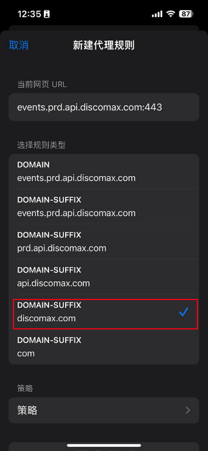

 规则详解

前面我们使用到的都是规则集，即包含了一系列的分流规则，surge中称之为 `RULE-SET`  

`RULE-SET`  的形式是一行一个规则，surge的规则除了针对域名分流，针对ip、针对进程（mac上）也都是可以的

常见的规则形式有：

- 域名规则
    - DOMAIN：严格匹配某域名。
    - DOMAIN-SUFFIX：匹配某域名及其子域名，如 DOMAIN-SUFFIX,apple.com 可以匹配 apple.com 和 www.apple.com，但是不会匹配 anapple.com。
- IP地址规则
- 其他规则
    - PROCESS-NAME：仅对 Mac 版本有效，可以匹配程序名。
    - SRC-IP：可匹配连接来源 IP 地址，接管其他设备连接时可使用。
    - IN-PORT：Mac 版本支持多端口监听，可为不同监听端口配置特定的规则。

更多请参考文档：[Surge 官方中文指引：理解 Surge 原理 (nssurge.com)](https://manual.nssurge.com/book/understanding-surge/cn/%E7%AD%96%E7%95%A5)

 脚本&模块

在使用脚本和模块功能之前，最好是先打开MITM

打开MITM需要证书信任操作，这里不仔细说了，建议自行Google

之后就可以切换到【修改】界面，使用脚本和模块功能了

其实这两者本质上都是对请求和响应做一些修改，并且完成一些自动化的工作，但个人觉得模块相比脚本更好用，原因在于：

- 脚本的配置比较繁琐，需要自行添加MITM的域名
- 模块相对来说更简单，一键安装即可（但依赖模块作者开发的质量，比如之前有个模块作者直接覆盖掉了我的 `skip-proxy`  配置，我后面找了半天才找到原因）

  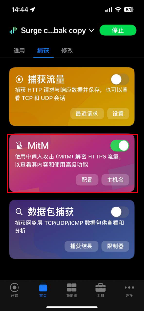
  

下面提供了一些开箱即用的模块：

- 京东比价：[https://raw.githubusercontent.com/Rabbit-Spec/Surge/Master/Module/Spec/JD_Price/Moore/JD_Price.sgmodule](https://raw.githubusercontent.com/Rabbit-Spec/Surge/Master/Module/Spec/JD_Price/Moore/JD_Price.sgmodule)
- 阿里云盘签到：[https://github.com/rayepeng/surge-module/raw/main/aliyunpan.sgmodule.sgmodule](https://github.com/rayepeng/surge-module/raw/main/aliyunpan.sgmodule.sgmodule)
- 看天下app免费读：[https://raw.githubusercontent.com/rayepeng/surge-module/main/ktx.sgmodule](https://raw.githubusercontent.com/rayepeng/surge-module/main/ktx.sgmodule)
- 财新周刊免费读： [https://raw.githubusercontent.com/rayepeng/surge-module/main/caixin.sgmodule](https://raw.githubusercontent.com/rayepeng/surge-module/main/caixin.sgmodule)\

更进阶的模块技巧需要搭配boxjs使用，安装链接：[https://raw.githubusercontent.com/chavyleung/scripts/master/box/rewrite/boxjs.rewrite.surge.sgmodule](https://raw.githubusercontent.com/chavyleung/scripts/master/box/rewrite/boxjs.rewrite.surge.sgmodule) 

文档：[介绍 - BoxJs](https://docs.boxjs.app/) 

比如自定义B站ui的模块：[https://raw.githubusercontent.com/BiliUniverse/Enhanced/main/modules/BiliBili.Enhanced.sgmodule](https://raw.githubusercontent.com/BiliUniverse/Enhanced/main/modules/BiliBili.Enhanced.sgmodule) 

搭配boxjs可以自由勾选首页展示的内容：

  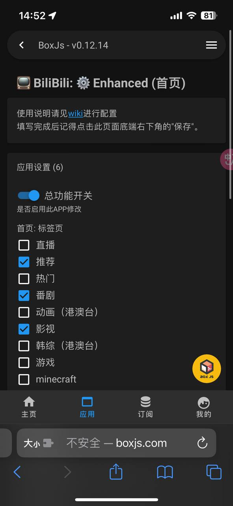
  

 后续内容

零零散散先写了这么多，主要是平常使用到的一些经验沉淀，后面一篇准备写一下配置文件、编写脚本和模块吧

 参考

1. [Surge Mac使用指南 | by Alan He | Jan, 2024 | Medium](https://medium.com/@alanhg/surge-mac%E4%BD%BF%E7%94%A8%E6%8C%87%E5%8D%97-cbebb2c90f89) 
2. [Surge 官方中文指引：理解 Surge 原理 (nssurge.com)](https://manual.nssurge.com/book/understanding-surge/cn/) surge官方的文档，对于深入理解网络协议有很大的帮助
3. [GetSomeCats/Surge新手从注册Apple ID到退款.md at Surge · getsomecat/GetSomeCats (github.com)](https://github.com/getsomecat/GetSomeCats/blob/Surge/Surge%E6%96%B0%E6%89%8B%E4%BB%8E%E6%B3%A8%E5%86%8CApple%20ID%E5%88%B0%E9%80%80%E6%AC%BE.md) 这个写的很详细了
4. 推荐最小配置，可以认识配置文件 [中国区用户推荐最小配置 - Surge Tech Community (nssurge.com)](https://community.nssurge.com/d/1214)

