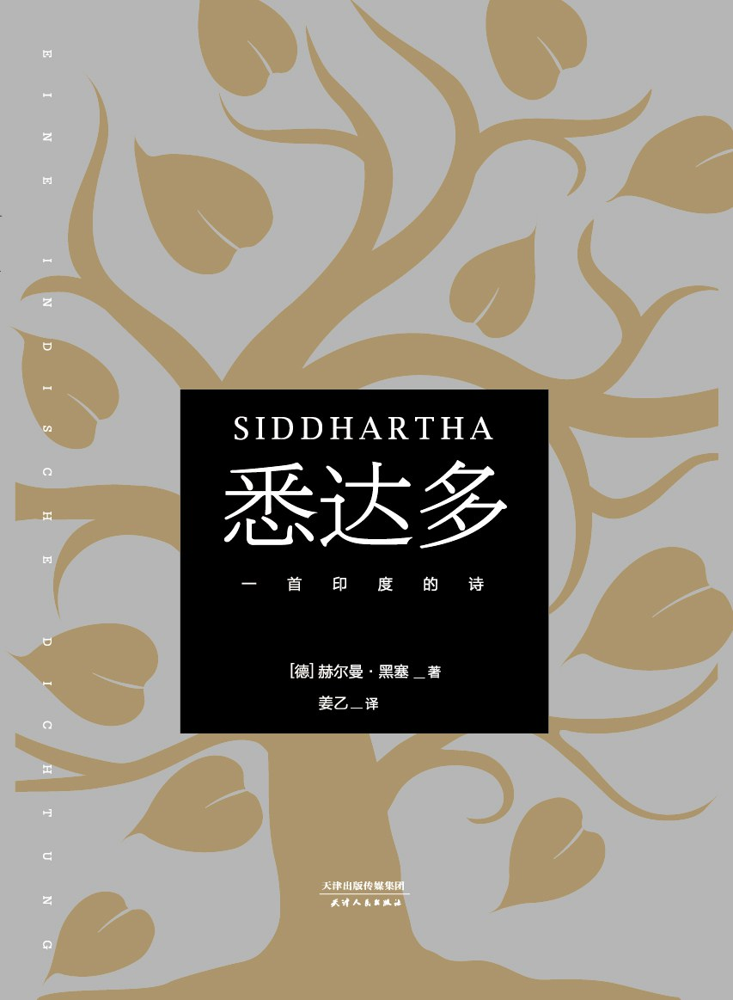
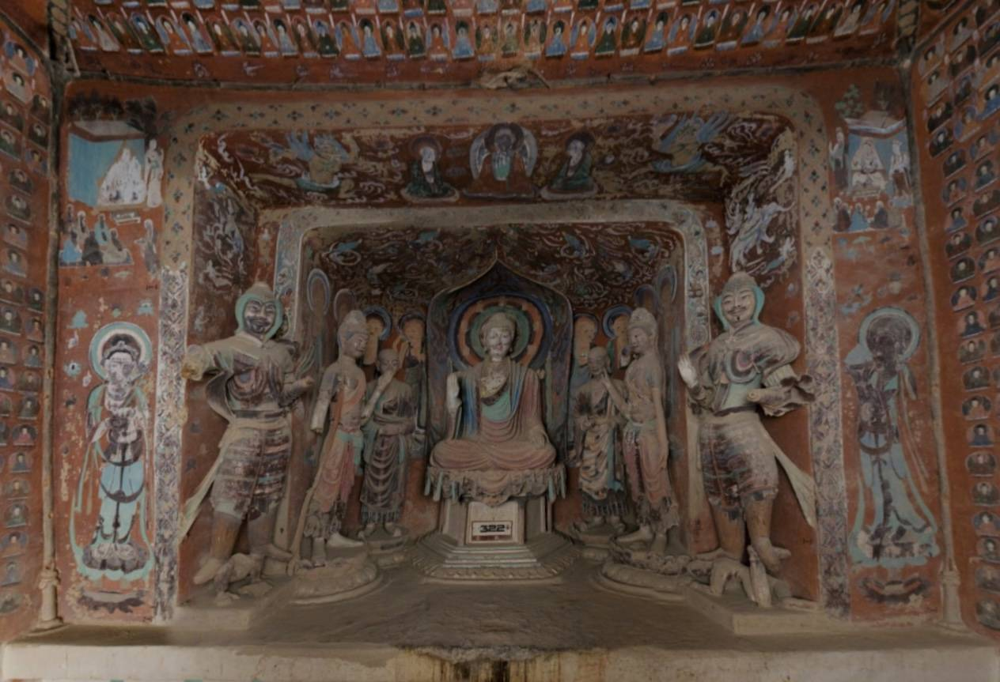
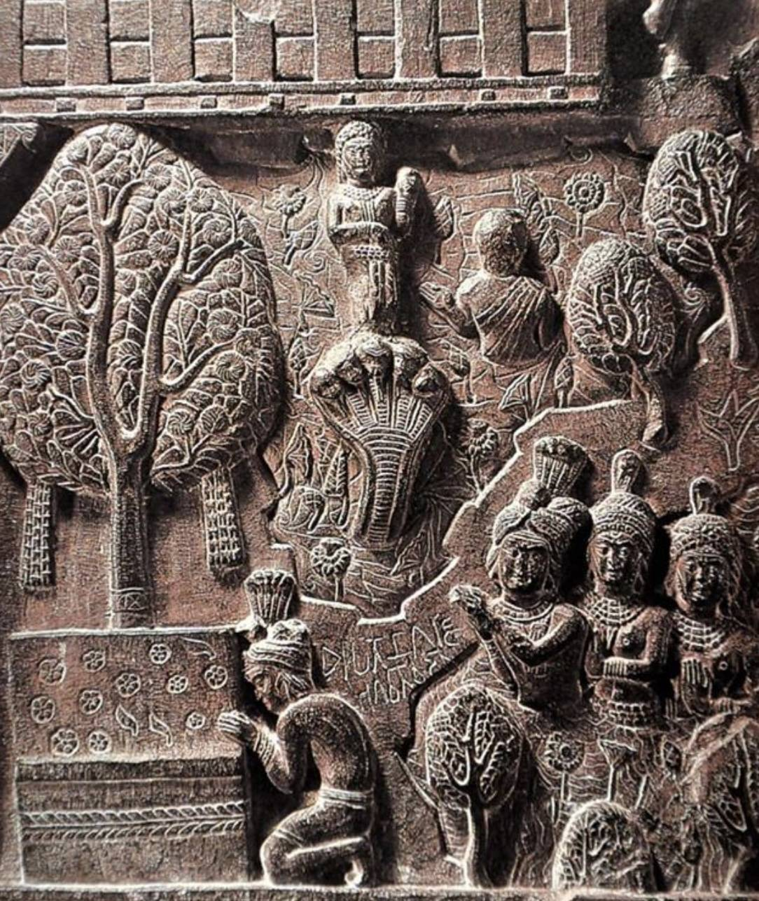

 《悉达多：一首印度的诗》 分享

<!--  -->

https://book.douban.com/subject/26980487/
作者：赫尔曼·黑塞
译者：姜乙

豆瓣简介：
《悉达多》并非是佛陀的故事，它讲述了一个人的一生，千万寻常人亦会经历的一生。
意气风发的少年郎，常认为自己是被命运选中的人。抛下过去，随了跌跌撞撞的步伐，找寻心中的声音，追逐名利，经历友情，品尝爱情。不同的是，悉达多一生追求的是生命的圆融统一，看似宏大，确是每个人无法回避的问题。
黑塞的语言是充满诗性的，正如本书副题“一首印度的诗”，因不得而知的原因，此副题在前人所出版本中都被回避了。为了尽可能表现黑塞的诗意，我们选择从德文直译，尽管我们的译文不能完全实现这种诗意，但其诗的本性与精神显而易见。
本书地位在前人的版本中已被反复强调——亨利·米勒的最爱；影响了包括电台司令在内的许多名人雅士；在六十年代美国掀起过阅读黑塞的热潮，大学生们人手一册等等。
但如书中成为摆渡人的悉达多所述，智慧无法分享，它可以被发现，被体验。
所以倘若你碰巧遇到了这本小书，请细细品味其中的文字。
愿你在读了悉达多的故事后，也能有所感悟，并开始体验属于自己的人生。

 关于这本书的故事
1967年，保罗柯艾略20岁，他被送进了巴西的一家精神病院里。
他的名字你可能不熟悉，但是你肯定听过《牧羊少年的奇幻之旅》，作者就是保罗柯艾略。
他的一生本来应该被精神病院葬送的，但是一本书拯救了他。（ps. 这本书是保罗柯艾略女朋友给他邮寄到精神病院的
这本书就是我们今天要分享的《悉达多》。

我想很多人和精神病人保罗的感受是一样的，在读这本书的时候，内心期望的会是一个圣人的故事，但读完后不免有一些些失落，这本书除了语言异常优美外，似乎并不像许多人说的那样能解答人生的终极问题。

《悉达多》所讲述的，不过是一个世俗人的烦恼故事，似乎书中昙花一现的佛陀，才是许多人追求的目标，悉达多，这个人的内心怎么会有这么多阴暗的情感呢？这么多恐惧呢？

但保罗悟出来了，悉达多是执意要将自己的生命本质去寻找自我，在大千世界中不迷失自己。

在阅读完这本书之后的几天，保罗就出院了。出院当天，他回望精神病院的铁栏杆，想起精神病院里的疯子对他说，他们要一辈子待在精神病院里，与世隔绝永远不出去。为什么呢？因为外面的世界太难面对了。

这个时候，保罗柯艾略对自己说：我发誓，我选择生命。(ps. 我命油我不油天

好了这本书的分享就到这里为止了，我已经总结完了 /手动狗头（此处埋个伏笔）

 佛陀是谁？
佛陀，意为“觉悟者”，本名乔达摩·悉达多，又尊称为释迦牟尼
佛陀生活在约公元前6至前5世纪的古印度，原本是释迦族的王子，后来出家修行，经过长期的修炼和思考，在菩提树下获得觉悟（菩提），成为“佛陀”，意为“觉悟者”或“开悟者”。

在你的心目中，佛陀是一个什么样的形象？
是洞窟里的佛菩萨像？还是栩栩如生的壁画？亦或是在藏经洞里发现的画匠们创作的涂鸦草稿？

<!--  -->

<!--  -->

传言佛陀是生活在公元前5世纪的人，但要到公元2世纪左右，佛陀的形象才开始流行，不同地区的佛陀的形象各不相同，最开始的佛像更多的是一个“符号”，并不是代表真实存在的佛陀形象，主要是为了供后人忆念和瞻礼佛功德之用。、

《金刚经》中有言：“若见诸相非相，即见如来”，意思是说，要见到真正的“如来”，必须知道种种的外相都不具备永恒性。

既然最高境界是“诸相非相”，那为什么还要有这么多金碧辉煌的佛像呢？释迦牟尼也不过就是两千多年前的悉达多太子，怎么就变成了类似电视剧中“如来佛祖”一般的形象呢？

在佛教中，有“三身佛”的说法，即佛有三种身相，分别是“应化身”，“报身”和“法身”，觉悟程度深浅不同的人，所见到的佛就会呈现出不同的样貌。所谓“应化身”，如我等凡夫俗子，尚未觉悟，所以看到的佛陀就是和尚，跟平常人一样。已经觉悟的菩萨，所看到的佛陀形象则是庄严恢弘的，这就是佛的“报身”，“法身”，则是说真正的“佛”就是无形无相，随众生的心而显现出不同的样子。

最后，历史上是否真的有佛陀其人呢？

直到1898年，一位名叫佩普的英国工程师，他在印度比普罗瓦考古发现了一个装有佛陀遗骨的舍利瓮，而就在前一年的尼泊尔的蓝毗尼，尼泊尔总督雷纳将军和德国考古学家福勒博士，发现了在佛陀出生地出土的阿育王石柱。这些新发现最终让西方学者开始相信，佛陀并非是神话人物，而是曾经活生生地在印度行脚弘法的一位僧侣。

<!--  -->

 悉达多为什么要离家出走？

佛陀，即乔达摩·悉达多，大约在19岁成亲，娶了城中的美人耶输陀罗，但却在29岁毅然出家，经历数年苦修，终于35岁在菩提伽耶觉悟，然后在北印度赤足游历讲法45年，最终于80岁时在拘尸那迦涅槃。

佛陀本属于释迦族。释迦族本身属于刹帝利种姓，即贵族阶层。

在《悉达多》开篇，黑塞是这样形容悉达多的：

> 悉达多，俊美的婆罗门之子，年轻的鹰隼，在屋舍阴凉处，在河岸船旁的阳光中，在婆罗双林和无花果树的浓荫下，与他的好友，同为婆罗门之子的乔文达一道长大。
> 
> 而最爱他的人是乔文达。他爱他的步态，他行动时的优雅完美。他爱悉达多的一切言行，但更爱他的精神，他崇高激昂的思想、强大的意志和高贵的使命感。

用现在的话来说，悉达多是一位“富二代”，既不用担心生计，婚姻，事业也应该想当顺利，是我们非常羡慕的生活状态，这样的世俗人生，似乎没有任何理由主动放弃。

那么，他为什么要出家呢？

关于佛陀想要出家修行的动因，更为直接的描述，则是太子经历四个城门的故事：

> 有一天悉达多太子出行，在其中一个城门，他见到一个耄耋老人，于是问侍从，这个人为何这般模样？侍从告诉太子，这就是“老”：“夫老者生寿向尽，余命无几，故谓之老。” 第二天，太子又在城门遇见一位重病的人，问侍者这又是什么情况？侍者回答说这是“病人”，太子于是追问什么是“病”，侍者回答说：“众痛迫切，存亡无期，故曰病也。” 又有一天，太子在城门处遇见有人亡故，亲人们嚎哭围绕。太子又问：“死为何？”侍者则回答：“死者，尽也。风先火次，诸根坏败，存亡异趣，室家离别。” 短短数语，道尽了人生的无奈。
> 
>当太子再度出游时，却见到街道上有一位出家的沙门，便好奇询问侍者这是何人。侍者告知，那是“沙门”：“舍离恩爱，出家修道，攝御诸根，不染外欲，慈心一切，無所伤害，逢苦不慼，遇乐不欣，能忍如地。” 也就是说，出家修道能让人远离欲望的伤害，并且对于众生升起无尽的慈悲，这让年轻的太子非常羡慕，萌生了出家修行的念头。

而在小说《悉达多》中，黑塞用文学化的方式描述了悉达多的出家时刻：“乔文达意识到：时候到了，悉达多要去走自己的路。他的命运即将萌发。”

> 那时，三位沙门经过悉达多所在的城邑。他们是去朝圣的苦行者，不老也不年轻。憔悴、消瘦，几乎全裸的身躯被阳光暴晒得焦黑，尘埃和血迹布满肩头。他们是人类王国的异乡人，骨瘦如柴的胡狼。孤独、绝尘，与世界为敌。一种由无声的激情、不惜一切去献身、无情的肉体灭绝构成的灼热气息回旋在他们周身。

在黑塞的小说中，悉达多是主角，他的同伴叫乔文达，书中他俩曾一同去拜访佛陀乔达摩

ps. 私以为，佛祖的本名叫乔达摩 · 悉达多，黑塞将其拆分成两个人物，所以文中的悉达多其实也是佛陀，是悟道的另一条路

 沙门修行

悉达多与乔文达一同离开了家乡，开始了一段充满挑战的苦修生活，他们通过冥想、禁食和压抑感官欲望来试图摆脱自我和世俗的束缚。

> 他遇见女人时目光冷淡，遇见城中穿着华美之人，嘴角流露出轻蔑。他见到商贩经商，君侯外出狩猎，服丧者哀嚎，娼妓出卖色相，医生救治病人，祭司定夺播种之日，情侣们相互爱抚，母亲们哺乳——这一切都让他不屑。
> 
>悉达多唯一的目标是堕入空无。无渴慕，无愿望，无梦想。无喜无悲。​“我”被去除，不复存在。让空洞的心灵觅得安宁，在无“我”的深思中听便奇迹。这是他的目标。当“我”被彻底征服，当“我”消亡，当渴求和欲望在心中寂灭，那最终的、最深的非“我”存在，那个大秘密，必定觉醒。

然而，悉达多很快就意识到，沙门苦修不过是一种徒劳，并不是真正能够接近觉悟的道路。

> 悉达多道：​“我并不这么看，我的朋友。至今我在沙门处学到的东西，乔文达，我本可以更快更便捷地学到。在花街柳巷的酒馆里，我的朋友，在脚夫和赌徒处，我都能学到。​”

 遇见乔达摩

沙门的禁欲与苦修，并无法帮助悉达多真正解答关于存在、苦难和解脱的问题。他逐渐意识到，这些修行方式虽然提供了某种控制欲望的方法，却不能触及生命的本质。正是在这种疑惑与不满足的驱使下，悉达多听闻了佛陀——乔达摩前来宣法，于是便于乔文达一同拜访了佛陀。

> 夜幕降临，酷热消歇，祗园中的人们活跃起来，聚集在一处聆听佛陀宣法。
这时，他们听见佛陀的声音。那声音美满，安宁，平和。他论苦谛，苦之缘起及其灭往何处去。他平静的论述安详清晰。苦乃人生实相，但离苦之道业已被发觉，跟随佛陀即可脱离苦海。
世尊以柔和坚定的声音论四圣谛，讲八正道。他耐心地以惯常的方式讲经，举证，温故。他的声音明亮而安静地盘旋在听者上空，如光影，如星辰。

乔文达立即为佛陀的智慧，宁静的气质与深刻的洞察力所拜服，并想要追随佛陀修行
而悉达多却不愿成为佛陀的追随者，

> 乔文达不断地追问他的朋友，他想听他解释，他为何不容身乔达摩之法义，他在他的法义中发现了什么瑕疵。而悉达多却总是驳回追问：​“不要再问了，乔文达！佛陀的法义非常之好，我怎么可能发现瑕疵？​”

然而悉达多确实发现了乔达摩的缺陷，他清楚地意识到，每个人的觉悟之路是独特的，无法通过模仿或追随他人来获得。佛陀已经完成了他的修行道路，而悉达多必须去探索属于自己的道路。

> 只是，在您的法义中，在统一、逻辑完善的万物中却存在一个断裂之处。这一小小的缝隙让这个统一的世界呈现出些许陌生、些许新奇；呈现出些许迥异于从前，且无法被证实的东西：那就是您的超世拔俗，获得解脱的法义。这个小漏洞，这个小断裂，让永恒统一的世界法则变得破碎，失去效力。但愿您能宽恕我所提出的异议。​”
>哦，世尊佛陀，您从未以言辞或法义宣讲您在证觉成道之际所发生的事！世尊佛陀的法义多教人诸善奉行，诸恶莫作。在明晰又可敬的法义中不包含世尊的历程，那个您独自超越众生的秘密。这就是我在聆听法义时思考和认识的。这就是我为何要继续我的求道之路——并非去寻找更好的法义，我知道它并不存在——而是为摆脱所有圣贤及法义，独自去实现我的目标，或者去幻灭

在这一刻，悉达多与乔文达分道扬镳。他想要独自去实现他的目标，或者走向幻灭。

 另一条悟道之路
告别沙门生活之后，悉达多才开始体验到真正的生活

> 他环视四周，宛如与世界初逢。世界是美的，绚烂的；世界是奇异的，神秘的！这儿是湛蓝，这儿是灿黄，那儿是艳绿。高天河流飘逸，森林山峦高耸。一切都是美的。一切都充满秘密和魔力。而置身其中的他，悉达多，这个苏醒之人，正走向他自己。

原来的他，曾一直把现实世界看做虚妄，看做偶然和毫无价值的皮毛，但现在他已真正觉醒，他开始从头开始新的生活。

他遇到了聪慧美丽的妓女迦摩罗，向她学习爱情的艺术，开始接触世俗的享乐，开始学习经商之道，凭借着自己的智慧，又过上了奢华而舒适的生活。

但是呢，他也逐渐被物质的欲望吞噬：

> 世俗将他囚禁。情欲、贪欲和惰性，以及他最蔑视、时常嘲笑、视为最愚昧的唯利是图俘虏了他。他拜倒在钱财下。赚钱于他不再是游戏和琐事，而是枷锁和负荷。

于是他又开始对这种生活方式感到厌倦和厌恶，在经历了世俗生活的美与苦之后，他又重新走上了悟道之路。

作为他的伴侣，迦摩罗其实是非常了解悉达多的

> 唯有聪明的迦摩罗深知，他内心仍是个沙门。指引他生活的一直是思考、等待和斋戒的技艺。他和孩童般的世人间彼此依旧陌生。

我在看到这句话的时候写了个批注：这其实就是很多中国人的真实写照，入世则克己复礼，杀身成仁，出世则清心寡欲，黄粱一梦。如果用大白话来说的话就是，卷又卷不过，躺又躺不平。

于是悉达多选择了离开，他好似涅槃一样，又重新回到了一无所有，只是，此刻他已青春逝去，两鬓斑白，体力渐衰。

> 他只盼忘掉自己，得到安宁，甚至死去。只求闪电击毙他！虎狼吞噬他！只求一杯毒酒麻醉他，让他遗忘、沉睡，永不醒来！这世上还有哪种秽迹他没习染？还有什么罪孽和蠢行他没触及？还有哪一隅灵魂的荒蛮之地他没驻足？他岂能再活？再呼吸？再感觉饥饿，再吃，再睡，再和女人同笫？这轮回不是耗尽和桎梏了他？
> 那么，他想：无常之物已远离我。像儿时一样，我又一无所有，一无所能，无力又无知地站在阳光下。多么奇异！在青春逝去、两鬓斑白、体力渐衰的时候一切从儿时开始！他笑了。

我曾不记得是从哪里看到过一篇古文，说人生快意之事无非是金榜题名，洞房花烛。但真正最值得铭刻的，莫过于你正得意之时，被一棒子打到在地，失去所有，从零开始，这也是当前悉达多的真实写照吧

河边悟道
最后他来到了一条河边，此刻他已老去，变得很普通的老头别无二致。
就在他濒临崩溃的时刻，河水的声音唤醒了他。他开始学会了倾听河流的声音，学会欣赏山川草木，一花一石。
平静流淌着的水流，让他重新感受到了生命的意义，“逝者如斯，而未尝往也；盈虚者如彼，而卒莫消长也。” 河流并不会因为他的绝望而改变，它依然流淌不息，仿佛在向他诉说着某种深刻的真理
此刻，悉达多已不再执着于追求外在的真理，而是接受了生命本身。

也许，真正的智慧本来就不是通过抗争或逃避获得的，而是通过与生命和解、接受万物的本来面貌来实现的

> 这个， ”他摆弄着， “是一块石头。一段时间后，它或许成为土，生出植物，变成动物，变成人。过去我会说，它不过是块石头，毫无价值...
但今天我却想，这块石头就是石头。它也是动物，是神，是佛。我不会因它终将变为这个或那个而敬爱它，而会因为它一直是石头——正因为它是石头——今天和现在出现在我面前的石头而爱它。看到它每条纹理中，每道沟渠中，黄色、灰色中，坚硬中，我敲击它发出的声音中，它表面的干燥和潮湿中存在的意义和价值。有些石头如油如皂，有些像叶似沙，每块石头都不同，都以其特有的方式念诵着‘唵’。
每块石头都是梵天，但同时，它又确实是石头。

有一句点评写得好，只有经历过的那些体验，才有了此刻的你（此处回应开头伏笔）

> 你是你接触过的人，碰到过的物，感受过的情爱，迷失过的痛苦，家乡的老树，街边的路灯，吃过的烧烤摊……等等所有的体验，才有此刻的你。

悉达多从年少时轻蔑欲望，到青年时拒绝欲望，到中年时沉迷欲望，到老年时超脱欲望，不断从经历中看到自己的“我”，摈弃了善恶，
至此，他能够对现实生活中的人们有了更深层次的理解，听到了河流的生命，当悉达多专注于河水咆哮的交响，他不再听到哀，听到笑，当他的灵魂不再执念于一种声音，自我不再被占据，而是倾听一切，倾听整体和统一时，
这伟大的交响，凝成一个字，这个字就是“唵”，意为圆满。悉达多和佛陀一样，最终成就了自己的生命。

我读完《悉达多》的时候，最先浮现在脑海边的就是蒋捷的这首虞美人：

> 少年听雨歌楼上，红烛昏罗帐。壮年听雨客舟中，江阔云低、断雁叫西风。
而今听雨僧庐下，鬓已星星也。悲欢离合总无情，一任阶前、点滴到天明。
—— 蒋捷 《虞美人 · 听雨》

这首词以“听雨”的切入点，时空跳跃，三幅不同场景下的听雨画面，有点类似一个长焦镜头，将人生的一幅画卷压缩到了极致
少年时：不识愁滋味，“钿头银篦击节碎，血色罗裙翻酒污，今年欢笑复明年”
中年时：颠沛流离的悲凉沧桑；
老年时：历尽离乱后的憔悴枯槁一生的悲欢离合，谁也说不清，听那窗前的秋雨一无所动，任它滴滴答答直到天明。

同样的视角，王国维在《人间词话》中总结的三重境界也有异曲同工之妙：
第一重境界：“昨夜西风凋碧树，独上高楼，望尽天涯路”；—— 悉达多舍弃富足的生活，毅然踏上了沙门的苦修之路。
第二重境界：“衣带渐宽终不悔，为伊消得人憔悴”；——悉达多经历沙门的苦修生活
第三重境界：“众里寻他千百度，蓦然回首，那人却在灯火阑珊处”。—— 悉达多最后在河边悟道

那么悉达多悟到了什么呢？

> 世间的每一瞬间皆为圆满。一切罪孽都承载宽赦，所有孩童身上都栖息老人，所有新生儿身上都栖息亡者，所有将死之人都孕育永恒的生命。没人能看清他者的道路。强盗和赌徒的路或许通向佛陀，婆罗门的路或许通往强盗。在最深的禅定中存在这种可能：时间被终结，人视过往、当下和未来的生活为同时。这时，一切皆为善、圆满和梵天。因此在我看来，世间存在的一切皆好。

可以总结为：
1.时间：每一个瞬间都有其存在的意义，当你超越时间的限制来看待生命时，一切都是圆满和统一的
2.善恶：即便是看似堕落的路径，也可能带来觉悟；而看似纯净的道路，也可能引向迷失。
3.万物皆为善：梵天象征着宇宙的最高统一性，它包容一切，无论是我们眼中的“好”还是“坏”。

 感悟
读这本书的时候，一些曾经记得的句子总是会在我脑海里回响
“不入世，不足以谈出世。最高深的修行不是在寺庙山林，而是在菜场写字楼，”
“没逛过菜市场，不足以语人生”
“我欲乘风归去，又恐琼楼玉宇，高处不胜寒”
“你要去爱具体的人，而不是爱抽象的人”

厌恶生活又受困于生活，对生活的种种表示鄙夷，却又在生活面前臣服，昂着头下跪。

我常因为自己参透了很多道理，看透了事物的本质而沾沾自喜，冷漠地凝视着那些还在迷局中的人们，自视与他人不同，其实自己也还并未探明前路。真正拥有大爱的人不应该是冷漠的，应该是包容、温柔、懂得倾听和拥抱苦难的人，这样的人才真的能助人渡河。

你看悉达多当苦行僧的时候，用尽各种办法，希望能够忘记自己、放下自己，可是怎么都忘不掉、放不下。后来他阅尽人间繁华，享受人间一切，所有的世俗都明白之后，突然就开悟了。

我们其实害怕自己的欲望，因为“人的欲望就如同高山上的滚石，一旦开始，就再也停不住了”，于是我们着迷于那些自律的神话，妄图通过苦修，压抑来抵制它。但不妨多给自己一点自信，试着去满足自己的欲望，到一定时候，“你就会像我一样精疲力尽，坐回到自己的位子上才发现，原来我想要的一切都已经在我出发的地方等着我了。”

其实哪有那么多超然物外，淡泊名利，宁静致远，大胆去体验就行了。