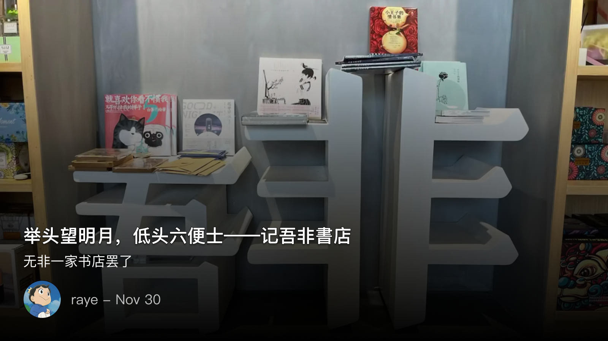

 举头望明月，低头六便士——记吾非書店

<!--  -->

为什么要叫吾非書店呢？可能有两层含义吧

- 我不是一家书店/我不只是一家书店（毕竟是和电信合作，挺贴切的hh）
- 无非就是一家书店罢了，我倒是挺喜欢这个，毕竟书店总给人一种小清新，文雅装个范的感觉，不过终究无非一家书店罢了

店长叫衣然，也许出自某篇典故吧，但我并不知道，只觉得莫名好听（补充下人也超级有趣好玩的！是一颗有趣的灵魂哈哈）

一个人运营一家书店，真的可行吗，在吾非書店，我感觉这是可行的

从书籍摆放，饮品制作，活动举办，创意市集，身为店长的衣然，一个人周旋于案牍之间，却还能保持着一颗放浪形骸之外的心灵

压力虽大，谈笑自若间，却仿佛举重若轻，泰山崩于前而色不变。我能感受到一种源自于最纯粹对书籍的热爱

在衣然讲解书籍摆放的时候，其中有几个比较有意思的细节，她刻意将林语堂和鲁迅的书摆在一起，希望这一对前结怨的文人，也能因这现世间一可爱的女子，化解掉往昔的仇恨吧。文人自是有相轻的宿怨，作为读者的我们，可不管那么多

还有木心，木心，多么好听又优美的名字，也藏在这书店的某一角呢，只有那些愿意慢下心来逛书店的人才能找到吧。指尖在一册册书籍间滑过，拂去一粒粒灰尘，看着一个个大师的名字，仿佛宇宙的终极真理就已然被掌握

逛书店，不是那种一进来就能直接买一本书的人，那目标太明确了，互联网上的书店就是这样，对于读者来说，更便宜的钱，送上门的物流，更别说大量的折扣与优惠了

可这世上总该还是要有一些人去坚守，总有些价值是无法用价格来衡量的，总有些逆子，生长于疾风之下，咬定于青山之中

在吾非書店，确实能看到一群爱书的人，

典雅的布局，电影的幕布，装点的花朵，古朴的书柜，随处可见的涂鸦，明信片，入口的漂流书屋，窗台边的旧书，未开封的新书，面朝阳光的卡座，咖啡的香味，我实在是忍不住想多待一会

一整天在茶在书在咖啡在阳光在几案间磨磨蹭蹭的好日子，这天上真有掉下来的馅饼！

只是可惜在深圳，很少有那样一种氛围了，曾今听过看理想的一档播客节目，标题就很嘲讽了，《在深圳，围观搞钱》

我很羡慕在北京，能有一群同样忧国忧民的小伙伴，在一个清风明月的夜晚，举杯把盏，半醉半醒之间，脱口而出一句，“这个世界会好吗？”

为之潸然泪下，为之欢欣鼓舞

