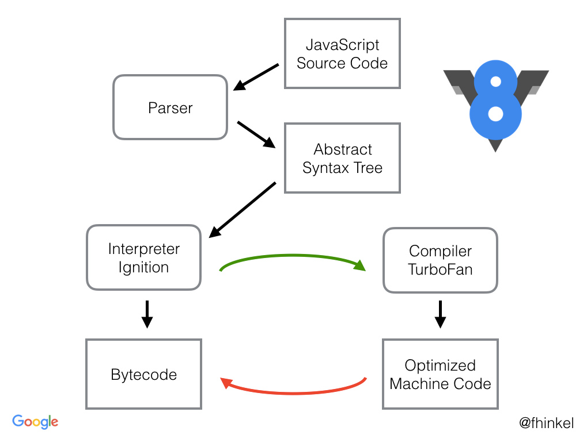
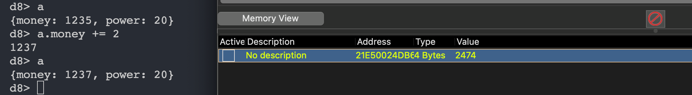
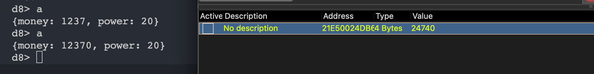
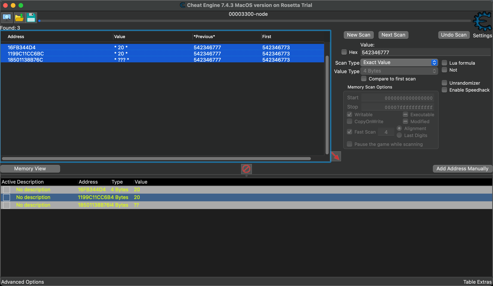
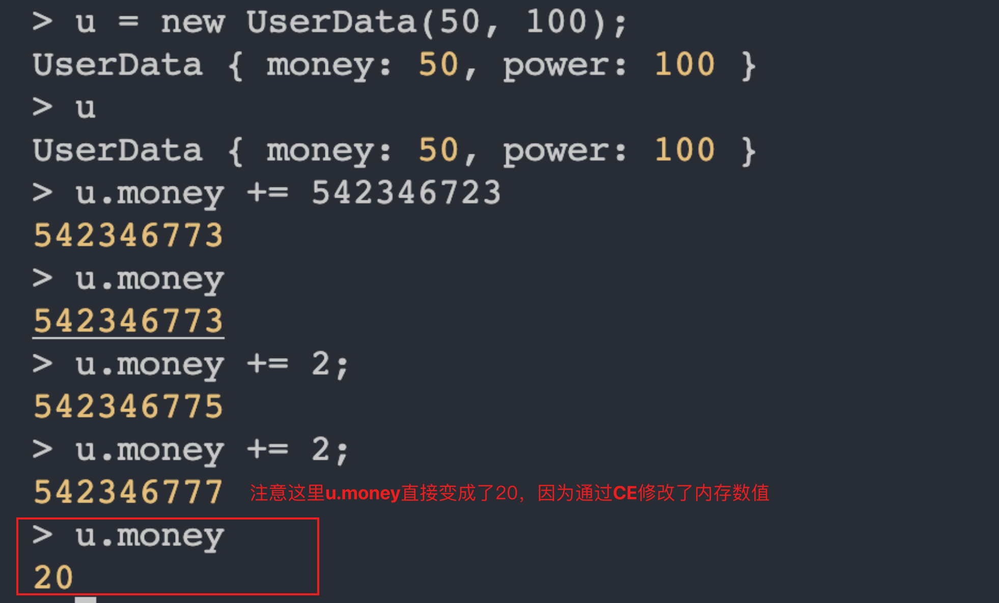
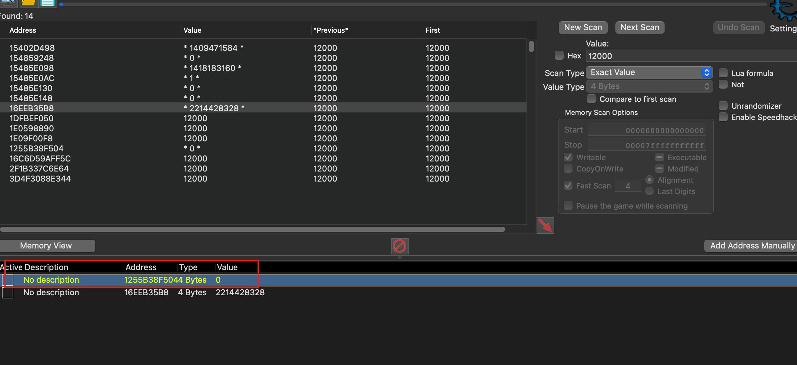
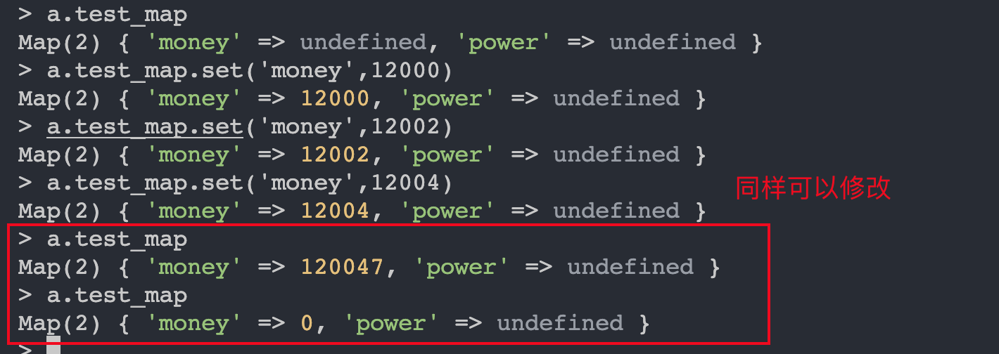
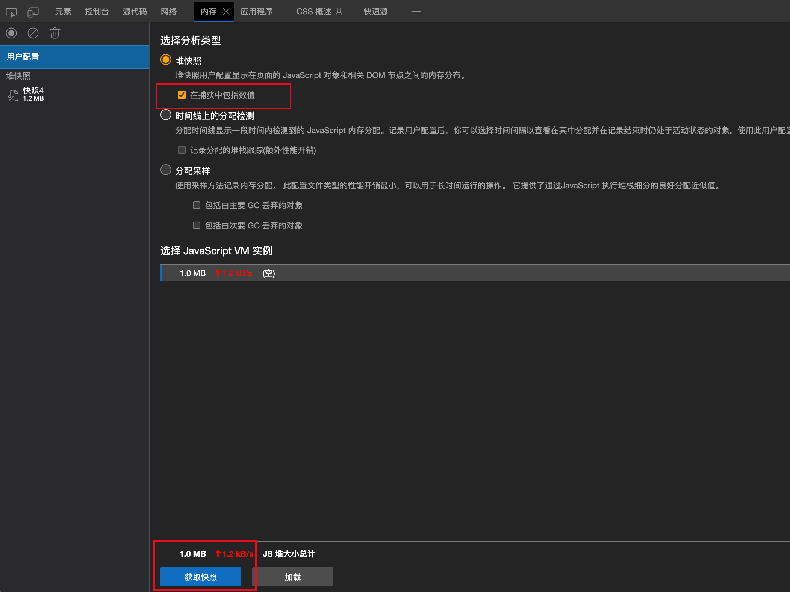
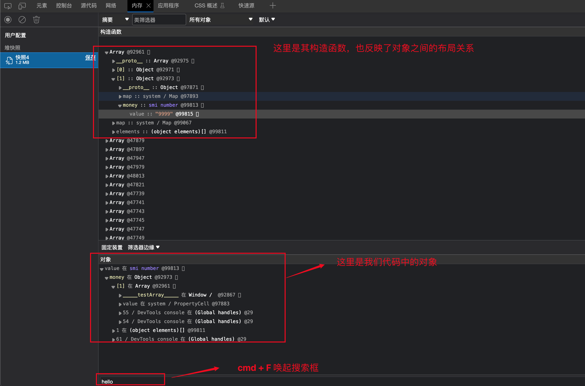
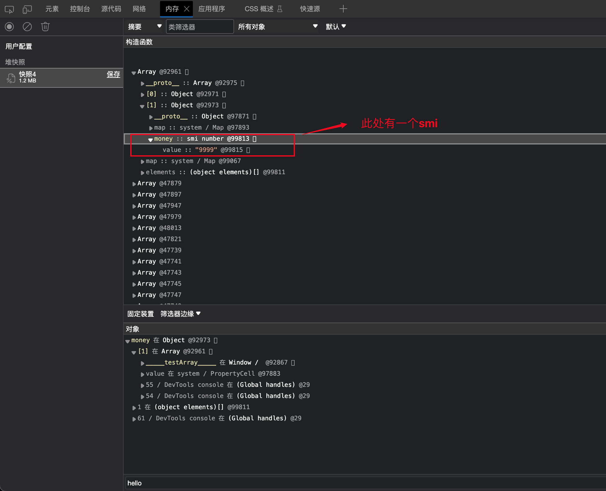

 从一个问题引发的JS内存探索

标题其实不太恰当，先这样吧


<!--  -->


 从一个内存规律说起

起因是在研究微信小游戏的时候，发现网上一直流传着一个规律，即游戏内数值 \* 2 = 内存数值

比如：[ CE游戏内存修改-爱神花园 ](https://www.nowcoder.com/discuss/352819218934489088)

<!--  -->

这个两倍确实有点令人费解，按照我对编译原理的理解，代码最后变为汇编代码的过程中，虽然会经过常量折叠等操作，但代码中数值是多少，实际内存中的数值也就是那个，比如我们通过CE来修改植物大战僵尸，代码中并未对阳光数值做加密，因此直接搜索数值就可以定位到：
[ [re入门]ce对植物大战僵尸的修改 ](https://blog.51cto.com/u_15302226/5189504)

如果是游戏做了数值的变化还好说，但是实际游戏代码里是并未去做这类操作的（要做这个操作也不至于简单地做个2倍乘法吧🤔）

由此作为因子，开始研究JS的内存问题


 v8引擎

本质上微信小程序代码也是跑在v8引擎上的，于是开始好奇JS代码是怎么一步步变为汇编代码的

我以为node.js就是v8，毕竟node.js也是基于v8移植的嘛，但发现两者还是有区别的。v8 本身是提供了一个shell的，这个才是最原汁原味的

本地可以编译一个v8 shell

步骤参考：[https://gist.github.com/Becavalier/58da63744f255abe5717e23dacc673e5](https://gist.github.com/Becavalier/58da63744f255abe5717e23dacc673e5)

```bash
 下载二进制工具
git clone https://chromium.googlesource.com/chromium/tools/depot_tools.git
export PATH=/path/depot_tools:$PATH
source ~/.bash_profile

 新建一个想要安装v8的目录
gclient

fetch v8
cd v8
gclient sync
tools/dev/v8gen.py x64.optdebug
ninja -C out.gn/x64.optdebug 

 最后获得d8的安装路径
/path/chromev8/v8/out.gn/x64.optdebug/d8
```

 v8 是怎么编译执行JS代码的？

基本原理还是那套，词法解析-\>语法解析-\>中间代码生成等

不过v8还做了很多优化，即 `ignition` 与 `turbofan` ，但这些都不在本次讨论范围内

<!--  -->


从图中可以看到，最后的结果就是 bytecode，那么这个bytecode长什么样子？

写一段代码做测试：

```bash
function test( obj ) {
  return obj.money + 10;
}

class UserData {
  constructor( money, power ) {
    this.money = money;
    this.power = power;
  }
}
u = new UserData(50, 100);
console.log(u.money, u.power);
for(let i = 0; i < 100000000; i++){
  test( u );
}
```

打印字节码 

```bash
d8  -print-bytecode test1.js 
```

我这里就把完整的字节码放上来了：

```bash
[generated bytecode for function:  (0x35e90011ae01 <SharedFunctionInfo>)]
Bytecode length: 131
Parameter count 1
Register count 7
Frame size 56
         0x35e90011afec @    0 : 13 00             LdaConstant [0]
         0x35e90011afee @    2 : c3                Star2
         0x35e90011afef @    3 : 19 fe f7          Mov <closure>, r3
         0x35e90011aff2 @    6 : 65 68 01 f8 02    CallRuntime [DeclareGlobals], r2-r3
         0x35e90011aff7 @   11 : 82 01             CreateBlockContext [1]
         0x35e90011aff9 @   13 : 1a f8             PushContext r2
         0x35e90011affb @   15 : 10                LdaTheHole
         0x35e90011affc @   16 : bf                Star6
         0x35e90011affd @   17 : 81 03 00 00       CreateClosure [3], [0], 0
         0x35e90011b001 @   21 : c2                Star3
         0x35e90011b002 @   22 : 13 02             LdaConstant [2]
         0x35e90011b004 @   24 : c1                Star4
         0x35e90011b005 @   25 : 19 f7 f5          Mov r3, r5
         0x35e90011b008 @   28 : 65 2a 00 f6 03    CallRuntime [DefineClass], r4-r6
         0x35e90011b00d @   33 : 1b f8             PopContext r2
         0x35e90011b00f @   35 : 0b f5             Ldar r5
         0x35e90011b011 @   37 : 25 02             StaCurrentContextSlot [2]
         0x35e90011b013 @   39 : 16 02             LdaCurrentContextSlot [2]
         0x35e90011b015 @   41 : c3                Star2
         0x35e90011b016 @   42 : 0d 32             LdaSmi [50]
         0x35e90011b018 @   44 : c2                Star3
         0x35e90011b019 @   45 : 0d 64             LdaSmi [100]
         0x35e90011b01b @   47 : c1                Star4
         0x35e90011b01c @   48 : 0b f8             Ldar r2
         0x35e90011b01e @   50 : 69 f8 f7 02 00    Construct r2, r3-r4, [0]
         0x35e90011b023 @   55 : 23 04 02          StaGlobal [4], [2]
         0x35e90011b026 @   58 : 21 05 04          LdaGlobal [5], [4]
         0x35e90011b029 @   61 : c2                Star3
         0x35e90011b02a @   62 : 2d f7 06 06       GetNamedProperty r3, [6], [6]
         0x35e90011b02e @   66 : c3                Star2
         0x35e90011b02f @   67 : 21 04 08          LdaGlobal [4], [8]
         0x35e90011b032 @   70 : c1                Star4
         0x35e90011b033 @   71 : 2d f6 07 0a       GetNamedProperty r4, [7], [10]
         0x35e90011b037 @   75 : c1                Star4
         0x35e90011b038 @   76 : 21 04 08          LdaGlobal [4], [8]
         0x35e90011b03b @   79 : c0                Star5
         0x35e90011b03c @   80 : 2d f5 08 0c       GetNamedProperty r5, [8], [12]
         0x35e90011b040 @   84 : c0                Star5
         0x35e90011b041 @   85 : 5f f8 f7 f6 f5 0e CallProperty2 r2, r3, r4, r5, [14]
         0x35e90011b047 @   91 : 0c                LdaZero
         0x35e90011b048 @   92 : c4                Star1
         0x35e90011b049 @   93 : 0e                LdaUndefined
         0x35e90011b04a @   94 : c5                Star0
         0x35e90011b04b @   95 : 01 0d 00 e1 f5 05 LdaSmi.ExtraWide [100000000]
         0x35e90011b051 @  101 : 6d f9 10          TestLessThan r1, [16]
         0x35e90011b054 @  104 : 9a 18             JumpIfFalse [24] (0x35e90011b06c @ 128)
         0x35e90011b056 @  106 : 21 09 11          LdaGlobal [9], [17]
         0x35e90011b059 @  109 : c3                Star2
         0x35e90011b05a @  110 : 21 04 08          LdaGlobal [4], [8]
         0x35e90011b05d @  113 : c2                Star3
         0x35e90011b05e @  114 : 62 f8 f7 13       CallUndefinedReceiver1 r2, r3, [19]
         0x35e90011b062 @  118 : c5                Star0
         0x35e90011b063 @  119 : 0b f9             Ldar r1
         0x35e90011b065 @  121 : 50 15             Inc [21]
         0x35e90011b067 @  123 : c4                Star1
         0x35e90011b068 @  124 : 8a 1d 00 16       JumpLoop [29], [0], [22] (0x35e90011b04b @ 95)
         0x35e90011b06c @  128 : 0b fa             Ldar r0
         0x35e90011b06e @  130 : aa                Return
Constant pool (size = 10)
0x35e90011af9d: [FixedArray] in OldSpace
 - map: 0x35e900000089 <Map(FIXED_ARRAY_TYPE)>
 - length: 10
           0: 0x35e90011ae71 <FixedArray[2]>
           1: 0x35e90011ae55 <ScopeInfo CLASS_SCOPE>
           2: 0x35e90011af79 <FixedArray[7]>
           3: 0x35e90011aebd <SharedFunctionInfo UserData>
           4: 0x35e900002b85 <String[1]: u>
           5: 0x35e9000044a9 <String[7]: console>
           6: 0x35e900311cad <String[3]: log>
           7: 0x35e90011adc5 <String[5]: money>
           8: 0x35e90011add9 <String[5]: power>
           9: 0x35e900310aed <String[4]: test>
Handler Table (size = 0)
Source Position Table (size = 0)
[generated bytecode for function: UserData (0x35e90011aebd <SharedFunctionInfo UserData>)]
Bytecode length: 14
Parameter count 3
Register count 0
Frame size 0
         0x35e90011b1f8 @    0 : 0b 03             Ldar a0
         0x35e90011b1fa @    2 : 32 02 00 00       SetNamedProperty <this>, [0], [0]
         0x35e90011b1fe @    6 : 0b 04             Ldar a1
         0x35e90011b200 @    8 : 32 02 01 02       SetNamedProperty <this>, [1], [2]
         0x35e90011b204 @   12 : 0e                LdaUndefined
         0x35e90011b205 @   13 : aa                Return
Constant pool (size = 2)
0x35e90011b1c9: [FixedArray] in OldSpace
 - map: 0x35e900000089 <Map(FIXED_ARRAY_TYPE)>
 - length: 2
           0: 0x35e90011adc5 <String[5]: money>
           1: 0x35e90011add9 <String[5]: power>
Handler Table (size = 0)
Source Position Table (size = 0)
50 100
[generated bytecode for function: test (0x35e90011ae81 <SharedFunctionInfo test>)]
Bytecode length: 8
Parameter count 2
Register count 0
Frame size 0
         0x35e90011b374 @    0 : 2d 03 00 01       GetNamedProperty a0, [0], [1]
         0x35e90011b378 @    4 : 44 0a 00          AddSmi [10], [0]
         0x35e90011b37b @    7 : aa                Return
Constant pool (size = 1)
0x35e90011b349: [FixedArray] in OldSpace
 - map: 0x35e900000089 <Map(FIXED_ARRAY_TYPE)>
 - length: 1
           0: 0x35e90011adc5 <String[5]: money>
Handler Table (size = 0)
Source Position Table (size = 0)
```


对于初次接触这个字节码的人来说，肯定是要花点时间才能理解清楚的，所以我们直接丢给chatGPT，看看它能不能复原出原来的代码：

> 以下回答出自GPT4

这段字节码表示了一段更复杂的JavaScript代码。让我们一步一步地分析它。

 主函数字节码

 常量池：

1. 其他固定数组和元数据
2. ScopeInfo for Class (类的范围信息)
3. 其他固定数组和元数据
4. `UserData` 的共享函数信息
5. 字符串 `u`
6. 字符串 `console`
7. 字符串 `log`
8. 字符串 `money`
9. 字符串 `power`
10. 字符串 `test`

 分析：

1. 定义一个类`UserData`，它有两个属性：`money`和`power`。
2. 创建一个`UserData`实例，传入参数 `50` 和 `100` 作为 `money` 和 `power` 的初始化值。
3. 将这个实例赋值给变量 `u`。
4. 调用 `console.log(u.money, u.power)`。
5. 创建一个循环，循环次数为`100000000`，在循环内部调用函数 `test`，使用 `u` 作为参数。

 UserData构造函数字节码

 分析：

1. 设置`this.money`为传入的第一个参数。
2. 设置`this.power`为传入的第二个参数。

 test函数字节码

 分析：

1. 从传入的对象中获取 `money` 属性。
2. 将获取到的值加10。
3. 返回这个结果。

 复原后的JavaScript代码：

```javascript
class UserData {
    constructor(money, power) {
        this.money = money;
        this.power = power;
    }
}

let u = new UserData(50, 100);
console.log(u.money, u.power);

function test(obj) {
    return obj.money + 10;
}

for (let i = 0; i < 100000000; i++) {
    test(u);
}
```

这就是根据给定的字节码复原的JavaScript代码。

GPT4也太牛了🥹，完美取代我吧

整体的字节码还是很好理解的，多看几遍，结合对应的指令格式不难分析出来。

并且可以看到这两条指令，这就很类似汇编指令里去mov一个数值，所以这个数值一定是原封不动地保留在内存数据里的

```javascript
         0x35e90011b016 @   42 : 0d 32             LdaSmi [50]

         0x35e90011b019 @   45 : 0d 64             LdaSmi [100]
```


因为v8运行时并没有 setInterval （也很神奇了），于是直接在d8的shell里做这个实验：

可以很清晰地定位到，内存数值就是实际运行时数值的两倍（2474 = 1237 \* 2）

<!--  -->


修改内存，此时的数值就直接发生变化了

<!--  -->


 对比node.js

既然如此，那就来看看node.js

 自定义的类

同样的代码，在node.js的shell中运行，实例化一个对象 user，可以看到我设置了 user.money 为一个很奇怪的数值，目的是保证内存中不会出现重复的数值（虽然还是重复了三个）
那就将这三个数值都修改了，效果也很明显，修改完之后，user.money 的数值就变化了

那也不存在什么两倍关系啊？🤔 这不是很正常的，定位到数值后直接修改就好了

<!--  -->

<!--  -->


 内置的类

自定义的类，对应的数值是可以直接搜索到的，那么node.js提供的类会不会不一样呢，找个Map做下测试

```javascript
class UserData {
    constructor(money, power) {
        this.test_map =new Map();
        this.test_map.set('money', money);
        this.test_map.set('power', power);
    }
}
```


通过CE还是可以定位到：

<!--  -->


并且也能修改：

<!--  -->


 对比浏览器

后知后觉，才意识到chrome的开发者工具中有一个可以拍摄内存快照的工具，主要是用来排查内存泄漏原因的，不过对于内存布局的研究也很方便

 chrome Memory面板

我们可以编写一段示例代码：

```html
<!DOCTYPE html>
<html lang="en">
<head>
    <meta charset="UTF-8">
    <meta name="viewport" content="width=device-width, initial-scale=1.0">
    <title>Document</title>
</head>
<body>
    
</body>
<script>
var _____testArray_____ = [{value: 'hello'}, {money: 9999} ];
console.info(_____testArray_____);
</script>
</html>
```

拍摄内存快照，点击获取快照即可拍摄下当前的快照

<!--  -->


在当前页面直接按下 `cmd + F` (对应Windows应该是 `ctfl+ F` ，可以在底部打开搜索窗口

因为我们的代码中出现了 `hello` 字符串，因此直接搜索之，搜到之后，右键在摘要视图中显示，就可以定位到对应的构造函数了


<!--  -->


从内存结构上看， 

即：
- hello 字符串 @17037（可以理解为一段内存的标识符）
	- 存储在 Object@92971 （对应 `{value: ;'hello'}`）
		- Obj又作为数组，存储在 Array@92961（对应 `[{value: 'hello'} ]`)
			- 数组存储在 `testArray`这个变量中，由于是全局变量，因此对应到 Window@92867 上

> 这也对应了通过 var 声明的变量是直接挂载在 Window对象的属性上

 什么是smi？

如果你足够眼尖，应该就能发现，数字9999被标记上了smi number

<!--  -->


> 以下是GPT4给出的回答：
> 在 JavaScript 的 V8 引擎（主要用于 Google Chrome 和 Node.js）中，SMI（Small Integer）是一种特殊的整数表示方式。这种表示方法主要用于性能优化。SMI 是一种“标记”整数类型，其中一部分位用于存储实际的整数值，而其他位则用于标记这个数字为 SMI 类型。
> 具体的实现可能依赖于具体的平台和环境，但在一个典型的 64 位系统上，一个 SMI 可能会使用 31 位来表示整数值，而剩下的位则用于其他目的，如垃圾收集标记、类型信息等。因为使用了这些额外的位，所以 SMI 能表示的整数范围会比通常的 32 位或 64 位整数要小。

从GPT给出的回答来看，一个SMI会使用31位来表示整数值，剩余的1位则用于其他目的，那不正好相当于是数据左移了一位！也就是文章开头提到的内存规律

但还遗留了一个问题，即node.js为什么没有用SMI？至少从上述测试来看，node.js就是直接存的。

GPT对此也没给出很好的回答， 只能猜测node.js背后对v8做了一些魔改吧🤣

 参考

- [ How V8 JavaScript engine works step by step [with diagram] ](https://cabulous.medium.com/how-v8-javascript-engine-works-5393832d80a7) 这篇可以加深对v8引擎的理解，有丰富的流程图
- [ V8 Internals: How Small is a “Small Integer?” ](https://medium.com/fhinkel/v8-internals-how-small-is-a-small-integer-e0badc18b6da) 理解smi


[]()