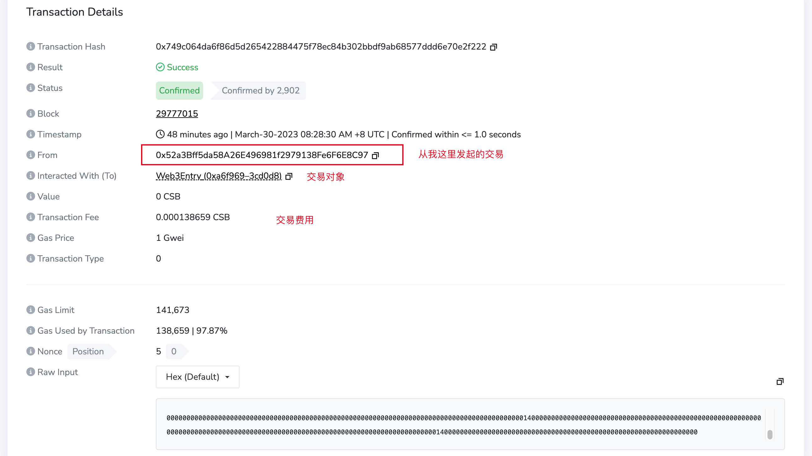
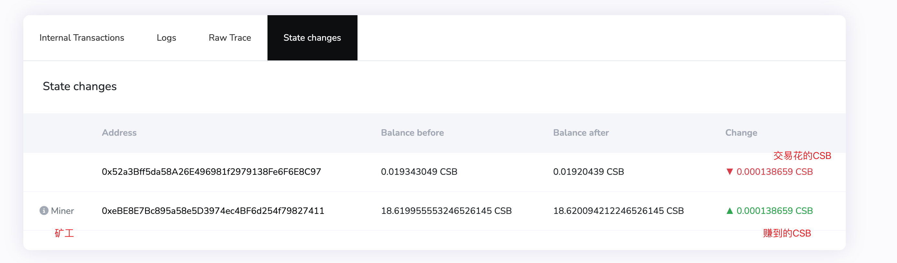
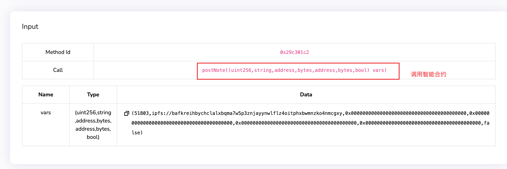
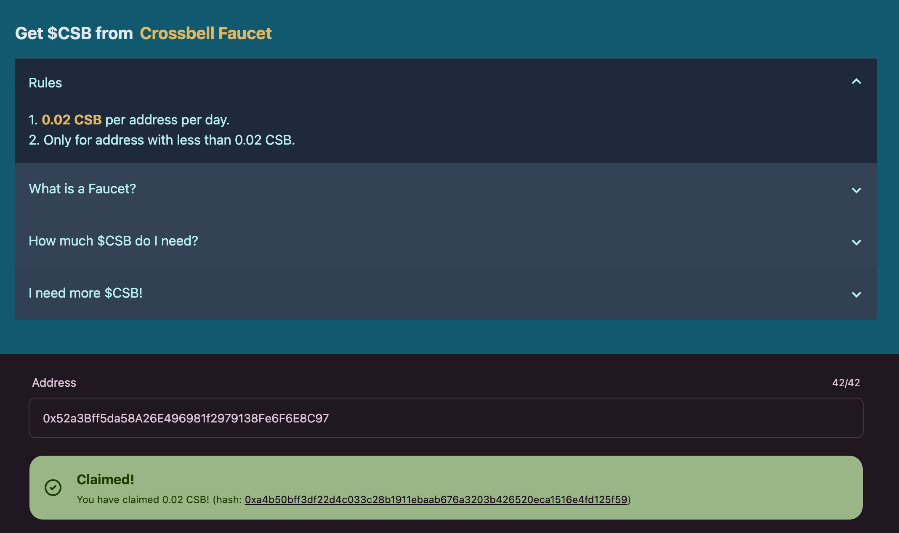
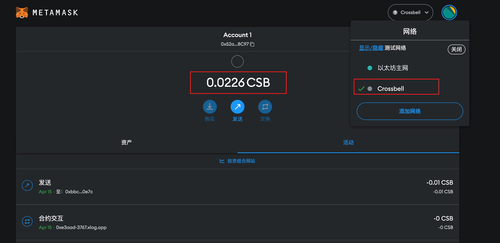
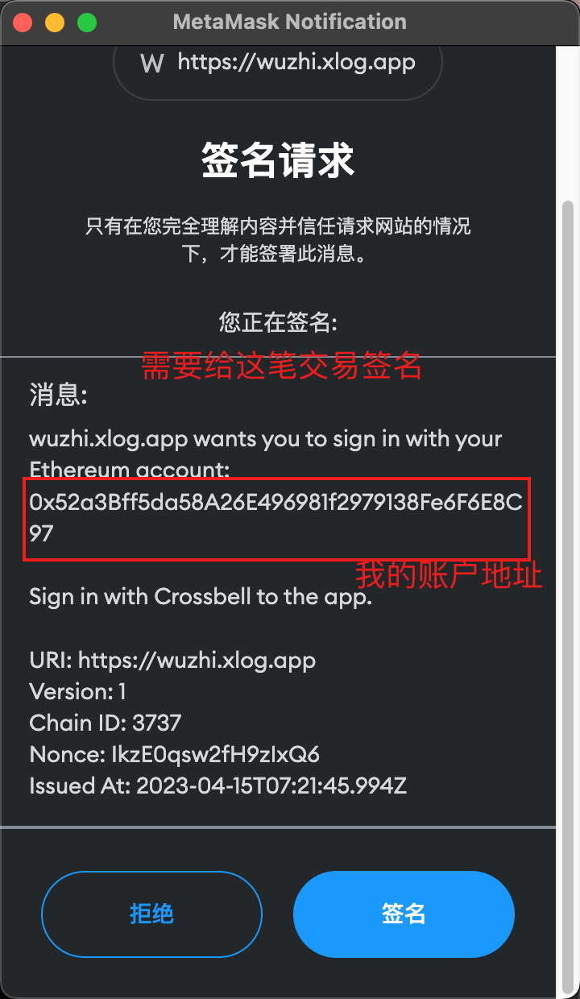
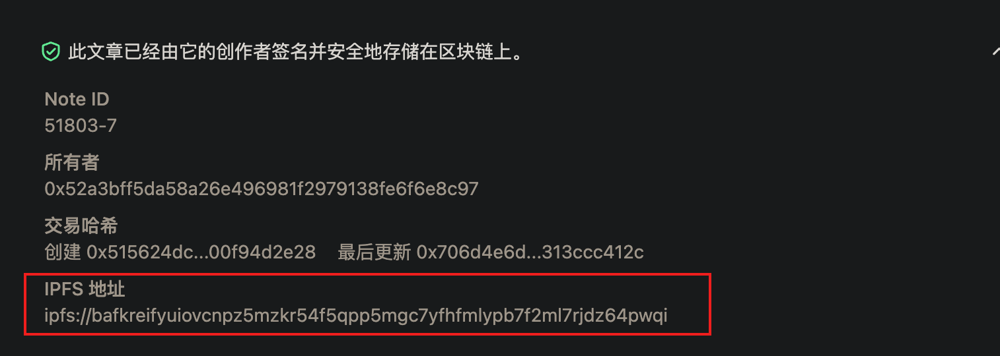

 区块链、智能合约、以太坊


旧文重写了下~

 web3初体验

今天有空来了解下这些web3相关的名词，起因是接触到了xlog.app这个web3的网站，在metamask小狐狸上创建了自己的钱包，并且发布了第一篇文章，也就是做了第一笔交易

由于是头一次接触web3，因为觉得年前对于这些概念炒的太火了，导致我对这些东西一直很排斥，不过现在终于有一个可以体验的平台了


<!--  -->


这是我的钱包公钥地址，欢迎转账👏🏻

```sql
0x52a3Bff5da58A26E496981f2979138Fe6F6E8C97
```

当我写一篇博客的时候，经过了一系列我不懂的环节，不过我马上意识到这本质上就是在区块链上完成了一笔交易

既然有交易，就有几个角色

- 发起交易方，也就是我，下图中可以看到 `From` 字段
- 交易对象，也就是 `Web3Entry` ，估计是xlog的账户吧？
- 交易费用，也就是支付给矿工的费用（因为矿工要帮忙验证和处理这一笔交易）

交易费用怎么计算呢？很简单，工作量 * 单价，单价一般用 Gwei 表示，记住就好了

从下图的交易详情可以看到这次的交易费用为0.000138659CSB （可以理解为类似CNY一样的符号）

这是交易的详情：

<!--  -->

[https://scan.crossbell.io/tx/0x749c064da6f86d5d265422884475f78ec84b302bbdf9ab68577ddd6e70e2f222](https://scan.crossbell.io/tx/0x749c064da6f86d5d265422884475f78ec84b302bbdf9ab68577ddd6e70e2f222) 


这里可以看到对应的矿工是谁，感谢他帮我签名


<!--  -->


此处是智能合约调用，具体我们会在后面说：


<!--  -->


未曾接触过区块链的萌新看到这些奇奇怪怪的名词都是懵的，这里就开始慢慢研究


<!--  -->

 重新认识钱包

钱包的概念其实是在不断进化的，比如我小时候知道钱包，就是指物理上那个小包包，用来装私房钱的


<!--  -->


长大一点，开始有了银行账户，这也是我的钱包，只是每一笔交易我都要去银行，或者自助柜台机办理。这种钱包，介于虚拟（电子账户）和物理（还是摸得到钱）之间。

后来开始有微信、QQ，网上银行，扫码支付，线上转账开始普及。这时候的钱包，已经逐渐脱离了物理上的概念，转账、支付都是数字上的变化


<!--  -->


区块链的钱包又是怎么回事呢？区块链钱包本质上并没有存钱，相反，它像一个守护神，帮助你保管一对神秘的密钥：公钥和私钥。公钥就像你的邮箱地址，你可以放心地告诉别人，让他们给你发送数字货币。而私钥则是你的专属密码，它让你能够随时随地访问并支配你的数字财富。

你可能会问，这不就意味着我有多少钱是公开的事情吗。确实如此，但是钱包地址和用户的真实身份是没有直接联系的。也就是说，你可以看到某个地址有多少钱，但是你不知道这个地址属于谁。

如果你把公钥告诉了别人，那确实可以看到你的所有交易记录，比如你现在就可以看我的交易记录：

[0x52a3Bff5da58A26E496981f2979138Fe6F6E8C97 - Crossbell Explorer](https://scan.crossbell.io/address/0x52a3Bff5da58A26E496981f2979138Fe6F6E8C97) 

看完是不是一脸懵逼，你知道我做了啥吗 /doge  


<!--  -->


背后其实就是博客发表、评论、点赞之类的记录，不过看到了也就看到了，没啥关系 /doge 

当然会有些技术比如零知识证明来保障钱包的隐私性，这是后话不谈

如果你想在xlog上发表文章，则首先需要创建一个钱包，这里我们就用MetaMask小狐狸钱包，它以浏览器插件的形式存在，手机上也可以下载对应的app

初次创建只会给你一个公私钥对，私钥不会直接给你，而是给你一串英文助记词，这是日后恢复账号的重要手段（或者说唯一）

 有了钱包，然后呢？

有了钱包之后，自然就能执行各种与钱相关的操作了

比如领钱


<!--  -->


只需复制你的账户地址，就可以去 Crossbell 的水龙头上领到 CSB 代币了，是不是很良心！

虽然只能领0.02 CSB，不过你看我前面发布一篇文章才 0.000138659CSB，就知道这是笔巨款了

[Crossbell Faucet](https://faucet.crossbell.io/) 


<!--  -->


领取完之后，就可以你的账户在 Crossbell Chain 上的余额，交易情况，后续你在xlog的每一次文章发表，点赞，评论都会被视作一次交易存储在 Crossbel Chain 上


<!--  -->


比如点赞，等于发起了一笔交易，需要签名并记录下来，发表文章则需要会提示你消耗CSB


<!--  -->


 我的文章内容存储在哪呢？

xlog使用了ipfs技术来存储，ipfs类似bt，不过更先进

我们都知道bt下载的人越多，下载速度越快，这其实就有点分布式存储的概念了，ipfs则完全是分布式的，如果离你最近的电脑有你需要的资源，那就直接通过ipfs传输给你了，不再需要去中心服务器（比如万恶的百度云）去查

如下就是ipfs的地址啦，点下就能查看


<!--  -->


 小结

其实整个web3的流程上手体验起来会觉得没啥阻碍，反倒是看着web3的一些概念会觉得头晕眼花，完全不知所云

小结

- 钱包其实是不断进化的，区块链钱包的实现方式和普通钱包不太一样，通过公私钥对来记录信息
- 既然都是钱包，那就和普通钱包一样可以管理资产
- 区块链钱包还可以和不同的链进行交互，可以理解为和不同的国家银行交互（毕竟币种不同）
- 在web3上发表文章就是一笔交易，会被记录到链上，拥有你的签名，后面我们会看到本质上就是对智能合约的调用

 参考

[在区块链上搭建个博客站，永久 免费 简单 安全！ - 无知便是罪 (xlog.app)](https://wuzhi.xlog.app/zai-qu-kuai-lian-shang-da-jian-ge-bo-ke-zhan--yong-jiu-mian-fei-jian-dan-an-quan-) 

[Notion+XLog双保险自己的Blog - oppenai.eth](https://oppenaieth-3787.xlog.app/NotionXLog) 

[从此开始 Web3 生活 - xcode.eth (xlog.app)](https://serenity.xlog.app/web3-from-zero)