 南北战争三百年：中国4—6世纪的军事与政权 读书分享

<!-- 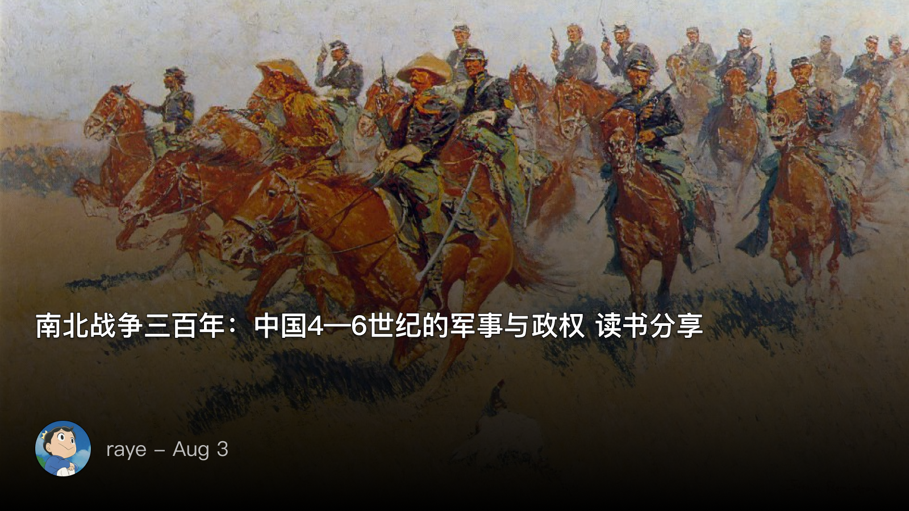 -->

ppt参考：

https://gamma.app/docs/-h164hf9xsdor2t8?mode=doc

 引入
正如我在对这本书的介绍中写到，
你有没有发现，无论是复联中的超级英雄，还是在电子游戏中，主角往往都偏爱使用冷兵器. 

明明科技都那么发达了，千里之外一发导弹就能解决的事，还要嘿嘿哈噫乱打一通. 

刀枪剑戟，策马扬鞭。所谓的“冷”兵器，反而最能让人热血沸腾. 

封狼居胥和勒石燕然的威名依旧威震四方，暗度陈仓与六出祁山仍然在不断假设与探讨中被演绎，南征与北伐，在这片土地的千年历史中一次又一次被不断重复.

我一直很想分享一本关于历史的书，但又怕深陷于繁杂的细节中难以抽身。主要是害怕被大佬们挑战到，总觉得自己积累的不够。去年11月的时候，我也是在1803会议室，分享过一本《夜晚的潜水艇》，那是我当时觉得写的特别好的一本小说。今年呢，我想尝试下挑战历史题材，我不太喜欢那种中规中矩的去介绍某个朝代，政治、经济、文化、军事这些这些

其实是我不太喜欢宏观视角的叙事，我更喜欢从一个侧面，或者从一个人物入手去思考历史，这也是我会和大家讨论的，就是你怎么去看历史，你更喜欢宏观叙事还是微观叙事

> 补充：我还记得曾经上学的时候，语文老师让我们轮流分享魏晋时代的名人，我的同学们当然都是介绍阮籍啦、嵇康、向秀这些人物，但我后来实在是不想这样循规蹈矩，于是我就从世说新语中受到启发，我分享的内容是这些名人儿童时候的经历，都说三岁看大，七岁看老，魏晋时代那些风云人物，他们的孩提时代，其实也有很多精彩的故事，从这些故事中，也可以看出未来他们的性格特点

于是思来想去，我就挑了李硕老师的这本《南北战争三百年》，他提供了一个很棒的视角，让我们可以地理与战争为切入点，探讨历史演化的本质。而这正好是我最喜欢的

 关于作者

李硕老师，其实如果说名字的话大家可能不一定很清楚，但如果说《翦商》的话，可能很多人就知道了。他是清华大学的历史系的博士，《南北战争三百年》其实是出自他的博士论文修改而来的，他最开始是写了一个短篇历史散文，讲的是刘裕北伐的故事，原文链接其实我分享过，那种他独有的散文风格，让我一下就喜欢上了他的书

https://book.douban.com/review/9236601/

马伯庸马亲王也是一位特别擅长写历史的作家，如果说马伯庸写历史是挖掘边角料再辅以天马行空的想象，那么李硕老师则是从学术分析的角度抽丝剥茧，加上严谨的考据和推理。 但得益于他散文式的笔法，读起来却并不枯燥，这也是促使我来分享的动力

 关于我

我的话呢，也不用说太多，因为在分享之前，群里就已经在开始在各种期待了，大家叫我raye就好了。关于我的标签呢，是一个典型的ENFJ-A人，羽毛球二级左撇子选手，就是比一般路人稍微厉害点，还是个左撇子。也可兼职做心理咨询师，虽然我并不是这方面相关的，但是确实有很多朋友说跟我聊过之后收获很多，可能得益于我本身是一个比较乐观的人吧

另外我也是一个经常失眠，然后失眠就喜欢胡思乱想的人，就像伍尔夫《墙上的斑点》一样，我的思维经常是跳跃性的，意识流的，所以如果你去看我的博客，里面记录的全是我胡思乱想的一些东西

嗯对，程序员似乎都喜欢倒腾一下博客，我也是从上大学开始的，中间陆陆续续更换了好几个站点，不过现在就稳定下来了，域名就是这个，后面的文稿、ppt也都会放在博客里。哦如果你也想跟我交流下写博客的东西，也欢迎找我

最后是介绍一下我的阅读经历吧，本来不太想放的，感觉有点制造焦虑，但我觉得有必要给自己增加一点背书，因为我基本只用微信读书看书，纸质书看得很少，所以时长比较长，然后又特别喜欢阅读历史相关的，欢迎和我一起探讨历史

 问题引入

介绍了这么多，我们先来看几个问题吧，应该不是挺难，这里主要是让大家热热身，提前熟悉下历史

1.中国王朝的更替顺序，秦汉三国两晋南北朝隋唐宋元明清，我们这次的历史跨度涉及主要是隋唐之前，即秦汉三国两晋南北朝
2.先秦至南北朝有哪些著名的战役

这个挺多的，包括春秋战国时马陵之战，桂陵之战，长平之战，官渡之战，赤壁之战，夷陵之战等等

3.先秦至南北朝有哪些著名将领
其实武庙十哲已经基本囊括了，田穰苴，杀神白起、韩信、张良、诸葛亮等等

好，那我要讲什么呢？因为从介绍到这次分享会开始也只有一周的时间，相信很多人也不一定能看完，不过也无所谓了，我讲的内容不一定完全按照书里的来，大家听我讲就好

主要是这几个大的问题：
1.骑兵作战技术从先秦到汉再到三国两晋南北朝的革新与演化 
2.古代中国地理环境对于冷兵器战争的影响 
3.经典的几场南北战争（北伐为什么那么难！）

以及一些小的讨论点：
1.李广难封的原因
2.真实的骑兵冲锋是怎样的
3.马镫是什么时候发明的

 为什么好奇冷兵器

提到冷兵器战争，可能会有个问题，也就是我们最开始提到的，为什么会好奇冷兵器呢？为什么即便是武器装备已经发展到了如今，还是有很多军事迷、电影、游戏都要去展现冷兵器的魅力呢？

其实这就有点像蒸汽朋克一样，人永远是被一些能理解，能看到的事务所着迷，千里之外一发导弹命中确实很爽，但你看不到，你感知不到，这个过程太快了。但冷兵器不一样，有书友跟我说，这是为了方便做特效啊，对，因为冷兵器打得慢，打得慢就容易融入一些元素，可以做很多的特效

提到冷兵器战争呢，其实古诗上面也有很多记载，不知道大家能想到多少，我这里随便列举了一些

- 一身转战三千里，一剑曾当百万师
- 将军金甲夜不脱，半夜行军戈相拨，匈奴草黄马正肥，金山西见烟尘飞
- 想当年，金戈铁马，气吞万里如虎
- 梦里挑灯看剑，梦回吹角连营，八百里分麾下炙，五十弦翻塞外声，沙场秋点兵

迄今为止，对于冷兵器战争场面还原的最到位的，还是全面战争系列，其中最贴合我们理解的，就是《全面战争 三国》，我在后续也会多次引用到这款游戏

 认识古代中国

好，既然要在这片土地上打仗了，那不认清楚这片土地又怎么行呢。中国的地理其实很复杂，算是地球上地理多样性最丰富的国家了吧，感觉没有之一

我们学地理那会，都知道中国有四大高原、四大盆地、三大平原这些，但对于古代中国人的认知范围来说，还远没有这么深，

隋唐之前，我们的核心版图基本局限于如下地区，向北最远抵达燕山，即燕云十六州，向南最远抵达南海，即古交州，也就现在的广州，但由于太过偏远了，是不参与中原争霸的，所以我们的最南其实就只抵达南岭了，即现在湖南裕广州的交接处

插个题，马伯庸马亲王的新书《食南之徒》就是讲的在汉朝，广州这块土地上发生的故事

那么在古人眼中的中国，其实刚好能构成一个类似九宫格的存在，为什么说是九宫格了，因为刚刚好每个版块就占据了一个格子

这是我自己的认识哈哈哈，但是很容易理解

我们知道中国按照秦岭——淮河是可以分为南北的，南北分界线上刚好分布着三个地理单元，然后北方和南方又可以再分别拆出三个地理单元

来依次看，从九宫格的左边看起：
左上： 关中+晋中，也就是春秋战国时的秦国和晋国，也即如今的陕西省中部北部加上陕西省
左中：汉中盆地，自古汉中为蜀中之咽喉，因此汉中经常为关中与四川盆地的缓冲区，谁拥有了汉中，谁就拥有了用兵的前沿阵地（所以刘备拼死也要把汉中拿下来）
左下：四川盆地，自成一体

中上：华北平原，即古代的冀州，三国时袁绍据有此地
中中：南阳盆地，同样是北方和南方的前沿阵地，其中襄阳为天下之咽喉，金庸小说中《神雕侠侣》中的郭靖和黄蓉，就是在此死守襄阳，抵御蒙古人的入侵
中下：江汉平原，古代楚国的大后方

右上：山东半岛，即古代齐鲁大地
右中：江淮平原，古徐州，淮河流域，合肥，孙权快乐城就位于此，所以知道为啥孙权一定要死磕合肥了吧，为什么守江必守淮！
右下：长江下游的两个平原，鄱阳湖平原和太湖平原，古扬州

如果一下无法消化也不要紧，主要是留一个初步的印象，后面在讲实际战争的时候也会结合来讲

<!--  -->

 认识马

了解了古代中国的地理环境之后，再来认识生活在这片土地上的一种动物，即马

马这种生物比较有意思，我还记得小时候看过的《虹猫蓝兔七侠传》里，每一人都能骑马，连卧底马三娘，她自己就是马也能骑马哈哈哈

马的特点不用多说：
- 体型健壮
- 耐力强
- 速度快
- 适应性高

但是马也有很多缺点，其中一条就是饲养成本高，这玩意特别糟蹋，要不停的吃和拉，而且拉出的粪便会污染土壤，不像牛，又能耕作，又能施肥

农业民族是很痛恨马的

讲到马这里的时候了，自然离不开后面的骑兵，但我们要知道，马其实并不是能一直跑的，马奔跑的时候有几种形态，是按照马蹄子的腾空来划分的

现代马术中，马的运动主要分为几种不同的形态：

1. 步态（Walk）：这是最慢的步态，四脚依次接触地面，每次有三蹄在地面上。步态稳定、平缓。

2. 小跑（Trot）：小跑是一种较快的步态，马以“二步一组”的节奏移动，即两脚对角线成对地离地和着地。这种步态需要一定的平衡和节奏感。

3. 快跑（Canter或Lope）：快跑是一种快速且平滑的步态，马的三蹄轮流接触地面，有一个明显的悬空期。这种步态通常在马术比赛中使用，要求马具有良好的协调性和力量。

4.疾跑（Gallop）：疾跑是马的最快步态，四蹄轮流接触地面，也有明显的悬空期。疾跑用于最高速度的奔跑，通常在赛马和一些速度要求的马术比赛中看到。

但马这货就不一样了，这货一直吃，一直拉，一头一尾从来不闲着！

有句话叫做“马不吃夜草不肥”，就是说马这货得特么连轴转的吃才能胖。

你能吃就算了，更可恨的是，马粪酸性还大，不仅不能起到好肥料的作用，还祸害地！还特么随时随地的各种拉！

一句话来形容，这货的能量转化水平极低还特么糟蹋土地！
养活一匹马的草场大约能养活几十只羊，看看人家喜羊羊多么可爱！

而且马如果你想骑的话，是需要煽的（宫刑），不然马爷那脾气您根本上不去，轻轻松松踢死你。

必须要在小马两岁的早春左右实施宫刑，随后还要有专业的遛马等一系列恢复手段。

这就意味着为了让你能被骑我还得专门派个劳力去伺候你，我那地咋办！
再说田间地头就那么两步道，谁家烧的骑马下地干活啊！
所以不是说中原不能大规模养马，而是谁家也不至于败家到大好的土地和人力去养这么一帮败家玩意！
道理换算到游牧民族那其实也一样，他们也不愿意养这货，只是没办法，有打狼和迁徙以及放牧的刚性要求。
游牧民族养马群时也是由马倌将马群赶到草场不好的地方去单独管理的。

 认识打仗
打仗究竟是打什么呢？难道真的就像三国演义里面说的，两位大将先单挑个三百回合？然后获胜的一方带着小兵一路冲杀过去，就打赢了

其实不然，打仗打的士兵的士气，士气崩了，人心散了，队伍就不好带了。
你不要以为，我自己拼死战到最后，就能获胜了，其实大部分时候，很多士兵是不情愿上战场的，毕竟家有妻儿老小，所以能跑就跑，五十步笑百步，还真不是开玩笑的，连我们的杰出的政治家管仲，不也当多很多次逃兵吗

所以历史上才能屡次出现以少胜多的战役

当然打输了也不意味着人都死光了，只是你的队伍散了，很多士兵走散了，所以经常会出现主将收拢残兵，继续作战

不过，冷兵器战争确实挺残酷的，曾经在知乎上看到过一个问题，底下有个回答，说的时”春燕归，巢于林木“

这句话其实是很耸人听闻的，你开始看觉得没什么，好像就是写景啊，春天来了，燕子都在树林里筑巢

但细想下来你就会觉得不对劲，其实燕子是倾向于在居民的屋檐下筑巢的，那为啥燕子都在树林里呢？是因为人都死光了，连房屋都全部被烧毁了

这还是记录的比较文艺的，更多的则是人相食

 春秋车战

如果说打仗算是们艺术的话，那也只能是春秋时候了，我们知道，礼乐射御书数，这是君子六艺
御，骑马，驾驶战车冲锋，这是君子必须要掌握的技能。

所以春秋时候的战争，还是更多的大家商量好地点，约一场架，打赢了的一方也不会赶尽杀绝

来感受一下骑兵冲锋的魅力吧
https://www.bilibili.com/video/BV1a3411T72v/?spm_id_from=333.337.search-card.all.click&vd_source=15a2dc392ee5cfd2402320bee219d8e3

 骑兵作战技术的演化
 早期骑兵：骑射技术
匈奴人则是最擅长骑射的，他们从小就生活在马背上

司马迁记载：
"儿能骑羊，引弓射鸟鼠；少长则射狐兔：用为食。士力能毌弓，尽为甲骑"

匈奴的战法也很有意思，
"故其战，人人自为趣利，善为诱兵以冒敌。故其见敌则逐利，如鸟之集；其困败，则瓦解云散矣"

说的是匈奴人单兵作战都很猛，进攻的时候像一群鸟一样， 撤退的时候呢又像云一样快速散开

春秋战国时候的兵种：步兵与骑兵，当然还有一个车兵
如果要追溯到骑兵的起源，想必很多熟读历史的朋友可能就要脱口而出：赵武灵王胡服骑射！
《史记 · 赵世家》中记载：
"今吾将胡服骑射以教百姓，而世必议寡人，奈何?" 

赵武灵王顶住了巨大压力，在赵国范围内推广胡服骑射，身体力行
战国时赵国所处的位置大抵是今山西及河北部分，它一方面要承担抵御匈奴的任务，另一方面要帮助山东六国抗衡秦国，其压力是可想而知的

注意此时的骑兵本质为骑射手，即边骑马边射箭，那有人就要问了，射箭就射箭呗，为什么非要骑马射箭？

可以先看一段视频，看看步兵是如何对阵骑射手的
【正确的骑兵打步兵方阵的办法，终于看到阵战了，阵型，对阵，专业。看了那么多古装剧战争场面，其他的基本上只要是打仗一上来就是打烂仗。】 https://www.bilibili.com/video/BV1dz4y1k7NF/?share_source=copy_web&vd_source=eb74eb1e105cb306ab17818712e795b8 

这个视频里面评论总结的很好了，这里就是赵国骑兵对阵秦国步兵
1、秦国步兵是防御阵型，盾手在前，矛戟在后，末尾是弩手，阵线弧形分布是为了最大可能避免骑兵侧面梯形切入阵线，而把防御阵型下的受保护的弩手和矛戟近其的可能夹在中间以保全。

2、赵国骑兵有胡服骑射的典故，自武灵王改革以来尤善骑射及迂回作战，尤以短弓快马，秦卒追不得赶不上防不住，所以基本盘秦卒就是在挨打的阵势，并且挨打不是挨打就完了，战场上进行职业战争中，可以打不过，但深知逃不掉的时候，战尽最后一兵一卒也只是为了苟延残喘拖延时间，待得以逃脱生还的机会，最终在大部队有效驰援下，部分秦卒得以苟全性命。

3、秦国步卒防御变阵也是为了应对赵国骑兵军阵尽出由整体化为小股游射而化为多个小阵型多方位防御，主要目的像如上所述，就是为了能死的慢点，尽可能拖延时间，苟全一时之机。

4、骑兵游射最佳方案是包围目标阵型，不断游击绕行，以弓弩之利四面八方重围为机，消耗敌方人手，最终瓦解敌方阵势，在敌人显现出疲态和人员散乱下可以一鼓作气进行冲击阵型尔后分割敌人开始歼灭屠杀。

骑射的威力，借用王者荣耀的英雄来打比方，就像后羿、鲁班这种短腿英雄开了疾跑，可以不断地风筝敌人，让需要近身攻击的战士，即普通士兵难以靠近

但秦朝开国之初，此时匈奴部落还未统一，没有一个强有力的政权来领导各个部落，因此蒙恬才能“却匈奴七百余里，胡人不敢南下而牧马”

这里有一个比较有意思的，即秦朝的统一反倒促进了匈奴部落的统一，为什么呢？战国时北方边境分别是秦、赵和燕。匈奴人可以在这三个国家之间分别贸易，市场还未统一，因此这一家价格不好就换另一家

但是随着秦朝建立，匈奴人突然发现，怎么突然价格都是一个了，怎么还有一道长城全部连起来了

”却匈奴七百余里，胡人不敢南下而牧马“

 长城这么矮究竟能拦住什么？

在提到汉匈对决之前，我们有必要先了解一下长城。“乃使蒙恬北筑长城而守藩篱，却匈奴七百余里”
我们一提到长城，就会想到这个：

<!-- 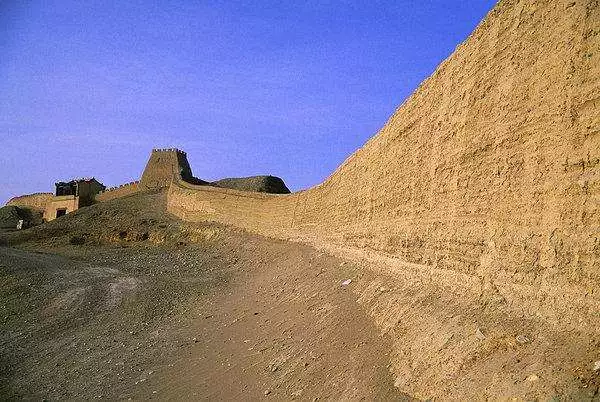 -->

但实际上，大部分长城是这样的，实际上就是土墙。
这道短短的土墙根本就拦不住人，但是拦得住马，游牧民族所依仗的就是高机动的马匹。
长城的第一个作用就是拦住匈奴人的马，你进来了但是没有马，那你面对的就是成建制的中原步兵，想都不用想，根本打不赢

但是游牧民族还是可以毁掉这座墙，如果是十万人规模的入侵，当然可以，三下五除二就没了
这时候长城的第二个作用就出现了，它会迟滞你的入侵。

在匈奴人拆除这道土墙的功夫，入侵的信息早就被一道道预警系统传到了中原内陆和沿线长城。人家可以从容的坚壁清野让你扑空并调人来堵你。战国时候赵国名将李牧就是靠这种方式来让匈奴人毛都抢不到

所以在战国时候，由于秦、赵、燕三国的长城并没有完全连成一片，因此匈奴人还是有空子可以钻的
另外他们也可以和秦、赵、燕三国互相battle，进行边关贸易

但是紧随着秦王扫六合，长城的第三个影响，也是最为深远的影响出现了，它连起来了

连起来了，也就意味着匈奴人有一天突然发现，这道万里长城，居然没有一点缝隙可以钻？而且对面本来不是三个国家吗，怎么突然变成了一个国家？连谈判的资格都没有了，人家反倒是借此垄断起来了，恐怖的经济封锁开始了。

这就好比美国联合世界上所有的国家抵制中国和俄罗斯，这时候中俄就只能团结在一起背靠背

于是游牧民族也不得不开始报团取暖，因为不报团，就活不下去了

因此从某种方面上来说，秦朝的统一，也促成了匈奴人的统一，这就是为什么，汉帝国和草原上的匈奴帝国，几乎在同一时间建立了

 最早的骑兵冲锋
我们知道赵武灵王胡服骑射也只是学习匈奴人的骑射，冲击骑兵真正大规模应用要等到卫青和霍去病，这个我们在后面讲

但其实在楚汉相争之时，项羽可以说是第一位将骑兵大规模用在正面战场上的将领了，这一点连韩信都比不上，韩信在他的成名之作，背水一战中，所率领的骑兵也只是起到骚扰和奇袭的作用

话说刘邦在韩信的指挥下，明修栈道暗度陈仓，重新获得关中的地盘，于是东出函谷关，一路上带着号称60w的兵马只捣项羽的老挝彭城

此时项羽呢，正忙着在齐国平定叛乱，听到自己的老窝被别人给端了，一下子愣了，这个刘邦不是被我一脚踹到四川去了吗，怎么这么快就打出来了

这时候你是项羽你也会犯难，救吧，这边平叛的兵力就不够了，不救的话自己的老窝又没了

<!-- 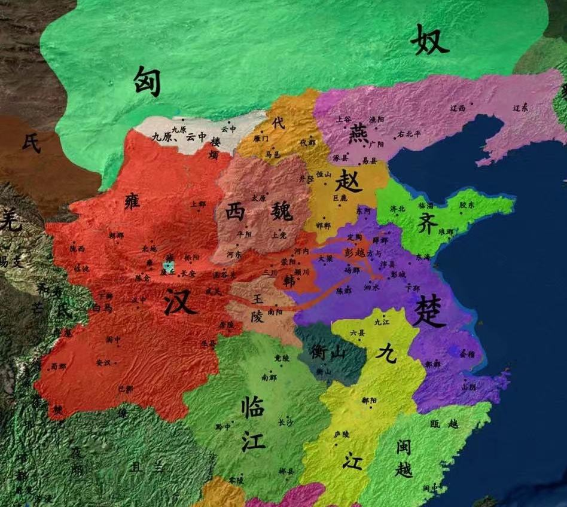 -->

而在项羽愣神的功夫，刘邦已经攻下了彭城，开始开party了
项羽最终决定，留下一位大将继续在齐国平叛，自己亲率3w骑兵，绕了个圈，没有走最近的沂水，3w骑兵直接攻破了刘邦手下樊哙的防线，直接就要冲到刘邦脸上来了

<!-- 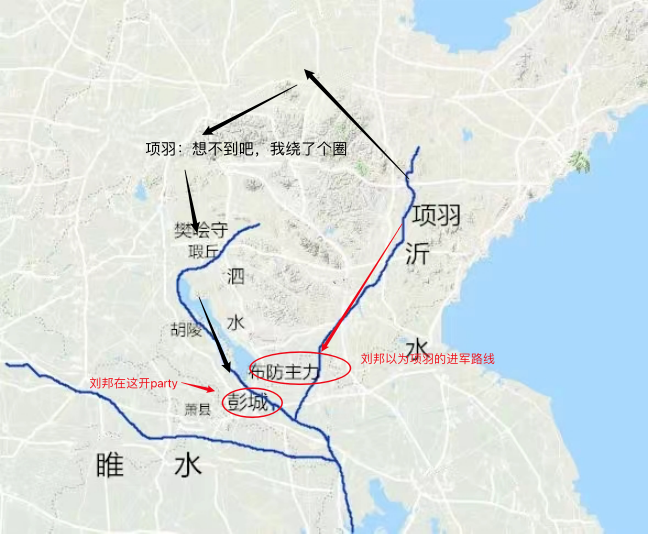 -->

刘邦此时的心情就像蒋委员长一样，“你们都干什么去了？”（只不过教员四渡赤水直逼贵州是将军抽车，项羽打刘邦这个就是几乎要一步杀了）

后面的事情就不展开了，总之刘邦抛妻弃子，最终在荥阳才稳固住防线，行程楚汉对峙的局面

史记记载：

> “项王乃西从萧,晨击汉军而东,至彭城，日中,大破汉军。”

以及我们所熟知的，司马迁记录项羽最后的垓下败亡时刻

> 今日固决死，原为诸君快战，必三胜之，为诸君溃围，斩将，刈旗，令诸君知天亡我，非战之罪也。”乃分其骑以为四队，四向
> 令四面骑驰下，期山东为三处。於是项王大呼驰下，汉军皆披靡，遂斩汉一将

 汉朝初年的窘境
汉初可以说是百废待兴，好巧不巧的是，由于秦始皇的长城大业，迫使匈奴人，在和汉朝建立几乎同时，也形成了自己的草原帝国

而我们此时的汉高祖刘邦，就想来试试这个未来的敌人，看看实力咋样，果不其然，御驾亲征，在白登山被围了。史称白登之围

自此直至汉武帝，汉朝一直都是能忍就忍，毕竟马匹资源不够，你这边步兵刚赶到，人家匈奴那群飞车党，已经抢完一把就跑了。你说这怎么打

其实汉景帝之时，汉朝已经足够富裕了，但还是打不赢匈奴，为什么呢？这就要讲讲骑射为何呢么这么难了

 骑射为什么难？

李广在一次出征匈奴的时候，只带了一百名左右的骑兵，突然遇见匈奴大军，此时李广说道：
"广之百骑皆大恐，欲驰还走。广曰：“吾去大军数十里，今如此以百骑走，匈奴追射我立尽。"
因为匈奴人从小就在马背上长大，因此他们的骑射技术是天生的，而骑射手本身就在于灵活性

而汉朝初年，马匹数量有限，甚至都只能坐牛车，更谈不上在马背上还要射箭了
那么在马背上射箭就那么难吗？难，确实很难，在马镫发明之前（关于马镫的故事后面会讲到）

难在哪里？随便说几个
1.上马
2.坐稳
3.拉弓瞄准
4.保持平衡

如果不是天生就在马背上的匈奴人，

汉朝当然也有，被司马迁捧上天的李广就是骑射高手，他所带领的部队也和匈奴人一样，没半点组织纪律

 汉匈战争：冲击骑兵的诞生
 司马迁的局限性

虽然司马迁很伟大，人固有一死，或重于泰山，或轻于鸿毛，司马迁的死是比泰山还重的
但奈何人都有自身的局限性，司马迁对于卫青霍去病的记录是少之又少，甚至连我们的初中历史课本，对于卫青和霍去病的贡献也只是简单的记录了下

 卫青与霍去病

还是要来介绍一下卫青，卫青的姐姐是卫子夫，卫子夫是汉武帝宠幸的妃子，所以卫青算是汉武帝的姐夫。

而卫青呢，其实是一个私生子，嗯没错，霍去病也是一个私生子。

卫青、霍去病，这俩中国历史上的最强外戚天团，将步兵的战阵用于骑兵，开创了冲击骑兵的先河

 汉武帝是如何解题的

好了，如果你是汉武帝，面对匈奴的难题，你手下有两位SSR级的武将卫青和霍去病，还有一位探险家张骞帮你开图，你要怎么去解这道题呢？

我们先来看汉朝的边防线：

注意，此时的河套地区（黄河百害，唯富一套），秦始皇曾经让蒙恬收复此地，但后来楚汉相争，这块底盘又被匈奴人控制了

前面已经说了，每次匈奴人来进攻，汉朝就派军队去守，但是等你人到了，匈奴人早就跑的没影了

汉武帝想要改变这种现状

<!-- 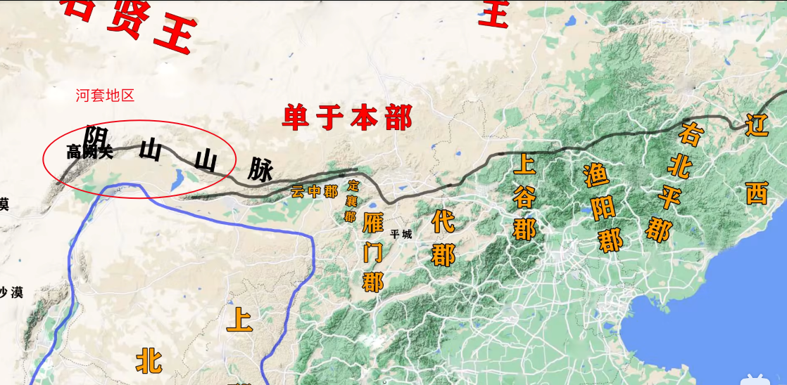 -->

 对照实验

既然手下有一堆将领，那就出击试一试，看看

其实也是做实验，经过前几代的积累，到他这已经有钱了

汉武帝算是精心挑选了这四个人，既有经验丰富，多次出征的李广，也有年纪轻轻的卫青
第一次出击，他分别派遣四位将领，卫青出上谷，公孙贺出云中，公孙敖出代郡，李广出雁门，各领一万骑兵

最后的结果是：
结果这一轮对照实验下来，卫青获胜，甚至于在这时候，卫青就已经探索发明了突骑战法

补充：冲击骑兵的物理学规律

主要涉及到两条物理学规律
1.E=1/2mv2 即速度越快，动能越大
2.v相对=v1-v2 相对速度

我们还记得匈奴人的战法吗？
利则进，不利则退，不羞遁走。
人人自为趣利，善为诱兵以冒敌。
故其见敌则逐利，如鸟之集；其困败，则瓦解云散矣。

人家一看不对，第一反应是跑！是保自己的这条命！他们并没有中原政权那种拢住步兵方阵不被你冲垮的纪律性！
而纪律性这点，在中原民族千百年来的练兵方法指引下，根本不叫个事

<!-- 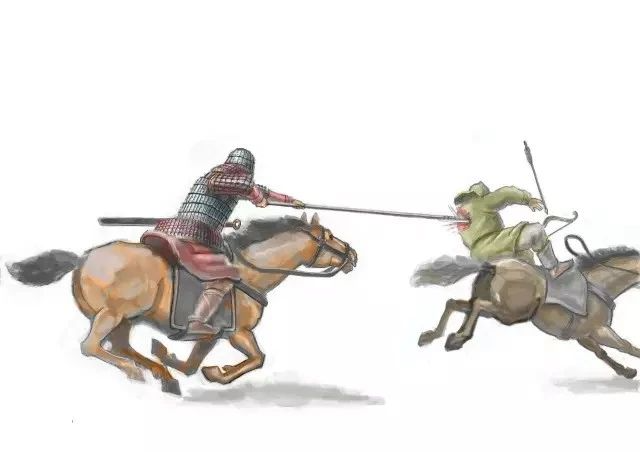 -->

 收复河套地区

果不其然，匈奴开始报复了，派大军再一次入侵上谷、渔阳等地
如果是你，你会派卫青去防御吗？
这一次汉武帝忍不下去了，好，既然你打这边，那我就打你的白羊部

为什么不让卫青率军直接从长安北上呢？而是要先绕道雁门郡，再折而向西？
因为直接向北只能起到赶的作用，匈奴人是可以往北撤退的，没办法一次性歼灭敌人有生力量

这一战，直接让卫青收复了河套地区，从此成为抗击匈奴的前线

<!--  -->

 开图找盟友
这里就不细说了，其实就是派遣张骞出使西域，看看大月氏人愿不愿意一起抗击匈奴
当然大月氏人早就跑了，但是汉武帝得知，原来在广袤的西边，还有三十六个国家在不断地给匈奴输血

这还得了，于是下一步自然而然的，打通河西走廊，联合西域诸国的方案开始提上日程

 河西四郡
收复河西走廊之战的示意图如下，这一战霍去病19岁...大漠扬威

汉武帝为了防止在攻打河西走廊的时候，左贤王过来参战，于是派遣了李广和张骞先去进攻，但是张骞迷路了...不过好在李广毕竟是飞将军，面对四倍于自己的兵力硬是扛过来了

单于本部此时远在漠北，但也得知了消息，于是南下骚扰，不过被汉军抵挡住了

左路的公孙敖也迷路了..霍去病则是千里奔袭，翻过贺兰山，再穿越大沙漠，最后到达河西走廊的尽头，这都没迷路，只能说牛13了

于是反向秃噜一遍，斩首匈奴人三万，彻底收复河西走廊，汉武帝置酒泉、武威、敦煌、张掖四郡，是为河西四郡（不得不说，汉武的命名是真的好听）

<!-- 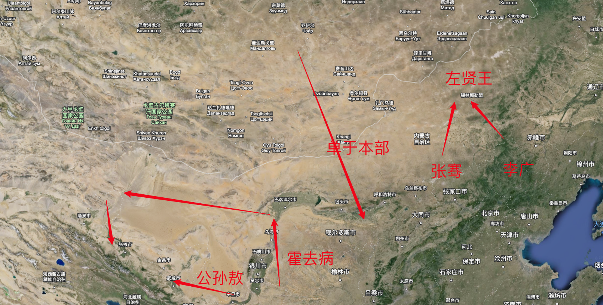 -->

 时间规律分析
除了上述说的几场大规模战役之外，中间还有数次小规模的侵略与反侵略。这里列举一些记录：

- 其明年秋，匈奴二万骑入汉，杀辽西太守，略二千馀人
- 其秋，匈奴又入雁门，杀略千馀人。
- 其秋，匈奴万骑入杀代郡都尉硃英，略千馀人
- 其秋，匈奴大入定襄、云中，杀略数千人，败数二千石而去，

从上述记录你有没有发现一个问题，怎么tmd匈奴都是秋天来打呢？这里
这只是表象，深入分析后你就会发现，因为春夏是
此时就对了，来看汉武帝数次派遣将领出征匈奴的时间

- 其明年春，汉以卫青为大将军，将六将军，十馀万人，出朔方、高阙击胡
- 其明年春，汉复遣大将军卫青将六将军，兵十馀万骑，乃再出定襄数百里击匈奴
- 其明年春，汉使骠骑将军去病将万骑出陇西，过焉支山千馀里，击匈奴，
- 其明年春，... 令大将军青、骠骑将军去病中分军，大将军出定襄，骠骑将军出代，咸约绝幕击匈奴。

 封狼居胥！漠南无王庭！

最后这一战没啥好说的了，总之就是匈奴人已经被打蒙了，从此漠南无王庭！
但也就是这最后一站，李广自杀，飞将军陨落！

这就是汉武帝面对匈奴难题的解决
历史是演化的，不是一蹴而就的，很多以事后诸葛亮来看的问题明明很容易解决，但放在当时那个环境就是想不出来

但你要对阵匈奴可就没那么简单了，人家利则进，不利则退，等你集结起兵马，人家早就跑的没影了。所以先秦到西汉初年，基本都是依赖两种方式。其一是长城，通过长城来告警，来迟缓敌人进攻的时间，其二是和亲，你都是我姑爷了，那就不用打了吧

但这都不够，于是经过多年的韬光养晦，刘彻这个最能做的皇帝就出来了，这里的作，既有褒义，也有贬义

 李广难封的悲哀
也不知道司马迁是不是故意的，在《史记 李将军列传》中，司马迁这么写：

感觉司马迁就是在塑造一个小说形象一样，还在最开始埋下了伏笔，后来一语成谶，李将军终生未能封侯

而文帝曰：“惜乎，子不遇时！如令子当高帝时，万户侯岂足道哉！”

李广的出名的原因就在于他是骑射高手，同时他的悲哀也在于它是一名骑射高手。他就像一个传统的手艺人一样，在机械化、工业化都已经大行其道的当下，还在坚持传统的工匠精神（我不知道我这么类比对不对啊），但我觉得司马迁可能想表达出这个意思

在那个时代，卫青、霍去病已经探索出了冲击骑兵的技战术，可李广还是坚持着老一套，我们可以说他是固执，但这是他最引以为傲的本领，这是连他的敌人匈奴人也都认可的

因此李广出征匈奴，他肯定会被重点关照，匈奴人常常以数倍的兵力围攻他，让他一次又一次全军覆没

单于素闻广贤，令曰：“得李广必生致之。”

“少年十五二十时，步行夺得胡马骑”，其实就是讲的李广在一次全军覆没后，他被俘虏了，但是李广太有名了，匈奴人就像动漫里经常出现的反派一样，一定要抓活的...

于是李广在被匈奴人俘虏抓获的时候，通过装死，骗过匈奴人的注意力，一个跃起，就夺走了匈奴人的一匹马，然后飞马逃回营地，并且挽弓射杀了好几个想要追上来的匈奴人

不得不说李广的骑射技术是真的精湛，但打仗从来都不是靠一个人就能行的，

所以这也是李广的悲哀，生不逢时，他要是出生在楚汉相争的时候，估计又是一个霸王项羽

你怎么看待李广，如果你是汉武帝，你会愿意重用李广吗？

 三国两晋：马镫与汉化

 先来看马镫
卫青霍去病时代，中原政权终于探索出了突骑战法，将步兵的正面冲锋战术移植到了骑兵
所谓冲击骑兵，本质就是一人一匹马，加一根长枪，用腋下夹着，然后用手握紧，对阵敌阵冲锋
这里就有很明显的问题：
1.如何保持自身稳定
2.武器如何拔不出来怎么办

<!-- 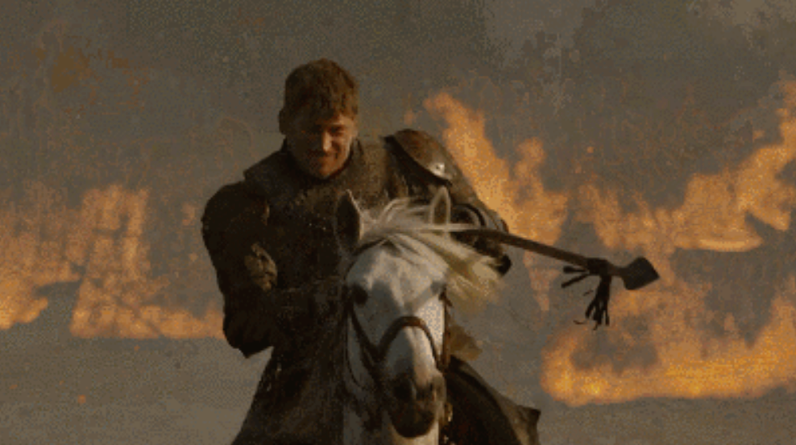 -->

在卫青霍去病那个时代，没有马镫其实可行的，为什么呢？
因为战争的对象是匈奴人，匈奴人是会跑的，所以汉军只要疯狂向前冲就行了，草原民族的天生基因就是一个个松散的个体在战斗，又怎么可能是全速冲刺的骑兵的对手
这样一来马镫是否需要也无所谓了，只要能冲上去，汉军个个都是杀神，原先匈奴引以为傲的战法，在汉军一轮轮的冲锋下，简直是进入到了死神的领域中

但是历史是演变的，东汉末年开始，骑兵的作战对象不再是只会跑的匈奴人，而是开始直面步兵

比如如下这个，看你作为骑兵你敢不敢冲锋，冲进去就是找死(这场景下只要长矛阵将前几排的人死命把前排的马戳死，后排上来的骑兵不是被绊倒就是要减速。)

https://www.bilibili.com/video/BV1gx411B7oX/?spm_id_from=333.337.search-card.all.click&vd_source=15a2dc392ee5cfd2402320bee219d8e3

骑兵是可以冲击步兵，但不是正面啊喂，是侧翼
但尽管是侧翼，现在你冲锋的对象已经是一个静止的物体了，速度为0，即便你冲锋进去了，你也要承受冲击带来的反作用力

为了对抗此类反作用力，最早的思路就是加高马鞍
但是吧，马鞍变高后，虽然被后坐力顶下去的可能性降低了，但骑兵上马又成了问题。

骑兵上马一直都是一个技术活，老将军廉颇甚至拿来炫技

廉颇为之一饭斗米，肉十斤，被甲上马，以示尚可用

当然还有一个原因，此时来自中国南方的将领们开始走上前线，著名的就是孙坚孙策孙权
南方人可能没有北方人那么高大，比如我是吧（不是地域黑），

坊间也流传着这样的笑话，马镫最开始是为了帮助孙权同志那种小短腿骑上马的

自然而然的，辅助上马的马镫开始出现，最早是作为单马镫，我们从考古推测出此时的马镫只是作为辅助骑手上马使用的，骑上之后就不用马镫了

<!-- 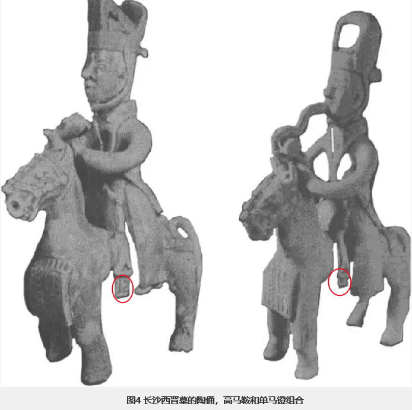 -->

但是，当骑手在实行突击战法的时候，一旦发现一只脚踩住单马镫能够更稳的坐在马背上获得一部分支撑力的时候，双马镫的发明，就不远了！

 再来讲汉化

前面我们说了，匈奴就算统一了，其内部的中央集权也远远比不上中原民族，单于首领是无法强制他们的部下冲锋的，但是我们汉民族就不一样了

我最喜欢的一个up主，渤海小吏写过一段话，我还挺喜欢的，他说跟匈奴比骑射，我们永远也比不上，

但是，跟你比纪律，比团结一致向前看，比总能量的集中调度，你们比我们差了上千年！
我们是治水杠黄河的民族！
我们是基建狂魔造长城的民族！
我们是打过上百万规模战争的民族！
我们是所有适龄男子在一声令下驰援长平战场包饺子的民族！
在这片土地，这个民族所最令人害怕的战争力量从来不是个体的天赋异禀！
而是成百上千人旗帜鲜明整齐划一所聚拢迸发出的恐怖力量

这段话，很清楚地讲明白了中央集权能够在这片土地上存在，是有其必然性的

其实隐藏在南北战争的背后，还有一条草蛇灰线，那就是汉化，少数民族想要入主中原，谁汉化的足够彻底，足够明白了，学会编户齐民了，你得血才能源源不断地抽上来，你必须汉化军制把纪律这事搞定了，才谈得上顶级战斗力

两晋之后的五胡乱华，匈奴、鲜卑、羯、氐、羌，这五个少数民族，正式凭借着不断熟悉冲击骑兵战术，以及自身政权组织的不断汉化，才能入主中原

 南北朝：大规模的骑兵对战
南北朝时期，北方冲击骑兵的技战术已然成行，由于南北朝的历史太过庞大复杂，无法展开，我们就以几场战役，来看看南北方是如何作战的吧

如果想要详细了解南北朝的历史，可以先看B站up 安州牧的《一口气看完170年的乱世南北朝》

经典的南北战役
还是要先来复习一下中国的九宫格地图：

<!--  -->

金戈铁马，气吞万里如虎
公元409年，即将取代东晋王朝建立刘宋的刘裕大将军上表请求北伐
北伐的目标是此时由慕容德在山东半岛建立的南燕政权
刘裕的行军路线如下图：先走水路到达下邳，按照以往北伐的经验，刘裕应该从下邳继续走水路
●一条自下邳北上，走沂水进入山东；（下图最右黑线）
●一条自泗水走汶水随后插入鲁郡走泰山路线插入山东。（下图中间黑线）
●一条自泗水走桓公渎然后进入济水随后从北面插进山东。（下图最左黑线）

<!-- 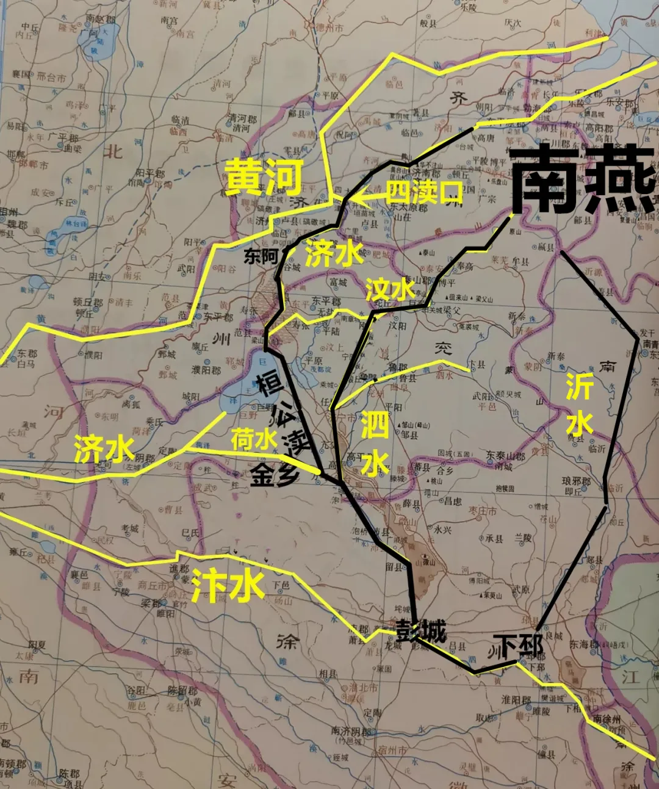 -->

但你能想到的，敌人也能想到，南燕早就设置好了防线等着你来，况且看上去最短的沂水，实际上因为很久没有走过了，还需要疏浚河道，如果往北又拖太久了。
此时的政治背景下，刘裕必须要速战速决

因此刘裕从下邳后放弃水路，步行至琅琊，再到东莞，最后直接插入大舰山
为什么要走山路？因为山地陡峭林木茂密不适合燕军的骑兵冲击，而且出了大舰山后离南燕的首都广固就很近了，说不定可以一战灭国（事实上也正是这样的）

但实际上这是很冒险的行为，因为你必须要祈求大舰山的出口没有被敌人封锁，而且你出山之后敌人没有坚壁清野，你得有粮草补给（从大舰山运粮肯定是噩梦）

但历史有时候就是这样，时来天地皆同力，说的就是刘裕这种情况
  
因为南燕啥都没做，就眼睁睁地看着刘裕从大舰山钻出来，当刘裕出来的时候，其实他就知道他赌对了，这场仗一定能打赢了

出山之后，南燕慕容超亲自率领步骑4w赶来，刘裕的手下也不知吃素的

军达临朐，与贼争水，龙符单骑冲突，应手破散，即据水源，贼遂退走

<!-- 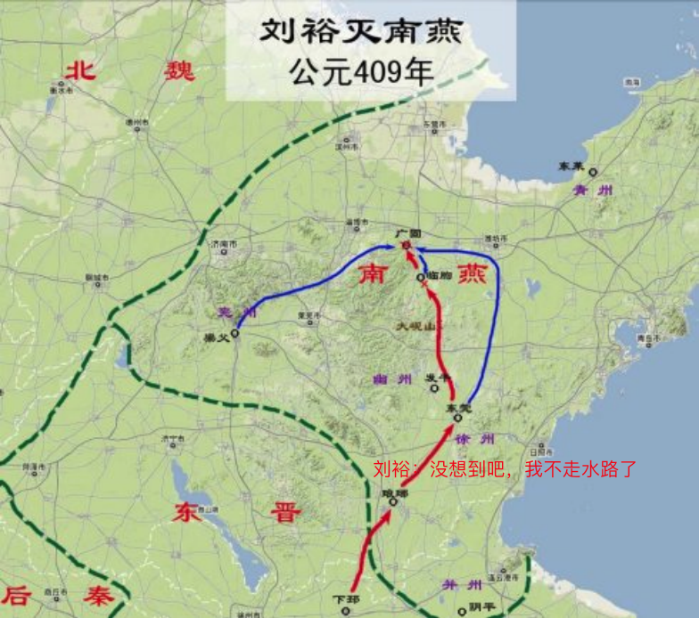 -->

后续刘裕摆出却月阵法，这个车阵就是类似于一个移动的加强盾牌方阵，车的吨位大，能够阻止骑兵冲击，然后步兵在车后面扎人，弓兵在车阵后面放箭。成功抵挡住了南燕骑兵的冲锋

<!-- 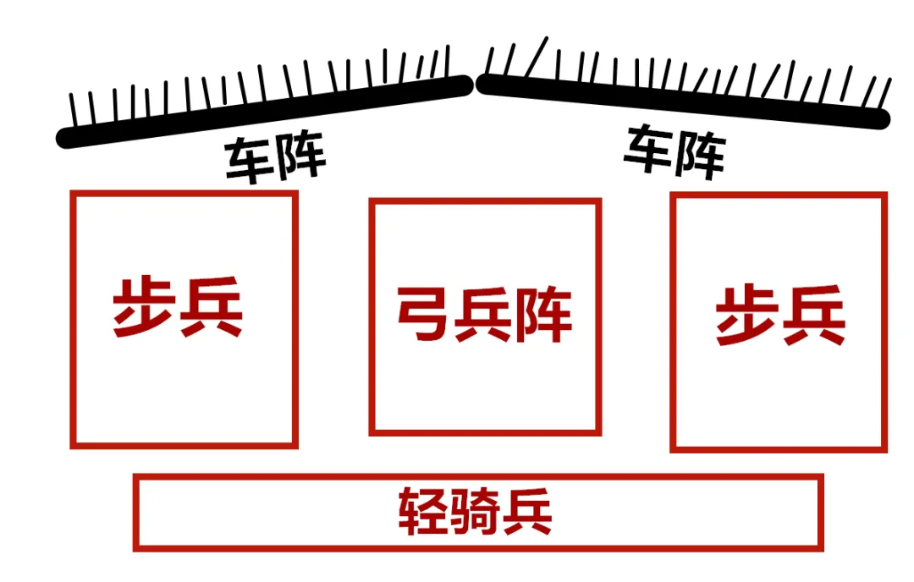 -->

 元嘉草草，却赢得仓皇北顾

公元450年，刘义隆北伐示意图：
从这张图上可以看到，此时南方的刘宋政权是很占优势的，九宫格里面，南方至少占据了6个格
北伐的问题？
战线拉的太长了，各支军队协同难以保证，而且你要意识到一个点，地球是一个球体，南方是在低纬度，相同的维度距离更长，这就像石头剪刀布一样，南方先出了个布
结果呢，东边进军的王玄谟在滑台一战失利，宋军精锐尽丧，北魏一路反推至建康城下，但终究由于北方军队推进过快，沿途路上还有多座城池并未攻克，拓跋焘也不敢真正渡江，随机班师

<!-- 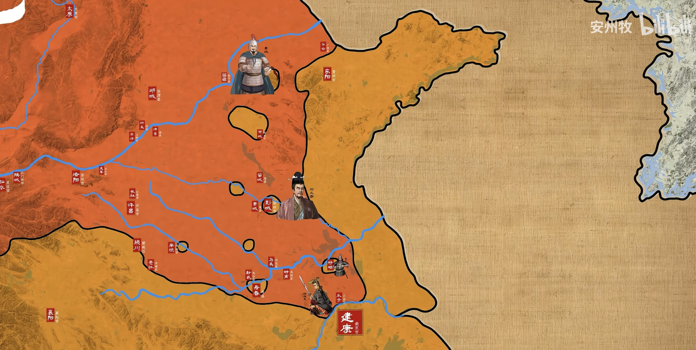 -->

 几个问题讨论
1.卫青为什么能改良骑兵作战技术
个人：卫青本身就是青年将领，敢于革新技术
敌人：匈奴作战的特性就是利则进，不利则退，所以面对一群冲上来的人，本能的反应就是跑
国家：文景之治后战马充足，拼消耗战拼的赢匈奴
让对自己不利的条件，重新转化到适合自己的条件下来

2.马镫发明的必要性？
本质是作战对象发生了变化

3.少数民族为什么要汉化，汉化的本质是什么？

4.《史记》充满了私货，你怎么看待司马迁这种写法？
《史记》充满了私货，但人活一辈子，连点私货都没有，还活个什么劲呢？—你说官方的正史不应该有私货，对，但《史记》本来就是个人创作啊。是后人把它追认为正史之首的，是充满了私货的《史记》给正史这个序列增加了光荣，而不论是不是正史，都不会影响《史记》的价值

5.历史的宏大叙事和个体叙事，你更喜欢哪一个？

让我想起一句话，历史书翻过一页，背后就是无数个人的一生

历史有时候是成王败寇，是从结果去反推原因的。譬如我们都知道袁绍被曹操打败了，但我们不能就因此觉得袁绍很蠢，b站有个up叫渤海小吏，深入分析了官渡之战的每一个细节，用事实告诉我们，历史是有因果的，是有细节的

以前读过一本书叫《芥子》，芥子和须弥是相对的，都是佛教用语。须弥是无穷大，芥子就是无穷小的意思。所以，《芥子》这本书就是讲历史上的小人物，比如，曲有误，周郎顾。这本书不会去讲周郎，而是写那个弹琴的侍女，写她的生活，写她的情感，写她弹琴时那一点调皮的心理活动。这也我所喜欢的历史故事

我也读《明朝那些事》，我觉得明朝那些事写的最好的两个人，也是最好哭的两个故事，一个是李时珍，一个是徐霞客

“无论徐阶是否斗倒了严嵩，无论张居正是不是一个杰出的改革家，都不关李时珍的事，他只是一个医生。他知道，生命很珍贵，也很柔弱，作为一个医生，有责任和义务去维护生命的存在。”

“我只是个平民，没有受命，只是穿着布衣，拿着拐杖，穿着草鞋，凭借自己，游历天下，故虽死，无憾。”

5 . 徐霞客的原话是，吾荷一锸来，何处不可埋吾骨耶？就是说我扛着我的锄头遍历天下，哪一处地方不可以埋葬我呢。这是我语文老师教我们的，我能感受到她对于徐霞客的喜爱，刚好当年明月，也把他放在结尾，用这样一个故事，收束了长达两百多年的明朝。这也是作者想表达的：成功就是，用我们自己的方式，度过一生

