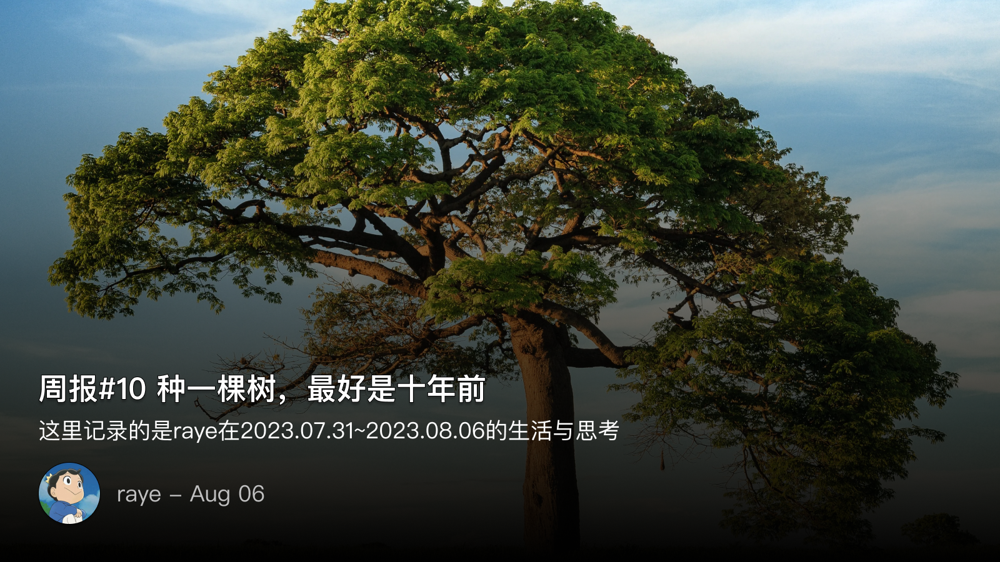

 周报10 种一棵树，最好是十年前

这里记录的是raye在 2023.7.31 ~ 2023.8.6 的生活、故事、感想

我发现我每周都在和拖延症做对抗，明明在内心中都计划好了，结果等到开始做的时候总会想出各种理由来为难自己。

这周刷到了[ 何同学的视频 ](https://www.bilibili.com/video/BV1fu411G7e3 "https://www.bilibili.com/video/BV1fu411G7e3") 虽然我早就因为各种原因不喜欢他并且不再关注他了，但是他这一期最新的视频确实让我受到一些启发，那就是任何事情，不管你借助多少外力，还是得需要你的内心真正迈出那一步。（尽管这道理很浅显，而且谁又不知道呢，我们从来都不是因为不知道某条道理而无法过好一生😂）

不知道阅读这篇文章的你是否也会有这种感觉：每当我要去汇报，去演讲，去见陌生人，明明早已做好准备，但心中的那步棋却始终迟疑不定，不肯落子

于是，我们害怕，害怕改变，这该死的惯性，驱使着我们，让我们找到了一个又一个的借口

于是我们怪罪于完美主义，怪罪于拖延症，怪罪于我们能找到的一切事物

心中的那一步，才是真正的那一步

降低预期，适当欺骗自己去开始，而不是踟蹰不前，不失为一种好的方法

于是，我也在周六就开始写这篇周报了，而不是拖到周日🐶（结果这篇周报还是拖到了今天周二才发🤔

毕竟，正如标题所说，种一棵树，最好是十年前，其次是现在

 📝 回忆深圳

突然间想记录一下自己对深圳这座城市的一些想法

恍惚间从20年第一次来深圳，也有3年了，入职也已过了2周年，相比起年少的我，总是莫名多了些想要写的文字

20年5月，刚刚孤身一人从新疆回来的我，刚回家不到一个月就独自南下，来到一个熟悉又陌生的城市，深圳

其实并没有文字中所谓的那么悲壮，只不过在疫情时候，我的选择可以说是有些与众不同罢了，不过也确实在家待腻了

对深圳最直观的印象就是热，那是一种无法摆脱的热，是一种今后将一直伴随着我的热，是一种沉浸其中之后就浑然不知的热

于是，步履开始加快，眼光开始锐利，头脑开始清醒，奔波在这其中的人，目标似乎都很明确（漂亮的小姐姐也好多🐶

深圳的气息，
不同于武汉，没有年轻人的小清新感，
不同于长沙，没有普通人的接地气感，
不同于西安，没有古都人的历史厚重感。

说白了，就是打工人生活的城市。日出而作，日落而息，这是深圳工作日不变的景象

在深圳并没有去过很多地方，除了日常的深圳湾，小山，小公园外，对这座城市，除了日常上班所必经的道路外，仿佛一切都还停留在最初的印象中

 💭思考&杂记

感觉现在的周报有开始沦为记流水账的形式了，因此打算改一改，重点还是记录自己本周内的思考吧

randy大佬开发的 `notepal` 支持了 `logseq` 后，我就马上成为付费用户了😉

试验导出功能的时候，碰巧看到很早之前重读《解忧杂货店》所看到的一句话：

> 如果把来找我咨询的人比喻成迷途的羔羊，通常他们手上都有地图，却没有去看，或是不知道自己目前的位置。 

当时的我愣住了，确实，这本书中所记录的每个个体，其实在向浪矢杂货店提问的时候，内心中都已经有了自己的想法，书中写信来求助的小人物，其实谁是真正按照浪矢老爷爷的路来走的呢？

自从有了chatGPT之后，我们不是也曾幻想着，通过chatGPT来做一些人类做不到的事情？甚而有说会有终极智能的出现，在我看来都只是一种笑话（我反正讨厌这种说法😒

毕竟我们问chatGPT的问题，很多时候我们内心中早已有了答案

每个人手中都有自己的地图，只是有些人不愿意去面对，假装自己手里的地图不存在，或者期待有更好的地图，其实，地图终究是那个，只有你看待地图的方式可以改变

 🏃🏻‍♀️跑步

再一次挑战十公里，加油😊 

我刚写完这句话就去跑了，结果半个小时Apple Watch记录了4公里都没到，严重怀疑手表GPS信号问题😭

实锤了，kepp记录的才是对的😅

 📺 追剧 & 📖阅读

本周倒是没怎么追剧，都把时间花在阅读上面了，这里做一些记录：

**《太白金星有点烦》**

这本书咋说呢，虽然评价都很高，我也觉得写的还可以。但奈何我对里面的神仙一个都认不清，更不用说神仙之间的算计了。但最精彩的地方在于，它真的描绘出一副职场上勾心斗角的画面，确如一部《官场现形记》。如何解决人事纠纷，如何解决同事矛盾，如何拐弯抹角，哪怕是神仙，都逃不过这其中的因果。
撇开这些不谈，我最佩服的还是亲王的想象力了，读《西游记》的过程中，你或多或少会有这样的疑问，为啥那些妖怪最后到头来都是天上神仙的坐骑、宠物下凡？亲王给了一个很好的回答，其实它们本来就是来打工的🤣

更多的影射梗可以看这里：[https://book.douban.com/review/15227484/](https://book.douban.com/review/15227484/)

另外一本书便是
**《饥饿的盛世：乾隆时代的得与失》**

这本书读着读着是最痛心的，但我又能说什么呢，只能是边看边叹息。

其实要想读懂中国这几千年背后的历史，是有很大难度的，我现在已经尽可能地从好几个方面去了解了
- 皇权与相权，我最开始是不懂为什么一定要划分的，以及后续的中央集权到底是为什么？
- 中国的地理，为什么相比欧洲，中国一定是一个统一的国家，这背后有很多地理要素，如气候、地形等等

纯摘录几处内容吧，有些感想过了段时间就忘了…🫠

> 那个老太监跑来问我，听说那个漂亮的高座是给车夫坐的，皇帝的座位在车厢里面，他面带讥笑地问道，难道我认为大皇帝会容忍有人坐得比他还高、把背冲向他吗？他想知道，我们是不是有办法把那个驭座拆下来，移到车厢的后面去。

狭隘腐朽的观念啊，确实不可理喻🤣

> 英国天文学家在皇帝面前卖力地做着各种示范。他将一块金属放在透镜前面，一会儿工夫，金属熔化了。皇帝十分惊奇，由此得出了结论：“无论透光镜或望远镜的原料都是玻璃，同一种东西通过欧洲人的技巧而做出不同功能的仪器来。

> 如今外国人直接闯到天津大沽来告御状，显然是有中国人在背后给出主意，至少也是顾问。要不然，外国人怎么会对告御状这么门儿清？此事必须查清楚。
> 因此，李侍尧在调查广州海关的同时，倒将更多的精力用于调查到底哪些中国人在英国人告状过程中提供了帮助。

统一盛世的弊端，明明万象升平，却始终怀疑是不是暗流涌动，一点风吹草动就要追根究底。

阅读的时候，或多或少想到了现在的情形，XX要上升到路线之争，上升到国家层面的对抗，全是境外势力的阴谋，这一点和乾隆盛世好像也没多大差别吧

 📮 Newsletter

以后所有的记录就都会自动同步到个人频道啦, [https://t.me/RayeJourney](https://t.me/RayeJourney)

不过也会摘录一些放在博客里：

1. [ 如何拥有真实的美国手机号 | 从免费到超贵，总有一天用得到 ](https://andrewji8-9527.xlog.app/ru-he-yong-you-zhen-shi-de-mei-guo-shou-ji-hao--cong-mian-fei-dao-chao-gui--zong-you-yi-tian-yong-de-dao) 如何拥有真实的美国手机号，之前也折腾过gvoice，但是都不长久，就放弃了（虽然我也不清楚有个美国手机号有啥用🤣
2. [ ChatGPT 一大波更新要来了 ](https://mp.weixin.qq.com/s/A_GdIIbzJXMa98uoV0ML3w) chatGPT的更新还是挺期待的，毕竟我已经成为一个重度依赖用户了
3. [ Pake - 利用 Rust 轻松构建轻量级应用 ](https://tw93.fun/2023-08-03/pake.html) 利用rust构建轻量级应用的最佳实践，学习
4. [ 这些知名UP主今年最喜欢的歌竟然是..? ](https://www.bilibili.com/video/BV1zj411U7j4) LKS整活一向是有点东西的
5. [一个发现Prompt的网站](https://flowgpt.com/p/sophia-carbon-credit-data-analyser-and-price-projector)可以调试Prompt
6. [练习英语对话的网站，使用AI](https://www.prettypolly.app/app)这个网站感觉还有点意思，不过要付费了

