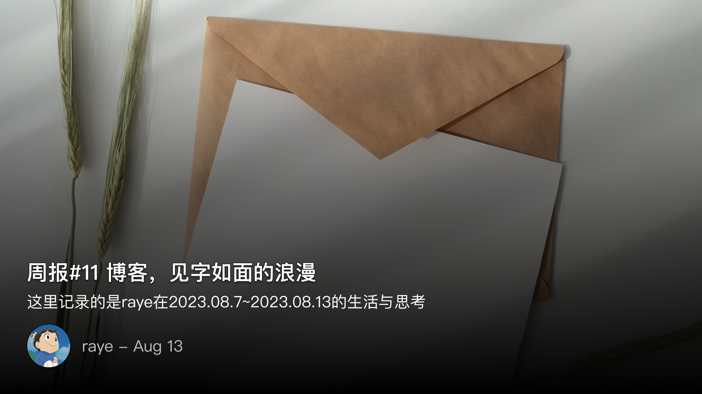
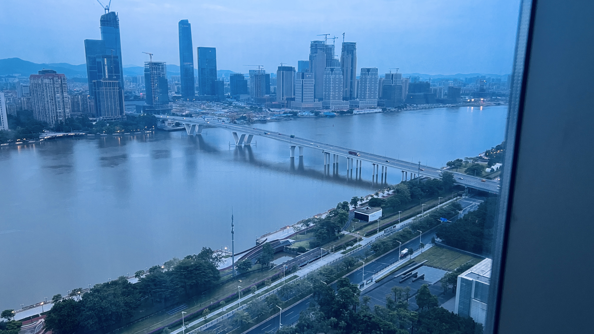
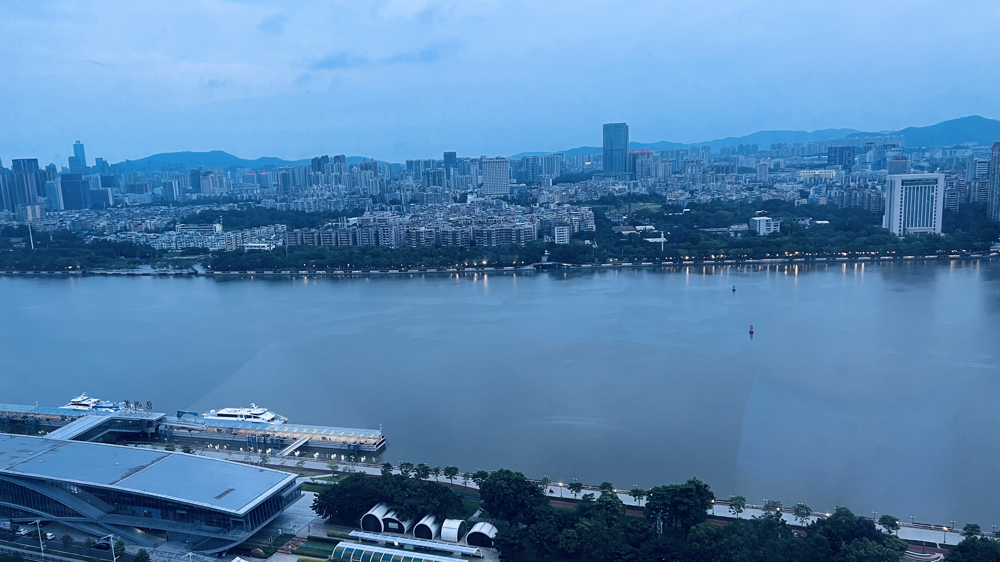

 周报11 博客，见字如面的浪漫

<!--  -->

这里记录的是raye在2023.8.7~2023.8.13的生活与思考

这是第十一篇周报了，也可以开始思考下我为什么要写周报这个问题了

其实也可以换个问法，我为什么要写博客？

这个问题好回答，很多人都给出过答案，这里我给个简单的答案：

> 这是互联网人的见字如面，是独属于我们心中的一份浪漫

曾经很喜欢董卿的那档节目——《朗读者》，诚哉，信件就是要读出来的，不读，则无感

> 马上相逢无纸笔，凭君传语报平安

可见，纸笔记录的是传语，而语言只有读出来才有其活力

那为什么要写周报呢？我很喜欢老蒋的那句话：

> 记忆是由那些不重要的东西，也就是——这一年我们见过的朋友，吃过的东西，去过的城市和街道，由那些意义不明，但是充满乐趣的周末和夜晚组成。正是这些闪亮的，非必要的事物，填充了被大事件框架搭起来的记忆宫殿

但这段话又失之于太过武断，凭什么记忆就一定是由不重要的东西组成的呢？

尽管谈论工作会显得有些千篇一律，但我觉得，生活的每一天，可以被你的阅读、运动、记录给填满，尽管这些时间或许不只能占到一天24小时的20%不到，但你在其中是欢乐的

其实，何必一定要追求这些呢，我们见过谁，吃过什么，去过哪里，这些终究都是一个载体，是引子，是回忆的对象。

人为什么不能两次踏入同一条河流呢？

因我思故我在，我在任一时刻的想法，都是组成了独一无二的我，因为我知道，这只是由我来思考的，是由我来想象的一方天地，是由我来描绘的一片星海，是由我来驰骋的一处领域

于是，我会将任何不同时刻的想法都快速记录下来，打上 `周报` 的标记，让我在周日的时候，有机会重新回到这个天地中，采摘果实；回到这片星海里，荡舟溯流；深入这处领域里，自由飘荡

是为本周周报序

 📝 广州记录

本周周三的时候和同事去了一趟广州出差，其实并不是开会而是庆祝业务小目标突破了哈哈哈🤣。晚上毫无疑问的又要喝酒，这可能是我第一次喝这么醉吧，回酒店的路上还是吐了😅（主要是因为白酒+葡萄酒+红酒三种酒一起混着喝的）

本身自己也有很多感悟吧，来团队两年多了，大的贡献并没有，但是小的成绩也还是可以。而且下半年和leader定死了一个目标一定要实现，于是索性借着酒劲，拉着老板讲述着自己下半年一定要怎么做，让老板看出成绩（老板：你不要过来啊😊

中间还和我导师、leader三个人一起，互相鼓劲，下半年一定是把弦绷紧了，卯着劲往前冲的。当时突然想到庄子那句“虽千万人，吾往矣”，不由得脱口而出，算是当着leader的面立下军令状了哈哈哈哈

晚上被同事拖着回酒店（真的只剩一点残留的意识了），尽管才10点多，洗漱完倒头就睡了，都没来得及好好欣赏下珠江夜景~😂

不过早上5、6点就醒了（毕竟生物钟只让我睡7个小时），下床走路还是有些摇摇晃晃，不过恢复的也七七八八了。我们住的酒店有个超大落地窗，可以俯瞰珠江，欣赏广州的清晨（你见过凌晨5点的广州吗，我见过哈哈哈哈🐶）

<!--  -->

<!--  -->

不过这个酒店也就江景房这一点吸引人了吧，实际体验很拉胯，比如：
- 床头柜连插座都没有，为了不让你在床上玩手机真的操碎了心
- 早上起来一次性梳头发的也没有
- 房间整体感觉并不是很新，卫生打扫的也一般般
- 早餐还算行吧，中规中矩，也没有太多特色

给我的感觉还不如以前大学出去打比赛的时候住的宜家汉庭酒店呢哈哈哈哈

上周的周报回忆了自己的深圳生活，也顺便记录下自己对广州的记忆吧。第一次来广州还是实习的时候跟着导师来开会的，见了几个在广州工作的同学，感受到了广州的湿热天气，体验到了广州总部的食堂。

关于广州的天气，感觉还是马亲王写的最好，摘录如下：

> 广州这里气候炎热，三月便和长安五六月差不多。李善德走进城里，只觉得浑身都在冒汗，如蚂蚁附身一般。尤其是脖子那一圈，圆领被汗水泡软了，朝内折进，只要稍稍一转动，皮肉便磨得生疼。
> 这广州城里的景致和长安可不太一样。墙上爬满藤蔓，屋旁侧立椰树，还有琴叶榕从墙头伸出来。街道两侧只要是空余处，便开满了木棉花、紫荆、栀子花、茶梅与各种叫不上名字的花，几乎没留空隙，近乎半个城市都被花草所淹没。

后来实习将要结束，独自一人来广州答辩，当天去当天回，一天将近5个小时的车程。当时还是有些伤感加担心的吧，害怕答辩不通过，无法留用。望着高速路上的灯光发呆，默默数着一颗颗飞离自己的行道树，我才意识到我的大学生活就剩一年了，已经是即将要迈入社会的人了

后来的结果自然是很好的，答辩通过后就留下来了，除了疫情稍稍放松的那段时间有来广州和同学一起玩过一次外，与广州的交集也比较少了（当天晚上还没买到回深圳的高铁票，于是打电话给广州这边的前leader，借住了一晚哈哈哈哈）。加上疫情后来严重了，也就基本没怎么来过了

那些逐渐失散的记忆，在这一次的旅程中，又慢慢回来了，是以记录如下，权做留念、

 💭思考&杂记

 xLogger

发了条Twitter~，纪念下自己成为xLogger之后粉丝数首次破百

> 比较遗憾的是技术文章发的好少，主要都集中在周报了。不过这也是因为技术类的文章我一般都很有洁癖，一般在写的时候回反复问自己，这个点到底弄清楚了没有，如果是自己都没有搞清楚的点一般都要弄清楚了才行

https://twitter.com/rayepeng_/status/1689618751338262528

也很开心自己的文章：[ 构建个性化的数字日记：自动化工作流实现信息聚合 ](https://raye.xlog.app/gou-jian-ge-xing-hua-de-shu-zi-ri-ji--zi-dong-hua-gong-zuo-liu-shi-xian-xin-xi-ju-he)能够帮助到好多好多人🥰

后续还打算写的，我先把flag立起来，放心都建好文件夹了😅

《自动化工作流补充》—— 自动化工作流有一些问题记录，作为后续
《我为什么用Ulysses写作》——目前Ulysses已经是我的主力写作工具了，准备安利给更多的人
《Raycast使用不完全指北》—— Raycast目前也在开发自己想要的插件，同时也是主力效率工具
《JS、v8、浏览器、内存》——标题还没想好，主要是介绍JS内存这块的东西

最近也熟悉了xlog的代码，有个评论置顶的需求，准备实现下提个pr（我感觉评论置顶是刚需啊啊啊）

 web3的一些想法

作为diygod的粉丝(划掉🐶)，这周听了他参与录制的一起播客：[ No.28 和xlog.app的作者DIYGOD聊区块链和博客平台、前端学习和生活感悟 ](https://www.xiaoyuzhoufm.com/episode/645a76f67d934b85051081c8) （虽然主持人的口音是不是有点重🤣但是不影响我学技术！）

于是也思考了下：
web2.0时代，如知乎是把文章存在服务器上，因为最开始，维持服务器的费用要大于用户产生的价值？（这个论断可能不正确）

但本质上，随着平台用户的不断累积，规模效应+流量扩大之后，用户产生的价值实际是要远远大于服务器维持的费用（比如那些KOL）。这时候平台的监管其实很大程度上会损害创作者的利益

而web3解决的就是这个问题，web3则认为，用户产生的价值是至上的，是不能依赖第三方来存储的，所以要去中心化。而为了达到这个目的，毕竟要算哈希签名，故用户需要付费（当然在xlog上也是这样的，只不过可以领低保）

结合上面的论述，web3没用起来是由很多原因的，其中一点就是：

很多人都认为我就写那点点玩意，平台愿意给我流量我都千恩万谢了，我还要用web3来折腾？

这其实多少有点跪久了都不知道怎么站起来了，永远不要忽视了自己的价值

 📺 追剧 & 📖阅读 & 🎧音乐

本周高强度刷完了 **《八尺门的辩护人》**，很少接触台剧的我，通过这部剧加深了对台湾的了解

要说起台湾，恐怕很多人也跟我一样，只知道九二共识、台独、蔡英文、自古以来等等

这就是可悲之处了，既然台湾是中国不可分割的一部分，何以我们对现代台湾的了解这么少呢？我觉得这是教育要反思的问题

在这部剧中，我看到了台湾的行政体系是怎么运作的，了解到台湾的经济支柱捕鱼业，才知道还有台湾原住民的说法。当然其揭露的阴暗面，已有点超出我的认知了。其实，看到这部剧的简介的时候，其结局就已经注定了是一个悲情英雄的故事，各方的势力博弈，台上台下，看得到看不到的操作，都在这部剧中呈现的淋漓尽致。是啊，以一人之力，终究只是个蚍蜉撼大树的故事，就算有“虽千万人，吾往矣”的凌云志，最后也会折翅于人间

另外本周很喜欢的一本书是《大汉帝国在巴蜀》，一言以蔽之，这本书最大的亮点在于从政治的角度去看战争，毕竟

> 一切战争都是政治的延续

本书有很多有意思的论述，摘录如下：

谈到《隆中对》时，作者认为这是一个军事构想，并没有严谨的政治论述。但他的军事论述确实被检验了一部分，即羽水淹七军，威震华夏。亮六出祁山，雍凉不卸甲，中国不释鞍。如果这两者真的能结合起来，历史可能又会多出一次以弱胜强的著名战役，汉中则又将多出一次成就帝业的典范

> 诸葛亮在分析形势时，对几大力量的分析和判断，均极清醒而透彻。但诸葛亮分析的主要是军事形势，尤其是军事地理形势，而非政治形势。与之相应，诸葛亮提出的是一套军事战略的构想。
> 如果说军事战略的灵魂是政治指导，那么，政治层面的战略，其灵魂是天下为公的道义主张和判明善恶的价值诉求。《隆中对》通篇没有政治关系的分析，也没有价值评判，因而没有政治定位，也就没有政治指导。作为一套大战略构想，没有了政治指导，也就没有了灵魂。

谈到夷陵之战时，作者也叹息于刘备的政治水平。不管是从当时，还是事后的角度来看，这一点都无可厚非。但是刘备政权最可爱，最充满人性的地方就在于，他们是没有政治头脑的，他们是真的亲兄弟，手足情。这个政权之所以经常被扼腕叹息，其最可爱的地方，也就在这里。

> 刘备东征，伐孙权之罪，却仅止于伐孙权袭杀关羽和侵夺荆州地盘之罪。这大大降低了伐吴之战的政治水平。

最后是这首歌，好喜欢哈哈哈哈~

https://twitter.com/rayepeng_/status/1689847243241824256?s=20

 📮 Newsletter

以后所有的记录就都会自动同步到个人频道啦, [https://t.me/RayeJourney](https://t.me/RayeJourney)

不过也会摘录一些放在博客里：

1. [ No.28 和xlog.app的作者DIYGOD聊区块链和博客平台、前端学习和生活感悟 ](https://www.xiaoyuzhoufm.com/episode/645a76f67d934b85051081c8)
2. [ 夜爬泰山观日出记 ](https://tumutanzi.com/archives/17064)
3. [ 为什么我们需要一个「关于」页面？ ](https://zuofei.net/5058.html)
4. [ 理解前端框架中的运行时和编译时 ](https://wungjyan.xlog.app/runtime-and-compileTime)
5. [ 第一次投出选票是什么样的体验？ ](https://thirdshire.com/post/first-voting-experience-in-canada/)
6. [ 回形针解散两年了，他们怎么样了？ ](https://matters.town/@amateurs/404541-%E5%9B%9E%E5%BD%A2%E9%92%88%E8%A7%A3%E6%95%A3%E4%B8%A4%E5%B9%B4%E4%BA%86-%E4%BB%96%E4%BB%AC%E6%80%8E%E4%B9%88%E6%A0%B7%E4%BA%86-bafybeifvvbkdcloazpuetjghzry7i2guljtqwnak6rfuiyas2v6uggr7gm)
7. [ “清零”不会有胜利，所有人都是输家 ](https://stephenleng.com/zero-covid-policy/)
8. [ 在化粪池里裸泳的年轻人们啊 ](https://www.bilibili.com/video/BV1kz4y1W7hv/?spm_id_from=333.999.0.0)
9. [ 中国式家长的教育模式：恐吓孩子 ](https://www.bilibili.com/video/BV12x4y1X7Eg/?spm_id_from=333.999.0.0)

