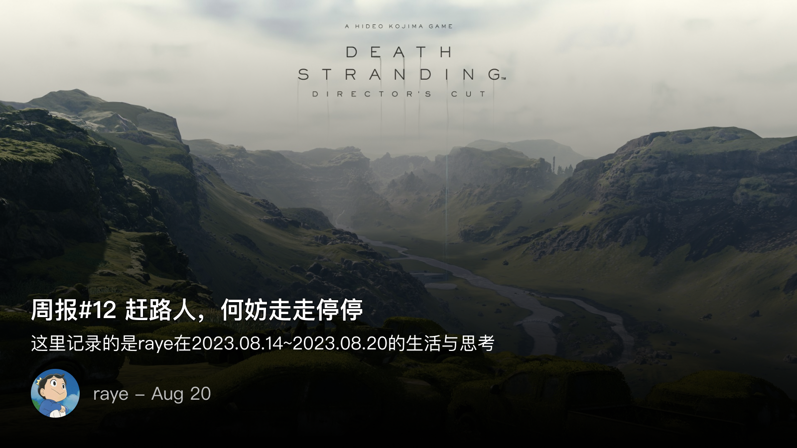
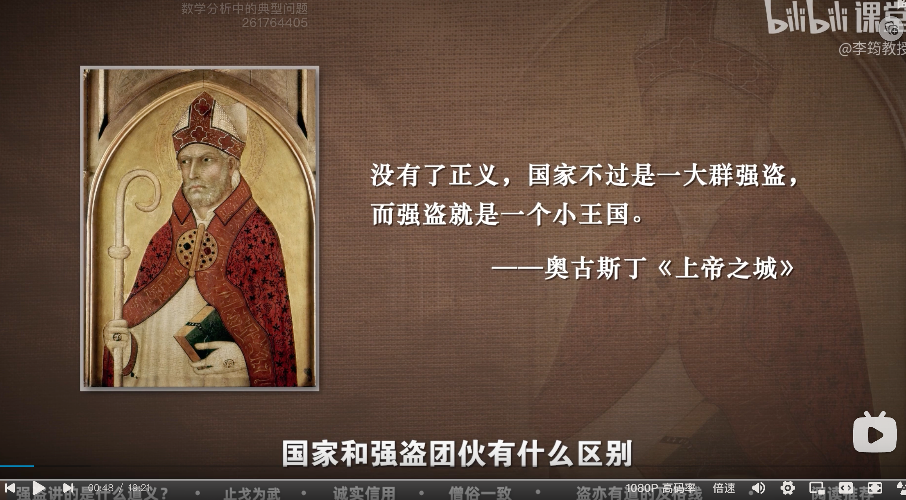

 周报12 赶路人，何妨走走停停

<!--  -->

> 周报给予一我种心流，在这种近似于修禅的状态下，整理回顾自己的平淡无奇的生活，就像在小孩子在描摹一张五彩斑斓的画。

就像一只飞久了会累的鸟儿，也要找个栖息地去饮泉进食。本周也体会到了压力过大带来的痛苦，入眠后感觉那根弦也一直绷紧着，无法真正放松下来，甚至于连躺下来，静静听一下播客都成为一种奢望。仿佛只要一安静下来，就会失去什么，心中总是焦躁不安，于是只好开始半强迫自己，闭合双眼，进入到一种意识流的思想状态。张晓风曾经在《我的幽光实验》中提到，她喜欢黑暗的晚上，关上房间里的灯光，独处于黑暗之中，仿佛宇宙成为了一把巨大的天平，幽光在彼端，与之对坐，相顾无言，唯有静静享受这一小段摆脱了快节奏生活的安心与静好。

许是个性使然，内心总是很急，步履总是匆匆，眼神总是在搜寻。吃东西一定要很快速的吃完，写文章一定要马上就写完并发布出来，看电视剧恨不得跳过无用的对话，立马就知晓结局。并非沉不下心来，只是内心在恐惧，错过了此刻，就无法再去经历。

工作久了，心态也渐渐发生了很多变化，开始越来越唯结果论，不再去关注当下的过程，缺少对过程的回顾。仿佛结果到位了，什么都是好的。之前看了Randy的文章，也曾幻想过去泰国修禅，去冥想，去好好学习如何休息。后来一想何必这么折腾呢，此刻在写周报时，慢慢体味这一刻键盘的敲击声，耳机中传来音乐的每一个节拍，窗外一束阳光照射下来，随风飘舞的一粒灰尘。怪到，张岱的《湖心亭看雪》能让人拍案叫绝，

> 天与云与山与水，上下一白。湖上影子，惟长堤一痕、湖心亭一点、与余舟一芥、舟中人两三粒而已

文字记录的美好，也终究会被现实所打破。试想，乘兴而来，数九寒冬，江面行舟，尽管拥拥毳衣炉火，但侵人的寒气可想而知。还好这一程并未让人失望，湖中焉的更有此人！

最喜欢张晓风这一句，

> 我是个赶路人，却总是忍不住贪看山色

赶路人，何妨走走停停呢

是为本周报序

 💭 杂念 

本周值得一提的是Apple Fitness给我设立的8月健身目标：连续14天，每天锻炼时间超过110分钟

最开始还觉得这是不是稍微过分了，结果现在已经完成了12次了，8月平均每天锻炼时间达到125min

<!--  -->

其实运动是经常保持的，羽毛球、跑步、HIT等等，但体重却一直没降下来，估摸着还是太爱吃主食了。本周又开始坚持重新跳绳了，目标有二，其一因为相信跳绳是减肥的最好方式，10min不到就能消耗100卡；其二是训练打羽毛球时的体力与跳跃能力

最近也开始对政治感兴趣了，在这之前是没太去管这些的，对于历史的思考点更多集中在军事、人物。至于政治、合法性权威这类问题很少涉猎，但架不住内心好奇心的驱使，渐渐地理解到了政治、权力、权威、合法性等等名词。结合当下经济的不景气，也逐渐意识到了，原来历史对当代实是有一种借鉴作用，但历史的吊诡就在于，明知这件事是错误的，历史也证明了这点，但这却又是当下唯一一种最合理，最能解决办法的途径

从上周开始重新读纸质书了，似乎是为了摆脱一直被屏幕围困的生活，我需要跳出来，用一些看似退步、逃离的方式，来远离一些屏幕的围剿

  📖阅读 & 🎮游戏

序言也提到了，本周过的很凌乱，并没有一个有计划的去追剧 or 阅读，倒是又重新捡起好久没玩的xbox与Apple arcade游戏，重温了游戏的乐趣，获得了很多新奇的体验。

比较眼前一亮的就是猫咪斗恶龙了（原谅我游戏玩的少），在steam上很早就加入愿望单但一直没去玩，刚好看到appstore上也有就买了

配合手柄操作还是挺好玩的，不过一如既往的手残，准备花点时间来通关下

<!--  -->

序言提到我对历史越来越上头了，同时开始思考政权的合法性，偶然间刷到了这个视频
[ 魏蜀吴三国争天命，各有什么特色？哪家合法性更高？ ](https://www.bilibili.com/video/BV1YX4y1x7ax/?spm_id_from=333.1007.top_right_bar_window_history.content.click&vd_source=15a2dc392ee5cfd2402320bee219d8e3)
作者是真敢讲啊，怎么看都觉得很反动🐶

B站的这个课程我也还挺喜欢的，准备买了好好学学，思考下权力到底是什么，以及国家存在的意义等
[ 偏见看政治：李筠教授的政治学课 ](https://www.bilibili.com/cheese/play/ep65845?t=66&csource=common_hp_history_null)

另外，这段话怎么看都觉得是在讽刺时政… 果然苏联笑话永不过时🤣

<!--  -->

 📝 一些值得回味的句子

主要是张晓风的句子，太喜欢她的散文了（主要是凑周报字数想不到吧😁

- 虽然沮丧，但一瞬间，有个念头，仿佛万道霞光破云而出。 “你，还有一支笔。”
- 似乎是仗了好风好日的胆子，我于是走了进去……
- 曾经是一段惊人的芬芳甜美，曾经装在华丽炫目的盒子里，曾经那么招人爱，曾经令人钦慕垂涎，曾经傲视同侪，曾经光华自足……而终于人生一世，善舞的，舞低了杨柳楼心的皓月；善战的，踏遍了沙场的暮草荒烟；善诗的，惊动了山川鬼神；善于众敛的，有黄金珠玉盈握……而至于他们自己的一介肉身，却注定是抛向黄土的一具盒子。
- 我于是憬悟到自身的庄严、灿美，原来尤胜于在深山莲花座上趺坐的石佛。
- 如果蓝天可以忘记白云的拂拭，如果老树可以忘记黄鹂的啭歌，你也快快忘了我那天小小的造访吧
- 恰如草莽布衣，一入庙堂便生机断尽
- 于是，时不时地，我用喷雾器把石头花盆喷得潮潮润润的。我想骗骗那石头，让它误以为自己仍住在山上，仍然日日餐霞饮露，仍是一块含烟带雨的石头。
- 我承认一钵一杖即可遍行天下的人固然了无牵挂，非常值得佩服，但像我这样想带着清茶以敬天下名人的人，不也挺可爱吗？

 📮 Newsletter

以后所有的记录就都会自动同步到个人频道啦, [https://t.me/RayeJourney](https://t.me/RayeJourney)

不过也会摘录一些放在博客里：
- [ 3年时间,从学生到百大,我经历了什么?丨我的创业故事 ](https://www.bilibili.com/video/BV1bj411B7xe/?spm_id_from=333.999.0.0)大狸子居然和毕业相差不到1年！初期的创业故事还是挺感动的，不过背后还是有很多隐藏的事并没有讲出来，不过被幸存者偏差误导了（讲真我在大学时连xbox是什么都不知道）
- [ “网红打卡点”套路解析与实践 -【冷却报告】](https://www.bilibili.com/video/BV12h4y1r7C5/?spm_id_from=333.999.0.0) 很有意思的视频，如果最后模特换成小姐姐，估计这个网红打卡点真的就成了
- [ 周报 44 - 静寂工人、xLog 与日常 ](https://www.pseudoyu.com/zh/2023/08/15/weekly_review_20230815/)终于更新了哈，狗粮管饱🐶
- [ 一个独立创造者的五年 ](https://mp.weixin.qq.com/s?__biz=MjM5OTg2MzE4Mg==&mid=2257483855&idx=1&sn=012da42659d465e1ebcb0adcd148dd42&chksm=a44e2eae9339a7b8d248bbd2bdb1b3640864e040900c63d71d001a35eb6833f52f9a586e4917rd)
- [ 随身听和冰啤酒，流行乐与热咖啡，谁来定义经典设计？非正常读物 vol.4 ](https://suithink.me/2023/08/13/%e9%9a%8f%e8%ba%ab%e5%90%ac%e5%92%8c%e5%86%b0%e5%95%a4%e9%85%92%ef%bc%8c%e6%b5%81%e8%a1%8c%e4%b9%90%e4%b8%8e%e7%83%ad%e5%92%96%e5%95%a1%ef%bc%8c%e8%b0%81%e6%9d%a5%e5%ae%9a%e4%b9%89%e7%bb%8f%e5%85%b8/)
- [ “救救孩子……”—— 谈鲁迅和《狂人日记》 ](https://blog.aeilot.top/2023/08/09/kuangrenriji/index.html)
- [ 回形针解散两年了，他们怎么样了？ ](https://matters.town/@amateurs/404541-%E5%9B%9E%E5%BD%A2%E9%92%88%E8%A7%A3%E6%95%A3%E4%B8%A4%E5%B9%B4%E4%BA%86-%E4%BB%96%E4%BB%AC%E6%80%8E%E4%B9%88%E6%A0%B7%E4%BA%86-bafybeifvvbkdcloazpuetjghzry7i2guljtqwnak6rfuiyas2v6uggr7gm)

