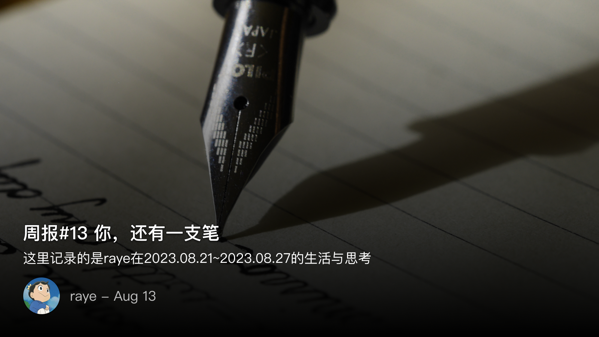
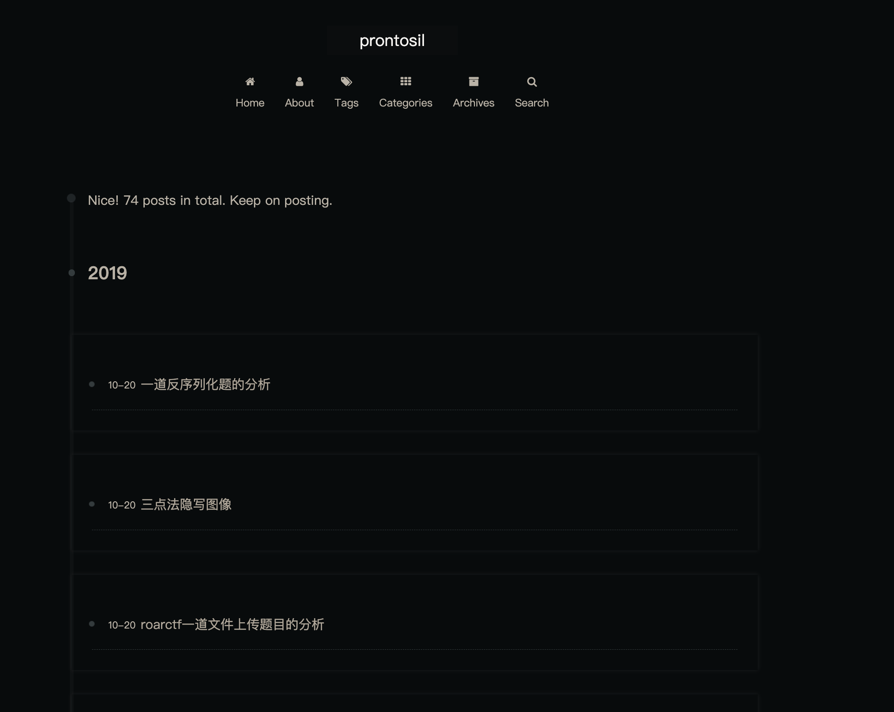
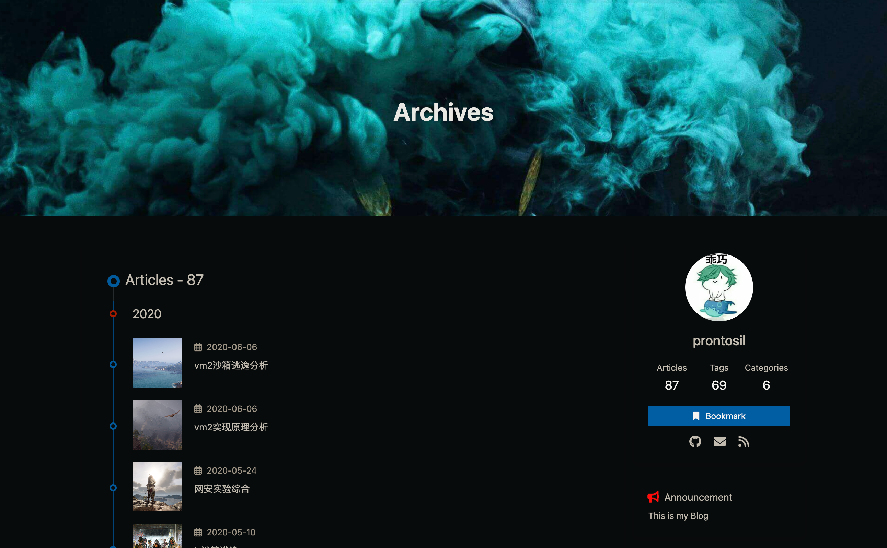
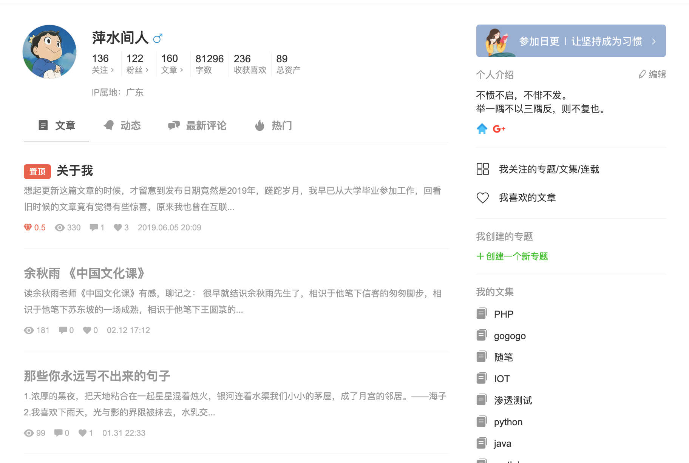

 周报13 你，还有一支笔

<!--  -->

这里记录的是raye在2023.8.21~2023.8.27的生活与思考

上周也是有些心里憔悴，导致睡眠加工作效率都不太行，索性周末开始了躺平之旅，每天上午打完羽毛球后就做点自己想做的，好好放松下（尽管实际效果也并不是很好）。

周六下午继续在熟悉xlog的源码，感受到了后端和前端开发思路的差异🥹，pr还没完善好，需要再继续分析下，顺带也想写篇文章解读下源码。周日下午则去参加了另外一个BG的读书会，主讲人分享的是《霍乱时代的爱情》，也算是第一次来参加公司线下组织的读书会，本来笔名应该要文雅一点的，结果就很简单的用了raye这个英文名😅。不过和书友们交流的还是很开心，也计划着做下一次分享的主讲人，目前还在思考要分享哪本书

周末飞速读完了《克莱因壶》，确实是一本很棒的小说，主人公体验了vr游戏之后，渐渐分不清现实和虚拟，有点像盗梦空间，不知道诺兰是否盗用了这个构思呢🤔

本周最重要的事情则是开始重新整理自己以前的博客文章，重新拾起几年前的记忆

曾经的我以为，总要抛弃过往，总要告别时光，总要挥泪离别，总要不断向前

如果蓝天可以忘记白云的拂拭，如果老树可以忘记黄鹂的啭歌
如果海浪可以忘记岸边的拥吻，如果夜空可以忘记繁星的闪烁
如果丹青可以忘记笔尖的流转，如果砚台可以忘记墨水的浸染

可惜这只是如果，我还是太高估了自己，有些留下的记录终究是舍不得的

这周突然怀念起自己以前写的文章，因为种种原因（比如误删了Github仓库🥲，sb操作）都不见了

张晓风老师曾提到她曾经在机场柜台填单的时候，随声携带的包包被偷了。当她察觉过来才意识到发生了什么，虽然沮丧，但那一瞬间，有个念头突然涌现出来：

> "你，还有一支笔"

是为本周报序

 📝旧博客迁移

虽然序言里提到文章都丢失了，不过幸好以前做了多备份，在gitee、coding平台上都找到了我的存档！太激动了（尽管md源文件已经丢失，但至少静态的HTML还留着，图片也都未丢失）

借此机会，重新整理了一下我的写作经历：
- 2018.11.20 以"萍水间人"的身份在简书第一篇文章 《Gephi分析红楼梦》总计写了160篇文章，字数8.1k，最后停更时间在2023年2月17日
- 2019.02.07 hexo博客搭建 主题NexT 第一篇文章 《bugku web题目的wp》，总共写了74篇文章，字数未知，最后停更时间在2019年10月20日
- 2020.01.30 hexo博客，主题更换为Butterfly 第一篇文章《XXE复习》，总共写了87篇文章，字数66.5k。最后停更时间在2020年6月6日
- 2023.4.3 正式成为一名xlogger，发表第一篇文章《周报1 羽毛球、聚会、句子》，目前还在写作中，希望这个停更时间是无限长😃
算下来，从2018年开始，总共写了321篇文章，总字数怎么也得破百万了吧哈哈哈哈🤣

部分截图如下，虽然都只剩静态的HTML页面了，不过我还是打算找个时间将其都部署出来，也算是一种留念了吧

<!--  -->

<!--  -->

<!--  -->

找回文章的那一刻，就感觉找到了一位失散多年的亲人，于是准备把以前的文章都精选出来，并且重新加工下，搬运到xlog上，目前还在缓慢进行中

除此之外，怎么将文章翻译文英文也是我一个比较头疼的问题，虽然过了六级，但英语水平其实还是很一般。不过很快就发现，沉浸式翻译这个工具也太好用了，结合Deepl翻译或者OpenAI的体验是真的棒，翻译的文章我自己都看不懂了，很接近原生的英语表达。

比如我将自己上周的周报翻译成了英文版，放在medium上，

[ Weekly Report 12: Traveler on the road, why not take a break and enjoy the journey? ](https://rayepeng.medium.com/weekpost12-3bafcf78faec)

唯一的缺点就是价格太高，但是我的OpenAI免费用量已经到期了，如果想要用自己的API token就得重新注册个账号🫠。懒得折腾，就当支持下沉浸式翻译插件了🤣

 👨🏻‍💻开源与xlog

本来想着给xlog开发一个评论置顶功能应该挺简单的，但我低估从后端到前端思路转变的难处了

尤其是对react hooks的理解，本来以为自己懂了懂了，马上就能用了！结果写起来还是要花很长的时间去思考，同时又发现自己遗漏了很多要点

等我慢慢来熟悉前端的东西吧，奔着目标去总能解决的

 📚阅读 & 🎧播客

记录下本周看过的一些书

-  [《在森崎书店的日子》](https://weread.qq.com/web/bookDetail/e7232170813ab7c05g0128b0)
对这类书名似乎都有一种说不出的喜欢，给人一种摆脱了世俗，外加小清新感的故事
但不足之处在于，故事情节的引子推动让人觉得不是那么可信，有些为了推动而推动。不过这本书更关注的其实是主人公的内心的变化，算是唯一的一点瑕疵了

-  [《克莱因壶》](https://weread.qq.com/web/bookDetail/31e32cc071cad2bd31e0252)
序言提到了，推荐，一两个小时就能看完

记录本周听过的一些播客

- [ 275. 离开看理想之后，我去深圳围观"搞钱" ](https://www.xiaoyuzhoufm.com/episode/63757ba2b8a7376c7e15d6c0)
第一次听说其他地方的人对深圳打工人睡午觉这么惊讶，真的好好玩哈哈哈哈 😆

- [ 《长安三万里》背后的历史更精彩 ](https://www.xiaoyuzhoufm.com/episode/64af8aeefcfe2c92feb7af0d?s=eyJ1IjogIjY0YjhiYzc0ZWRjZTY3MTA0YWRhNmU1OCJ9)
- [ No.35 和活力满满的拾一Innei 聊前端 React 技术选型、博客开发和生活的确幸 ](https://www.xiaoyuzhoufm.com/episode/64e62b09e490c5dee547778b?s=eyJ1IjogIjY0YjhiYzc0ZWRjZTY3MTA0YWRhNmU1OCJ9)
- [ vol.150｜徐英瑾：历史小说是倒向的思想实验 ](https://www.xiaoyuzhoufm.com/episode/64adedbc5142ef4a6cb4eece?s=eyJ1IjogIjY0YjhiYzc0ZWRjZTY3MTA0YWRhNmU1OCJ9)
播客种推荐了一本书，《坚：三国前传之孙坚匡汉》，从另一个视角去看三国，挺吸引我这个历史迷的

 📮 Newsletter

以后所有的记录就都会自动同步到个人频道啦, [https://t.me/RayeJourney](https://t.me/RayeJourney)

不过也会摘录一些放在博客里：

- [恒大的“破产保护”，后患无穷 ](https://mp.weixin.qq.com/s/Gz1JvJOnO39D1zmhHqLdgg)
- [ 25 | Homura's Blog ](https://homura.live/2023/08/23/Life/25/)
- [ 我的读书简史 ](https://blog.peterchen97.cn/posts/16-%E6%88%91%E7%9A%84%E8%AF%BB%E4%B9%A6%E7%AE%80%E5%8F%B2/)

