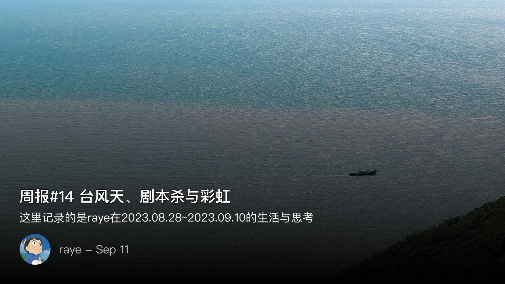
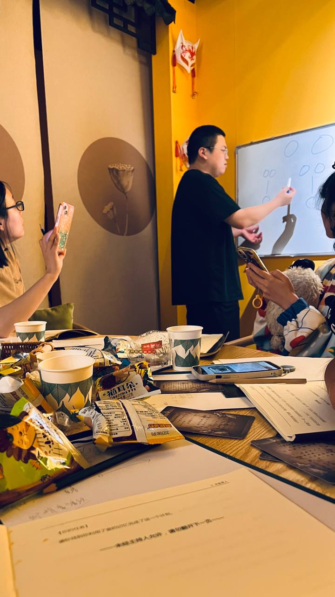
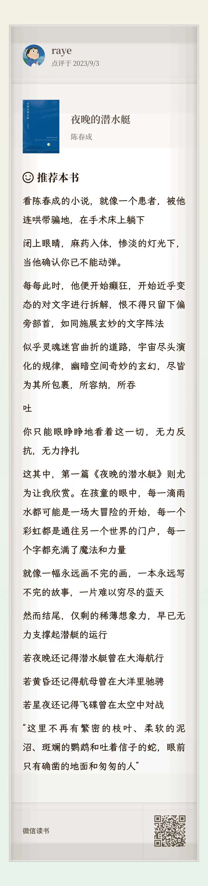

  周报14 台风天、剧本杀与彩虹

<!--  -->

暂停了一周的周报，本来这篇周报应该是上周就要发的，但或许是太忙了吧，沉不下心来整理自己的文字了，索性也就当给自己放个小假，合并到下周一起当做双周报来写

目前主力的写作软件是 `Ulysses`，虽然改成订阅制后有很多人吐槽、退坑。不过我目前感觉写作体验还是最棒的，批注、关键字等功能也很实用。这里顺带谈谈个人的习作习惯，日常会将一些零星的想法，收集到logseq或者flomo中，每当要写周报的时候再来回顾，这是模仿了周国平在《风中的纸屑》一书所写的做法，只有随手记录下来，才不至于让这些纸屑被生活的快节奏所吹走。

整理完这些纸屑后，就形成了一个初稿。在初稿的基础上，如果还有精力，就会对文字进行打磨，调整、扩展，当然这个过程是最耗费心力的了。毕竟大部分时候，都是不愿意去回顾自己写的文字（就像不愿去回顾自己写的垃圾代码一样🤣

深圳又来台风了，连续两周，每到周五就开始下大雨，公司也是很人性化地提前通知了，解锁了两天远程上班的体验（虽然效率并不是很高）

本来还担心周末是不是就无法出门了，短信、微信、微博都在不断地提醒我，不要外出，属实有些吓人了

不过台风真正肆虐的时间也仅在周五晚上，周六就开始转移目标了，周日甚至又重回了高温，台风的痕迹全无，太阳高照，果然是台风把所有云彩都带走了吧。

周六还是照惯例出门打羽毛球，台风过境后，无边丝雨，朦胧而安静的街道，无半点喧嚣。深圳这座脚步匆匆的城市，也被迫慢了下来呢

周日则是被文杰喊去一起打剧本杀了，（虽然我和他是在上周的读书会才第一次才认识的，但奈何自来熟🐶），在体验了被7个小时烧脑的推理折磨后，我已经不太敢再去玩推理本了🥹

周一上班，久违地见到了🌈（虽然不是我拍的

<!--  -->

是为本周报序

 👀剧本杀

很久没玩过剧本杀了，周六晚上文杰临时组了个局，想玩一个带点恐怖的推理本，于是大家就选了店家推荐的——《死者在幻夜中醒来》（真的是无知者无畏啊，马上就体会到了被折磨的痛苦）

大概玩了将近6、7个小时，不得不承认是一个设计很出色的剧本，

1. 两个故事，一个玄幻，一个本格，巧妙的结合，完美的反转
2. 叙事性诡计

本子其实是完全有两个故事组成的，第一个故事有一点玄幻的设定，即可以穿越时空，逆天改名，形成错乱的平行时空。第一个本子最后的推导我们大概花了3个多小时，而且推理非常的顺畅，DM频频点头（注意这是陷阱）

接着来到下半场，此时每个人都发现，他/她的记忆是错乱的，并且在第一个本中出现的玄幻设定、每个被杀的人的故事，全都是假的，都是伪造出来的！（简直颠覆好吗，已经炸了）

于是，每个人都需要重新找出自己的身份（当然靠我们那点贫瘠的推理能力是做不到的），只能逼得DM亲自下场“扛着火车跑了”🤣，有照片为证：

<!--  -->

具体的推理过程就不细说了，只说几个点：

故事开始时，每个人的身份，容貌，性别，名字，都是互相推理出来的，DM只会在关键节点引导你，至于你的推理结果，DM都是对对对（怪不得推理这么容易呢，原来是为了给反转做铺垫🥹

另外就是第一次接触到叙事性诡计，那什么叫叙事性诡计呢？

举个例子吧：

在我的剧本中，是一个关于无知的村民要抽签选人来献祭的故事，抽签的结果是：小悠山（日本人特有的昵称，即小+姓氏，所以事实上大家不知道名字）

在后续的推断中，由于剧本中提到了，村民们说过，“真琴”要被献祭了

于是大家一致认为，这里抽出的签人名为 悠山真琴

然而事实则完全相反：
1. 抽签结果只是小悠山，并不是悠山真琴（后续推断出是悠山翼）
2. “真琴”要被献祭，这其实是替换原定的献祭人（因为她死了）

类似的种种，数不胜数。可以理解为一种虚假的真相，让人先入为主的造成固有印象，确实是第一次接触了🫠

 📚重读《夜晚的潜水艇》

重新回顾了下《夜晚的潜水艇》（去年就读完了），但奈何写的太好了，写点东西做个纪念：

看陈春成的小说，就像一个患者，被他连哄带骗地，在手术床上躺下
闭上眼睛，麻药入体，惨淡的灯光下，当他确认你已不能动弹。
每每此时，他便开始癫狂，开始近乎变态的对文字进行拆解，恨不得只留下偏旁部首，如同施展玄妙的文字阵法
似乎灵魂迷宫曲折的道路，宇宙尽头演化的规律，幽暗空间奇妙的玄幻，尽皆为其所包裹，所容纳，所吞吐
你只能眼睁睁地看着这一切，无力反抗，无力挣扎
这其中，第一篇《夜晚的潜水艇》则尤为让我欣赏。在孩童的眼中，每一滴雨水都可能是一场大冒险的开始，每一个彩虹都是通往另一个世界的门户，每一个字都充满了魔法和力量
就像一幅永远画不完的画，一本永远写不完的故事，一片难以穷尽的蓝天
然而结尾，仅剩的稀薄想象力，早已无力支撑起潜艇的运行
若夜晚还记得潜水艇曾在大海航行
若黄昏还记得航母曾在大洋里驰骋
若星夜还记得飞碟曾在太空中对战
“这里不再有繁密的枝叶、柔软的泥沼、斑斓的鹦鹉和吐着信子的蛇，眼前只有确凿的地面和匆匆的人”

<!--  -->

 🕹️游戏

开始重拾对游戏的热爱了！原因则写在[《如何克服电子阳痿》](https://raye.xlog.app/ru-he-ke-fu-nei-xin-de-kong-ju--cong-dian-zi-yang-wei-shuo-qi)这篇文章了

Hifi rush 这个算是微软今年评分最高的游戏了吧（我哭死，星空真的，辜负了我），虽然年初就发售而且入了XGP，但是我这个拖延症就玩了前几章，后面就没玩了，这次找了个下午通关了

这个音游在我心中可以排到top1了，游戏里所有的物品都会跟随者节奏来跳动，配合炫酷的连招，大招与斩杀效果，配合xbox那个沙雕手柄可以震到手发麻…

这张图把我笑死了哈哈哈哈：

<!--  -->

p5r 也是，一直卡在奥村的宫殿boss那里，然后就没有去打，这次终于打通了，另外学妹也有面具了啊啊啊学妹真的太漂亮了！

<!--  -->

星之海，也是最近才发售的一款JRPG游戏，可以和八方旅人pk下了，解谜、战斗、音乐等体验下来还是非常棒的

《星空》褒姒了，真的太难受了，本来还想期待着微软能给玩家带来亿点点震撼，结果，还是那个b味

于是果断买了ps5，pdd百亿补贴安全下车，真的香。同时想着Switch好像也很便宜，那就买吧，顺带把王国之泪的卡带也买了

 🎧播客

除你武器最新的一集播客带给我很深的思考

<!--  -->

适当转移注意力，不要给自己施加太多压力，匆忙的当下，我们有时候更多的是需要无所事事，需要有一段被浪费的时间，告诉我们，不学习、不工作、不去想任何牵扯因果的事情，只属于自己的静水流深，也是值得被珍惜的。
这么说会有点像精神内耗，或者说是精神内耗的扩展，即隐性的内耗。显性的内耗则是指如社恐、担心别人的看法等等，而隐性的则是指自己与自己对抗，如害怕无法集中注意力，害怕浪费时间等等
以前每次工作的时候，稍微看个消息回复个消息都会让我觉得自己注意力被打扰了，严重的时候，甚至于每晚入睡，只要稍微精神清醒了点，就会怀疑自己是否能睡着，是否会影响到后面的工作等等
后面可能想写一篇针对如何休息的话题来做个探讨，也在努力的探索适合自己的休息方式（又开始挖坑了

 💭杂念

老蒋最新一期讲邓艾的视频，纠正了我一直以来玩三国杀的误区

【三国杀：我为什么一直都不喜欢邓艾？丨蒋述】 https://www.bilibili.com/video/BV1DF411677q/?share_source=copy_web&vd_source=eb74eb1e105cb306ab17818712e795b8

路人局最忌讳的就是能力不行，想法还多

执行大过决策
三流的决策一流的执行，永远大于一流的决策三流的执行

如果你是忠臣，主公开局对着你认为最有可能是忠臣内奸的角色盲狙，你能怎么办？
答案是只能跟进：
- 如果盲错了，那就交待了，但是你的犹豫也做不了啥，于事无补
- 如果盲对了，如果少了你的跟进，那责任反倒是由你来承担

 📮 Newsletter

以后所有的记录就都会自动同步到个人频道啦, [https://t.me/RayeJourney](https://t.me/RayeJourney)

不过也会摘录一些放在博客里：

- [ 23岁的我，不会玩 ](https://tianheg.co/posts/play-with-myself-at-23/)
- [ 当她将交友软件里的年龄调低到14岁 ](https://mp.weixin.qq.com/s?__biz=MzU4NDQ5MzkwNQ==&mid=2247493956&idx=1&sn=91a815549c033afd1bd5738323e2955d&chksm=fd9a577acaedde6c3e299e032bf6317344ca0d5a0cef7f27c5b8e9f56a10c3c00fc3dcd872e5rd)
- [ 一个独立创造者的五年 ](https://mp.weixin.qq.com/s?__biz=MjM5OTg2MzE4Mg==&mid=2257483855&idx=1&sn=012da42659d465e1ebcb0adcd148dd42&chksm=a44e2eae9339a7b8d248bbd2bdb1b3640864e040900c63d71d001a35eb6833f52f9a586e4917rd)
- [ 决战刘谦！魔术VS超高速摄影机，能拍到破绽吗？ ](https://www.bilibili.com/video/BV1Uh411p7r3/)
- [ 【IKGN】11分，《星空》评测：天外有天！ ](https://www.bilibili.com/video/BV12w411D7F1)
- [ 【毕导】这个视频里说的都是真的，但你却永远无法证明 ](https://www.bilibili.com/video/BV19u4y1D7GT)
- [ 用文明6的超大地图，按照真实的中国历史建造城市（高清） ](https://www.bilibili.com/video/BV1844y1D7E7)

