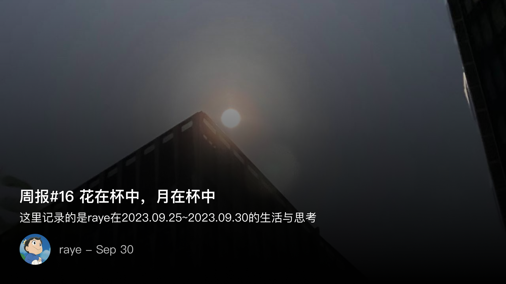
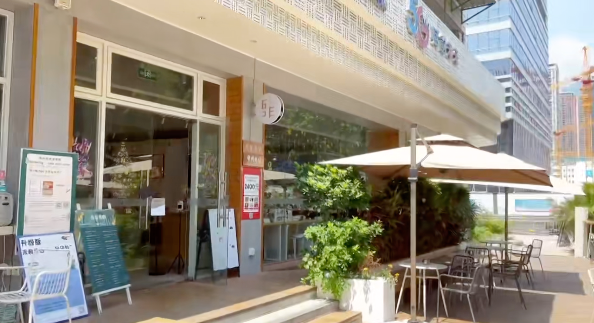
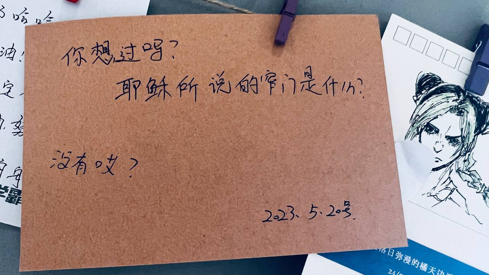
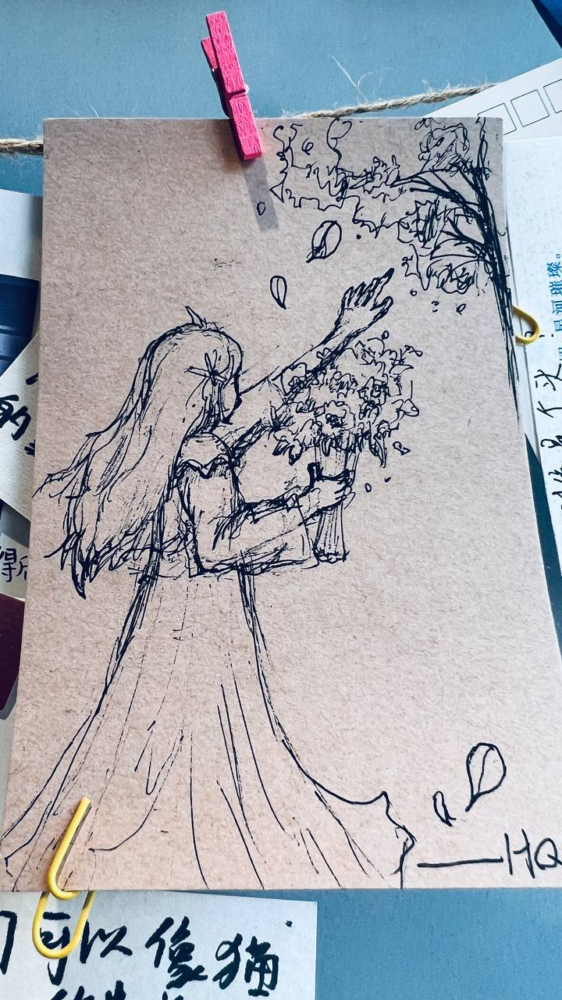
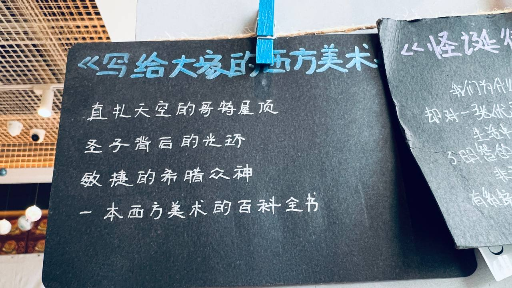

 周报16 花在杯中，月在杯中

<!--  -->

你要写月，就不能只写月
要写这苍穹之上的寒魄
写清光满杯，写对影独酌
要写二十四桥流水，泠泠无声
再写千里梦远
写九霄宫阙，写桂影婆娑
写山河万里俯瞰的灯火
笔锋一转，喧闹之外
冷露打湿了桂花，
霜华惊醒了游子
最后只剩
花在杯中，月在杯中

是为本周报序

 中秋——和一群人一起度过

很开心参加了吾非书店的中秋活动，一起共度季羡林的《月是故乡明》，还有精美的茶歇，围观了手工灯笼的制作，同时还参加了诗词名句抢答接龙与猜灯谜。

（补充一段，在我参加这个活动之前，我从未想过，在我每天上班的路上，在行人匆匆，车如流水马如龙的路边，铃声叮当响的自行车停靠点边，竟然隐藏着一家如此有文化气息的书店！所谓大隐隐于市，也不过如此了吧

盗图，非我拍🐶，来自店长的视频号

<!--  -->

<!--  -->

ENFJ人格参与这些活动还是没有任何压力的🤣，书店店长衣然小姐姐好漂亮，一袭古典的旗袍，映衬出一种说不出的美。不过共度环节有点像小学生上语文课哈哈哈😆，不过紧接着的讨论就让我感受到了区别于语文课的惊喜，大家分享的都是自己的感受，和月亮相关的故事（虽然就我和另外一个同学讲的最多🐶）。

年年今夜，月华如练，长是人千里。这是我分享的，也是我认为所有中秋写月里，我最喜欢的一句词。尽管月亮的名篇数不胜数，最著名的有《春江花月夜》，孤篇压全唐，也有每年都少不了被提及的苏子《明月几时有》。

我还记得是去年的中秋，当天晚上还在公司和球友激战，等到出公司的时候，在等车的瞬间，猛然抬头望去，纵我不曾有“月出于东山之上，徘徊于斗牛之间”的体验，但在那两栋高高耸起的楼中间，仿佛就拿一道缝隙，一轮明月悬空，明月总是能唤起一些东西的。谁曾想到，就在一千年前，范仲淹所写的“年年今夜，月华如练，长是人千里”突然间在我耳畔回响，于是就有了这条朋友圈

<!--  -->

在活动小憩的片刻，还发现了书店的一角，留有好多好多人的记录，且拍下来记录下

<!--  -->

我最喜欢的就是这一条了！！！哪有那么多，这正是贾宝玉所谓，除了《四书》，杜撰的也太多了，偏我杜撰的就不行？

<!--  -->

<!--  -->

<!--  -->

<!--  -->

最后，留下店长的一句话：

> 我想一个人在一路摸爬滚打的岁月后，还能保持天真简单的“傻气”，他（她）身边一定有很多很多人，明里暗中在保护。
> 而卸下戒备，袒露楚河汉界背后的一段段创伤，放下坚硬，也是一种勇气。
> 愿一起绽放光芒。

 📺 追剧& 🎮游戏

 Astrea 23年最值得玩的卡牌肉鸽游戏 | ★ ★ ★ ★ ★ 推荐

独立游戏蜥蜴君up安利了一款今年最值得玩的卡牌肉鸽游戏：Astrea阿斯特赖亚

我连他的分析视频都没看完就去买了🤣，这游戏的机制很简单，净化与腐化，对怪物而言，腐化是加血，对你的角色而言，腐化是扣血，反之同理

刚开始确实没理解到这个设计的精妙之处，以为就是换了个名字。但紧接着你就会不由自主的发现，腐化对你的角色来说并不一定是坏事，也可以随着血量的降低获得更厉害的技能。

除此外，骰子替换卡牌的设定，也让随机性进一步加强，骰子的面和效果的分布，也决定着你的套路，是走极端的收益路线，还是中规中矩，或者是保守路线。这都是要配合角色的特点来考虑的

当然，杀戮尖塔还是天花班级别的存在🐶，只不过这款游戏确实有一些新的设计和思考，不说了我再去开一把

 The Morning Show | ★ ★ ★ ★ ★ 推荐

Apple Tv已经更新了4集 The Morning Show，作为我入坑Apple TV追的第一部剧

剧情其实略显平淡，中间有好几处为了转折而转折

但如果坚持看下去，你就会发现科里的台词充满了语言艺术，豆瓣上刷到一篇帖子：

[ 假如用字面意思理解《早间新闻》科里的台词…… ](https://movie.douban.com/review/15449097/)

如：
1.  Kill the people 去打动观众吧
2. Kill this story 这个故事不能发布（这部剧的台词到处都是kill哈哈哈
3. What doesn’t kill you… Almost kills you （听君一席话
4. We can sit around counting beans or … （我们可以坐下来数豆子，精打细算的意思

凡此种种还有很多，这也是我舍不得快进的理由，人物的语言、肢体动作、表情实在是太丰富了。更不用说，其中充斥了对美国政治正确的嘲讽🐶

 追美剧的一些方法论

最近也越来越喜欢总结一些方法论，在我看来长期坚持做任何一件事情都不亚于修行。我们或多或少都是被一些偶然的多巴胺给刺激，并吸引而来，但若想真正坚持下去，总会遇到缺少知音，缺少分享，缺少动力的困境。终将走入一团迷雾中，而方法论则是指引我们克服多巴胺的这种天生的缺陷

于是也顺便也分享下我追美剧的一些感悟，主要谈谈是否需要中英双语字幕

其实我并不觉的双语字幕有什么太大的价值，你可能会觉得对于学习英语有很大的帮助，去你的吧，追个剧还学个毛的英语，
最开始你可能会喜欢对照双语字幕，来检验一下自己的英语能力。但很快你就会发现太累了，于是索性只看中文字幕了。

我追剧一般用的Netflix或者Apple TV，直接看中文字幕也没任何问题，既不耽误我追剧的体验，偶尔听到一些熟悉的单词，或者用自己刚过六级的英语来跟着主角说两句。

当然，我也会刻意去追一些生肉，主要是在Max或者hulu上看，这时全英文字幕虽然刚开始看的时候有很大压力，但很快就发现，追剧的时候一大半台词都是没用的，把握好剧情主线就差不多了。同时，由于是全英文字幕，对于一些难以用中文翻译的有趣表达，往往也能get到其中非常有趣的点

 📝开始动笔，2023年的总结

2023年也只剩三个月了，这一年让我认识到了太多的新事物，也是我工作中一个刚刚好的时间点。摆脱了初来职场的一些稚嫩，开始对自己的人生有所规划与思考，开始培养一些习惯，思考一些以后的问题。于是，在这周的某天，就开始动笔写23年的总结了

如果要说23年我最想选来作为代表的一句话，那可能是

> 我是个赶路人，却总是忍不住贪看山色

以此，作为23年年报的开头吧，诸君请期待吧：

匆匆忙忙的2023年也即将接近尾声了，在这一年中有过压力，有过失落，有过每个人都经历过的至暗时刻，有过独自登台的怅惘，也有过把栏杆拍遍的豪情
但不管怎样，总不会忘记记忆中的一些星星点点，正是这些关于挚友、关于阅读、关于旅行、关于失而复得喜悦，关于冥思苦想的明悟，关于上下求索的执迷，纵横交织，忽明忽暗，勾勒出每个人不同的风景线，描绘出独具一格的山光水色
初读到张晓风这一句的时候，只觉的浮躁的心灵瞬间被涤荡了，洗净了。盈盈一水间，莽莽深林处，被行程选择的赶路人，面对这湖光山色，还是值得贪恋几许的吧
我也曾在一篇写过的周报总结中中化用了这句：赶路人，何方走走停停呢？

 💭一些思考，少一点生活类的文章？

我总是想找一些优质的技术文章，但放眼望去，似乎大家写博客的时候都喜欢做生活记录，技术类的文章反而相对较少。我曾经想过是不是要少写一点，但

为什么要少些生活类的文章？其实我觉得也未尝不可，但从个人角度出发，还是希望能多写一点技术类的文章，虽然生活和工作已经够累了，难道写博客也不让人放松吗🤣。不过我还是觉得既然博客是作为一种激励我写作的方式，那么就必须得有足够的价值

目前周报的作用还是在于去分享我那无处安放的表达欲，同时作为一个记录习惯来打卡。只是技术文章对自己的要求太高了，没有搞清楚的时候又不太敢写，但何必呢，拖延症的一个症状就是完美焦虑。我还是会希望自己的文章中，技术类的比重提高

 📮 Newsletter

以后所有的记录就都会自动同步到个人频道啦, [https://t.me/RayeJourney](https://t.me/RayeJourney)

不过也会摘录一些放在博客里：

1. [你的孤独，虽败犹荣](https://www.xiaoyuzhoufm.com/episode/64e35e883fa4090b74de8304)，很喜欢这一期播客，每个人都是一座孤岛，但是通过这篇播客却能让我感受到一种无形之中的牵绊
2. [ 蜥蜴肉鸽杂谈01】为什么杀戮尖塔是肉鸽卡牌里“唯一的神”？从肉鸽游戏的随机性谈起 ](https://www.bilibili.com/video/BV1EU4y1X7J1) 蜥蜴君的游戏分析，杀戮尖塔也绝对是我所玩过的不管是卡牌游戏还是肉鸽游戏里最顶尖的存在
3. [ 年度最佳策略肉鸽卡牌预定？吹爆！【Astrea阿斯特赖亚】游戏测评 ](https://www.bilibili.com/video/BV1vN411n7FE) 
4. [ 记一次类型体操与其实战应用 ](https://xlog.htcube.top/volar-types-issue-3585)
5. [ 曲中剑】最惊艳我的一曲——《胡笳十八拍》](https://www.bilibili.com/video/BV1pa411N7bw)
6. [ infuse进阶带你全面了解Apple TV全能搭档，必备(补档20211203）](https://www.youtube.com/watch?v=RLoz2JYtVUM)
7. [ 假如用字面意思理解《早间新闻》科里的台词…… ](https://movie.douban.com/review/15449097/)

