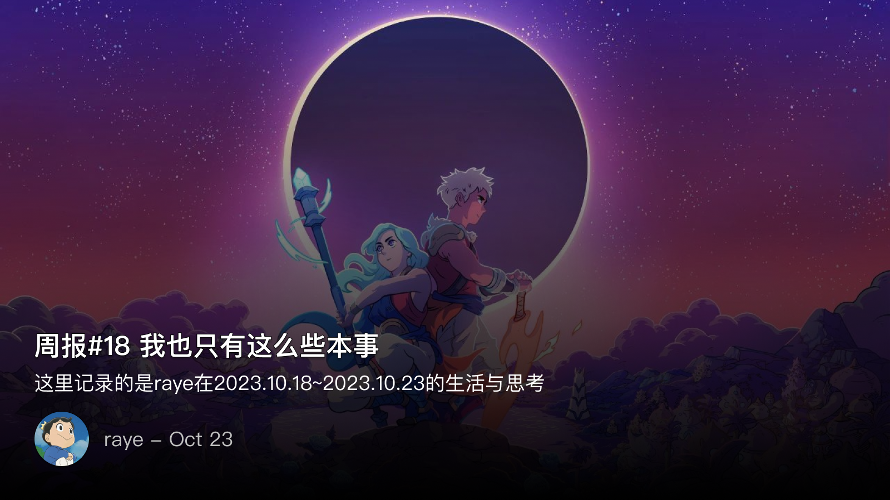
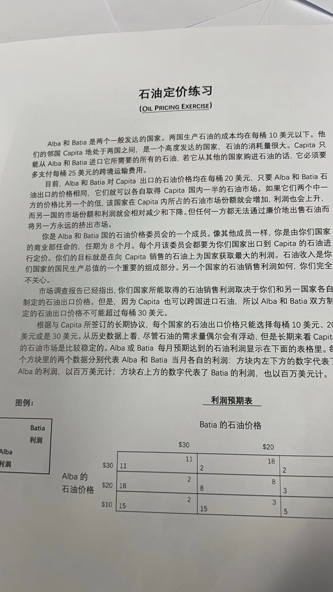
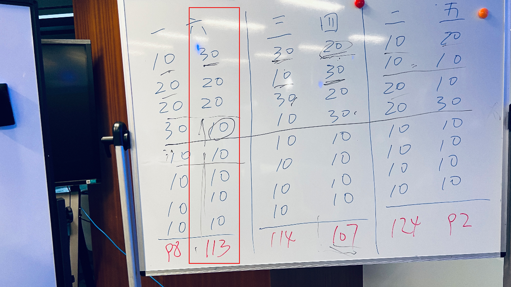

 周报18 我也只有这么些本事

<!--  -->

最近周报的更新时间不是很稳定，一方面可能是还没有调整过来，生活节奏稍有些紊乱，另一方面可能是有间歇性的懒癌发作了

随着xlog上认识的朋友变多，也开始有些压力，每篇周报发出去的时候总要纠结万分。但随着这个过程的重复，发现纠结太多反而没那么多必要，写完就行了，大部分时候都能做到文从字顺，有些刻意的雕琢反倒是有些画蛇添足。

你所看过的，你所经历的，都将凝聚在你的笔尖

本周也没有发生什么新奇的事情，周六下午报名了公司谈判课，抱着好奇心去听课的，其中的一个活动印象深刻；三天时间读完了《羊毛记》这本科幻小说，写了点书评；还在看《有生之年》，感触挺多的。

周日休养了一天，除了周三出差去了趟广州外，连续一周打球导致左臂肩膀肌肉酸疼。说是休养，其实基本一天都在打游戏，通关了cocoon这款解谜游戏，今年TGA年度独立游戏提名没有它我不看好吧🤣

空暇之余收拾了下出租屋，叠好了衣服，刷了下厕所

看到 one · 一个 app上的一篇文章，摘录了一句：

我也只有这么些本事，收拾屋子，读几本书，再写下一些不重要的文字，日子天天过，在自己眼前这片小天地里怡然自得，我花光了所有力气

封面图 星之海

 📕学会谈判

课堂上老师讲了几个故事，其实基本都选自一些谈判类的书籍，不过第一次接触到印象还是很深刻

罗斯福大选的故事可以看这里 [https://www.jianshu.com/p/6ac48f98ccc9](https://www.jianshu.com/p/6ac48f98ccc9)

印象最深刻的活动还是这个：

<!--  -->

规则很简单，A组和B组分别在两个不同的教室，由老师负责传递信息，总共八轮报价

第一轮报价，我们组计划先给对方一个善意的开局，毕竟如果直接报最低可能就没法玩了，结果对方却给了我们一个最低的报价
既然善意释放没有成功，但是我们预测到对方知道我方的善意后，还是多少会有点改进，于是调整到了中间价
果然对方也意识到了，于是第二轮、第三轮报价就都变为了20

第四轮开始之前，老师说这一轮可以先互相派出一个人进行谈判，并且收益翻倍

于是我们的代表和对方代表商议是都出最高价30（毕竟这样赚的才最多）
可能是由于前期善意释放的比较足，对方是相信了，但是我们经过考虑，决定撕破脸背刺一波，给出了最低价

果然不出所料，对方被我们摆了一道

但进行到第六轮的时候，老师说还可以进行一轮谈判，这是意想不到的，并且收益翻4倍
但是由于前期已经谈崩了，所以不存在复合的可能了，后面也就基本没啥意义了

最后记录的结果，我们是第六组，和第一组pk的，一级其余两组的结果

<!--  -->

有一些经验是值得记录的：
- 开局一定要明确善意和恶意，但最好释放善意，虽然从二、五组的比赛来看，恶意竞争的收益反而最多？
- 长期动态博弈的最佳策略一定是以牙还牙，即你给我善意我给你善意，你给我恶意，我给你恶意

还是个挺有趣的游戏，初看起来很简单，但是玩起来就有点陷入猜疑链了，三体既视感

 📺 追剧

《有生之年》

<!--  -->

最近越来越喜欢台剧了，喜欢这种充满生活烟火气息的镜头，而不是被滤镜美颜呈现出的虚假画面（国产剧说的就是你..

很佩服台剧的表现力，略带点台湾口音的语言，却让我越听越上头，平凡的早餐店工作，路边的街头小摊，昏黄幽暗的家，还有一架老风扇在吱呀呀的转

很适合在一个忙碌的一天结束之后，褪去了保护的外壳，静静地看着这一堆发生在别人身上的琐事，没有什么大道理可讲，生活就是在你日后回忆起来才发现，哦原来当初就是这么过去的啊

 📚阅读

《羊毛战记》这部剧上半年Apple tv就开始追了，一集没落，
实际剧情和羊毛没半点关系（除了擦镜布是用羊毛做的外）	
又是一部被汉化标题耽误的美剧

正好这本书微信读书上架了，集中两三天内读完了，翻译质量属实上乘之作（对，《耶路撒冷三千年》说的就是你，翻译的真拉胯）

每到世界末日的主题，总少不了外星人入侵地球，僵尸围城等等，激光炮弹射出的火花，总让人疑心这是在庆祝而不是恐慌？
真正的世界末日，是在一个144层的地堡中，一个充满谎言与欺骗的阶级统治下，一小撮人，向外探寻的故事
当主角真正走出这个名为"筒仓"的地下堡垒，用自己的眼睛看穿欺骗的谎言，也不过就是从一个筒仓到了另一个筒仓

筒仓，其实就像是存储粮食的仓库一样，不过是存储人类的种子而已
故事很简短，更像是一个寓言

作者在结尾中写到，
筒仓墙上的屏幕就是我们的电视、网络浏览器、搜索引擎、报纸、新闻和手机。
真相要用自己的眼睛去看

 📮 Newsletter

以后所有的记录就都会自动同步到个人频道啦, [https://t.me/RayeJourney](https://t.me/RayeJourney)

不过也会摘录一些放在博客里：

- [ 碧桂园，距离恒大还有多远？【汤山老王】 ](https://www.youtube.com/watch?v=N7v84mRU2Ag)
- [ 马立平：小学数学教材中的严重问题 ](https://mp.weixin.qq.com/s/_BD57wFFtXF6Cb-HHuZmwg) 说实话完全没看懂想表达什么，纯粹是为了怼而怼..一股子无脑黑，当个笑话看吧，也学点新知识🐶
- [ 【翻译】Quine - 自我复制的程序（上） ](https://zhuanlan.zhihu.com/p/549183520)，本来以为Quine的编写还挺简单的，没想到是我想简单了
- [ 最近微信与抖音小游戏-找到自己的定位 ](https://mp.weixin.qq.com/s/GNXu3xUP9xLAo679ggiXmA)
- [ 自建Clash订阅转换 - Subconverter+Subweb+MyUrls搭建教程 ](https://surgee.me/Subconvertermd)
- [ 我真的将这个虚假广告做成了游戏！！ ！](https://www.bilibili.com/video/BV1mu4y1v7ov)
- [ 我们为何总试图分辨谁是真正的女性主义者？从Lisa疯马秀争议谈起 ](https://mp.weixin.qq.com/s/yL-DwaTvbQMTypPltLOVyg)
- [ 《杀死一只知更鸟》阅读笔记 ](https://lca.xlog.app/-sha-si-yi-zhi-zhi-geng-niao--yue-du-bi-ji)
- [ 微信背后的产品观》：哪些观点塑造了现在的微信 ](https://xlog.app/post/weiyexing/shaping-the-perspective-of-wechat)

