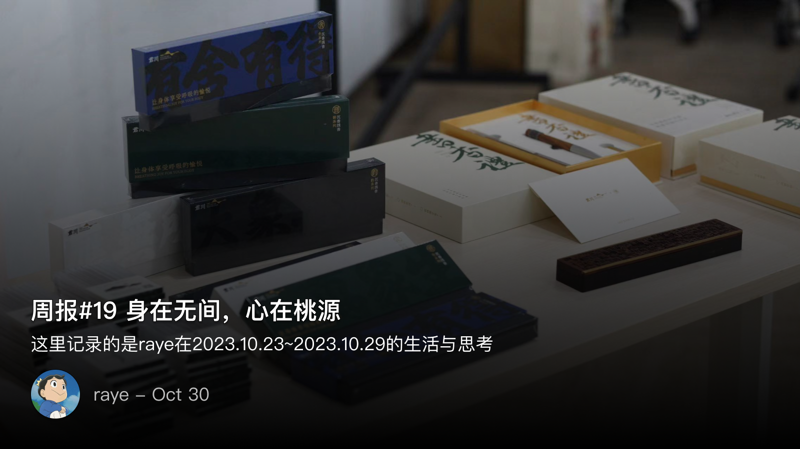
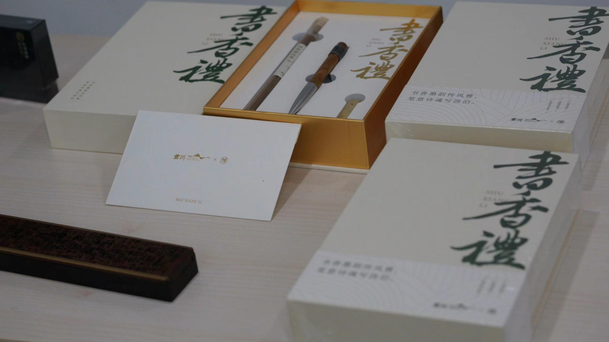

  周报19 身在无间，心在桃源

<!--  -->

周一去健身房撸了个铁，重量加的有点大，导致上肢疼了一周，差点羽毛球打打不了了🤣。周二则是1024程序员节，参加了公司的线下活动收获了一大批礼品，很开心。P5r10月底要退出XGP了，但又舍不得买，好在主线剧情到狮童宫殿了，第三学期恐怕来不及玩了，先肝着

最近一周仿佛又陷入到了思维的泥淖中，怎么都迈不开腿。
我们总是期盼有一个银弹，能一口气解决我们遇到的问题。
但是事实上，所谓灵光闪现，所谓豁然开朗，都不过是一步一盘桓，一步一选择，初极狭才通人，复行数十步才能见到的

刷到了毕导终于毕业的视频，虽然我没读过研，但是也能体会到写论文的不易，水论文的idea反倒是很多，正经的创新想法却一个都没有。可是除了真正的天才，谁又能在一瞬间想到那些惊为天人的想法呢？

我也常常感到头疼，被leader怼思考不够。这时候就会陷入到王阳明格竹子的困境，天天对着竹子能想出什么呢？往往是最后自怨自艾，恨不得倒退回去变成一个简单的程序员，只要被人指挥去实现各种功能就好了

看到已经离职的伙伴还在深圳自由自在，也不需要承担工作的压力，还挺羡慕的。但我其实知道我是做不到的，哪怕是周末宅一天打游戏，吃外卖，没有任何社交工作，对我来说也是无法接受的

有压力，有进步空间，有交流，但是又时刻想着逃离，这种矛盾的心态，恐怕才是当下最好的状态吧

正如标题所言，身在无间，心在桃源

 1024 程序员节快乐！

线下活动有个摊位是tRPC的，活动很简单，扫个码看看你对tRPC的贡献，如果有贡献过就能获得奖励哈哈哈哈😆

没想到之前无心插柳，抱着对tRPC的兴趣领了一些issue来完成，也算是共建的开发者了！

<!--  -->

打个广告，tRPC已经开源了，首批开源了`C++` 和 `golang` 的版本，欢迎提issue和pr
 
[https://github.com/trpc-group](https://github.com/trpc-group)

 📚阅读 & 读书会

<!--  -->

<!--  -->

<!--  -->

诸君看图吧，累了不想写了🤣

一次很有意思的读书会，尽管有一点点品牌宣传的嫌疑。不过我晚上回来，感觉全身无力…躺在床上什么都做不了，鉴定完毕，我可能是那种不适于闻香的人了

 📮 Newsletter

以后所有的记录就都会自动同步到个人频道啦, [https://t.me/RayeJourney](https://t.me/RayeJourney)

不过也会摘录一些放在博客里：

- [ Apache ActiveMQ 远程代码执行漏洞 ](https://mp.weixin.qq.com/s/ZWYYFu0q_riKNlEyz6EDbw) 又是一个Java的漏洞，最近打算花点时间研究下
- [ 在大城市，那些被放逐的程序员 ](https://mp.weixin.qq.com/s/Er2I9edCx1P40oPWGdTpjA)
- [ 用NAS和兄弟共享小姐姐：Docker项目SyncTV，实现多人观影和直播体验 ](https://panda995.xyz/network/3593.html)挺像入坑NAS的，但是奈何现在条件不允许
- [ 【全站首部】史诗级立体世界历史地图5000年 ](https://www.bilibili.com/video/BV14R4y1u7nm) 这个做得挺好的，可以纵览中外历史各个朝代，历史爱好者必备了
- [https://262.ecma-international.org/10.0/sec-ordinarysetwithowndescriptor](https://262.ecma-international.org/10.0/sec-ordinarysetwithowndescriptor) 最后还是要翻ecma的js标准才能找到原因
- [https://we.dog/](https://we.dog/) 舔狗网站太好笑了
- [ 碧桂园，距离恒大还有多远？【汤山老王】 ](https://www.youtube.com/watch?v=N7v84mRU2Ag)

