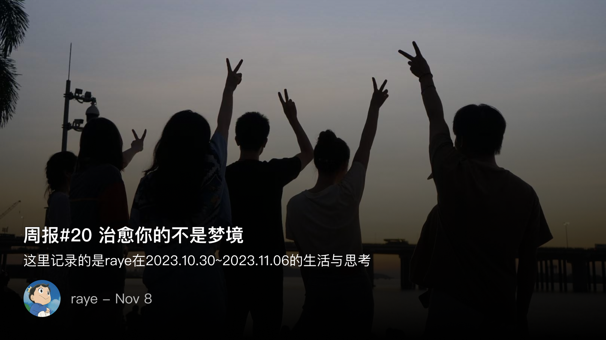

 周报20 治愈你的不是梦境

<!--  -->

看到《奇葩说》关于对“不睡觉药”的探讨，这个辩题对反方当然是很容易的，比如小鹿提到的，会造成内卷，是一个很合情合理的推断。作为正方则很难，但是我听到正方二辩的辩词时，被深深地打动了，摘录如下：

首尔姐告诉我们说梦境是人逃避现实的一种方式，我非常赞同，
可是你要知道梦境这件事情自己不能选择，你们有多久时间没做过梦了，你有多久时间可以控制自己梦境的发生。

我觉得与其等待梦境，不如创造梦境。

当我遇到所有不开心的时候，我第一反应绝对不会去睡觉，因为很可能睡醒之后你会感觉更失落，问题有时候并没有解决。
我把它写下来，按我一切想要的样子写下来，文字是可以永久记忆的，当若干年之后我翻出来读这些文字的时候，只要我仍然能够记得我当时描写的场景，我的亲人就没有离去，只要我还能记得我的爱人，我的爱人就没有离去，

所以治愈你的不是梦境，而是你刚才写下来的这一切

 💭对于历史类书籍阅读的思考

周日收到了文杰的邀请，一场别开生面的草地分享会，记录下自己的一些想法
1. 文杰分享的时候有个点让我印象深刻，"大家休息的短暂三分钟，十年过去了。"让我想起一句话，历史书翻过一页，背后就是无数个人的一生
2. 历史有时候是成王败寇，是从结果去反推原因的。譬如我们都知道袁绍被曹操打败了，但我们不能就因此觉得袁绍很蠢，b站有个up叫渤海小吏，深入分析了官渡之战的每一个细节，用事实告诉我们，历史是有因果的，是有细节的
3. 以前读过一本书叫《芥子》，芥子和须弥是相对的，都是佛教用语。须弥是无穷大，芥子就是无穷小的意思。所以，《芥子》这本书就是讲历史上的小人物，比如，曲有误，周郎顾。这本书不会去讲周郎，而是写那个弹琴的侍女，写她的生活，写她的情感，写她弹琴时那一点调皮的心理活动。这也我所喜欢的历史故事
4. 我也读《明朝那些事》，我觉得明朝那些事写的最好的两个人，也是最好哭的两个故事，一个是李时珍，一个是徐霞客

“无论徐阶是否斗倒了严嵩，无论张居正是不是一个杰出的改革家，都不关李时珍的事，他只是一个医生。他知道，生命很珍贵，也很柔弱，作为一个医生，有责任和义务去维护生命的存在。”
“我只是个平民，没有受命，只是穿着布衣，拿着拐杖，穿着草鞋，凭借自己，游历天下，故虽死，无憾。”

5. 徐霞客的原话是，吾荷一锸来 何处不可埋吾骨耶。就是说我扛着我的锄头遍历天下，哪一处地方不可以埋葬我呢。这是我语文老师教我们的，我能感受到她对于徐霞客的喜爱，刚好当年明月，也把他放在结尾，用这样一个故事，收束了长达两百多年的明朝。这也是作者想表达的：成功就是，用我们自己的方式，度过一生

 📮 Newsletter

以后所有的记录就都会自动同步到个人频道啦, [https://t.me/RayeJourney](https://t.me/RayeJourney)

不过也会摘录一些放在博客里：

- [ JavaScript 的函数参数竟然能相互访问到？ - Viki ](https://xlog.viki.moe/js-arguments-can-access-each-other)
- [ 我们在反对微博「访客记录」时到底在反对什么？ ](https://dongjunke.cn/posts/2023/11/05/32863.html)
- [ 基于荷尔蒙开发的开源项目 ](https://www.eaimty.com/2023/opensource-project-based-on-hormone/)
- [ 生日快乐，和菜头先生 ](https://mp.weixin.qq.com/s/Yz16UDZ3a4zDIHGM1TVDmg)
- [ 当人们纪念前总理时 到底在纪念什么 ?](https://archive.li/WFsPCselection-391.20-397.21)

 最近在读📚

《失败者的春秋》 [https://book.douban.com/subject/34431806/](https://book.douban.com/subject/34431806/)
书友推荐的，历史类的书籍也读过很多了，这一本需要有一定的历史基础，不过春秋时期的很多历史故事我已经知道得差不多，权当是复习了。

《安娜·卡列尼娜》 [https://book.douban.com/subject/34894032/](https://book.douban.com/subject/34894032/)

 最近在追📺

《镀金时代》[ https://movie.douban.com/subject/26361853/ ](https://movie.douban.com/subject/26361853/%20)
这类型的剧更经典的应该看《唐顿庄园》，也不知道是什么缘由开始喜欢上了这部剧，其中浓厚的历史气息，沉郁顿挫的BGM，仿佛一张历史的画卷就在你的前面铺开。（当然女主好漂亮啊！越看越养眼）

 最近在玩🎮

漫威蜘蛛侠2.0 ！爆米花游戏好上头😁

