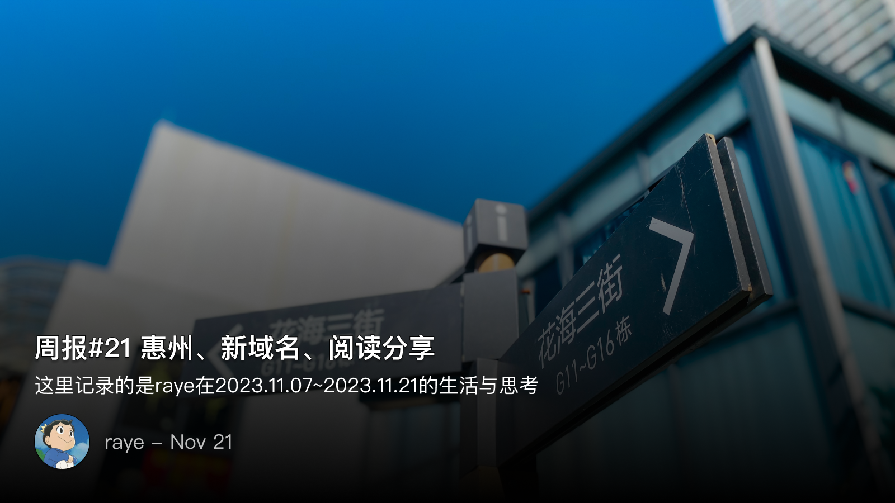
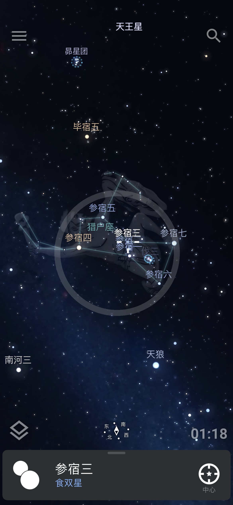

 周报21 惠州、新域名与阅读分享

<!--  -->

距离上一篇周报已经过去两周了，我在flomo上记过一段想法：

> 最近一段时间停了周报，感觉写的越多，就越沦为一种负担和强迫，因此有必要向内求索，向外探寻，去重新发现更多有意义的事情，还有值得记录的想法

这两周时间也有了一些新的体验，又忍不住开始写周报了🥰

上周六组内团建去了一趟惠州巽寮湾，挺累的，不过在海边的小别墅烧烤，夜晚抬头看久违的星星，以及深夜的德州都惊喜满满。周日中午赶着打了一辆顺风车回深圳，作为主讲人，分享了一本我最喜欢的书《夜晚的潜水艇》，最开始稍有些紧张，额头一直冒汗，但很快就进入了状态，就是不知道语速有没有放慢下来，期待后续再次准备好新的分享，可能会讲点历史方面的书吧。工作时摸鱼想了下还是有必要搞个个人的域名，之前注册了一个 `raye.wiki` 但总感觉差点意思。搜了下`raye` 相关的域名差不多都没了，只好退而求其次，`rayepeng.net` 还挺喜欢的，迁移到cloudfare的解析，白嫖下解析套餐。你现在看到这篇文章的时候，我已经完成了域名迁移。

前段时间听杨照老师讲司马迁写《史记》，才意识到有很多问题实际上没想到的。《史记》作为第一部纪传体史书，其面临的困难是很多的，试举一例，项羽和刘邦的鸿门宴，两个人都经历过，那这段故事应该放在谁的传记里？司马迁给出的答案是放在项羽本纪中，而对应到高祖本纪中，则是简单地略写。

我突然想到这个例子，是因为写周报这件事看似简单，实则就像写史记一样，虽不是什么通古今之变的作品，但也是属于我个人的一些微不足道的记录。其中的详略安排，只有写起来的时候才能感受到。写作与写作之间，其实本没什么高下，如果可以，我也想做司马迁身旁的一位书童，为其研墨镇纸。

 惠州

虽然但是，临时起意的旅行还是打乱了我的安排。惠州的团建虽说比较仓促，但体验还是不错的，虽然巽寮湾已经是第二次去了。车上还看到了上次团建时吃海鲜大排档的餐馆🤣，属于是故地重游了

第一次室外温泉，貌似没看到几个好看的小姐姐🐶，但是真的好冷。披着一个毯子游走在各个温泉池之间，同时还解锁了泡温泉差点晕倒的成就，这一点和pr5体验一致了属于是🤔

回去后便开始了紧张的切菜串串烤串的工作，一群人忙活到深夜12点多才吃上第一口肉，都怪木炭不给力🤣。但一轮弯月当空，头顶上还有无数的星星，以及远处可见的烟花，都带来了很多惊喜

惠州夜晚的星星是真的太多了，在深圳哪怕是有，也鲜少有这样的闲情抬头凝望一颗颗明亮如宝石般的星星。而且，手机拍摄的星空比肉眼见到的要多多了，冷知识+1

<!--  -->

同事安利了一个星图软件 Stellarium，简直不要太好用。我从小就不知道怎么看哪颗星星叫什么名字，就像我可能现在还认不出农田里的作物叫啥一样（其实主要是教科书上那点知识，以及老师讲的根本就不清楚）

<!--  -->

封面图出自我们在巽寮湾住的小别墅

 读书会分享

虽说作为一次线下读书会主讲人是我一直以来想要做的一个事情了，不过真正实践起来还是会遇到很多的问题

其中就包括我一拖再拖的稿子，虽然很早就开始构思了，但实际上都是到临近分享的前一周开始动笔
（我这该死的拖延症

虽然前一周的周末没有完全整完，但是预计着上班时间摸摸鱼+周六还有一天肯定能搞完的
结果一上班就发现，我将要面临两个汇报材料的整理，头都整麻了，看来上班摸鱼是没法了
周三的时候，突然又临时决定周末去惠州团建？我..真就计划全被打乱了呗😀

于是只能每天下班后，靠着上床睡觉前的俩小时来续命整稿子和ppt了

果然人太忙了，就会导致失去游戏的兴趣，我一点打游戏的想法都没有，累的时候只想躺下来看看书

[他在幻想的羊水中写作——11.19 《夜晚的潜水艇》分享 - raye~ (rayepeng.net)](https://rayepeng.net/1119-ye-wan-de-qian-shui-ting-fen-xiang)

 新域名

xlog博客域名正式更换为 [rayepeng.net](rayepeng.net) 了

同时也解锁了使用 obsidian 来发布 xlog博客，感觉效率就上升了好多了，恰好Ulysses的半年订阅也已过期了，于是就全部迁移到obsidian来吧

obsidian现在也确实越来越好用了，从两年前我第一次接触的时候，感觉还只是能用的水平，现在的功能更加完善了

sync-to-xlog 插件体验了下，感觉还有几个可以优化的点

1. 自动识别我在obsidian的标签，并且同步到xlog上，同时发布的文章中去除掉文本中的标签？
2. 双向链接其实并没有转化过去，这个其实有点难搞

 newsletter

以后所有的记录就都会自动同步到个人频道啦, [https://t.me/RayeJourney](https://t.me/RayeJourney)

不过也会摘录一些放在博客里：

- [ 只是一份工作 ](https://mp.weixin.qq.com/s/XOyEdmqIYrmt3fkekGqPPQ)
- [ 再见，小猫咪 ](https://veryjack.com/life/goodbye_mimi/)
-  [又见年度书单](https://mp.weixin.qq.com/s/u7iqQkOpusH_5wrYg1D5XA)
- [25年，腾讯一直在思考「我们的用户在哪？」](https://mp.weixin.qq.com/s/1LK3hFQgzJbkFT3rEQLhQw)
- [论著选刊 | 李硕：周灭商与华夏新生](https://mp.weixin.qq.com/s/X4p1D-smhyR5ENef5gcogQ)
- [赛跑的最高境界，是不动声色地“控制时间” ](https://mp.weixin.qq.com/s/SL807HQ_fSCvOMVtL8LPGw)

