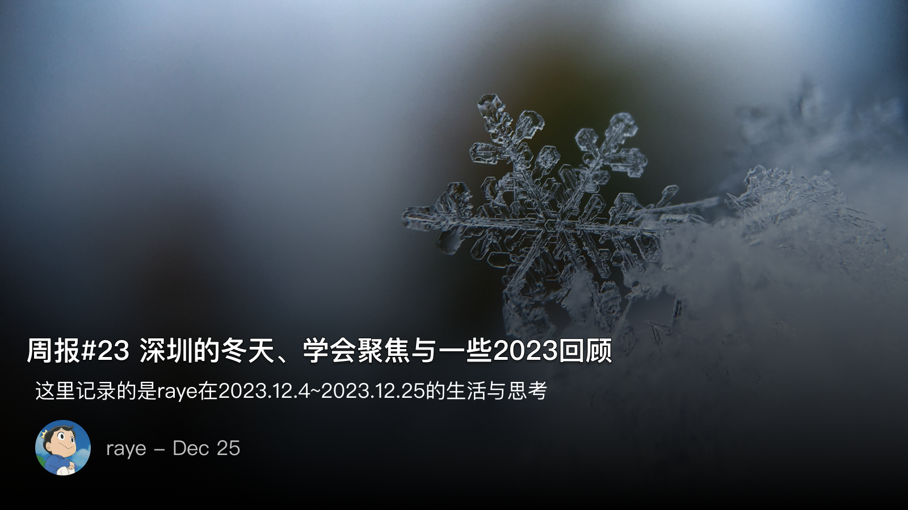
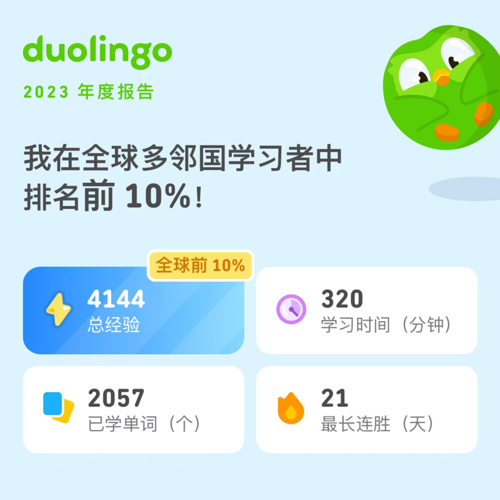
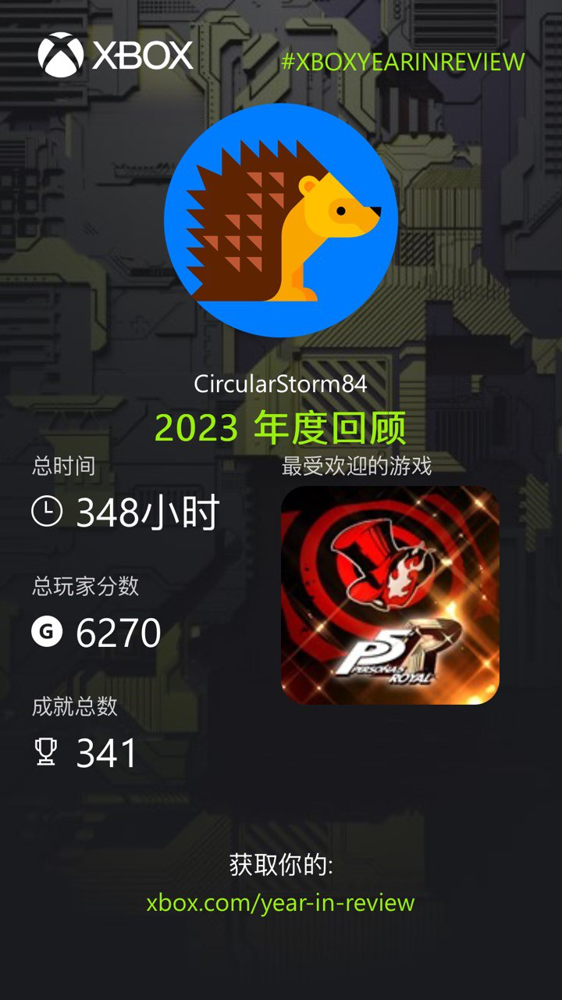
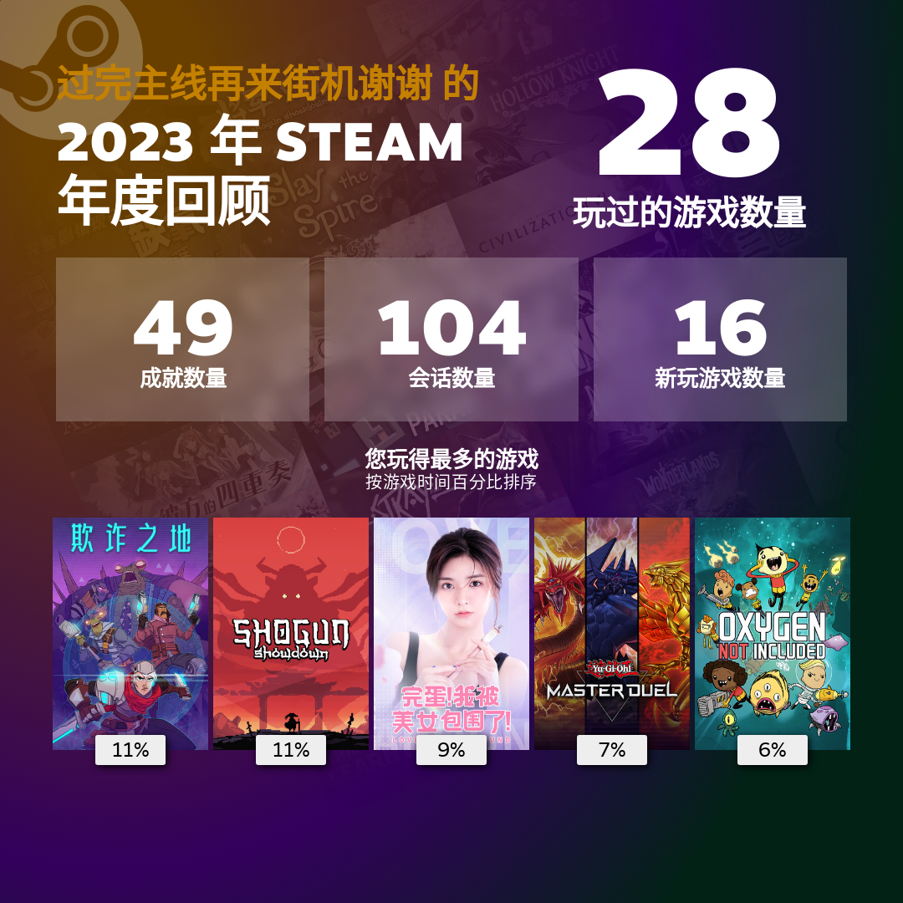
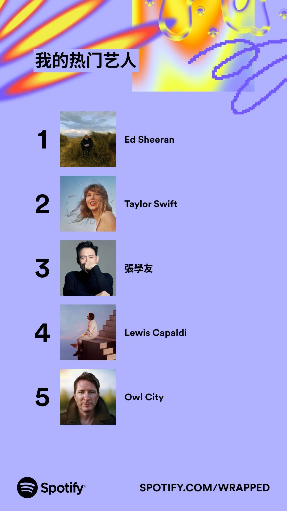
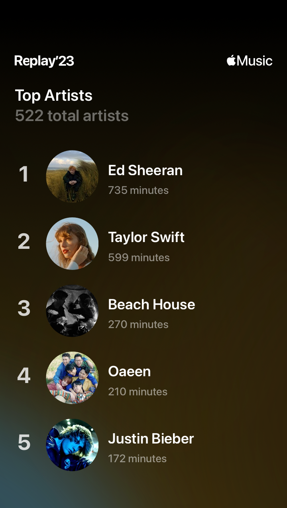

 周报23 深圳的冬天、学会聚焦与一些2023回顾

<!--  -->

深圳大降温了。

老舍有一篇文章，“济南的冬天”，课后有个阅读理解题我一直还记得，“为什么不是冬天的济南？作者这样写有什么用意？”

有什么用意呢？我不想批评应试教育，总是要贴心地帮着作者想出一些问题来，但毕竟提出问题总是好的。

当我写下这个标题的时候，很自然而然的，我就是想写深圳的冬天，仿佛上帝从宇宙中俯视地球，洛杉矶在下雨，好望角烈日炎炎，西伯利亚的冷风还在刮。每一个所能被经纬度标注的地区，气象各异。

而我这所处这一点，可能连最精确的芯片都无法精确表征出的位置，此刻正处于深圳，经受第一场严冬的洗礼

这也算是23年的最后一篇周报了，12月起开始偷懒了，花在写作的时间逐渐变少了，但还是会一直写下去的

圣诞的夜晚，Merry Christmas

 学会聚焦

这个世界没有什么四两拨千斤的神话传奇，只有敢于在战场上拼刺刀的勇士

12月22日是部门年会，我这个中奖绝缘体只有在21年刚入职的时候才中过大奖，后来几次年会就再也没有中过了🥹。但当天下午的闭门会，才是我从中最受益良多的

三年前我第一次来这个部门实习的时候，估计是觉得微信-发现-游戏入口的红点太多太烦了，于是直接把它给隐藏了，以致于leader当时跟我说，可以在微信游戏里领到很多游戏福利的时候，我竟然一脸茫然，不过当初的我还是连连点头表示知道了🐶。其实，不止我，部门内很多同学都不知道或者基本不会去打开，这还一定程度成为了老板给我们的KPI——如何让部门内的同学先使用起来，不过这都是后话了，此处不提。

那时候，小游戏基本处于劣币驱逐良币的状态，随手打开的小游戏全都是充斥其中的广告，我们和产品同事还有个微信群，谁发现了恶意诱导用户点击广告的case就会反馈，我当时还和同事抢着不断地往群里丢，不过现在这个群已经几乎没人反馈了（侧面也反映出小游戏生态越来越好了）

谁又能想到呢，部门的两大核心业务，一个成立十周年，另一个已经过了六周年，筚路蓝缕，以启山林。

但反观我这一年，精力太过分散，相比去年反而在不断退步。不过好在导师和leader也都察觉到了，及时跟我交流后让我学会重新聚焦

之前从《贪婪的多巴胺》中也吸取到一些经验，我在一定程度上也属于那种不断去追求新事物，其实这不过是一种很低级，很省事来获取多巴胺的一种方式，并且事后也会越发的疲倦。

 中文博客微信群

加入了小胡同学的中文博客微信群，群聊名片中带上自己的博客域名，这种交流方式真的好酷！

加入到微信群后也遇到了一些有趣的事情，大家聊的话题都很广，偶尔窥屏或者参与一些讨论摸摸鱼

深圳的朋友还是挺多的，在聊天的时候还会发现原来就在同一栋楼或者相隔不远的地方上班哈哈，说不定还在上下班的人流中曾见过一面呢，缘分也就是这么奇妙

小胡同学的严选推荐很棒！

[ 小胡同学的剁手安利库 ](https://huhexian.notion.site/huhexian/66a7d139a06b46ccac9236d1e58b9a2a)

 一些2023年的总结

国外的APP总结都来的好早，国内的可能都得要最后一周了，到时候估计会写到年终总结 or 24年的周报里吧
并且也打算安利下我23年都看过哪些书，追过哪些剧，也做一个属于自己的2023年推荐了

 学习的

多邻国的：

<!--  -->

 游戏的

Xbox的：

<!--  -->

Ps5的（毕竟今年刚到，没来得及玩）：

<!--  -->

Steam的（今年独立游戏买了一堆，但是都没怎么玩）：

<!--  -->

 听歌的

果然我最钟爱的还是黄老板，基本都是他的歌了

Spotify的：

<!--  -->

Apple music的：

<!--  -->

 📮 Newsletter

以后所有的记录就都会自动同步到个人频道啦, [https://t.me/RayeJourney](https://t.me/RayeJourney)

不过也会摘录一些放在博客里：（内容太多了，欢迎到我频道里去看吧，不一一放了）

-  [ 从格斯纳、林奈到达尔文：信息管理的另一种叙事 ](https://utgd.net/article/20484/)
- [豆瓣2023年读书榜单](https://book.douban.com/annual/2023/?fullscreen=1&source=doumail&dt_dapp=1&dt_platform=com.douban.activity.wechat_friends&event_source=timeline&refer_uri_app=douban://douban.com/timeline&author_id=40005481)
- [ 走走画画，在山野间探寻自我 | 北京漫步 ](https://hellotangman.xlog.app/Strolling-and-painting)
- [ 2024年“先立后破”，怎么“立”，怎么“破”？【汤山老王】 ](https://www.youtube.com/watch?v=yfbM8Hmni3E)
- [ 游戏公司股价集体暴跌，《网游管理办法征求意见稿》该如何理解？ ](https://mp.weixin.qq.com/s?__biz=MjM5NzQwMjI4MA==&mid=2657260190&idx=2&sn=f801554a90aa9e38a006977278677335&chksm=bd4cb1598a3b384f933afe98bb6ac55189c0f8d31a4383423091d28a8832f854bd1c0007a98brd)

