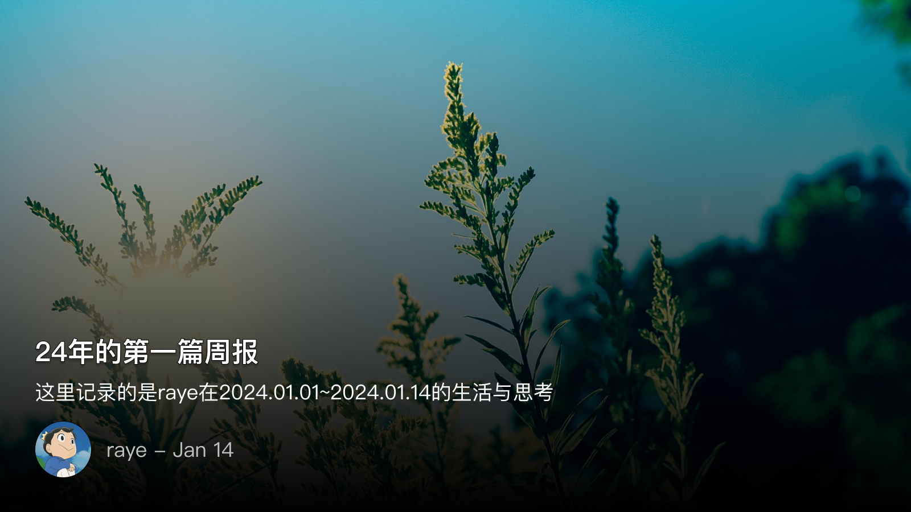

 周报24 24年的第一篇周报

<!--  -->

午后的阳光跳进窗玻璃，跳到我的键盘上，蜗居的小房间里仿佛又多了点生机

每到一周快要结束的时候，我都会头疼又要写周报了，指工作周报和博客周报，其中一个是真头疼，另一个是可能是假头疼吧

但每每搜肠刮肚，也还能想到些什么，再经过几番互联网式的总结和加工，最后凝结为几行简短，一目了然的句子，以此总结自己本周的工作

那生活呢？普通打工人的生活，除了上下班还能有哪些出彩值得记录的地方呢，我扪心自问

但谁又不是如此呢，除了有明确目标的工作，我们都不太清楚要总结什么

想到这里你就明白了，为什么历史人物的传记的那么单调了—— 全是官职的调动，再难看到司马迁笔下诸如霸王别姬，自刎乌江前的豪壮场面了

但我还是看到一些，这些细节，构成了我眼中的世界
我看到，坐在女朋友小电驴后座的男生一只手扛着东西，另一只手紧搂着她
我看到，辛苦爬楼送完外卖的的小哥，下楼的时候开心地刷着短视频
我看到，买炒粉的路边摊阿姨，帮我打包后还送我一个小橘子

> 你是你接触过的人，碰到过的物，感受过的情爱，迷失过的痛苦，家乡的老树，街边的路灯，吃过的烧烤摊……等等所有的体验，才有此刻的你。

我固然经历不到那些所谓“后浪”的生活，我也需要在逛街的时候有一个共享充电宝应急（而不是可以直接去车上充电🐶），我讨厌冷冰冰毫无人性的道理，比如如下语出《内瓦尔宝典》：

> 如果你将在一个城市生活十年，一份工作干上五年，或者跟一个人相伴十年，你就应该先花一到两年的时间认真思考再做决定。这些都是非常重大的决定，是人生的三大关键决定。

我是这么点评的：

经济学家似乎都喜欢鲁滨逊漂流记，但鲁滨逊有得选吗，他只能走一步看一步，慢慢经营，虽然他没法选择流亡的岛屿，但是他可以选择定居点，选择工具，选择规划。人也是一样，我不觉得最开始就要困住自己，没有决定选出哪个城市就踟蹰不前，哪怕你选错了城市，你还可以选择定居的地点，选择不同的社区，是这一系列的抉择，而不是所谓孤注一掷重大的某个抉择。否则，就会像猫头鹰搬家一样，始终无所适从

按惯例是要总结提升一下，比如来一句凝练的话语，引人深思（我以前可能也是这么做的），但我还是不想，我只是想把这些无关紧要的话语记录下来供诸君取乐下

是为本周报序

 📚《悉达多》《内瓦尔宝典》《两汉风云》《弹性生长》

我向来对这种书是不太感冒的，这种书一般有如下特点：
1. 必须是国外的，这样才有格调
2. 书名一般是一些直接音译的名字，显得很高大上

当然，类似宝典这种书，我是非常排斥的，但这周态度转变了下，我觉得还是有必要抱着一种看烂片的心态去阅读的

首先花了一个多小时很快就把《悉达多》看完了，文字翻译的很美，有音律感

但书的内容属于你看了开头就知道结尾的，而且作为自小被中国传统文化熏陶的我们，对于所谓

> 得意时信儒，失意时信道，绝望时信佛

是一点也不陌生的，而悉达多所做的，所经历的就是这一切

看完后我第一个想到的还是蒋捷的听雨，短短的十几个字，已经把《悉达多》的内容全部概括了

而《内瓦尔宝典》这本书，正如我在序言里提到的，我反正是一边看一遍骂的，属于正确的废话了，随便摘录几条吧

> 不要跟愤世嫉俗和消极悲观的人合作。他们的预言会自我实现。

我：so，知道了这条又有什么意义呢？ 我能选择和什么样的人合作吗哈哈

> 有时候，即使你自己不觉得那是一门技能，身边的人也会留意到。你的母亲或者你成长过程中最好的朋友会知道你有什么特别之处。

我：但现实就是，很少有人能在某些方面特别擅长。我们在学校阶段所展现出的特长，无非是经过了大量练习，或者是依靠一些记忆力，再或者是花了点时间而已。

> 要积累和发展专长，就要发挥自己的天赋，研究自己真正好奇的东西，追寻自己的热情所在，而不是选择一个当下的热门专业，然后在毕业后进入投资者宣称的热门行业。

我：道理我都懂，那你可以告诉我怎么做吗

> 我想说的是，你应该在经过深思熟虑后，清醒地认识到自己需要从大多数事情（人际关系、工作、学习）中找到可以尽全力去付出的那部分，以充分获取复利效应。

我：所以怎么深思熟虑呢？

> 普通人把时间浪费在短期思考上，浪费在毫无价值的繁重工作上。而巴菲特会用一年斟酌判断，然后用一天采取行动。他一天的行动可以影响未来几十年

我：你这么做一次试试，看你老板不把你开了

（不说了，我继续去骂了🐶

渤海小吏的《两汉风云》也在微信读书上上架了，23年基本都是看他的历史类视频，也补充了一堆以前没有接触过的历史知识，再去重读一遍纸质书，还是看的很爽，真的，感觉多读一点历史要比整天看那些给建议的毒鸡汤好多了

下周估计会集中精力研读一下《南北战争三百年》

 🎬《年会不能停》& 📺《单身即地狱》

这是一部很好的片子，但豆瓣评分不过，依照豆瓣那些评论家一贯的尿性，估计会说：

> 虽然很好，但也只是在国产电影日常的框架中做了一些微不足道的创新吧

也不是没道理，毕竟看下来，结尾还是有些刻意去营造一个很好的结局呈现出来

除去那些影评频道都会说的，电影有几个镜头让我觉得很感动

第一个是三个人在天台的那场戏，杰克马的那一番话和转变，其实我并没有太理解，尽管转变可能有点突兀，但我总觉得导演在里面埋了一点东西，估计要看第二遍才能理解了

远在天边的，三百个职工的饭碗，与当下自己的妻儿老小，哪个更重要？这无疑又是一个电车悖论。但所幸，权利的斗争还是给人一点希望

这就是第二个点了，我最想说的这个人，徐总，因为都姓徐，让我想起了另一个人——徐阶

他属于典型的，士大夫笔下的反面案例。他不缺钱，但是他有点理想主义（这也是剧中的女一挂在嘴边的），他想通过快刀斩乱麻的方式，让公司拥抱互联网，快速斩断掉与旧时代的关系。我不由得想象，如果他成功了，在他主导的叙事视角中，这又是怎样一番景象

想千年前，徐阶斗倒了严嵩，在史官的笔下，严嵩就是一个十恶不赦的坏蛋，可要是徐阶没有斗倒呢？

我们总是容易被历史的叙事视角给影响的，电影之所以是电影，就在于它的结局大多是一个向上的（当然是指国产的），而现实则很难

不说这些历史了，不妨看看恋爱综艺养养眼🤣，献上一张修罗场的图，堪比《最后的晚餐》

<!--  -->

诸君自己解读吧哈哈哈哈（纯爱战士应声倒地啊

 📮 Newsletter

以后所有的记录就都会自动同步到个人频道啦，[https://t.me/RayeJourney](https://t.me/RayeJourney)

不过也会摘录一些放在博客里：

1. [ Heptabase 最完整模板中文教學及配合 Raycast 使用模板的方法 ](https://readingstrength.com/heptabase-raycast-template/) 
2. [ 如何写好年终总结？V4.0 ](https://www.woshipm.com/data-analysis/5975665.html)
3. [ 2023 年终总结: 和自己对话 ](https://lutaonan.com/blog/2023-summary/)
4. [ 2023，逃离仿徨 ](https://blog.ursb.me/posts/summary-2023/)

