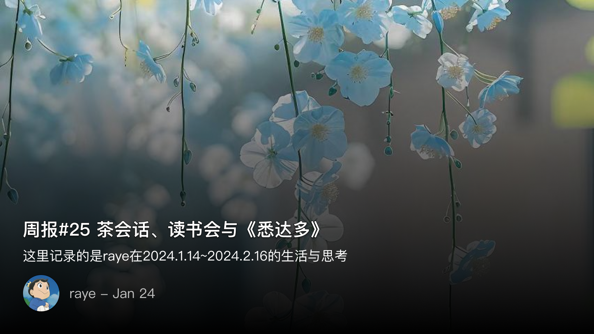

 周报25 茶会话、读书会与《悉达多》

<!--  -->

回看自己的文章，有时候真有一种和过去的自己对话的奇妙经历

我不是一个特别擅长表达的人，也在努力让自己的语速变慢，说话更有条理，强迫自己用1.2.3.这样的方式来使得说话更有结构性

不过这终究比不上写作来的舒服，文字的排列组合是美妙的，是一件很有创意的事，是可以让你击节赞叹的

虽然不同的人有不同的观点，比如“写给自己看的博客就不要发出来啊”，”我写过的文章就不用再回过头去看了啊“ 诸如此类

何必呢，一定要给自己附加这些条条框框，仿佛一个强迫症患者，面对马路上的瓷砖，规定自己不能踩到边线一样

文字，学了之后，就是用来写，用来读的。我们一边说着不要给自己设限，一边又给自己限制一些不可理喻的条件

总觉得怪怪的（

是为本周报序

 茶话会

参加了一个读书群的线上茶话会，大家线上接入腾讯会议，聊聊各自的23年

席间听到了很多不同年龄段人的感悟，或有因为同事疯狂卷而吐槽的，或有老板pua愤而离职的，说实话我觉得收获不太大，听来听去都是一些茶余饭后的吐槽罢了

但我又有了另一种想法，因为听到一个在新加坡工作的人说，他们的leader在年初就会说清自己今年的休假规划，让下属在他休假的时候不要去打扰他

我顿时生出了一种厌恶感，为什么我们每次一谈到工作的对立面，就一定要提到诸如，去马尔代夫潜水，去阿尔卑斯山滑雪，这些真的很重要吗，这些真的就是所谓的诗和远方吗

在一定程度上我能理解，这是对当前生活的一种逃离，是对自我的一种放逐。但我所求的，不过就是吃一顿饭的满足，不过就是翻开一页书的喜悦，不过就是行走在香樟树下，微风拂过的一缕淡淡芳香吗

我突然想到了《悉达多》，这本我曾经评价不是很高的书，我现在又有了新的感悟

悉达多最开始也是一个约束自己的沙门，这就像我们打工人每天要面对自己繁杂的工作一样。但当他领悟到世间的美好时，他便开始放纵自己，但他的这种放纵，却只是一种报复性的，因为他终究不可能推翻自己曾经的过往

于是最终悉达多守着一条河流度过了余生。

一生的尺度太长，我一天就能亲历悉达多的经历：早上还信心满满要解决问题，谁都不准来打扰我，仿佛此刻我就是无欲无求的佛祖。结果一到下午就发现无法坚持下去了，开始放纵自己摸鱼。

然而内心还是告诉我，不能放弃，最后回到正常的轨道，守着那些未解决的问题，开始慢慢理清头绪

坦然接受自己的欲望，直面它，不逃避，这就是阅读悉达多所学到的

 游戏

也许23年因为本命年的关系，做啥啥都不成，游戏其实也没怎么坚持玩，等我回过头来发现还有好多想玩的游戏都没怎么动..

- 卧龙的那只老虎我一直没打过去
- 空洞的第一个boss也没有过关
- 匹诺曹的第一个小boss我死了后就再也没打开了

但当我这几天开始沉入其中，去真正体验的时候，才发现这些游戏设计的是多么好

- 卧龙的化解机制，玩起来是真的爽。
- 空洞的地图设计、bgm、场景，人物，每一个都能给我带来惊喜
- 匹诺曹的艺术风格我也很喜欢，这种独自一人漫步在漆黑的小巷子里带来大量的多巴胺刺激

我不由得想，其实真正去做也没那么难，多看几个攻略，多找几条路就很快了

但我以前总是遇到稍微大一点的困难就放弃了，然后随着时间越拖越久，其实自己也是记得的，但就是不敢迈出那一步去做，由此不断堆积，进而产生了恐惧心理

成功的人总是善于去找各种办法，找各种助力来帮助实现

失败的人，或者懒惰，不想动的人，其实本质在于不想求变

你只要想到每时每刻都是变化的，你做任何一件事其实都是在尽全力，并没有说哪一件事就是很轻松，你才能豁然

我们经过长夜，本以为黑暗无边，但其实只要敢于抬头，月亮还是在的，敢于迈开一步，路也还是在的，不求顺风顺水，但求走过的每一步都是在不断地接近终点

 道德经分享会

成为读书会理事后，我也算是第一次帮忙主持下一场读书会（我不是主讲人哦）

其实要做的事情也不算太多，前期准备主要是发一发通知之类的，并不算麻烦，现成的模版复制粘贴，确认下时间地点不要出错即可

难的是通知的传达，视角的转变有时候是很难的，所以多去经历不同人的生活才能换位思考

作为发布通知的人来看，信息已经足够清晰，只需要花上几十秒即可快速获得

但是偏偏还会有人上来就问...刚开始可能还会愿意解答，但随着次数变多，人性也是会倾向于不耐烦的

不过好歹我也是曾扮演过参与者，也能做到换位思考（毕竟微信这种拉胯的app，消息折叠，遗漏，加载慢又不是没遇到过）

读书会分享当天也没出差错，设备之类的我早已熟悉，唯一要吐槽的就是音频线，似乎所有地方的音频线都是无用的（可能因为本身用的也少吧）

读书会分享人是一个漂亮的小姐姐，而且是一个典型的I人了。

I人有什么特征呢，就是特别怕冷场，担心尴尬，于是会不断地找话题，嘴巴就停不下来哈哈哈。而且I人特别喜欢吐槽自己，比如说自己没有准备好之类的等等

不过我并不太在意这些，我觉得读书会更多的是听一个人的故事

比如她讲高考考试前的紧张焦虑

讲自己的朋友被车撞了缝了几根针

讲自己学习转念的经历

讲自己心酸的准备过程，

还讲了很多好笑的梗，虽然有些在大家看来跳跃性太大了哈哈

你要说这些有什么意义呢，我也觉得没什么，但我就是喜欢听，喜欢听同样的事发生在另一个人身上

 📮 Newsletter

以后所有的记录就都会自动同步到个人频道啦，https://t.me/RayeJourney

不过也会摘录一些放在博客里：

- [https://saveweb.github.io/review-2023/](https://saveweb.github.io/review-2023/)
- [https://iconce.com/](https://iconce.com/)
- https://github.com/malinkang/weread2notion
- [https://tgso.pro/](https://tgso.pro/)
- [https://niracler.com/nyaruko-deploy-for-xlog](https://niracler.com/nyaruko-deploy-for-xlog)