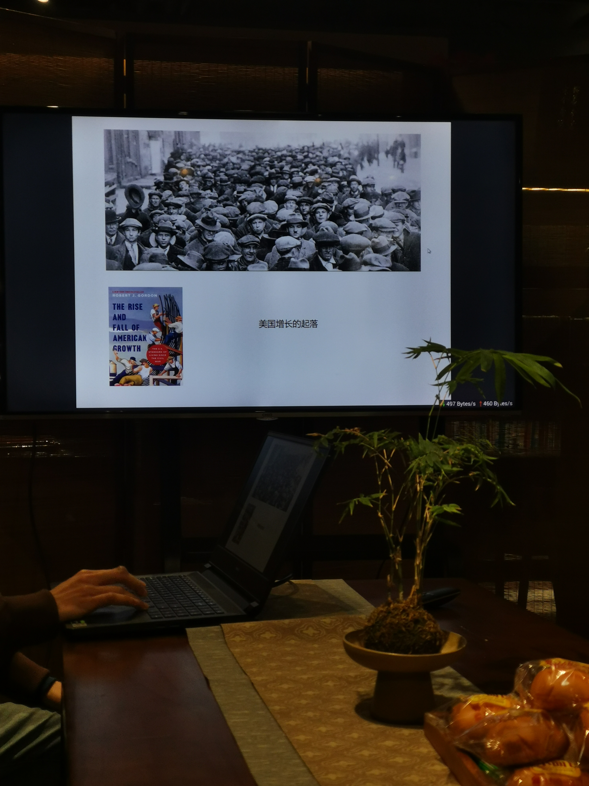

  周报26 赤子之心、读书页面与对技术的追求

<!--  -->

等公交车是一件最为莫过奇妙的事情了

你看着地图上明明接近了，结果半天没看到

等你放弃张望了，这时它才不紧不慢地，慢悠悠地，仿佛故意气你样的开过来

以前我是不太敢坐公交的，甚至有些害怕

因为在老家，公交车是需要挥手招呼才会停下来的，什么时候来一辆公交车也是随机的，完全靠运气

下车就更难受了，你要学着模仿大人的口气，喊出一声“下车！”，更遑论还有大爷大妈回过头来，用一种幽暗的目光盯着你，那种目光射在小孩眼里，是最难受的，因为它毫无感情，毫无温度

小孩的内心是很敏感的，任何哪怕一点小事都有可能在其心中留下难以抹去的印象，这也就是所谓原生家庭，原生环境对人的影响了

似乎任何一本书上，但凡涉及到所谓”突破”，”觉醒”，”宝典”之类的书籍，总是要提到，当你不再被他人的目光所影响，你就真正成熟了，长大了

我是个实用主义者，我一直认为，这些写书的人，都该被斩立决，外加诛九族

怎么可能不在意别人的目光呢！当一百双眼睛看向你的时候

人的眼睛是最会说话的，要不然为什么那么多人研究蒙娜丽莎的微笑，那望向你的目光中，如怨如慕 如泣如诉

尤其是在乡下，在老家，在一个被低维展开的城市里，你的一举一动，都要被那些左邻右舍，上亲下戚所窥探，他们的目光是能杀人的！（请参考阿Q正传）

历史是由最朴素人民创造的，但我也无法承受这杀人的目光，哪怕闭上双眼，犹然如芒刺在怀

一些和周报主题无瓜的想法，是为本周报序

 赤子之心

这次开工后春茗，老板照例送给我们一段话：“不失赤子之心”

（去年是“敬创造，也敬怀疑”， 前年是 “2022保持独立思考”

然后就是照例会有一本总结23年业务的书了，其中我摘录了一些

看到“分分捐”产品设计的时候差点类目，这应该是去年最有温度的产品了吧

  
  
  
  

 用Notion搭建一个读书页面

起因是看到了Randy搭建的一个读书乐园：

[前言 | Randy 的读书乐园 (lutaonan.com)](https://read.lutaonan.com/preface) 

其实我春节也在做类似的事情，但奈何春节基本都沉迷在玩p3r了🤣，导致进度缓慢

Notion搭建一个读书页面还是挺简单的，除了自定义域名还比较麻烦（貌似也有解决方案在研究中

[https://rayepeng.notion.site/da0fea51586945c6bd7b84c5587041b0?v=7aa15763e05b493195750e2368af0bce](https://www.notion.so/da0fea51586945c6bd7b84c5587041b0?pvs=21) 

把自己看过的一些书摘录和书评都记录在Notion上了，突然就有了看书的动力（bushi

昨天看到内部论坛有人提了一个问题：

> 看过很多提高阅读速度的方法，感觉都提不上来，可能是因为方法不对吧。求问有没有提高阅读速度的方法？或者有没有书籍、文章可以推荐？
> 

想不到我对这个问题还挺有看法的，于是就一口气写了答案

其实如果只看文字不加理解的话，你的阅读速度是可以达到很快的🐶

但是要搭配上对文字的理解，整体速度自然就会慢下来了，但这并不是你的问题，不妨先想想

1. 为什么要提高阅读速度，是否受那些所谓“自律”的博主影响，比如一年读完几百本书的，一周读完几十本书的...看着就让我反胃
2. 选择的书籍本身也会影响你的阅读速度，就我个人经验来说，哪怕是名家写的文章，有时候一段话读个半天也不知道要讲什么，更遑论很多作者人称指代不明确，以及糟糕的翻译质量... 有些文字就是要慢读，有些口水文就是可以读很快，爽文甚至可以快到飞起🐶
3. 重新回到问题，我们看国产剧的时候，某些片段其实跳过对于理解剧情没有任何影响（哪怕《繁花》我也有部分是跳过去看的），读书不也可以这样么，一些无关的段落跳过，一些章节也可以跳过，反正书就在那里，没看懂回过头去看不就好了（这一点纸质书其实比较有优势，我以前读纸书就喜欢跳着看结尾哈哈哈🐶
4. 更进一步，AI对于阅读已经有很大帮助了，微信读书的AI大纲还挺好用的，助力快速阅读max🐶
5. 最后，名家的作品还是需要慢慢来读的，毕竟语言的魅力就在于细细的品读，人家写篇文章都要花那么长时间推敲，你花个人家一半的时间来阅读一下怎么了？🐶
6. 最后的最后，不妨多花点时间看看吧，勤能补拙，读得慢有读得慢的好处，如果想要快速吸收知识，那我选择三分钟短视频速读然后去装X 🐶

工作久了，看待问题的思路也发生了变化，往往会习惯性去问一个为什么。这时候的思路一下就开阔了许多。

 对技术的追求

摘录一段p牛的话：

原文链接： [三年 | 离别歌 (leavesongs.com)](https://www.leavesongs.com/THINK/Third-year-story.html)

> 经常有人问我，我是怎么成长起来的。我今天在这里分享一个最简单的答案：对技术，我是有目标的，我的目标很简单，就是让我的博客不停更。如果有一段时间我博客一个月没有新文章，我就会特别着急，我会想我能研究什么东西，然后写一篇日记。
> 
> 
> 当然，慢慢的我发现，自己经常会有时间研究各种东西（不用愁没有东西写），当然也会失败，失败并不可怕，可怕的是没有竭尽全力就半途而废。我也做过很多半途而废的事情，也说过很多不负责的言论，但这些点滴都在我的博客里我永远不会删。
> 
> 安全界有个很知名的理论：“不能够相信用户的所有输入”，但我坚决不支持这句话被放到现实生活中，我选择相信而不是怀疑。怀疑的生活会变得很累，如果你总是考虑怎样去防范他人。
> 

上周二，我导师也在日常吹水群里转发了一篇文章链接《C++17在业务代码中最好用的十个特性》，并@我们这些小鲜肉们：

> 人老了就学不进去。。。 @所有人 鲜肉们是这样吗？现在可还有兴趣学这个 ？
> 

我导师的观点是，现在看到这些已经没有什么兴趣了，直接自动划走，工作里也用不到，接着他又反问了一个问题：

> 但讲道理，我们都是后台开发，为啥看到 cpp 多少多少个特性，会绕开呢，，想一想，是不是底层的畏难情绪？
> 

我：日常开发确实很难用到这些C++特性吧，但如果换成是JS的十个特性，我绝对会很兴奋的

我导师还是挺好玩的，对于新技术一直抱有激情，他回想起刚毕业那段时间，对这些底层知识还是很感觉兴趣的，windows 核心编程看了好几遍，以及 unix 高级编程等等

曾几何时（我偏要用错这个成语🐶），大学时候的我们还立志要啃完那些龙书虎书X书

现在变成了天天写C代码，一年到头也手写不了几个class

重载 ? no
继承 ? no
多态 ? no
sql 性能调优 ? no
编译原理 ? no
系统编程 ? no
....

这几天也承担了面试实习生的工作，我在面试他们到时候，偶尔也会思考下比我还小的鲜肉们是什么心态，他们恐怕现在正如同我当年，怀揣着对技术的一腔热火，在工作后的几年里快速地被浇灭吧

但我还是愿意相信，面对这些新颖的技术名词，我总还是会爆发出一些热情的，毕竟做技术的人都有着类似登山一样的壮志：因为它就在那里

 读书会——美国增长的起落

<!--  -->

主讲人是香港人（普通话确实不太标准哦🤣）而且他讲的内容，基本都是书中的摘录，极其零散。尤其是没有做任何的铺垫，纯纯的干讲。

我还是很佩服这种勇气（换我纯粹干讲是不可能讲的下去的哈哈）。不管是写东西，还是讲东西，起兴都是一种很常见也很实用的技巧，在古诗文中尤其常见。我在分享自己的观点是，譬如讲到荷兰“海上马车夫”的时候，我会先说自己在文明六游戏如何扮演一个文明走上商业帝国之路，譬如讲中美文化对比，我会先从象棋与国际象棋的记谱方式作对比。

去年经常见到的一种句式就是，你要写XX，就不能只写XX，还要写YYY，ZZZ等。这就是一种常见的讲述方式了，永远先荡开一笔，然后再收拢回来，这就是斯堪的纳维亚钟摆！（语出《飞驰人生》）

这次分享美国崛起，主讲人干巴巴地分享结束后，大家就各自讨论了。自然地，会有那种稍许崇洋媚外的观点出现，本来我是不太想讲啥的，但听着听着，突然又有了一点想法，当场就顺口说了，也权且记录下

1. 中国和西方的对比从象棋记谱的方式就可以看出来，譬如走当头炮，炮二平五，你会发现中国象棋的记谱是很实用的，很方便你背下来，都是四个字四个字的。但反观国际象棋，人家就很严谨的要记录每个点的坐标，从A点移动到B点。如果你仔细思考，你就会被老祖宗的智慧给折服，我们都不需要纵坐标，光靠横坐标，再结合平、进、退就足以描述二维平面上点的运动了。其实我一直在想，要是我们的文化在近代后持续独立地演化，其实也能形成类似西方的数学体系，只是我们的描述方式一定是不同于西方，更偏向实用主义的
2. 讲到美国的崛起呢，我总觉得偶然中有一些必然。读过《枪炮，病菌与钢铁》这本书的人应该都记得，文明在同一经度上传播是很方便，因为地理气候都是比较相似的。我们看到，北纬40度线左右，其实恰好穿过了中国北方，欧洲，还有美国五大湖附近，这也是人类历史上相继崛起的几个文明（埃及和古巴比伦原谅我把你们忽略了，以为你们的持续时间太短了）。但为什么是从中国向西传播呢？这其实也有一点必然，因为生产力的原因，一定是适合于农业生产的地方先发展起来。而中国所处的长江黄河流域恰好有雨热同期的季风适合农业作物生长（对比欧洲温带海洋一年内气温都比较均匀也没啥变化，北美那就更没法发展灌溉农业了，冬夏穿堂风嗖嗖地刮），所以农业时代就先从中国起步，再沿着经线向西传递到欧洲，欧洲农业文明不太行就发展了海洋文明，继续向西，传递到美洲，美洲又刚好赶上了工业革命，原本不适合农业生产的气候，有了科技加持，也可以生产大量的粮食了。三体里曾经提到过，如果模拟一个地球环境，设置完全相同的参数，是否可以演化出如今的文明？我觉得不太可能完全一样，但这其中的主线我估计还是一样的

 记录

以后所有的记录就都会自动同步到个人频道啦，[https://t.me/RayeJourney](https://t.me/RayeJourney)

不过也会摘录一些放在博客里（因为并不是所有的都同步过去了）：

文章

- [看完P牛博客后的感想 - 小草窝博客 (hacking8.com)](https://x.hacking8.com/post-304.html)
- [如何为 Notion 公开页面自定义域名 | 一日一技 - 少数派 (sspai.com)](https://sspai.com/post/58441)
- [微信公众平台 (qq.com)](https://mp.weixin.qq.com/s/v8hc_tzca2_5Zp_PxSPo5g)
- [https://justgoidea.com/posts/2024-008/](https://justgoidea.com/posts/2024-008/)
- [417年，舰队划开洛阳的年轮](https://book.douban.com/review/9236601/)

视频

- [孙权到底有没有资格当皇帝？【神奇皇帝】_哔哩哔哩_bilibili](https://www.bilibili.com/video/BV1RK421t7ce/?share_source=copy_web&vd_source=eb74eb1e105cb306ab17818712e795b8)
- [赛车究竟有多费钱？_哔哩哔哩_bilibili](https://www.bilibili.com/video/BV1WC411s7MN/?spm_id_from=333.880.my_history.page.click)
- [德国的三魂七魄（德国上篇）_哔哩哔哩_bilibili](https://www.bilibili.com/video/BV11x421f7uy/?spm_id_from=333.880.my_history.page.click) 最近对欧洲地理挺感兴趣的，看了好多
- [30分钟带你全面了解法国_哔哩哔哩_bilibili](https://www.bilibili.com/video/BV1Qw411x71V/?spm_id_from=333.880.my_history.page.click)
- [20分钟带你全面了解德国_哔哩哔哩_bilibili](https://www.bilibili.com/video/BV1b34y1c7vE/?spm_id_from=333.880.my_history.page.click)
- [30分钟带你全面了解英国_哔哩哔哩_bilibili](https://www.bilibili.com/video/BV1Y94y1K7Wp/?spm_id_from=333.880.my_history.page.click)
- [从英格兰到大不列颠为何花了700年？英格兰、苏格兰、威尔士与爱尔兰的相爱相杀！_哔哩哔哩_bilibili](https://www.bilibili.com/video/BV1Nx4y1C7mK/?spm_id_from=333.880.my_history.page.click)
- [中炮威力最大化 中炮布局的基本逻辑_桌游棋牌热门视频 (bilibili.com)](https://www.bilibili.com/video/BV1Qm411f7wh/?spm_id_from=333.880.my_history.page.click) 下象棋好难啊，一直在学..
- [1981年的中国发生了什么？ 【激荡四十年·1981】_哔哩哔哩_bilibili](https://www.bilibili.com/video/BV1WA411E7cE/?spm_id_from=333.880.my_history.page.click) 朋友推荐的，对于理解改革开放后的中国还是挺有用的

纪录片

- [鸟瞰欧洲 第一季 (豆瓣) (douban.com)](https://movie.douban.com/subject/35278835/) 上周日读书会分享了荷兰大国崛起的主题，突然对欧洲开始感兴趣，于是找到了这部纪录片（网上居然还真有人说荷兰和四川省面积差不多…感觉没有任何地理常识了…

游戏

- [女神异闻录3 重制版 ペルソナ３ リロード (豆瓣) (douban.com)](https://www.douban.com/game/36352772/) p3r还是挺好玩的，但还是比不上p5r，夜晚可去的地方很少，以及放暑假的时候完全不知道干嘛。
- [地平线 西之绝境 Horizon Forbidden West (豆瓣) (douban.com)](https://www.douban.com/game/35097625/) 这周终于通关了，但还是有好多成就没解锁，以及，我甚至不理解这个故事到底讲了啥…