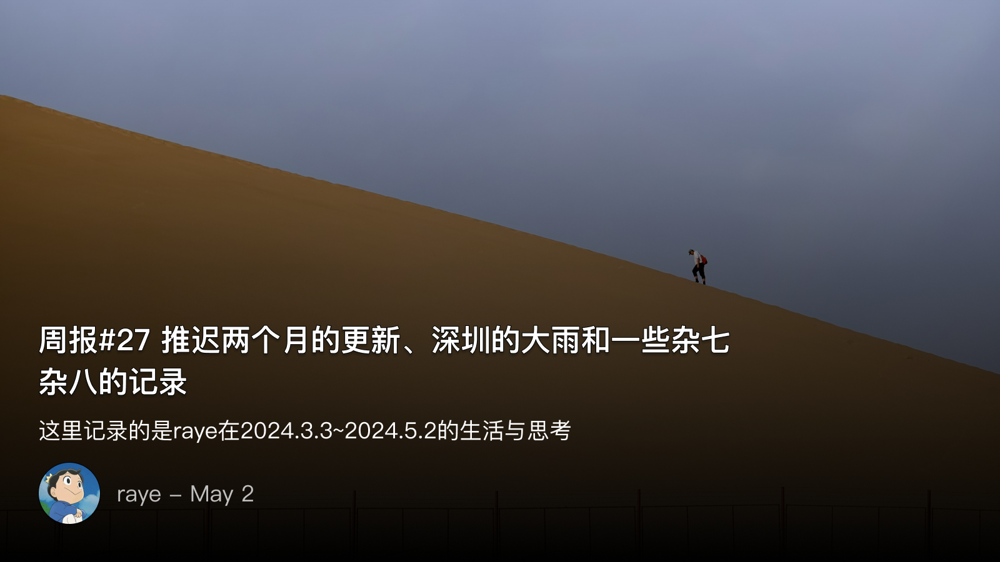

 周报27 推迟两个月的更新、深圳的大雨和一些杂七杂八的记录

<!--  -->

这是一篇迟到了两个月的更新

写作最适合独处，独处时最适合写作，由此，写作频率的减少，反推处我的独处时间在大量减少

因此我从没想到，去年一次偶然的决定去参加读书会，让我收获了这么多朋友

我们可以在美好的4月天，于深圳湾处，寻个阴凉的草地，争论《大国大城》的观点，从下午吵到晚上，再连续微信群里吵一周
我们也可以在深夜狼人杀，猎人被刀开枪女巫好人阵营直接崩盘
也可以在公司一间宽敞的会议室里，邀请喜欢阅读的朋友们，就一本书分享各自的观点

这是我此前从未经历过的，以致于没有时间写一点伤感的文字来假装矫情一下了 /doge 

后续的更新会慢慢补上的，慢慢来吧~

 关于探讨《大国大城》

一场关于自由主义和保守主义的对立，作为正方的我和老李，赞同书中陆铭的观点，人口就需要自由流动起来，建设用地指标也可以流动起来，大城市不再需要顾虑耕地红线指标

作为反方的haofeng和友人，则强烈反对，认为这势必会导致弱势群体进一步被剥削，国家的稳定性得不到保障

我本来也想参与讨论的，但奈何“吵”起来的时候，大家基本各说各话，很难达到统一的观点哈哈哈哈。但这场讨论是我见过最激烈最好玩的了，我们从下午草地上吵到晚上吃饭的时候，回家后又在微信群里吵，后面工作的一周也一直在吵哈哈哈哈

记录一下：

—— from haofeng
= =。几个问题：
一、财政拨款的问题。要搞的话财政支出的哪一块进行拨款支出；
1.1非财政拨款，债务形式实现。由政府发债，银行进行借贷解决的话。参照地产模式，仍旧是银行作为贷款方，企业/政府发行债券，拿到钱后进行补偿；08--13年期间确实有此空间，相当于挤占了政府那会的卖地收入，减少了基础设施建设，变相补贴给进城居民；
1.2非财政、非债务，由央行直接印钞的话，那就会造成短期的通胀，而后经贷款、生产的供应链条，长时间后造成商品的通缩和企业的大规模呆坏账；其次仍有名额先后的问题；
1.3挤占现有财政资源。那对应领财政支出的项目就要减少。
如果要搞，当下合理的应该是资产税——遗产税、地产税、离境税等税种进行收取，然后就新增地税源进行再分配、补偿。

但不论咋说，真正的问题是城乡不均等发展的问题。城乡不均等的局面，一方面是商品经济循环发展中的必然，另一方面却是现代生产分工模式下的必然。前者是资本利润增值为驱动，信贷增生的循环问题——不可能大规模全国一致化；后者则是人的发展和受教育问题，而这却是当下全世界的难题——穷却不思变的家风和宣传问题和阶级分化后的中产阶级对于阶级传承的问题——中国起码有高考的平均线；哪怕以不计后果的形式给了他们补偿，大量货币的凭空投放，市场生产、外汇、投资市场、养老和医疗资源的再分配会产生新的波动；而大量的货币投放，在一次（工资）、二次（税）、三次（养老社保）分配机制极其不完善的当下，我想最终也势必会造就新的财富分配平衡（罗马和牛马问题，基尼系数再次增大），新的阶级剥削罢了。

从政策制定者来说，不确定性太大了，稳定＞发展——现在连每年应届毕业生的1000万就业都困难，国际环境波诡云谲，资产税都不敢提的当下，我觉得这类变革风险极大，要搞、要论可以，当我们人民币真正的东亚化，能收铸币税，当我们的资产税能收起来再说这个也不迟

二则是执行的问题。不展开了，古往今来，好的政策，而执行的乱七八糟的多了去了。当年的4万亿初衷一定是好，最后怎么搞成影子银行，这些故事的映射到最后，都是人的问题——作为父母官，你怎么能干这事？？
也因此，为啥我对人性是持悲观态度的——鲁迅说的对啊：我翻开历史一查，这历史没有年代，歪歪斜斜的每页上都写着“仁义道德”几个字。我横竖睡不着，仔细看了半夜，才从字缝里看出字来，满本都写着两个字是“吃人”！

—— from 老李的观点

首先第一点，土地资源是优质资产，财政拨款不是问题，烂债都有一堆人投，烂项目也能骗到政府，这种优质项目害怕没人投？所以你提的问题根本不存在。
我之所以反复列举出虎门大桥的案例就是如此，优质项目不怕没钱。怕就怕钱都去了垃圾项目。

第二点，发展》》》稳定，中国社会这20几年的发展极端迅速，除开文化与政策跟不上以外，快速的发展掩盖了大量问题。现在是一个问题集中爆发时期，所以感觉会相对困难。
空谈稳定是没有意义的，这个社会已经不是农业时代了，所有问题都只能在发展中解决，停滞等同于后退。
所谓的维持稳定，不过是不去解决现有问题的一种托辞，一种懒政。只是无视问题，那么矛盾积累到一定程度只会引来更大的爆发。具体可以参考90年代国企大破产，2022年12月的风波。

执行与决策，最重要是决策要有科学性，要充分民主讨论，科学决策。而不是一拍脑袋，或者领导者只关注自身的一种晋升。
缺乏民主监管的决策，是危险的，这才是“本意是好的”所讽刺的情况。

再次 from haofeng

只能说太理想了。

第一点，补补财政和财经类的书籍科目。我说的是宏观大循环，你说的是商品销售和资金归拢，不是一个事。首先不是每个都是虎门大桥，能长期，稳定盈利；其次，用地目的的好坏评价标准和评价方，太专了且太归拢了，很难做到民主监督和科学评价（类似于当下某校的学阀）；再尔，在24年的当下，好的项目（盈利且有产出）在当下不会被卡，作者写书的时候（13年）可能有项目因此无法及时上，现在不同。相当于无视很多问题强推，同时也没法解析通胀和随之而来的坏账问题。

至于监管，监督，那是官僚资本主义的问题。苏联就是这么凉了的。教员对此深恶痛绝。抗日，统一战争，越战，三大改造，一次二次五年计划，都是和苏联紧密合作的，他也看到苏联的官僚化和思想的异化，也看到了国内的阶级化，他也因此更悲观了，这是为啥，他主导搞了那10年了——把造反有理，民主监督，和农民的不易深深地传递下去罢了

真正的民主，法治大家都希望，可如何去做？文革从结果来说，有利有弊，可随着改开和国际的深化，大家都在追名逐利和拜物主义化了。

而参政议政又涉及专业认知，意识形态斗争和个人的意愿等其他问题。

起码目前的文明进程吧，没有先例

先记录如下吧，很多事情也不是一下就能分清对错的🤣

 狼人杀的一些总结

从大学开始入门，到现在狼人杀至少也玩过几十次了吧。虽然有那么多人吐槽这游戏的不好，但不管怎样，这依旧是最适合多人聚会的游戏

最近和书友们玩的有点多（对，我们就是打着读书的幌子来聚会而已），总结下来几条新的经验
1. 狼人杀无非是个站边拉票的游戏，一定要站边，不管站对站错
其实作为一个非预言家的神，很容易陷入自我纠结中，在平民无脑站队的时候，总是会去怀疑是不是焊跳狼，但很多时候真的没必要想太多，想太多反而容易暴露自己，所以有时候无脑站队就完了，输了怪预言家
2. 预言家一定要很勇敢地跳出来，及时表明自己的身份
这应该是最简单的道理了，但很多新手玩的时候却不敢跳。duck不必，直接跳，反正预言家也就两轮，两轮后必死hhh
3. 女巫第一晚救不救很难说，但如果被刀了就不要说自己是女巫了
嗯，算是一个坑吧，因为很容易让屠边局的好人输掉

 桌游

深圳连续几天都是大雨，连周末也不放过。周日那晚和cloris一起去玩了桌游，第一次接触到了那么多种类的桌游，不再局限于三国杀了😄。印象比较深的两人桌游中，昆虫棋是我比较喜欢的类型了，六边形的棋子，每一个棋子都有不同的功能，最终的目标是围住对面的蜂后，设计思路让我击节赞叹，但实际上手玩起来后发现，其中的复杂程度着实让我头晕了，但对于刚接触这个游戏的两人来说，先手优势是很大的，所以我两把都输了🐶

相较而言，多人桌游的设计似乎有点套路公式化了，且基本都依赖相当多的道具，这一点是让我觉得玩桌游比较麻烦的，因此自己也不会去买，想玩的时候去桌游店体验就好了。我们与另外两位玩家拼桌打了两把《花砖》，设计思路和《璀璨宝石》相差不多，都是属于拿砖/宝石，组合策略，或者卡住对手，来计算分数的游戏

在桌游店的另一个好处就是可以切换玩多种类型的桌游，没想到我们最后沉迷的竟然是《达芬奇密码》哈哈哈，这款猜对方数字的游戏无论是策略性还是趣味性都算是拉满了。最搞笑的是，我的每一句话都容易被对手利用，从而给出一些排除的信息，以致于我最后都不敢说话了，两人默不作声，抓牌，看牌，再对视思考，一直玩到凌晨三点左右🤣

 游戏

作为曾今的DM遗老，当然我也看完了5ds，对于游戏王一直都保有情怀，也曾玩过duel links，但沙雕游戏又肝又氪后面弃坑去玩了一段时间《万智牌》。相较而言，万智牌的设计其实更加科学，玩法也拓宽了，轮抓的经济性更是让我研究了好久，但奈何感受不到作为一名旅法师的荣耀，于是也渐渐退坑

后来k社发布了最新的游戏王master duel，最开始也顶着英文的压力沉迷了几个月，不过后来因为种种原因还是退坑了。但最近想打牌的心情又压抑不住了，于是回坑了master duel，刚巧这游戏不久前也发布了中文版本，于是直接买初始号组卡。不得不说master duel初始号转生的方式很是值得，分解合卡的机制值得给k社安排一个🐴

先后玩了白银城、蛇眼、转生炎兽、珠泪等卡组，作为一个只会背公式的玩家，基本是照抄b站大佬们的攻略。这游戏能经历这么多年的演化，从仪式召唤，上级召唤，融合召唤，同调召唤，超量召唤，灵摆召唤到链接召唤，游戏王设计师们的脑洞确实足够大，设计思路也是一脉相承，不像隔壁三国杀，某东吴命运线的设计那都不是开脑洞了，属于是开天眼了

最近也看到B站一个up分析游戏王召唤方式的演化思路，结合他的分析我也简单列下我的思考。同调召唤其实是为了弥补仪式召唤的弱点，这两种方式都是算卡片等级的加法，但仪式召唤，不仅占用主卡位，而且必须上手仪式魔法卡，使得这一召唤方式让玩家挫败感很强，毕竟不是谁都有主角那样与卡组的羁绊。于是设计师的思路就将其挪到额外卡组，并且不再需要魔法卡的辅助，再结合小怪兽们多次特招，来弥补一回合一次的通召限制。不得不说，结合5ds，蟹哥的主角人设，就是联合弱小的力量，聚集的祈愿将会化为光芒闪耀的道路！

但同调怪兽的效果又过于超模，此时设计师们自然就像去限制卡牌的效果发动次数，此时XYZ召唤，即超量召唤就诞生了，两卡叠放，发动效果拔除素材，XYZ召唤正如其名，让二维的卡牌又多了新的维度。并且正如同调召唤后续演化出了加速同调，超量召唤，也增加了升阶、多次叠放，让可玩性进一步上升。

灵摆召唤则又是一次新的突破，这个玩法设计的很好，但很难设计出强度和可玩性都达标的卡片。链接召唤最开始出现是为了做减法，但后续规则的变更，又让链接怪兽成为了新的泛用卡，毕竟相比同调的凑星星，链接召唤的限制更少。

