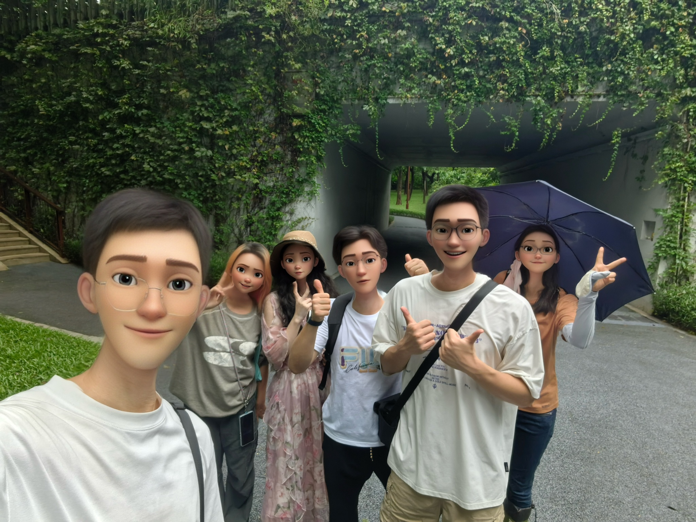
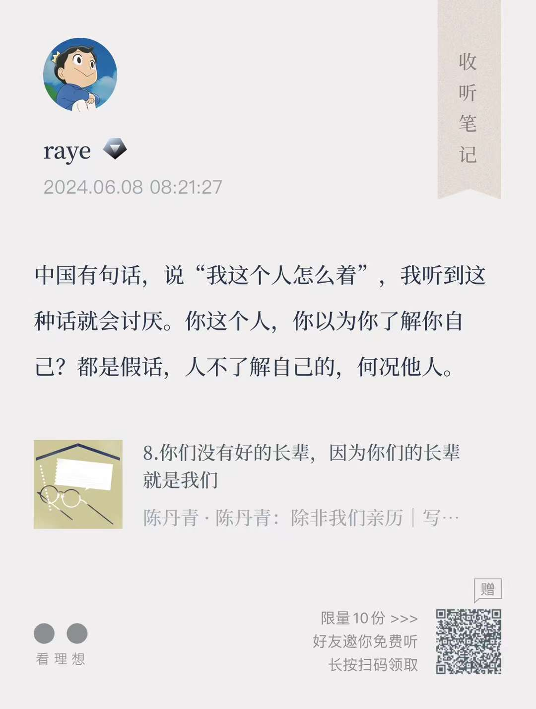
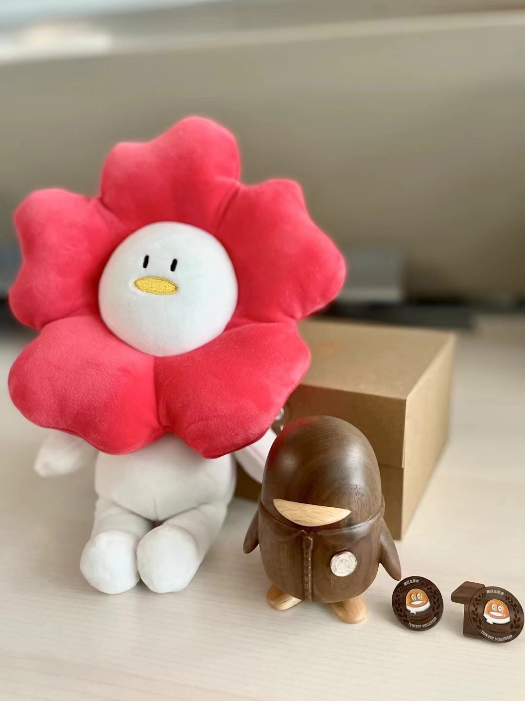
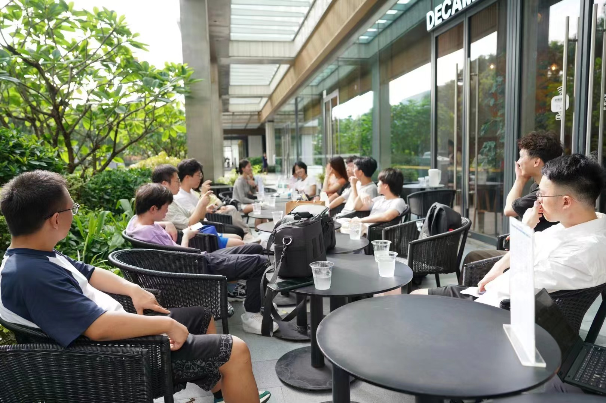

 周报29 人有悲欢离合

<!--  -->

我似乎总是喜欢在一个人的旅途中写作的，就连这一段开头也是在晃荡的公交车上用手机写下的。

狂放不羁的刘伶曾说过，“行无辙迹，居无室庐，幕天席地，纵意所如”，以地为席，以天为盖，这得有多浩大的想象力，才会把天地都当做自己的陪衬。

所谓“躲进小楼成一统，管它春夏与秋冬”，于我而言总是觉得不太合时宜，反倒是在摇摇晃晃的地铁公交上、在人流熙熙攘攘的公园草地旁，才能激发出我最恣意的灵感，写下一些不足道哉的文字。

距离上一次提笔，已经过去了两个多月，这段停更期中，若非让我找一个理由出来，我只觉得时间不够，太多需要我去做的事情了，也可能是沉不下心来，将一些零零碎碎的flomo，整理出一篇长文。

过度的沉迷于文字于书写中，在我看来也并不太好，人是要有具体的生活的，出门、下楼，丢垃圾，看见花花草草，遇见三两好友，沐乎沂，风乎舞雩，咏而归，否则人是会坏掉的。

但飘荡久了，总要有一些根脚可以落下来，这也是让我觉得有一种紧迫感，是时候了，需要写一点文字来沉淀下生活，如果要我用一句话来概括最近这两个月发生的事情，那苏子的“人有悲欢离合”，怕是再贴切不过了。

是为本周报序（喂你这都不算周报了吧/doge）

 离

> 那些聊天和对话都被封存在记忆中，也许在未来某个瞬间就会不经意想起，那些深入灵魂的碰撞以及鼓励和关怀，在我胡乱对这个世界进行猜想时总有领路者告诉我，“是的，你的猜想没错”。

—— 摘录自cloris的离职贴中我最喜欢的一句话

第一次认识cloris，是在一次烧脑的剧本杀，参见[周报14 台风天，剧本杀与彩虹](https://rayepeng.net/weekpost14)，许是一种巧合+缘分，那时我刚认识文杰不久，被他临时拉过去打《死者在幻夜中醒来》，当时还没意识到这个本有多么恐怖，直到体验了将近6、7个小时的烧脑推理之后，CPU已经宕机了，不过这是后话。

刚被拉进群就看到了和我头像一模一样，对都是《国王排名》的波吉王子，DM还在群里Q我们说分不清哈哈哈，当然这俩头像日后还将被朋友们调侃无数次，这也是后话不提。

同样喜欢追动漫，看书，参加读书会，一次偶然的契机，发现同样都喜欢玩独立游戏~！那次在食堂吃饭，我俩聊了好久的独立游戏，《cocoon》《杀戮尖塔》《grils》《巴别塔圣歌》《邪恶冥刻》《饥荒》《缺氧》。

我从来没有找到过一个同样这么喜欢独立游戏的人，一时引为知己。

除此之外，她身上的标签还有很多：

喜欢参加公益、喜欢探索未知、热爱数学、桌游、喜欢玩独立游戏、并梦想成为独立游戏制作人、喜欢阅读、喜欢探讨历史、思考未来、科技的发展。

这个世界很大，到处是未知之境，她好像那个捡贝壳的小女孩，会仔细挑选，收集想要的贝壳，观察其纹理，思考其形成，并梦想着有朝一日制作出一个完美无瑕的贝壳。

上周四看到她的离职帖，内心中多少有些遗憾，细数下来，虽认识不到一年，但却觉早已熟识。曾经多少次我也会想，如果那一天真的到来，我会怎么去书写我的离职帖呢，我想感谢好多的人，人从来都不是孤立的，是社会关系的总和。

而她也如此做了，看着那么多名字，其中有一些是共同的朋友，更多的还是她来到深圳后所结识的伙伴。人是要花很长世界才能学会感恩的，万事万物的颜色，朋友们的热情，无一不是豪华的天宠。

祝好~！

<!--  -->

 合

连续两个月，读书会基本做到了每个周末都有一次，好多公司内外的书友们积极报名分享，甚至一度让我觉节奏太快了，看书跟不上。

从北魏的兰陵长公主之死去探索古代女性的法律地位《公主之死》；

追随钱老的脚步，思考汉唐宋明清各朝代的政治制度得失《中国历代政治得失》；

7位朝圣者，一起前往海伯利安星球，讲述自己与伯劳的故事，解开背后的真相《海伯利安》；

从童年动漫神作EVA聊起，思考存在主义的本质，讨论人类是否应该补完《EVA与存在主义》；

还有诸如详细讲解游戏策划的工作《游戏造梦师》、哈佛公正课《正义》与《技术陷阱》；

虽然不是每期都去参加了，但是基本感兴趣有时间都会去，但随着参加的次数变多，我内心也逐渐有了一些困惑，报名分享的人多固然好，但有时候形式胜过了质量，单位时间的收益反倒降低了

曾经我是很喜欢读书会的氛围的，每次参加完之后，总给我一种宿醉感，这种感觉，并不是酒精等外物刺激带来的，那种外物的冲击属于有点难受，这是一种精神上的宿醉感。

它在我的脑海中不断回荡，让我仔细咂摸，品味，感受到和他人思想碰撞带来的灵感。

更重要的是，读书会更多的是反映一个人怎么去看书，怎么去讲书，如果纯粹是书中的内容堆砌，那换一个人来讲效果其实没什么两样。

上上周（也不记得具体是哪天了毕竟停太久了），参加了一场分享《尤利西斯》的读书分享会。本来我对于这本书的期待是挺高的，敢于分享意识流作品的人毕竟很少，这本书的作者又是可以和伍尔夫齐名的意识流派作家。

只是可惜，分享人似乎全然没有讲述自己读这本书的体验，而只是把这本书的相关内容介绍了一遍，让我多少有点大失所望。

事后与其沟通，他给出的理由居然冠冕堂皇，说“我读这这本书的体验是我非常私密的，我讲不出来，也不知道怎么讲”，那我还来听你讲个锤子tmd /doge。

也许并不是每一场读书会都值得参与，并不是每一本书都有其分享的价值，专注于自身的读书体验才是最好的。

 欢

7月3日，入职三周年了，我写下了这段话

今天才意识到已经在我司待满了三年。

喜欢陈丹青说过的一句「你这个人，你以为你了解自己？」没有这些外物的提醒，你根本意识不到的，原来时间真的可以过这么快，前一秒仿佛还在做自我介绍，后一秒已经开始要准备汇报材料了。

如果算上实习的时间，我来到深圳已经四年了，20年4月刚结束在克拉玛依的行程，5月便独自一人南下深圳，至今还记得那天的太阳真tm热，以至于后来读到《长安的荔枝》中写到李德善第一次来到广州，「浑身冒汗，如蚂蚁附体一般」，简直不要太真实。

幸好这三年来，除去专注于本职工作之外，那些闲暇的独属于我的时光，总算是做了一点事情：上了三次乐问的头条，用心写的回答能帮助到很多人，希望今年能冲个千赞；坚持了一年的蓝信封活动，写了11封信，和远方的留守儿童互相倾诉，也收到了公益活动的纪念礼品；喜欢上了打羽毛球，打断了好多根65的线；去年重新开始写博客了，累积了50多篇文章；前年微信读书时长已经破1000，希望今年能破2000；认识了一大群喜欢读书的书友们，做过了三次读书分享，之后还想分享《理想国》；喜欢上了摄影，开始留心身边的一草一木；以及还有很多想做的事情……

最后，以我的博客签名做结吧 ，「且趁身闲未老，尽放我、些子疏狂」

<!--  -->

<!--  -->

<!--  -->

 悲

随着认识的朋友越来越多，不可避免的，虽然我认识的很多很多人，都非常友好，但总有那么几颗老鼠屎，玷污了生活这碗汤，每每这个时候，我就想到在《抬头看二十九次月亮》中的一段话

> 我们真的不需要那么多朋友，有些人光是遇见就已经很折寿了

<!--  -->

<!--  -->

其次就是微信群聊吹水聊天的时间挤占太多了，随着参加活动越来越多，认识的人也越来越多，加上enfj的个性使然，越来越喜欢和人争论，本来在读书会里，我觉得争论是一种很自然的事情，也并非网上的杠精，大家都是理性的表达自己的一些思考，所以很喜欢这种氛围

但不可避免的，就有各种引战、男女对立、最让我讨厌的还是动不动就喜欢嘲讽国内男性，说什么和国外的客户谈合作人家都是从健身房过来的诸如此类国外的月亮更圆的说法，着实让人觉得有些无语凝噎。

毕竟总有那么一群人在追求者所谓的认知觉醒，张口闭口奇门遁甲，推背图，河图洛书诸如此类，看了两三篇营销号文章，对于《道德经》还一知半解，看一本书连最基础的概念都弄不清楚，还要上纲上线，无限放大，对于这些人，我还是选择回避吧。

另外附上一些思考同时还有怼人的flomo记录

 怼“所谓写日常生活不好看”的说法

不知道为什么，最近开始沉迷于在微信群和各路人争论观点，这其中自然有我觉得有问题的，比如所谓文似看山不喜平，某人说你看红楼梦写日常生活，你看的下去吗，甚至还有应着，连声点头称是

于是我就看不下去了，《我的母亲做保洁》《我在北京送快递》这类记录日常点滴的书籍，难道也看不下去吗，对于我们来说这些日常也很平凡，但就是给我们一种不一样的体验，让我们知道原来在所谓苟且的生活中，也有人在努力生活着，人生也不是荒谬的诸如此类

所以我是一直反对一杆子打死某个事情的，这样对于思考来说当然很简单，很偷懒，也很省事，但我还是要说，分类讨论是必须得，在数学上，你只有不断的分类，不断地排除，正如福尔摩斯所说，当你把一切不可能都排除掉，剩下的不管多么荒唐才是真正的结论，但关键是你要去穷尽所有的可能性，而不是一味地，啊非A即B，非黑即白，非死即生，人哪有那么简单，用一句话就能简单概括

 思考“电子书是否会成为主流”

必须得系统总结一下我认为电子书为什么会是主流，摸鱼打字中

书的作用是什么，书是人类文明进步的阶梯，历史上西方文艺复兴时期的兴盛，很大一部分原因是古登堡印刷机大大促进了知识的传播，打破了教会对于知识的垄断，从这一点上来说，纸质书的诞生和快速传播有其必然性和历史使命

但正如马克思所说的当生产力的发展达到了现有生产关系无法适应的程度时，生产关系就会成为生产力进一步发展的障碍。纸质书作为传递人类文明的载体，也遵循着类似的规律，在极大促进人类文明传播的过程中，人类文明本身也在不断地沉淀，肉眼可见的纸质书从几页的小册子逐步发展为越来越厚的大部头，此时纸质书的形式已经明显无法承载人类文明成果了，更遑论其查询、印刷、仓储、传播等成本

其余所谓纸质书更有感觉，阅读更快，个人偏好等等，均属于小众群体的爱好罢了（我且不追究喜欢纸质书的人究竟是不是叶公好龙吧/手动狗头），毕竟21世纪还有人坚持信仰君主，但这终究无法阻碍民主成为主流，电子书完全取代纸质书也终究只是时间问题罢了

 怼“所谓某人觉得的23年最佳书籍《信号与噪声》”

《信号与噪声》第一眼看这本书其实我是不太感冒的，因为看到这种书，尤其是外国作者，再加上xx时报推荐，什么必读、什么榜单的，属于是buff叠满了，但在我看来每一条都可以是我不读的理由

但我还是耐下性子，毕竟没有读过就没有评价的权利，先花了两个小时左右快速翻了一下，不得不说作者的语言是真的很啰嗦，很多观点在我看来也就是浅尝辄止，如要不断收集信息，如预测和预言的区别，如模型过拟合等等

对于没有接触过这些理论的人来说，或许确实值得一读吧，但在我看来有更好的这类科普书可以作为替代

说了这么多诋毁这本书的话，但我还是想推荐一下，因为我在快速读完之后也忍不住去回味下其中的内容，特别是关于德州的打法，作者写的还是很有意思的（笑）

信号是什么，噪声是什么，作者并没有一开始给出完整的定义，害的我找了半天，终于找到了他埋藏的隐秘，“信号是统计或预测问题背后真相的表征”

这个定义我是接受的，因为它让我想起了本征向量（也叫特征向量），这个在数据统计中是有可以被拟合出来的，而噪声，作者称为“容易被误认作信号的随机模型“，这一点我觉得也没多大问题，如果了解过定性与半定量物理学分析，就能知道物理学家门有时候宁愿牺牲准确性，也要去找到一条能够满足特征的拟合曲线了

如果作者直接把这俩定义摆出来，并着重去叙述，我个人认为这本书的评分还可以再上升一点。

最后，这本书的作者强调了一点“本书是关于预测的，而不是关于如何预测的”，作者所能提供的就是从各种已经发生或者可能将要发生的事情中，去梳理辨别信号、噪声（好吧其实他连这一点做的也不够好），因此，这本书更多的是需要你自己来思考了，作者基本没给你什么帮助，最多是给了你一些可供思考的案例

 怼“有人觉得三毛关于读书一句话是扯淡”

“读书多了，容颜自然改变。许多时候，自己可能以为许多看过的书籍都成过眼烟云，不复记忆，其实他们仍是潜在的。在气质里，在谈吐上，在胸襟的无涯。当然，也能显露在生活和文字中。”

说实话我一直都很喜欢三毛的这句话，但是上次群里有人数这是扯淡，还说你在大学不喜欢的专业学了就是白学

我很反对这种光靠吐槽情绪的说法，

我记起来，我接触的第一本书是一套连环画，但那其中的内容我早已忘却，你说有什么意义吗？确实没有，但我没看那套书，会和现在的我有些许不同吗？我也不知道。但是我愿意相信这是有不同的，可能这就是一个意义吧

意义到底在哪里？意义只存在于那一瞬间，那一瞬间你看到了，但是他就过去了

 怼“所谓康有为的评价”

动不动就有人卖弄，说什么看历史人物，只盯着裤裆里那点事看，不看他xxxxx之类的句式，都可以成为模版套用了

我对康有为的评价：

1. 那个短视频的观点片面，这个没毛病，刻意只提那点事

2. 涉及到实际对康有为的评价，这个很复杂，评价角度是多方面的（思想/学术/政治/阶级/实际行动/不同年龄阶段的主张等等），从马克思唯物主义史观的角度，他早期的一系列主张如变法思想、发展实业、君主立宪等在当时都属于有进步意义的，但人总会受限于自己的阶级，通俗来说就是屁股决定脑袋，他骨子里代表的还是士大夫地主阶层，保皇派，因此他之后的种种举动，如密谋刺杀孙文，鼓吹复辟等等，属于是开倒车了，被时人骂为封建余孽，生活作风问题被指责也就不足为奇了。

3. 最后，至少从我个人最朴素的角度来说，我不否定他的功绩，但我对这人没啥好感（

 怼“所谓马克思唯物史观就是循环论证”

这个我真的服了，所谓群里某个“田老师”，就只会质疑无限杠，那你倒是说说自己觉得哪里不对啊

关于驳斥马克思唯物主义史观是「循环论证」

首先你要区分下什么是循环论证，循环论证举例比如“我说话是真的，因为我很诚实”，“因为很诚实，所以我说话很真”，循环论证的本质是没有加入独立的论据来辅助，而唯物史观显然不是循环论证这么简单。

然后再来看你说的，

1. 「他怎么就代表大地主的利益了」，他当然代表大地主的利益，这是从他的言行举止，他当时的主张等一系列论据推导出来的，这是和当时的革命党人有本质区别的，所谓「大地主」这个名字只不过是用来区分一下，但归根结底你不能否认他的阶级和他代表的利益群体就是有局限性的，是和另外的群体不同的。

2. 「怎么就是历史倒车了」，可能是我没表述清楚，在辛亥革命成功后，民主已经是当时社会主流共识，复辟已经是不可能的，但他依然鼓吹复辟，谋害革命党人，这是和当时主流思潮相违背的，这你总不能否认吧，这难道还不够说明是开历史倒车吗（不需要关注复辟的结果，因为复辟肯定失败）。就好比你现在想回到封建君主制，那你显然就是在开历史倒车，并不需要过个十几年等结果出来才能说明这点。

3. 「具体分析君主立宪和保皇，为什么中国不行」，那这又是另一个话题了，得放到辛亥革命之前来讨论，在晚晴大变局的时代，每一种思想都是有其价值的，这我也不否认，此时他的主张用马克思唯物主义史观来看也是值得肯定的，至于为啥中国不行，那只能说是晚清自己作死了。

 思考“悲剧和喜剧谁更伟大”

悲喜剧的谁更胜一筹早已有论断，我也驳不倒这个，但我不喜欢人云亦云，几乎所有人都承认喜剧的内核都是悲剧，也承认悲剧才是最伟大的，否则为何茨威格偏偏要为斯科特队写下《伟大的悲剧》呢？能举出的例子实在是太多了

但我还是要想，虽然悲剧的如此伟大，但我想创作者的本意并不是非要为了写悲剧而写悲剧，开头一定是以喜剧的方式呈现，再毁灭之，再以喜剧方式呈现，再毁灭之，如此循环。可反过来，为什么不能是先以悲剧的方式呈现，再以喜剧的灵魂拯救之呢？只能说是人的底色是悲伤的，人不愿意去相信有美好的结局。不然为何孔子老是要说，「道不行，乘桴浮于海」。可他真的做了吗，不见得，「滔滔者天下皆是也，而谁以易之」，坏人坏事就像洪水一样，谁又能改变呢？这足够悲剧了吧，足够让人痛心了吧。但孔子还是要说「天下有道，丘不与易也」，这位「晃晃如丧家之犬」的老头子，依然演绎着乱世中独属于他的一场喜剧。

最伟大的喜剧，首推卓别林的《摩登时代》吧，当然可以说这喜剧的内核也还是反映了资本主义时代下的工人的悲剧，但在这部伟大的作品中，依然能让观众在经济萧条的黑暗中，恢复对生活的信心， 卓别林在夸张和荒诞中演绎真实，在嘲弄与逗乐中带给人希望和力量。

就连我在开头中写到的茨威格，他记述斯科特冲击南极点失败的悲剧，难道其目的就是让后人再不去探寻地球冰川的奥秘了吗？不见得吧，这个伟大的悲剧，不断激励着一群人，他们想穿越浩瀚无垠的雪原，想见识极地独一份的极昼和极夜，想让自己国家的国旗永远矗立在南极点之上，从来没有人会因为悲剧而停下自己的脚步。

悲喜剧的论断我终究无力反驳，但我想这两者本就是密不可分的，「我将让它成为融合物：就让我们叫它悲喜剧吧。我不认为一贯称呼一部既有国王又有神明的剧为戏剧是恰当的。你怎么想？既然这剧里也有奴隶，我就称它为悲喜剧好了」

 一些随笔记录

关闭了哗哗响的水龙头，再将刷子，洗干净的抹布晾在一边，擦干净湿漉漉的手掌，然后抹去眼角的一滴汗，我坐下来，拿起手机记录这一次清洁中的想法。

我的睡眠不算太好，偶发性失眠，生物钟很固定，午睡起来之后，有一种怅然若失的感觉，半掩的窗帘一角，透出一道光线，此时才发现外面的天气甚是晴好，似乎是仗了好风好日的胆子，我开始了这次的大扫除。

曾经是每个周末都会做一些简单的清洁，六祖慧能所写的「本来无一物，何处惹尘埃」境界我是无法达到的，书桌上，《南北归一》《女性是一束光》《世界上为什么要有图书馆》这几本书还未完全看完，装在包里的相机，xbox游戏里，显示器，还有真吃灰许久的switch，每一件都是我曾心仪的事物，想起曾经收到它们，都装在崭新发亮的盒子里，带给我或是欢乐或是思考或是趣味，难以想象我的生活离开了它们会如何，也许神秀所写的「时时勤拂拭，勿使惹尘埃」才是我们生活的最真实写照。

擦瓷砖的时候，恍惚间才意识到，原来瓷砖的颜色本就是那么洁白无瑕，只因沾染了旧物，失去了其原本颜色，那些未见过原先洁白颜色的，竟以为现在的颜色才是正常的。眼睛里染上了蒙尘，自然看什么都带点滤镜。我奋力洗去最犄角旮旯的污垢，开始痛骂自己为什么每天都视若无睹，好在我也不在乎时间，不在乎用了多少水，完成我想要的工作就好，独处的意义就体现出来了，无需有太多顾虑，紧赶慢赶，做到一半半途而废也不是不行，想到这，压力顿绝轻松许多。

曾经看到 one・一个 app 上的一篇文章，摘录了一句如下：

「我也只有这么些本事，收拾屋子，读几本书，再写下一些不重要的文字，日子天天过，在自己眼前这片小天地里怡然自得，我花光了所有力气」

花光所有力气倒不至于，但做点事情总是很开心的，且乐生前一杯酒，喝了，乐了，再说！

