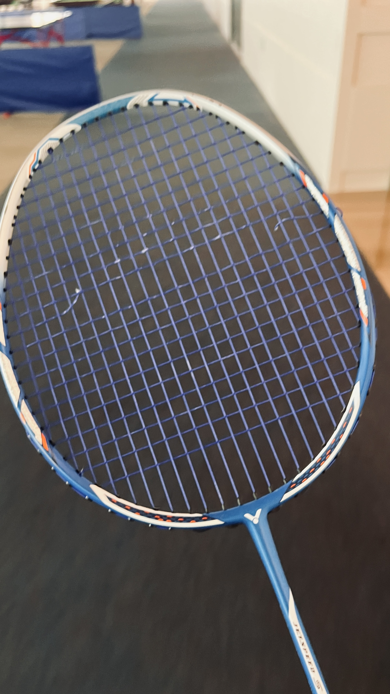
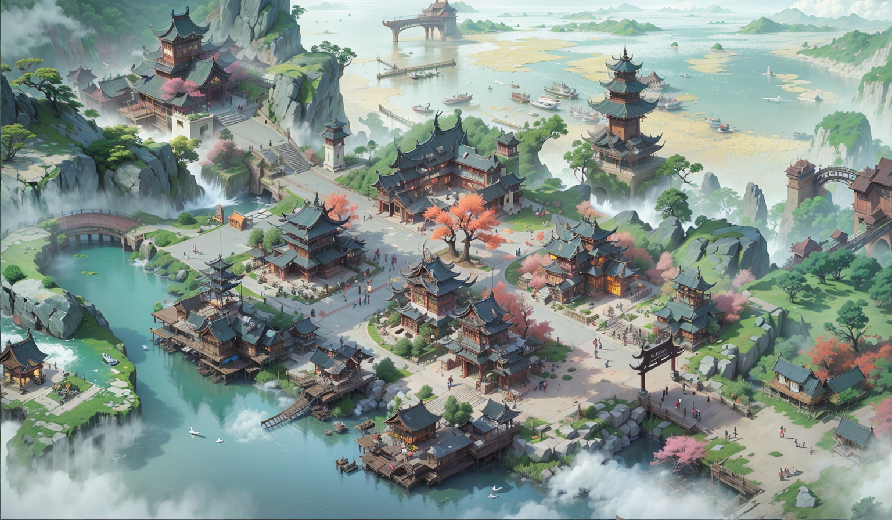

 周报3 羽毛球、开源、阅读、游戏

这里记录的是raye在2023年，4.14~4.20这段时间的经历与故事。

<!--  -->

封面图是AI画的

因为会经常假装性忘记自己要坚持写周记的事情，劳形于工作之中，也习惯了去找很多的借口来逃避。但不管这些理由是多么冠冕堂皇，我总还是愿意去记录一些。也许是看到xlog上有越来越多的人关注自己会觉得很开心，抑或品读到一段优美的文字会忍不住想要去记录下来，然后希望更多的人能够在忙碌的生活中收获一点点宁静~

 羽毛球

我的拍又双叒叕断线了，回忆起来这次可能还不到一个月，跟球友交流的时候他说自己用的是李宁N61的线+26磅，断线频率大概在两周一次。当他听到我用BG65的线+24磅一个月断一次也是很惊讶哈哈哈哈😂，可能真的是我打的频次太多了吧，拍线承受了太多。

<!--  -->

不过最近一周打球的球感逐渐在上升，主要是指单打，毕竟单打双打是两个游戏。我因为没有上过教练课，野球打的多，很多姿势、技巧都是旁观或者被大佬虐出来的。这样子入门其实很容易导致姿势不对且打出去的球没感觉，不过随着我打的越来越多，我终于体会到，原来击球的时候球拍，球头是要在你的左侧前方的（我是左撇子）。怎么这么简单的知识我才明白！！

自从意识到这一点之后，突然发现我的每个球，只要不是太被动，终于能回到一个比较高远的位置，杀球也变得更有力量了哈哈哈哈，而且随着体力逐渐变好，连续单打也不成问题（旗鼓相当的对手/doge) 

 开源

惭愧，最近一周以来，又没怎么逛GitHub，参与开源工作了。反思了下可能是以下几个原因

1. 前两天睡眠一直不好，导致下班后经常没有精力
2. 太沉迷羽毛球了 /doge   

 阅读

这一周看完了浮生六记 · 闺房记乐，且摘抄出了很多优美的文字，不过我还没来得及去一一品读完，暂且记录在这里：

[浮生六记——闺房记乐 - raye~ (xlog.app)](https://raye.xlog.app/fu-sheng-liu-ji--gui-fang-ji-le) 

 游戏

我的世界：传奇这部我期待很久的作品终于上线了，虽然看评测分数并不算高，但还是抱着想体验的态度去玩了玩，等我细细体验下来写写自己的感受

 AI画图

虽然还一直没有去玩mj，不过看着同事们都在玩这个也是心有点痒痒，除了封面图之外，最近收集了几张我挺喜欢的图~

虽然我不是肥宅，但是古风二次元的图也太好看了吧！

<!--  -->

这张也好美，有一种红杏枝头春意闹的美感

<!--  -->

<!--  -->

这张简直可以直接用作游戏地图了哈哈哈

<!--  -->

