 周报30 ENFJ人格、双月湾拾遗与阅读笔记

<!--  -->

终日昏昏醉梦间，忽闻春尽强登山。
因过竹院逢僧话，偷得浮生半日闲。
—— 李涉 《题鹤林寺僧舍》

好久没有过这么平静的下午了，能够继续翻看没有看完的《香料之路》， 继续switch游戏里的冒险，继续坐在电脑桌前倾听手指敲击茶轴的声响，感受键盘回弹的清脆。

实在是太忙了，但是我竟然不知道在忙什么，是忙着规划日程？忙着在微信群和一群明知没有任何关系的人，争论着一些明知无关紧要的话题，卖弄着一些明知谁也不在乎的故作高深？

恐怕如此吧，我已经有些厌倦了，若说年轻有什么缺点，那就是太过于和别人比较，过于执着说服他人， 尤其是喜欢读书的人恐怕更是如此

我更喜欢跟随作者约翰·凯伊的脚步，探索《香料之路》中敢于舍身冒险的船长脚步，拨开弥漫在大海上的迷雾，我更喜欢跟着斑鸠、黄老板、霉霉的歌声不停抖腿，跺jiojio，感受到纯粹韵律带给我的美好

幸好我意识到了，开始及早脱身出来，享受属于自己的一方小小天地。此间虽如果壳般渺小，却亦足以安居。

（其实还是欠的东西实在是太多了，于是打算继续接着写几篇，后续也会保持一定的更新频率的）

 ENFJ人格

现在确实是越来越流行mbti人格了，所第一次知道这个测试开始，我前后在不同时段做过三次，每次的结果都是ENFJ-A，也就是俗称的“大剑”，而且据说该种人格特征的人非常少，虽然从概率角度上，要四个字母都完全相同本身就比较低，但至少从我身边的样本来看，我所认识的同为ENFJ-A人格的人在5个以下。

前几日跟小狐狸（她也是ENFJ-A）讨论起来，ENFJ的显著特征如下图。几乎其中的每条特征都能精准命中我俩。随便举几条：

1. 比较难维持佛系和摸鱼的状态，虽说大部分人如此，但我是真的觉得自己很难完全去放松下来，那种gap个一两年出去旅游在我看来都是天方夜谭（
2. 认为众生平等，非常反感“人上人”之说。也可能大部分人如此，但我是真的有看到过，都4202年了，依然觉得国外的月亮更圆的人，在微信群里大吵了一番
3. 看起来高冷不太好接近，我上学的时候就一直被吐槽很高冷，但其实熟悉我的人都知道，只要你问我问题我都会倾尽所有去解答，哪怕是暂时想不明白的，也一定会优先想清楚后再告诉对方，甚至有时候连上课都顾不上
4. 兴趣广而不深，只能说别骂了别骂了
以及种种种种，只能说太贴合了。。

<!-- 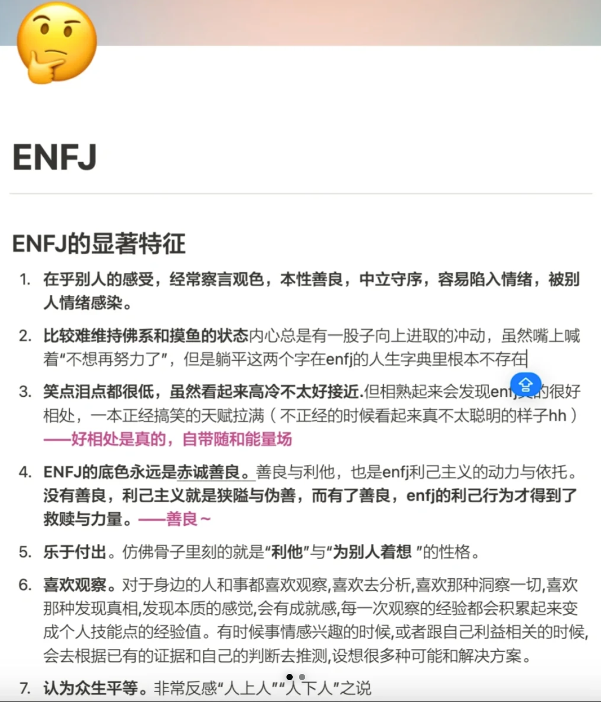 -->

<!-- 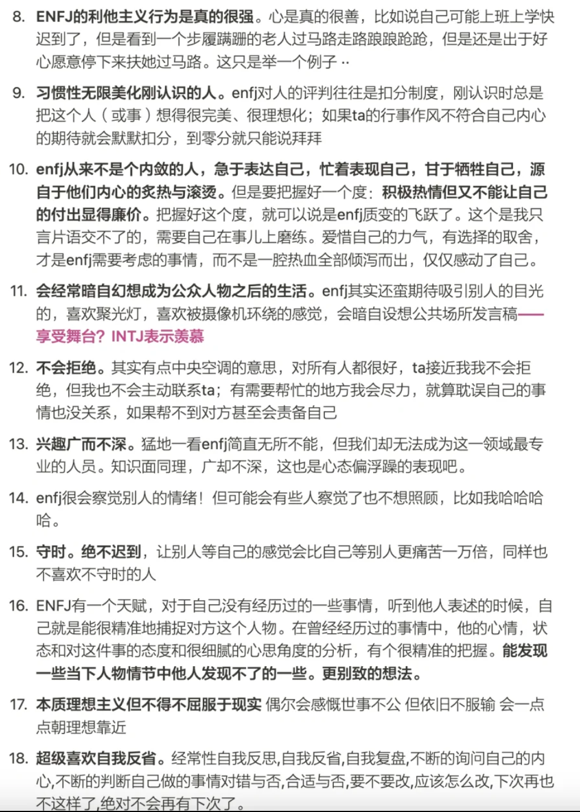 -->

 6.22\~6.23 惠州双月湾拾遗与入手索尼A7C2

惠州本身离深圳就不算远，去程不堵车的话也就两个半小时。巽寮湾，小径湾，双月湾算是惠州最有名的三个景点了，自动来深圳上班之后，团建的扫尾路线多半都是去这几个地方，巽寮湾甚至去过了两次！

一次是中心组织的团建，现在提起来都是满口的怨言，大下午火辣辣的太阳下，我们居然在天台上搞你画我猜等一些老掉牙的团建活动🤣。

另一次则是小组内组织的团建，leader心血来潮要带我们自驾去度假一天，详情参见 [周报21 惠州、新域名与阅读分享](https://rayepeng.net/weekpost21)，也是临时组织起来，差点打乱我原本的计划安排。

曾经某次刷短视频的时候看到过一个吐槽，当你出去团建的时候同事浓度超过90%的时候，这就已经不再是团建而是上班了，我只能说确实如此（所以今年的团建甚至都不太想参与，毕竟也不一定有报销补贴）。但心里还是想着，什么时候能和自己认识的玩得好小伙伴们一起出去玩一次啊！

川哥果然组织起来了，于是毫不犹豫的报名了。原本这次去双月湾的初衷是为了拍日出日落，毕竟6月深圳真的难得天晴一次！于是，五人小队在短时间内很快就成团了，都是通过读书会认识的好朋友们，章鱼，王律，满格，川哥+我，终于能够满足和好朋友们一起出去玩的心愿了！

我曾总是喜欢以不同的视角去观察一个城市，喜欢用脚步去丈量一座城市的长度，感受其中的一花一叶。但却从来没想过真的要入手一个相机，但借着这次去惠州拍照玩耍的契机，在川鸽的强烈安利及详尽的参数对比下，周一当天就下单了索尼A7C2 + 腾龙28-200镜头，一瞬间就入坑了🤣。

惠州的行程倒是没有出现太多意外，但我竟真的没料到，6月22日当晚的晚霞竟会那么好看~！我们抵达民宿休息短时间后（当然我打开电脑开始加班了因为过两天就要给老板汇报），出门就遇上了大雨，等待雨过天晴之后，登上双月湾观景台，方才明白双月湾名字的来源（拍不好直接用小红书的图吧）

<!-- 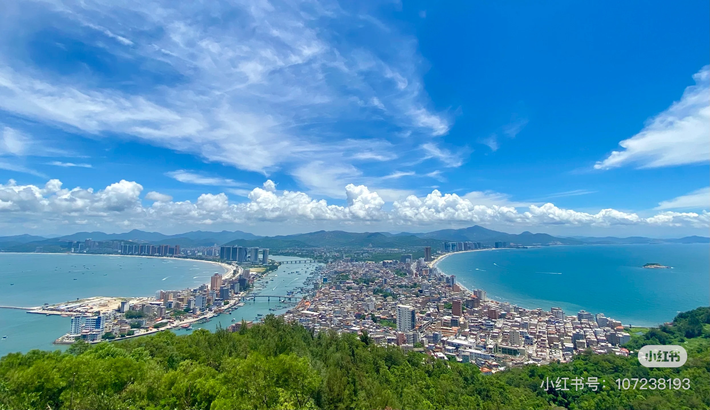 -->

由于刚下过雨，所谓观景台能观的景并不是很美，还贼热。索性直接下山前往情人堤，此时天光稍暗，堤岸边散落着稀稀落落的人，落日竟仿佛如同刚睡醒一样，透过云层懒懒地散出几道光芒，搭配上远处雾霭朦胧下的重叠的山峦，站在沙滩上眺望，会疑心此时的时间是不是错乱了。

放上章鱼模特的原图直出照~！

<!-- 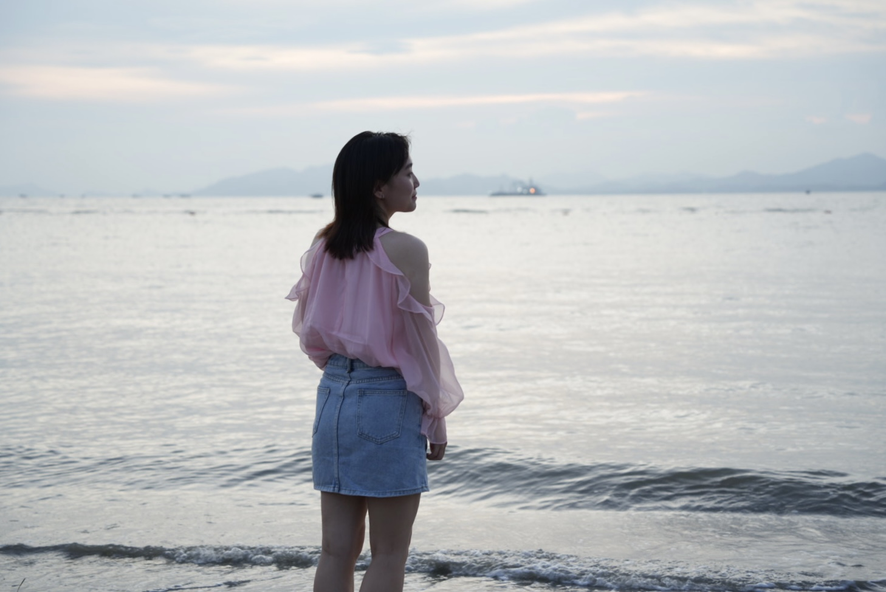 -->

沈复曾在浮生六记中记载：

> "于是相挽登舟，返棹至万年桥下，阳乌犹未落山。舟窗尽落，清风徐来，纨扇罗衫，剖瓜解暑。少焉，霞映桥红，烟笼柳暗，银蟾欲上，渔火满江矣。"

重点是这句： **少焉，霞映桥红，烟笼柳暗**

谁可曾想到，我们马上就见到了**霞映桥红**~！

多说无益，直接放图吧

<!-- 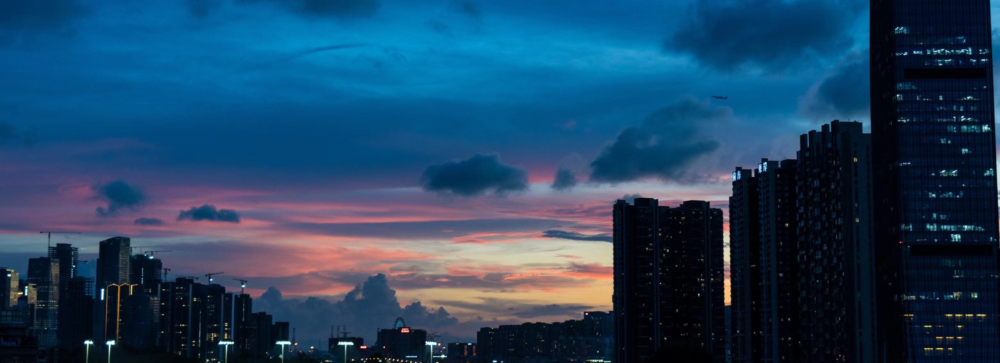 -->

<!-- 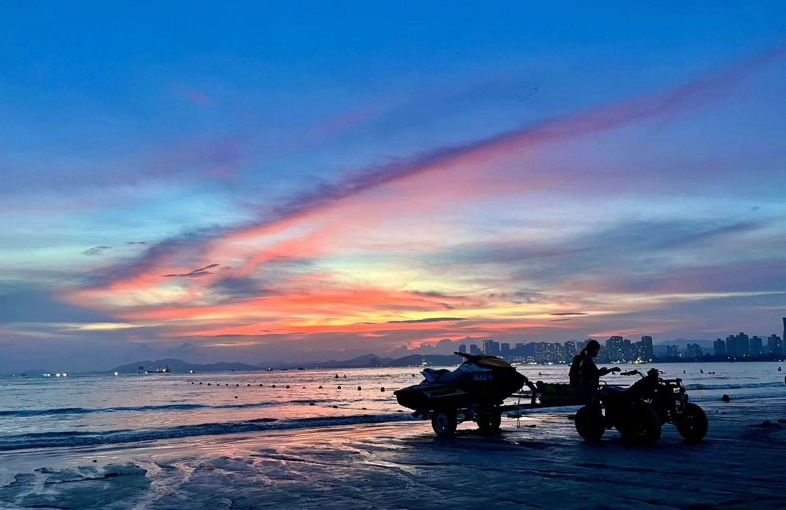 -->

<!-- 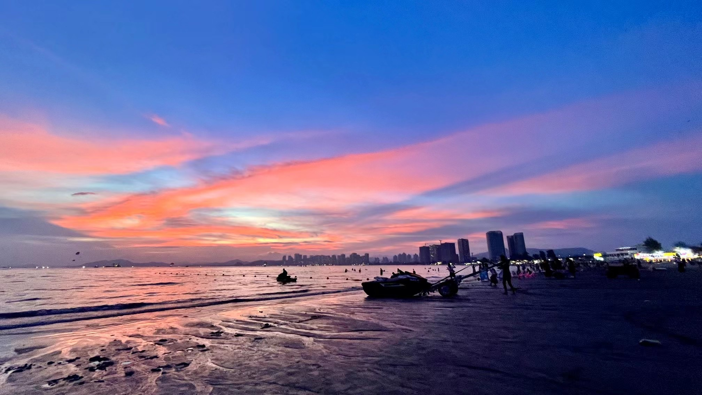 -->

这中间还发生了一个小插曲，让我这个不太相信玄学的人又一次觉得冥冥之中可能自由天数吧。

> 起因是当天逐渐暗下的时候，此时我们还没意识到即将到来的晚霞，于是一行人在沙滩上漫步准备去附近的饭馆大快朵颐。谁曾想此时晚霞突然出现，于是徘徊在沙滩上，奈何用手机拍照实在是不尽兴，于是章鱼拉上我快跑会停车的地方去拿相机
> 此时到了车旁才意识到车窗居然没完全关上！！！章鱼的相机就在后座，若是有心人伸手即可顺走，那一瞬间我们感觉非常后怕，我开玩笑说可能冥冥之中真的有天意吧，这个晚霞拯救了你的相机

临近晚上9点，海边的烟花声不绝于耳，新手摄影师第一次拍烟花感觉实在是太难了，用川鸽的图吧：

<!--  -->

烟花往往代表了一瞬间的美好，代表了终将逝去的繁花，每个人都有各自的解读，但如果是燃放一整晚的烟花恐怕就没那么幸运了🤣。当晚就我和满格睡得比较好，由于被子比较短，两个人半夜互扯被子，迷迷糊糊之中我脱口而出，恐怕这就是为什么需要”人类补完计划”吧（EVA乱入）

川鸽、章鱼和王律就没那么好运了，整晚的烟花+楼下ktv的声音让他们基本没睡着，当我五点多爬起来准备拍日出的时候，他俩已经拍了好久了，只可惜这次天公不作美，日出被层云遮挡住，无缘美景。

<!-- 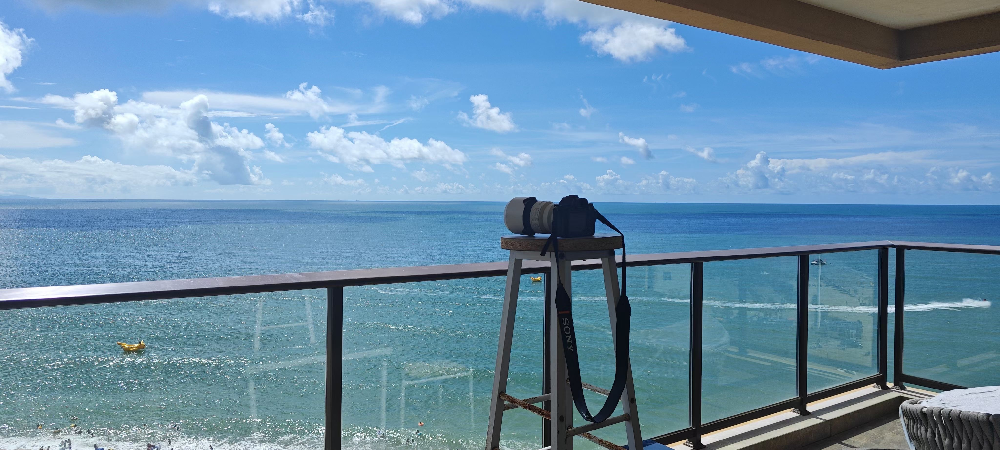 -->

<!-- 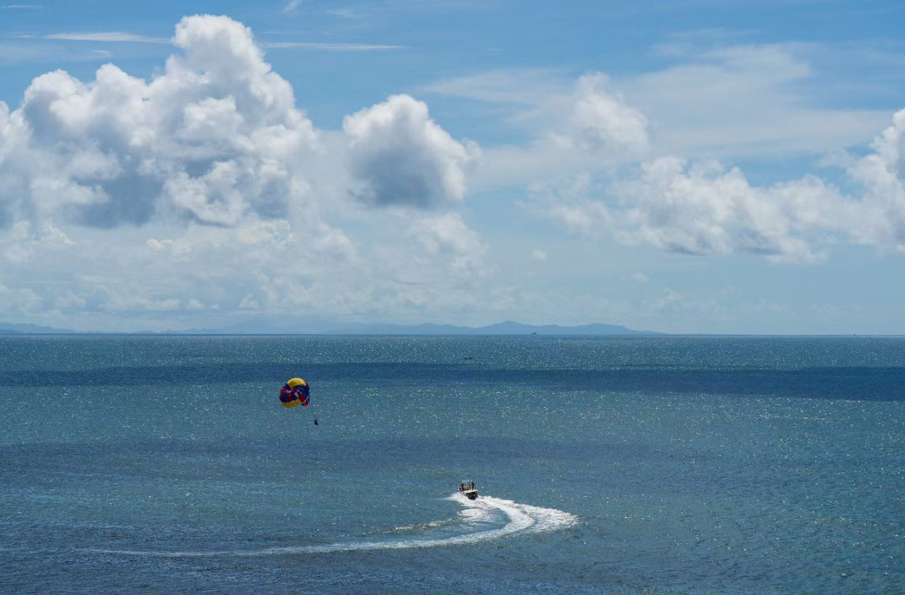 -->

收拾启程后，章鱼带我们去吃了一家巨巨巨巨好吃的海鲜店，恐怕能记一辈子了（80岁之后要考的🐶）

<!-- 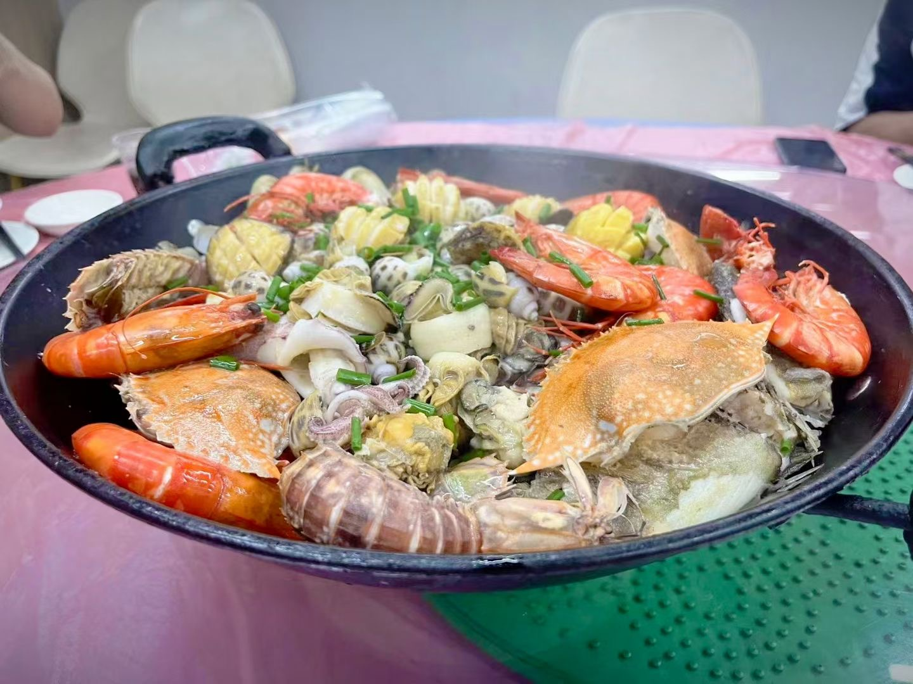 -->

返程途中还有一张绝美的照片：

<!-- 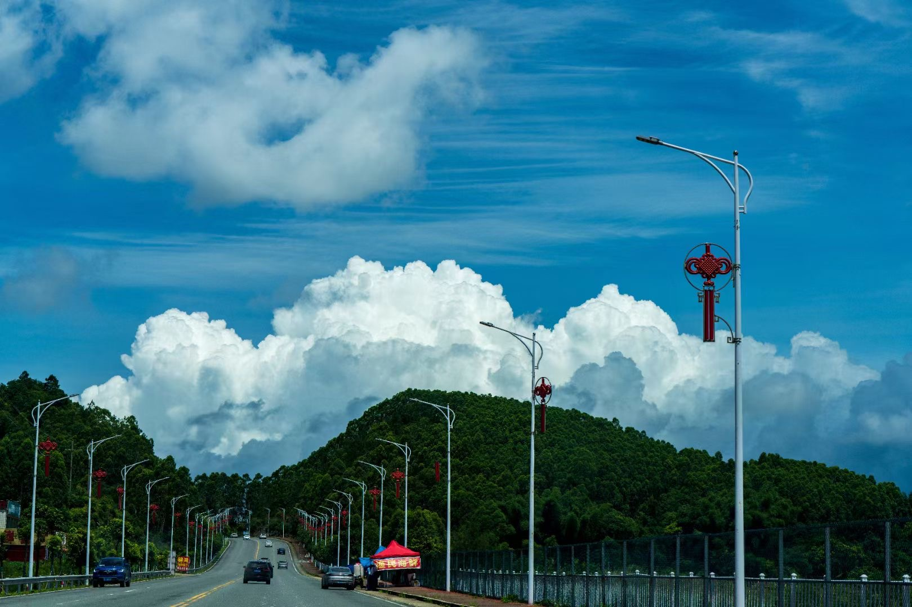 -->

返程回科兴后紧接着的是小狐狸《公主之死》的分享会，一群人等着我的电脑投屏呢（对就是我加班用的电脑，callback了）， 原谅我们路上堵车耽误了几分钟🤣

<!-- 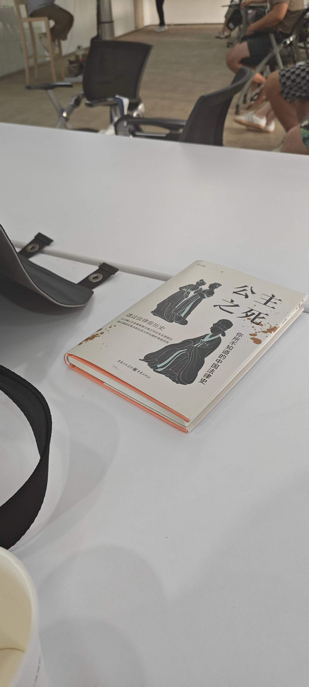 -->

结束之后，木屋烧烤喝酒happy ending~！ 桃李春风一杯酒，江湖夜雨十年灯。（而我，还要回去继续肝汇报的材料）

<!-- 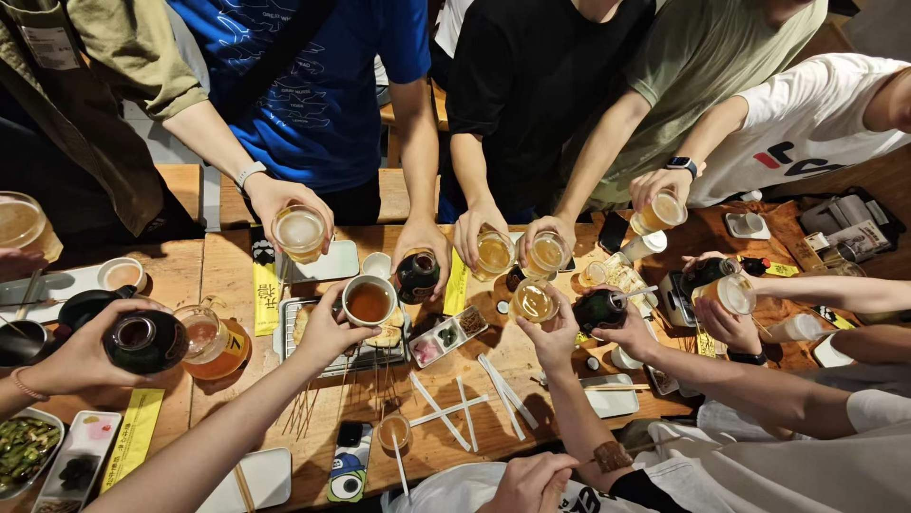 -->

肝完报告，真正的happy ending🤣

<!-- 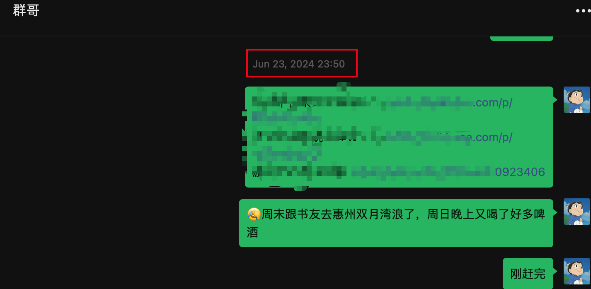 -->

 阅读——大清为何轰然倒塌

6月29日我主持了一次大概20分钟的草坪分享，文稿参见：

[大清为何轰然倒塌——读书分享 ](https://rayepeng.net/daqingwhydie)

但在分享会组织中也是一波三折，简而言之主要是野餐垫数量不够，下午刚下过雨导致天气过于闷热，未提前做好应急预案等等。

但好在小伙伴们也都非常理解（真的太难了）

<!--  -->

这本书虽然标题有点噱头，但内容质量确实很棒，为此我还特地写了一篇短评发在微信读书里，现在过了有一个多月来看，竟然得到了很多人的点赞与认同。

这里也粘贴下我写的内容：

历史是有因果的，历史是不断演化的，历史也是充满机遇与巧合的。

晚清这段历史，不是所谓教科书上各种丧权辱国条约的签订，不是所谓几次变法，不是所谓「武昌起义一声枪响，标志着 xxxxx」可以一页翻过的，面对晚清这个可以称之为封建时代强大的「百足之虫」，面对三千年未有之大变局，面对新旧思想的激烈碰撞，这是中华民族的一次自我革命，这场革命，涉及到国家主权、人民、金融、政治等各个方面的重新认识，其改造程度无异于一次分娩时的阵痛，无异于一个病人的全身大换血，无异于这片土地上一个民族的自我涅槃。

提起令人沉痛的近代史，我们总会为那些条约，那些压迫而感到耻辱，但真正让人痛心的，是其中的人，自「我自横刀向天笑，去留肝胆两昆仑」谭嗣同血荐轩辕始，无数的人，无数思想觉醒的学子，无数为革命牺牲的战士，无数为了一个口号而往前冲锋的普通农民、小摊贩、甚至流氓痞子、市井无赖。他们或因 个人品性、或因志向不一、或因无知懵懂，不一定受时人待见，但却都梦想着推倒这个旧世界，梦想着建立一个他/她们想要的中国

最后，以孙中山同志的这句话结尾吧：

「革命尚未成功，同志仍需努力」

<!--  -->

 一些值得分享的记录

欢迎join我的频道，https://t.me/RayeJourney

我就懒得去摘录出来了，写完好累啊hhh

