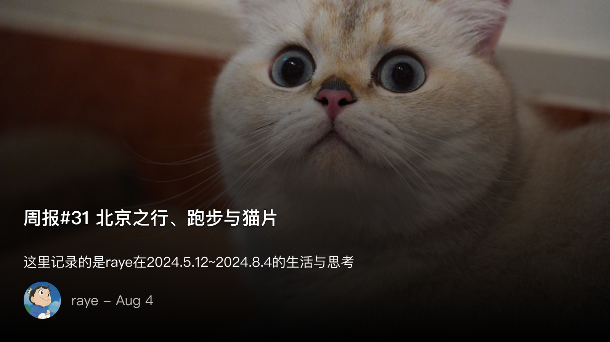
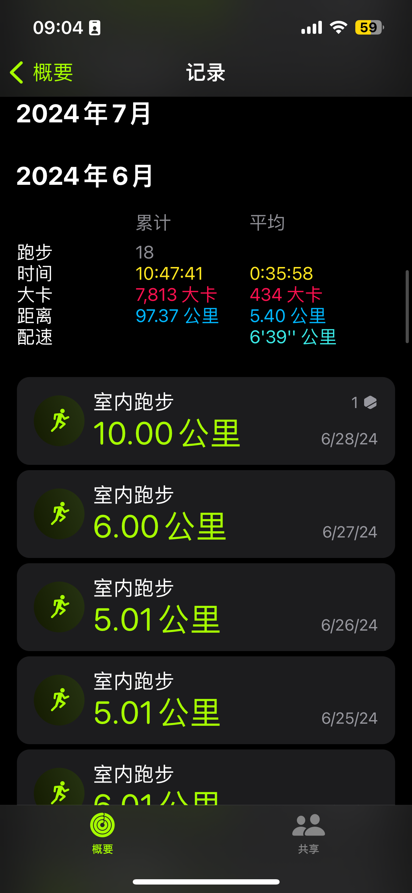
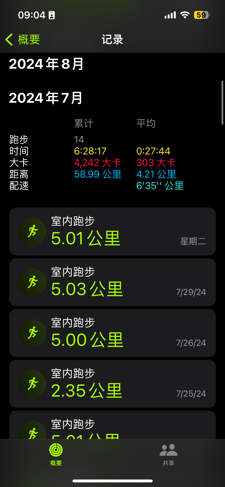
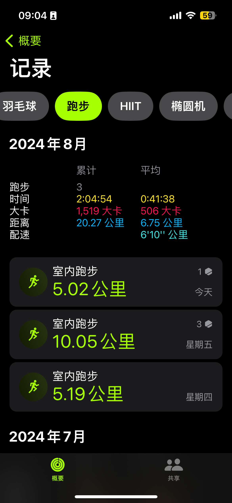
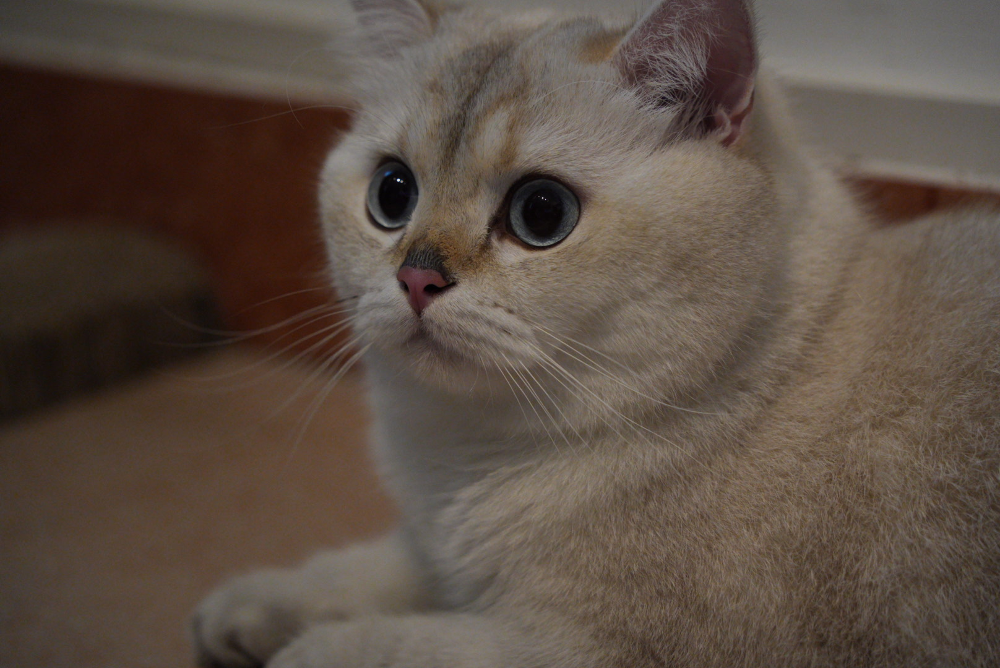
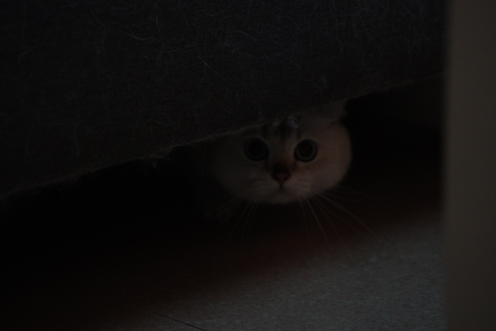
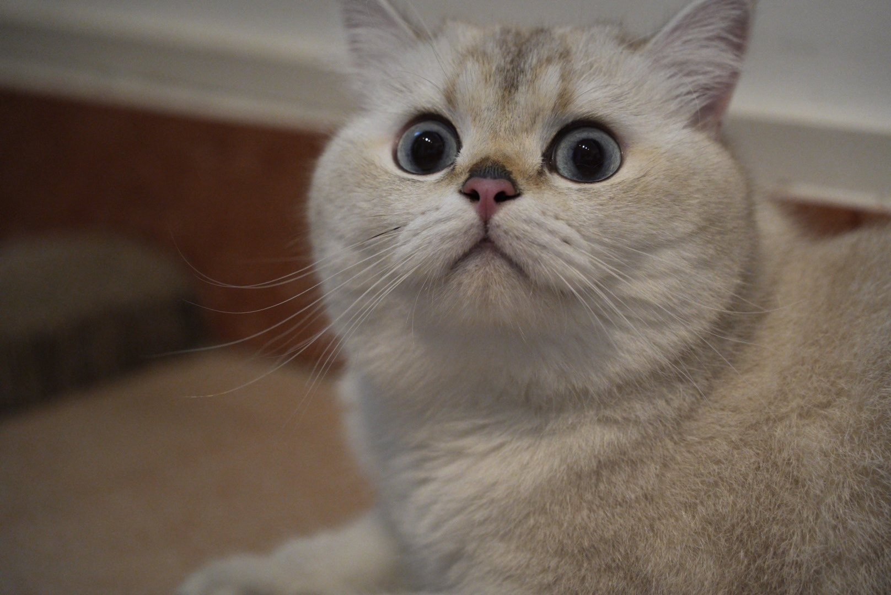
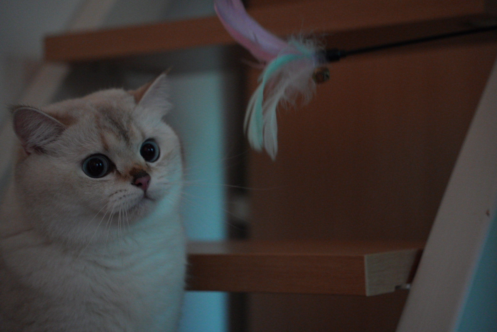
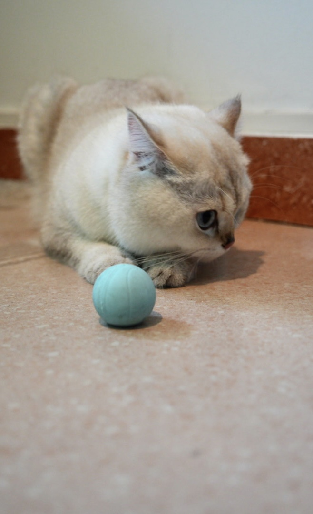
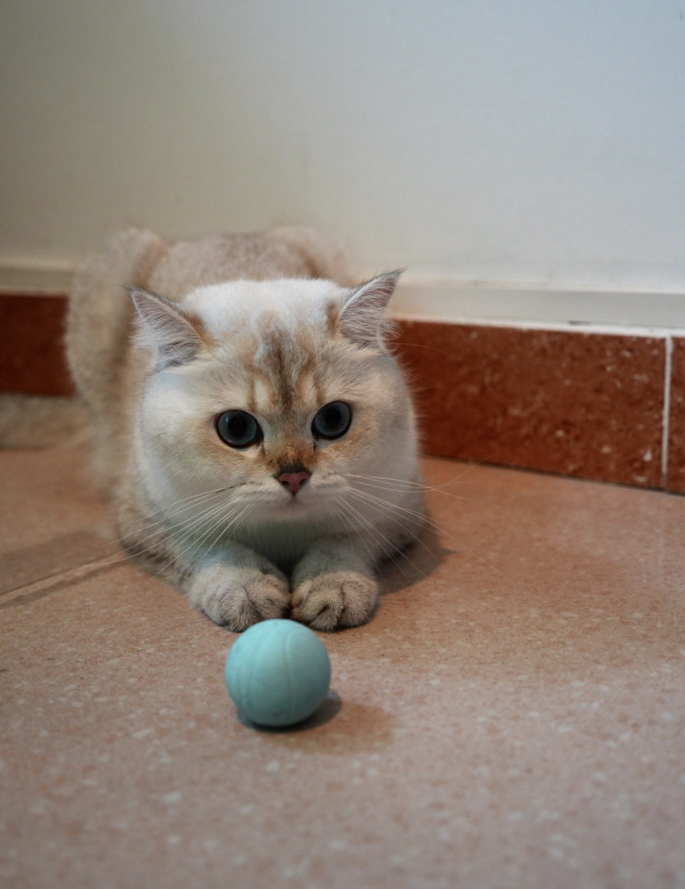

 周报31 北京之行、跑步与猫片

<!--  -->

写作不同，写作需要先有个想法。为了把这个想法表达出来，一个人不得不围绕着这个想法自己和自己争吵，自己和自己辩论。话语随口而出，随风而逝，然而文字却要落在纸上，所有人都隐隐约约知道，文字可能是自己的另外一张脸，需要慎重对待。

—— 和菜头

我发觉欠的内容实在是太多了，这其中又有太多残留在我记忆中的种种过往，有与不同人的时空交错，有与这个世界的诸多互动，有太多值得我去仔细思考的会回忆。

我好像一直愿意相信平行宇宙的理论，相信此刻的当下无非是由我的选择所展开的多维宇宙在此刻的一处投影罢了。最近也刚好看到了一部美剧《Dark Matter》，讲述的就是多维宇宙的故事

如果你习惯于漫威宇宙中对多维空间的描写，其中的主角穿梭到不同时空之后，仿佛跟没事人一样，还能顺原路找到自己的家，周围的人事物也都没有任何变化

那你就大错特错了，真实的多维宇宙远没有那么简单。《Dark Matter》 是改编自同名小说《人生复本》，由于美剧节奏太慢了，于是我先把小说看完了。

本以为穿梭平行宇宙是一个很简单的事情，但你要知道不仅仅是你此刻的选择影响了，他人的众多选择也会导致这个世界发生很大的变化。主角前几次穿梭的世界几乎都是末日景象，哪怕在他掌握了穿梭的秘诀之后，也几乎难以回到只被自己选择所影响的那个当下。

这才是真正的多维宇宙啊，莫要以为真有什么后悔药，哪怕真的有也得历经千百次的尝试。

所以好好记录当下吧~！

 北京之行

距离高中去北京旅游过之后，算是时隔多年再一次来北京了，不过此刻我已经不再是当时那个懵懂的高中生，因为这一次是来出差的。

如果要深入一个行业，当然是要去见识其中的每个人。我们此次的出行就是抱着这样一个目的，去和微信小游戏的开发者们做一次深入交流。

给开发者介绍我们的能力，科普常见的问题，介绍最优的解决办法与最佳实践，同时感受开发者们的热情，解答他们的困惑。

但我对于北京还是很抵触的，高中的那次旅途现在想起来都有点好笑，在北京的六天就没有吃一顿好的，完全不符合弗兰人的口味。又想起了辅导员在我们出发之前的聚餐上说的，这可能是你们这次北京旅途吃的最好的一顿了，辅导员真是诚不我欺啊hhh。

于是在北京几乎不敢独自去任何地方吃饭，中间也和一位老同学及一位在阿里工作的同事吃过一次饭，要么北京烤鸭要么羊蝎子了。在北京，敢于随机选择一家餐馆吃饭的人才是真的勇士。

开发者大会结束之后居然还空出一天，但是北京的常见景点，如天坛，颐和园，故宫，毛主席纪念馆，博物馆，长城等基本都去过了，于是也没有心思去，本想着要么去一趟首都图书馆待一天来着，但还是跟随导师一起去了一趟圆明园参观下。

晚上则去了一趟罗刹海，一个不算太大的琥珀，感受下北京弄堂的悠远，见识下王府的恢弘大气。

整个北京之行感觉并没有给我留下太多的深刻印象，尽管是一座历史古都，但其在我心中的地位却远不及西安洛阳南京等。

收获最大的是读完了一本书《三国前夜： 士大夫政治与东汉皇权的崩解》 https://book.douban.com/subject/36699839/

 跑步与专注

为了减肥，真的是为了减肥，在羽毛球教练的建议下，开始了每天早晨的空腹有氧跑步

最开始坚持起来还是挺难的，毕竟跑步也中断了一段时间了。

以前跑步是喜欢横冲直撞的，上来就马力开足，跑步机时速直接干到11、12，开始狂奔。

但很快就坚持不下来，坚持跑个五分钟已经是极限，于是只能减速到6，开始慢走喘气，等到体力堪堪恢复一段又开始狂冲。

但我觉得有必要稍微调整下，于是就保持9km/h的速度，试试能不能坚持跑半小时。

本以为是一件很轻松的事情，毕竟11km/h都可以跑，9km/h不是小菜一碟吗。

但很快你就发现，坚持匀速跑步，才是一项更大的挑战。

刚开始跑的时候自然觉得没啥，甚至觉得速度还能再上去，但奈何被跑步机限制了，于是只能慢下性子。到后期又发觉体能跟不上去了，此时又不能减速。

于是开始领悟到，如果我能坚持匀速跑下来，应该对体能有很大的改善。

目前已经坚持跑了两个月了，6月跑的比较勤，7月因为北京出差的关系则中断了一些。

<!--  -->

<!--  -->

<!--  -->

 猫片

不多说了，猫猫真的好可爱，虽然不是我养的（下午去川鸽家一起拍猫猫）

<!--  -->

<!--  -->

<!--  -->

<!--  -->

<!--  -->

<!--  -->

 一些值得分享的记录

欢迎 join 我的频道，https://t.me/RayeJourney

