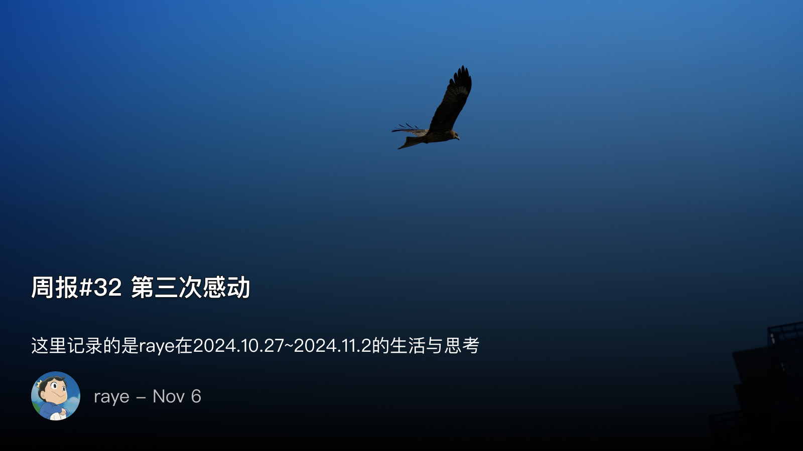
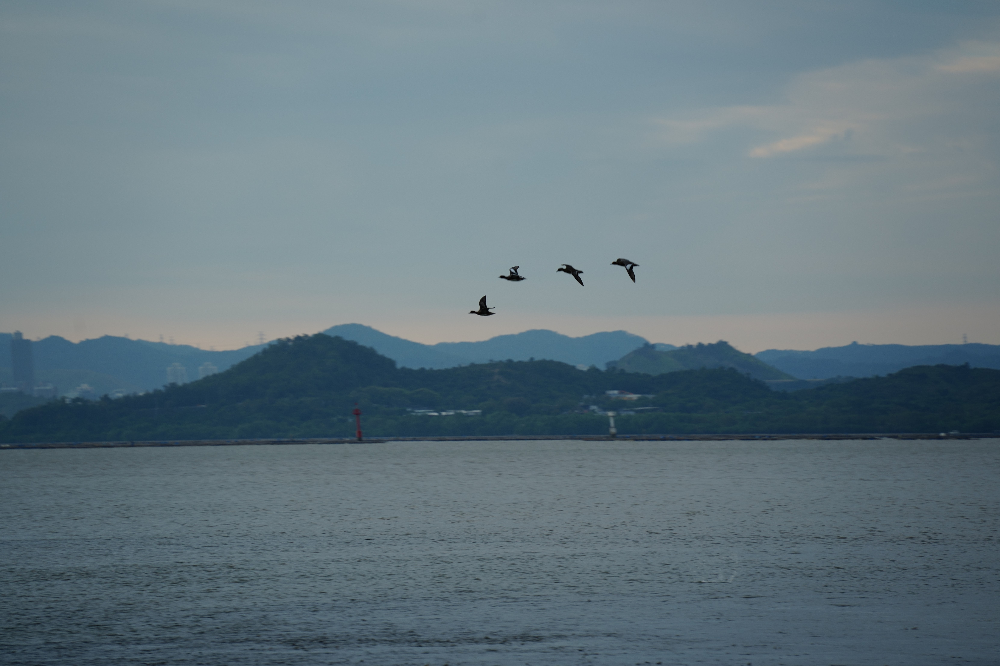
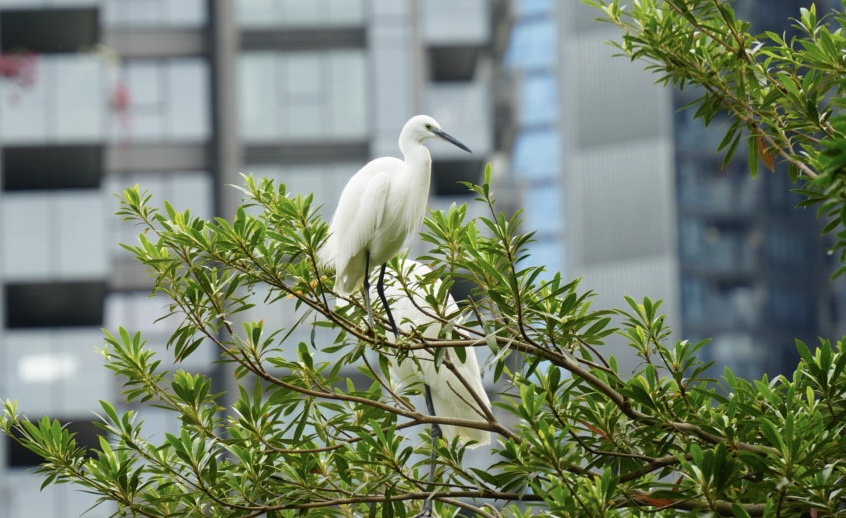
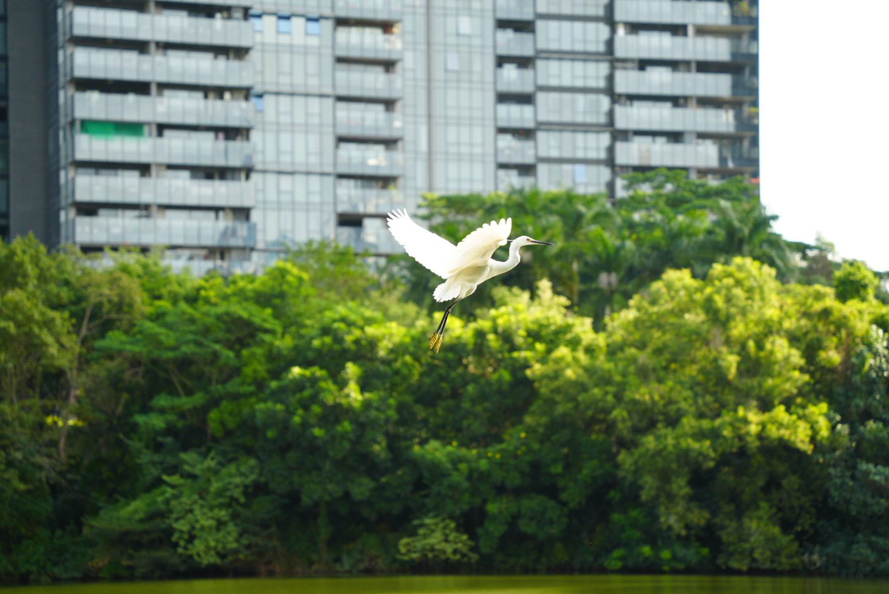

 周报32 第三次感动

<!--  -->

https://open.spotify.com/track/0plHBfV2PAWAFKGvhTfMLC?si=-KSGF-pZSpCy8195bVrccA&context=spotify%3Aalbum%3A6F8uiNvpfUdMTpPGPRCK6o

> 我最喜欢的歌手萨莎，出自她今年的新专辑《Me Again》

我自觉是一个很难坚持长久做一件事情的人，过于理想主义，或者说是天真加上完美主义吧，总是容易头脑发热，却又无法长期坚持下去

本来以为写博客也是这样一个半途而废的事情，最开始是被xlog这样一个开放包容的开源创作社区所感动，拥有一个web3的博客是一件非常cool的事情。

在融入xlog社区之后，也不断经营自己的blog，认识到了同样很多写独立博客的朋友，在书写自己生活的同时，也总是能收获到一些认同感，同时也被追求独立博客的愿景所感动。

然而随着工作上日渐繁忙，以及自己状态的持续低迷，我好像开始逃离这一切。喜剧之王单口秀上，阎鹤祥讲述自己为了逃离郭麒麟，逃离说相声，他骑着摩托车，穿过中亚欧洲，越过大西洋，越过巴拿马海峡，抵达潘帕斯草原，来到了地球上离自己家乡最远的对跖点。

在这个点上，是他离自己烦恼最远的地方，你再也无法迈开任何一步，你想爬到最高处，离烦恼更远一点，可是那连一棵树都没有。

但反过来，你之后走的每一步，都是离自己曾经的梦想又近了一步。

我本来并不打算去尝试follow应用的，因为我知道我自己连rss订阅应用都换了好几个，也并没有坚持把rss的阅读习惯培养起来。

但当我下载体验之后，我知道这确实是一个只存在于理想中的应用，虽然它可能还有一些不完美的地方，但它确实就是我今年的最佳应用了

流畅的阅读体验，合理的订阅分类，众多的独立博客作者，大量的优质订阅源，读者与作者之间的互动，无不让我第三次感动。

一瞬间，我感觉我又活过来了，曾经被压抑的表达欲望，曾经对自己的种种质疑通通烟消云散，我相信我是可以坚持写下来的。

是为本周报序

 打鸟🐦打鸟🐦打鸟🐦打鸟🐦

早上6点15左右起床，简单洗漱后就直奔深圳湾。

第一次接触到打鸟的乐趣，遗憾的是腾龙28-200能拍到的实在是太有限了

深圳湾，早上7点左右的天空，太阳刚刚从云层中探出来，远处的天空中有淡淡的红光，这四只小鸟的飞行动作，让我疑心是不是一只鸟的慢动作回放😂

<!--  -->

> 朋友说这种副厂的镜头有两种做法，一种是优先照顾广角，像腾龙28-200就是这样，一种是优先照顾长焦，并且疯狂安利腾龙的50-400，好吧我又想买镜头了😅

<!--  -->

不过天鹅湖倒是非常值得一去，咔咔咔一顿拍，结果发现拍的都不咋地.. 勉强放几张能看的吧：

<!--  -->

<!--  -->

 鸟事一堆！超崩溃鸟类观察笔记读书会

第一次接触到“观鸟”这个稍显小众的爱好，感谢见夏学姐的提议，让我深深入迷了

> 喜欢观鸟的朋友都会给自己起个自然名，比如这次的讲师就叫山羊， “见夏”这个名字也是来源一种植物

这确实是一本特别有意思的书，作者手绘了许多鸟类，并且在书中给它们取了好多有趣的别名

书的封面：
./attachments/

作者画的小鸟太有趣了哈哈：

 一些值得分享的记录

文章：
- 介绍了很多mac上的工具，非常全面，我都是头一次知道Apple notes可以安装插件来写markdown的 https://blog.ursb.me/posts/mac-app-share-2024/
- 介绍follow的使用，非常全面了，可能我也会写一篇类似的吧 https://www.pseudoyu.com/zh/2024/11/04/follow_information_acquisition_revolution/
- 作者介绍了他面试Google的经历 https://justyy.com/archives/66293
- 一道非常有意思的社工题目，最后一个脑洞是遍历pastebin链接的最后一个字符 https://hackmd.io/@c2uru/HJznxU6eyl

视频：
- 王局终于还是出错了，回旋镖打回来了，但作为合格的媒体人，马上发视频道歉，并且还要直播道歉，对于指出他们错误的人还发放奖品 https://www.youtube.com/watch?v=xMZqTuLWSA4

追剧：
- 最近在看《诊疗中》，我特别喜欢的一部喜剧  http://movie.douban.com/subject/36305116/

音乐：
- sasha的《Me Again》专辑，百听不厌，虽然每首歌的曲调风格都比较相似，但这就是sasha最真挚感情的流露https://music.163.com/song?id=2135385131

更多分享可以加入我的频道：https://t.me/RayeJourney

