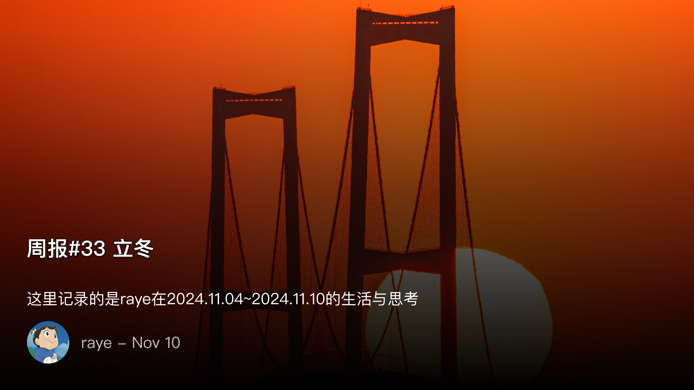
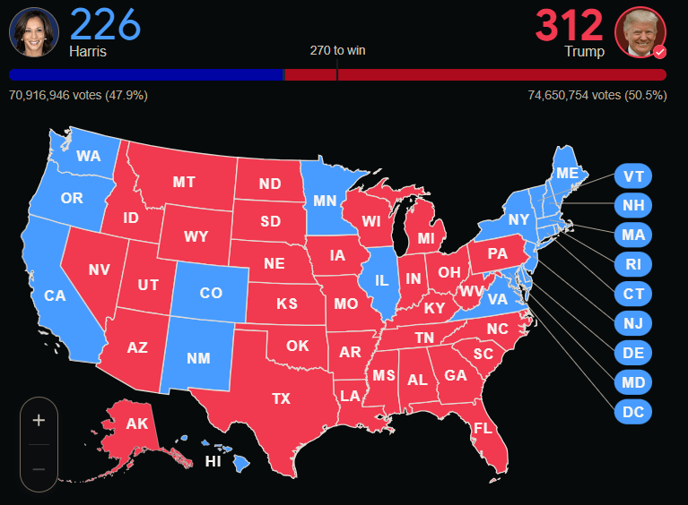
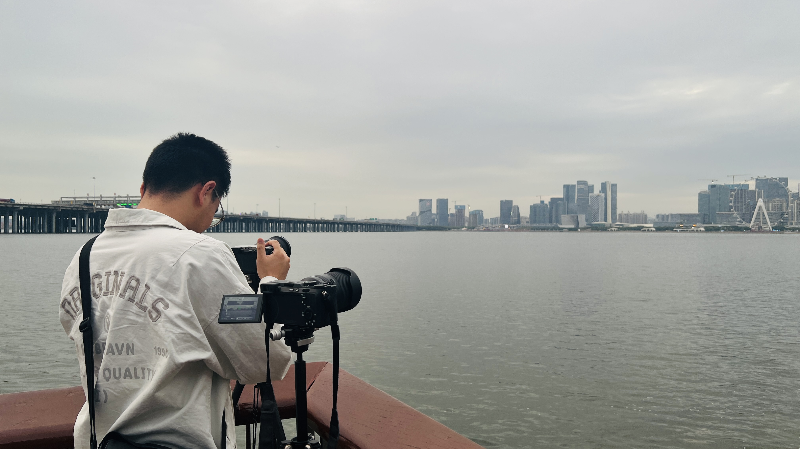

 周报33 立冬

<!--  -->

https://open.spotify.com/track/0j2l3sf15o9vczIATwA3Xr?si=ZNKbDRK9Td6-MM41yOCJEw&context=spotify%3Aalbum%3A653YWJ1EZLWEvUdE6Kc8WL

> 出自我非常喜欢的一位歌手Jeremy Zucker，今年11月发布最新的专辑 《brent iii》

具体的生活细节永远是比较平淡的，但是蕴藏在其中又有一些惊喜。它们可能闪现与一首与你灵魂共振的歌曲，闪现于一两句书中的摘录，闪现于一段视频中。

如果有一个观察者拿着放大镜仔细观察一个人一生的每一0.000000...001秒钟（假设有这样一个时间单位），注意我说的时间其实也是可以观察的，因为它不过就是类似长度的一个单位罢了。

它其实会发现人是根本没有动的，想想“飞矢不动”理论吧。这样的工作也太无聊了吧，还不如把这个人晾在一边，等想起来了再看看。

这样的观察才是有意思的，那么这么说，是不是连续不间断的人生其实没有什么特殊的趣味呢？只有片段化的，离散的，才是最值得铭刻的。

如果离散化的人生也有一个最小不可分割的计量单位，那是什么呢？

ps. 11月7日立冬了，刚好二十多年前一个人出生了

是为本周报序

 付航牛逼！

付航最后一期的视频，第二次看确实会觉得很感人，也无外乎评委们及现场观众都是又哭又笑的

我第一遍看的时候，其实并不能理解为什么这样一个长得像”猴“的人，略显浮夸的表演，能拿下冠军

但当我把决赛每位选手都看完之后，尤其付航前一场，小鹿的表演可以说是有些冷场，付航面临的的难度更加可想而知

但他还是出色的完成了，凭借他优秀的文本，对于悲喜剧融合的艺术

他开场的时候就说到，这是喜剧之王，又不是悲剧之王

但他的演绎中，我能感受到悲喜剧本就是一体的，尤其他讲到他的女朋友时：

”你还记得我说过这些话吗“

”哎呀说这些干嘛，怪恶心的“，”不过付航你要记住，早点回来，我在家里等你“

我愿称之为对人类感情描述的最佳文本了

 参见懂王

> 抛开大立场，特朗普真是大丈夫当如是，当年白宫晚宴被嘲讽，素人打穿希拉里。4年前光环被斩尽，随后而来的嘲笑、污蔑、栽赃、刺杀，78岁子弹擦伤仍然高呼战斗，美国巅峰时期那代人的精气神真的在他身上体现的淋漓尽致。这老头越是逆境越是顽强，活到这地步人真的无遗憾了。

<!--  -->

美国大选最后投票定格在了312:226，懂王拿下了所有摇摆州，意料之外，情理之中了。

坊间基本都在说，懂王这次可以说是大赢特赢，立法、司法、行政三权基本都掌握在自己人手里，完全可以登基加冕称帝了。

今年不知道为什么额外关注大选，尤其是拜登退出，哈里斯接任后，美国大选相关的视频几乎是一个不落地在刷。

选举前，从哈里斯和特朗普的种种表现来看，我都是几乎无条件相信懂王会胜选了（除非民主党搞一些小手段）

真的非常讨厌民主党，那一套歪曲的政治正确理论，怎么都无法洗清楚，懂王的回归可以说是挽救了美国的命运（奇怪为啥我这么高兴哈哈哈，但不管怎样中国一定是最后的赢家）

最近看书，有个作者提出了一条比较有意思的理论：

在中国，基本都是对人不对事的，那些当官的，但凡涉及到一点政治黑点，基本就走不下去了，不止是官员，连我们普通人也时刻生活在这样的压力之下，但凡有一些在旁人眼中看起来“出格”的动作，就会“社死”

生活在集体社会中，免不了时时刻刻要和别人打交道，不管现在互联网公司怎么强调要“对事不对人”，但社交的压力其实一直都存在。

反观在西方，是经典的“对事不对人”，总统候选人可以被判刑，有政治黑点的人照样可以继续他的政治生涯，普通人则更加不在乎别人的看法。

尽管现在大城市中的我们，逐渐演化出原子化的个人状态，可是你所在的公司、你所在的社群、都是你的压力来源。

每当一个吃瓜的pdf在微信群传播，我总是在想，这背后的人到底要承担多大的压力，要有多强大的内心，才能抵抗得住这背后无数双眼睛的贪婪目光。

扯远了，庆祝下懂王，也祝福那些买了川大智胜股票的人吧哈哈。

 一些值得分享的事物

6点半的深圳，蓝色的天，残留的路灯，远处的春笋，感觉还挺有意境

追不到的晚霞（in 前海石公园）

<!--  -->

打车的时候偶然发现后排座位也有这样一个后视镜，感觉非常有用，这样每次下车的时候就不用提心吊胆后面有没有车或者人来了，建议普及。

> 感觉很多事情就是这样，靠贴标语、喊口号，其实比不上真正的实物有用

 书音播

动漫：
- 《双城之战》太好看liao~，可恨我第一季都没看完，先恶补一段时间

音乐：
- Jeremy Zucker 最新的专辑 《brent iii》 非常推荐，不插电的风格，吉他弹唱，恰到好处的男女声

播客：
- 三联《拼命寻找旷野的年轻人，却正在丢失“附近”？》https://www.xiaoyuzhoufm.com/episode/671b78f244ae79002c038667?utm_source=rss

摘录的一些金句观点：
- 落叶作为秋天最美的一种风景，为什么没办法长久地被人看到呢
- 有点好笑，我们生活在都市里，却缺少了对自然的敏感，越来越“钝感力”哈哈哈
- 互联网只会加速某种趋势，而不是创造某种趋势，不要让互联网背锅

更多分享可以加入我的频道：https://t.me/RayeJourney