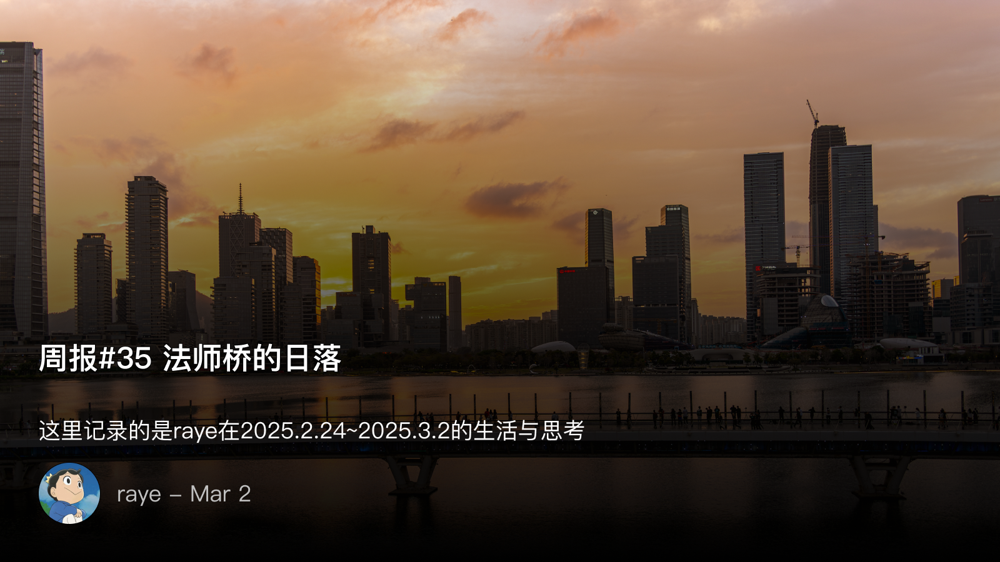
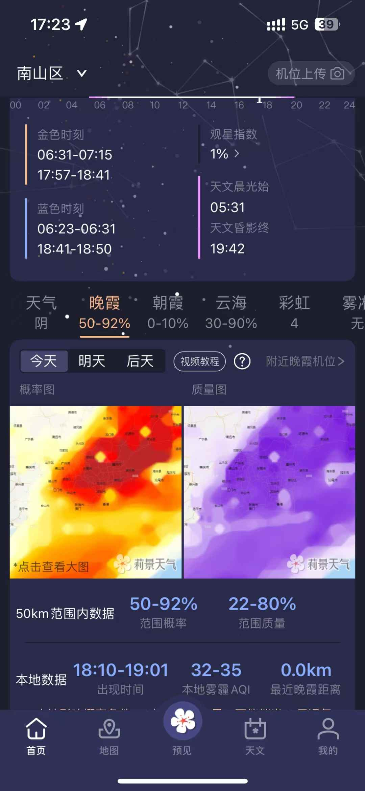
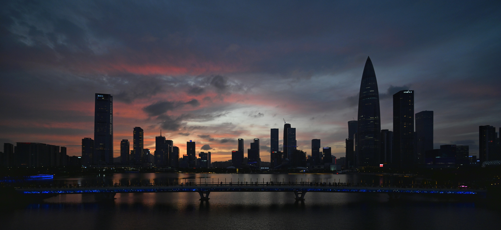
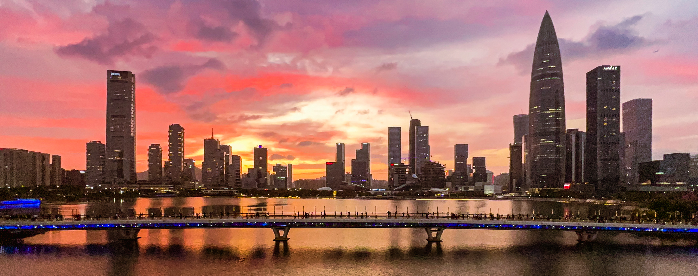
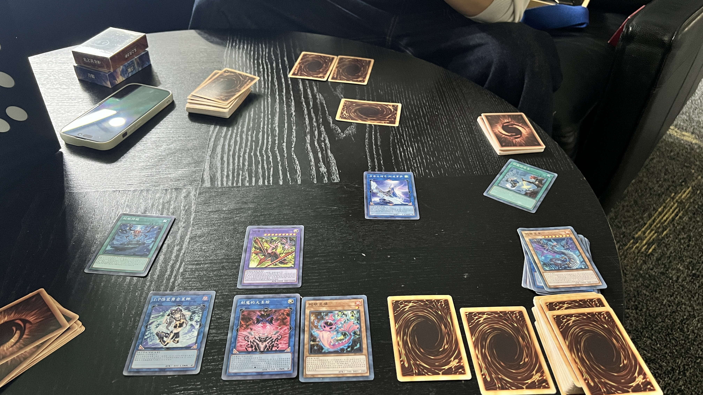

 周报35 法师桥的日落

<!--  -->

 日落

虽说来深圳很久了，但实际上也没有真正几次去过法师桥

<!--  -->

太好看的落日了，跟随着一群老法师，后海大桥也因此得名为法师桥

下图是定定拍摄的，我在他的基础上进行了简单的调色处理，提亮建筑物的亮度会更好看一些

<!--  -->

<!--  -->

<!--  -->

下图是我用iPhone13pro的超广角镜头拍摄的，整体的感觉氛围还是很棒的

<!--  -->

谁让我的相机暂时没有超广角镜头呢，24端目前拍摄出的感觉是下图这样的

<!--  -->

回想起从最初的相机小白，到现在已经买了两台相机加无人机加pocket，设备已经有点多了🤣

对于拍照的热爱也在不断累积，消息小红书上的推荐帖子基本都是摄影调色相关的。

调色也是我很喜欢做的，以前对于摄影的后期有误解，认为一定要直出才是最真实的，其实不过是对于自己懒惰的一种欺骗

因为相机不同于人眼，再好的拍摄器材也有自己的局限性，后期不过是将照片的色彩还原为自己肉眼所看到的

尤其是在强光，弱光，死光等各种情况下，其实都是需要后期参与的，而且后期的技术并不见得有多么复杂，基本的调色原理都是有迹可循的，饱和度，鲜艳度，明亮度，色调，色温，对比度，高光，阴影，白色色阶，黑色色阶，这些概念并没有那么难理解

写到这里，又想到了教员的话，“你想要获得第一手的资料吗？那末，你就去实地考察吧”，唯有实践才能出真知，“你要知道梨子的滋味，你就得变革梨子，亲口吃一吃。你要知道原子的组织同性质，你就得实行物理学和化学的实验，变革原子的情况”

 游戏王实卡决斗

来一场真正的游戏王决斗吧！周日和hh进行了一场真正的决斗，如下是我用刻魔蛇眼卡组展开的终场，其实有点失误了，不过问题不大，后场盖得另外两张卡，一张是无限泡影，另一张则是墓穴的指名者

感觉很多人对游戏王还是存在偏见，其实这也是侧面反映出很多人对于自己不了解的事物，很容易忙着发表看法（反思下自己也是这样的）

譬如文杰问了我一个问题，“你们玩游戏王用的是什么规则”，我最开始觉得有些奇怪，毕竟游戏王的规则说明书是一直公开的，但转念就知道了，其实小时候玩的都是村规，大家根本不知道规则就在那里瞎玩

但我还是想给没有真正认识过这款游戏的人科普下，游戏王是世界三大TCG(集换式卡牌游戏)之一，另外两个分别是万智牌与宝可梦，游戏王的规则经过多次调整，现在已经是一个非常有趣耐玩的游戏了，不仅有线下实体卡，也有线上的电子游戏

游戏王的召唤方式在我看来就是其最大的创新，不得不佩服设计师的丰富的创意，从初代的上级召唤，融合召唤，仪式召唤开始，同调召唤可以说是非常富有设计感的一种召唤方式，调整怪兽，星级数相加，既有策略性又有趣味性。

超量怪兽的引入，正如其日文的xyz表述，在二维的卡牌上增加了立体的叠放动作，同时又限制了强力怪兽的效果发动次数。

灵摆怪兽，也是最大的一次创新，可以与前述任意一种召唤方式结合

链接召唤，一方面是为了降速，另一方面，链接箭头的设计，让二维平面上的卡牌之间又增加了一种联动关系

<!--  -->

 包饺子

周五晚上和小墨绿、满哥呱呱小狐影砸阿E安安以及706的朋友们一起包饺子

果然自己包饺子还是得蒸饺才最有容错性，煮饺子很容易失败，蒸饺子则相对稳定

忙活了好久，虽然我只会打打下手加包不太像样的饺子，但看到新鲜出炉的饺子还是很开心

<!--  -->

<!--  -->

<!--  -->

 值得分享的事物

好像也没啥太多值得分享的，欢迎 join 我的频道
https://t.me/RayeJourney
