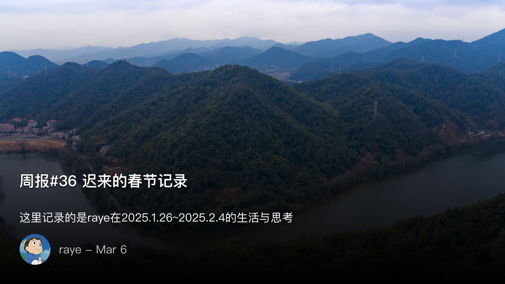
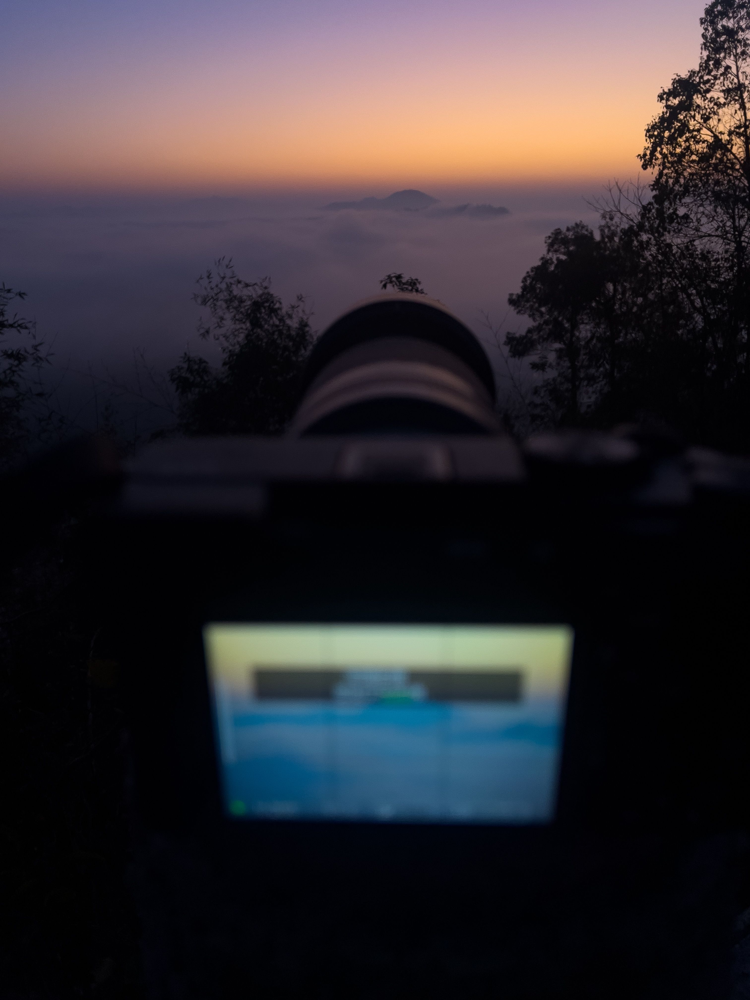

 周报36 迟来的春节记录

<!--  -->

其实过年在家就应该记录一下的，但一直忘了hhh，在家基本都是在看书休息，也没做什么事情，但与以往不同的是，这次是第一次买了相机之后回家的

以往春节回家都是不太想出去的，天气冷，熟悉的朋友也基本都是要回乡下过年（我倒是不用回乡下，一直在城里），除了找找陌生人打羽毛球之外似乎也没啥能做的

但今年是第一次买了相机后带回家的，作为一名自诩为风光摄影师的刚入门新手，第一次有了一种迫不及待想要出门的动力，于是在回家的头两天，每天早上6点多就起床出门去爬山了

第一天早上没蹲到日出，但是天气还算不错，拍了几张西湖山的照片

第二天早上继续爬山，竟然第一次看到云海！尽管这座山也就200米出头，但却能真实地感受到云海的流动，以至于有朋友看了照片以为我是用无人机拍的

下山边修图的途中，《滕王阁序》的一句“俨骖騑于上路，访风景于崇阿”突然击中了我，细想一下还挺适合风光佬的
其实过年在家就应该记录一下的，但一直忘了hhh，在家基本都是在看书休息，也没做什么事情，但与以往不同的是，这次是第一次买了相机之后回家的

以往春节回家都是不太想出去的，天气冷，熟悉的朋友也基本都是要回乡下过年（我倒是不用回乡下，一直在城里），除了找找陌生人打羽毛球之外似乎也没啥能做的

但今年是第一次买了相机后带回家的，作为一名自诩为风光摄影师的刚入门新手，第一次有了一种迫不及待想要出门的动力，于是在回家的头两天，每天早上6点多就起床出门去爬山了

第一天早上没蹲到日出，但是天气还算不错，拍了几张西湖山的照片

第二天早上继续爬山，竟然第一次看到云海！尽管这座山也就200米出头，但却能真实地感受到云海的流动，以至于有朋友看了照片以为我是用无人机拍的

下山边修图的途中，《滕王阁序》的一句“俨骖騑于上路，访风景于崇阿”突然击中了我，细想一下还挺适合风光佬的

<!--  -->

<!--  -->

<!--  -->

<!--  -->

<!--  -->

 记录下春晚

漫才兄弟表演的太好了

我连续刷了好多次漫才兄弟的表演，非常上头，湖南塑普，加上无厘头的搞怪，他们在脱口秀的表演节目基本都是模拟某个场景，如租房，打车，去餐馆吃饭

这些场景中总是能融入一些对现实的讽刺，最后决赛的演出是模拟丧尸剧，其中一句“现在酒店不都有摄像头”，又好笑又直戳现实，更绝的是在最后的一小段两人历数所有演出的模拟场景，“你讲漫才的旁边一直是老子晓得不”哈哈哈哈太有意思了