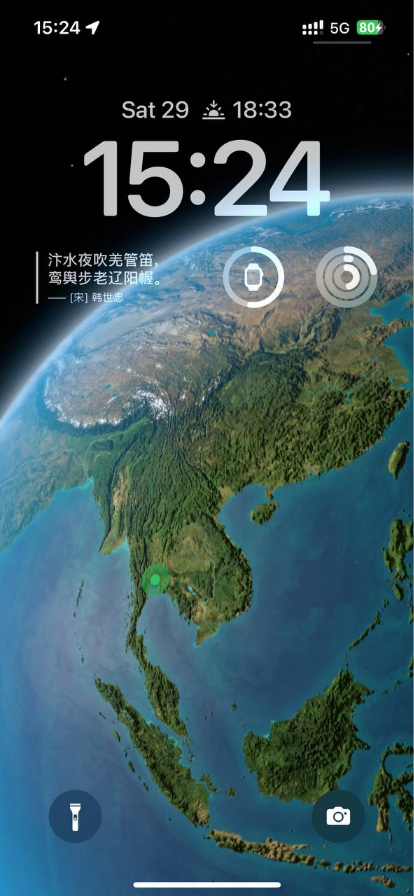
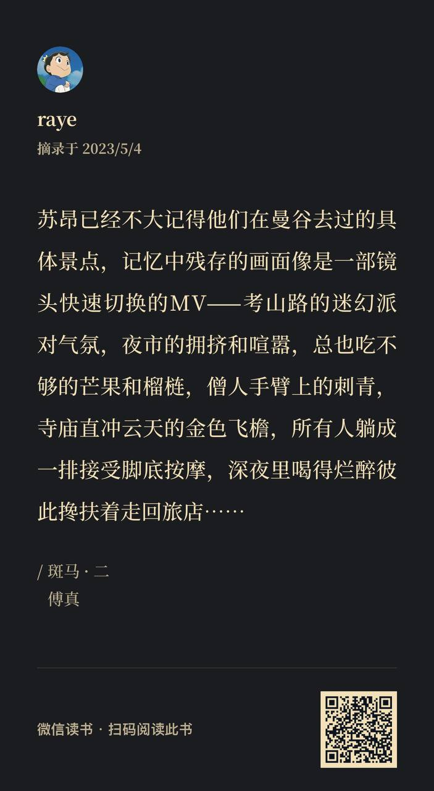
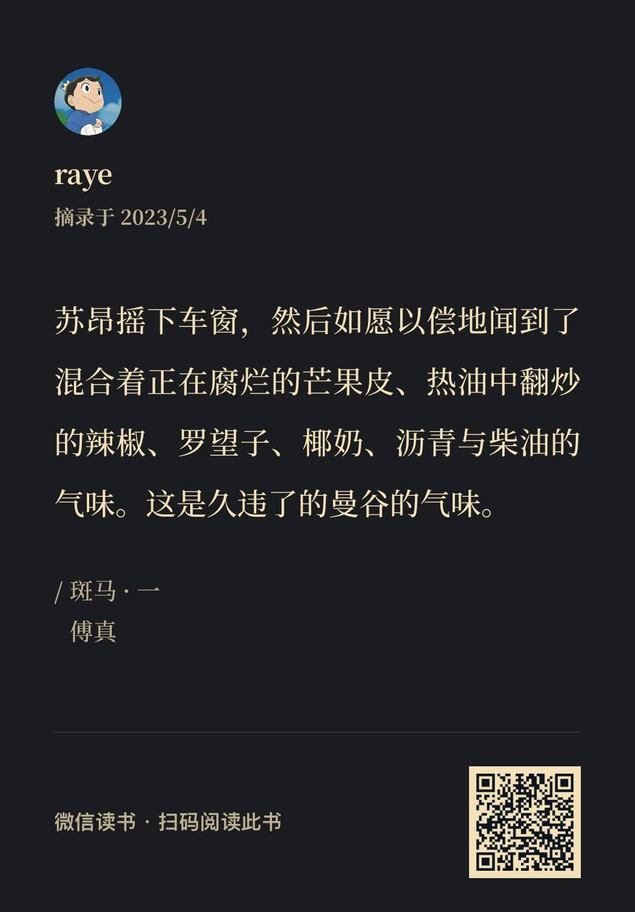
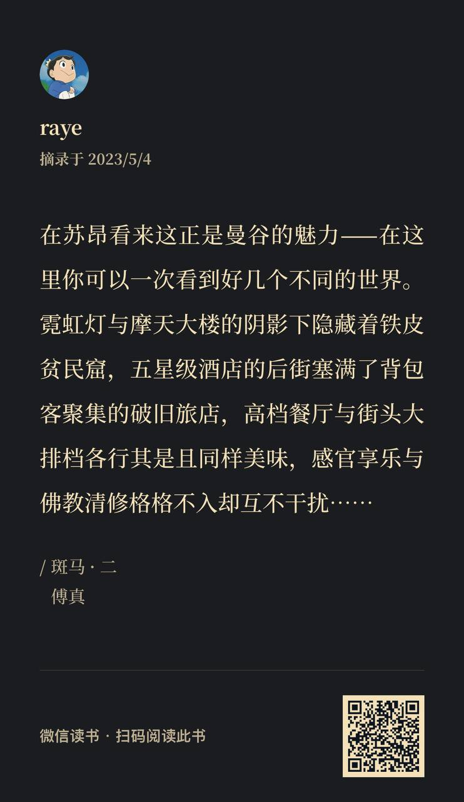
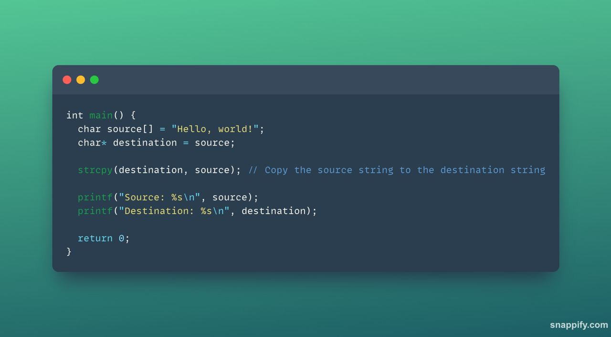

 周报4 泰国、写信、阅读、Midjourney

这里记录的是raye在2023年，4.26-5.7这段时间的记录与故事。

<!--  -->

封面图 via Midjourney

已经有一大段时间没动笔写了，好多想法在脑海里盘旋，总得找个宣泄的出口。每当我想要记录的时候，总会因为各种原因耽搁，但等我真正落笔，时间早已冲刷掉了大半的记忆，只能让我费力地搜刮半天，写出一些零乱的词句，最后拼凑出来。后面计划修改一下思路，改为平常多多记录，最后只需要做总结润色的工作。

 泰国之旅

4.26 飞曼谷，4.29飞普吉岛，5.4回深圳

4.29日在曼谷飞往普吉的飞机上，无意中瞥到自己在地图上的定位，一是感慨自己在地球上的位置终于有了变化，二来会感觉到自己真的好渺小。“寄蜉蝣于天地，渺沧海之一粟”

<!--  -->

去泰国的起因在之前的文章中有提到，当我在返程的飞机上重温《斑马》时，才知读万卷书，行万里路的这句话背后的分量：

<!--  -->

<!--  -->

<!--  -->

<!--  -->

摩的、tutu车、芒果、辣椒、椰奶、热气，按摩店，傅真笔下的曼谷，若只停留在纸面的理解上，是无法真正读懂这些文字的。中学时代，常常有各种各样的阅读理解题，让我们体会作者的心境，亦或是联系实际作答。那个时候碍于生活阅历和情商，我无法理解老师或者标准层答案中那些模糊概念，依我看，语文课的教学，如果只限于课堂上老师口干舌燥，连篇累牍的讲解，那真无异于填鸭式教学。只有真正走进作者笔下的那个世界，才能体会其中所蕴含的感情。

当我下飞机后坐在的士上，两旁的景物飞速掠过，我惊叹于曼谷的摩天大楼和深圳不遑上下，却也感叹曼谷的棚户区苍老破旧。

考山路上的酒吧歌声震耳欲聋，当我们离开很远之后依然能听到传来的歌。

我们穿行于错乱的街道中，时不时在狭窄的道路上避让来往的人，只为了品尝一口曼谷地道的船面

不过，最令人印象深刻的，还是曼谷那拥挤的交通，和肆无忌惮的穿梭在车辆中的摩的与一骑绝尘的tutu车

相反，泰国的特色按摩massage（马杀鸡）反倒不是让我很满意，基本每隔两天或者一天就会做一次，力道确实很大，有几次我实在是忍不住，疼的喊了出来。我很困惑为啥非要往硬的骨头上用力，有一种让我得了骨质疏松的错觉

当然，红灯区也是少不了逛一逛的，著名的 nana plazz怎么能错过，不过顶多也就是绕了几圈，观赏下不知道是舞女还是人妖的曼妙身姿（不让拍照的）

普吉岛的行程则并没有太多特色，逛夜市、出海、沙滩、日落、斯米兰群岛、丛林穿越，它更像是一个任何小岛都有的旅游项目，我们也是在淘宝或者飞猪上去寻找旅游团，跟着出游的。

不过斯米兰群岛的景色着实让我惊讶，太美了！

<!--  -->

<!--  -->

 写信

我很早就报名参加了蓝信封这个公益活动，但是它的报名机制让我很想吐槽。报名之后需要预约观看直播，获得直播答题口令，回答30个选择题+2道开放题，通过审核后才能获得资格和小孩子们通信。我在这个环节就卡了很久，因为直播口令的选择是和你预约的直播场次相关，而预约这个操作经常性失败，导致我看了直播，但因为没有预约上看直播，所以直播口令不对….

好在还是折腾了很久后通过了审核，也很开心的收到了一个小男孩的信，分享了自己的校园生活，也像我倾诉了月考不理想的苦恼。奈何我是在五一度假期间收到的来信，且必须要在7天内回复+满600字。于是在普吉岛的酒店，可以远眺大海的窗户边，我开始写回信，分享了自己的一些爱好，鼓励小男孩不要因为短暂的失败而苦恼，给了他一些我认为可可行的建议（毕竟我已经初中毕业好久了），也算是第一次在如此奇妙的环境中写下了第一封回信

 阅读

人在泰国玩，但大部分时间会在车上、飞机上、床上，碎片化的时间刚好可以用来阅读。碰巧书友向我推荐了马亲王最近的一本新书《大医》，分上下两本，《大医·破晓》和《大医·日出》。如果要概括下内容，我觉得一句话足矣：从医生的视角看中国近代史

首先确实佩服马亲王写历史小说的水平，主角团也是经典的三人团，2男一女，以及围绕在主角团周边的人物，他们或是以历史人物的身份登场，或是某一群人的代表。而且亲王特别喜欢埋伏笔，那伏笔埋的，真的是草蛇灰线，甚至每一小节的故事都可以当做一个侦探故事来推理揣摩。

暂时还没写完这本书的随笔，等我后续发出来吧~

 Midjourney

最近开始学习使用mj来画图，不能错过AIGC的大潮。

先放几个自认为觉得还不错的AI作品：(虽然我并非肥宅，但是二次元的女性都好好看啊）

<!--  -->

<!--  -->

<!--  -->

一些目前总结到的要点如下：

- 尽量不要使用模糊的词语：我最开始用GPT4来帮忙辅助描述，结果文本中出现了诸如“优雅地漫步”，“郁郁葱葱的树木”这类字眼，AI很难理解的
- 绘画风格：目前使用了比如“**Japanese manga style**”(日漫风格），”**Chinese ancient style**”(中国古典风格）,””
- 绘画参数：网上的资料还挺多，mj有很多神奇的功能可以探索，如平铺，sketch风格，我先参考了这篇 [Midjourney prompts 使用详解，命令、参数介绍 - 哔哩哔哩 (bilibili.com)](https://www.bilibili.com/read/cv22849901/)
- 控制角色一致性的办法：如果有中意的角色动作，则可以复制图像链接，并放到prompt最前面来实现。另还有seed微调、神奇的提示词等方法

 句子

**要怎样对一粒尘埃解释风暴呢？即使那尘埃置身于大时代的烈风之中，也无法明白这撕裂一切的力量从何而来。**

—— 摘自《大医·破晓》

纱窗外，斜风细雨，一阵轻寒

—— 《八声甘州》

 interesting things

最近也开始经营起自己的tg频道了，日常分享一些文章及经验，欢迎subscribe

https://t.me/+4G9ohagz0iE1N2Q1 

- https://www.bilibili.com/read/cv20992052
感觉是一套学习next.js 和 react 的非常棒的教程！

- https://mp.weixin.qq.com/s/nyqVaXQOVlFcFWJOfPuOCQ
分析腾讯游戏的，目前从我狭隘的角度看，确实讲的很有道理

- https://snappify.com/editor 
原来这里可以生成代码的图片，太棒了

类似这样的风格

<!--  -->

