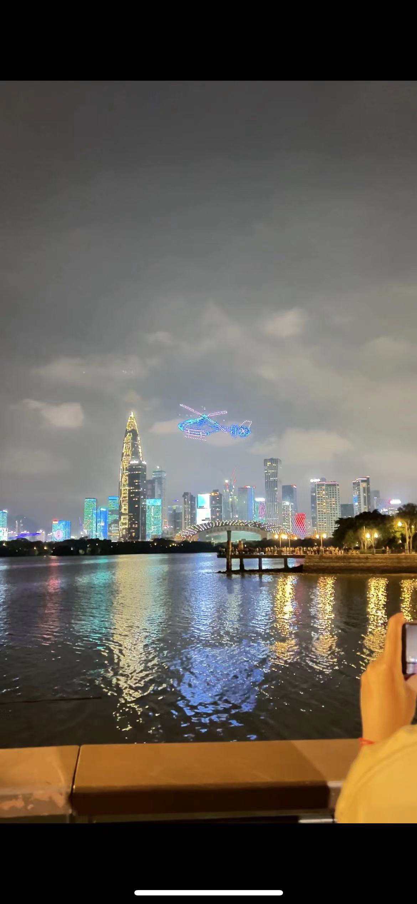

 周报5 写作、生活

这里记录的是raye在2023年，5.7-6.7这段时间的记录与思考。

大概有好几两周没写自己的记录了，这其中也发生了很多事情，有些事情不便公开发出来，那我先把能发的都发了吧哈哈哈哈

 写作

这周在自己的坚持不懈下，终于完成了两篇技术文章，不过还没有完全打磨完毕，我越来越觉得还得是给自己去设限，主动去逼迫自己，才能去客服拖延症。。

比如我发现在自己要分享之前，如果文稿还没准备完，就会强迫自己努力去准备，而且思维特别灵活，能想尽一切办法

其实拖延症无非几个问题：
1. 不敢开始，总是在想
2. 完美强迫症，一定要做到某个完美的程度
3. 经常忘记

背后其实是三个根本性的问题：
1. 畏惧
2. 强迫
3. 遗忘

于是我开始这样给自己规定，
1. 把写作用的app（我最近在用的ulysses）放到最容易碰到的位置，并且禁止自己经常打开wechat或者其他消遣工具
2. 设立期限，假设两小时后我就要给别人讲这件事，我能不能讲清楚
3. 用ticktick提醒自己，并且直接把ticktick放在手机底部的dock栏

只要去改变，收获就是免不了的。我也很开心终于能解决这个顽疾了。不过还是那句话，贵在坚持

 胡言乱语

初次之外，最近也有很多随笔类的感想，或者是触景生情，或者是偶然采撷，又或者是梦中所得，于是统统用备忘录记录下来，仿佛像个小孩在抓蝴蝶一样。当我回顾的时候，仿佛捕捉到了历史的空隙

 论流氓

现在人是该流氓的时候不流氓，不该流氓的时候，“流氓”痞性暴露，面目可憎

现代人的流氓痞性，乃事后流氓，明知自己已经痛失，无法弥补，还强赖，想通过耍流氓来获得，如泼妇骂街，如地上打滚

我想学刘邦做一个真正的流氓

何谓，真正的流氓？

昔者，吕公开宴，名流云集。我敢道贺钱万，直入上位，吃喝谈笑间，面无愧色

敢在大场面耍流氓，言谈间了无痕迹，这才是真正的流氓

所谓魏晋风度，实乃高祖遗风而已

 没来由的焦虑

深夜学习，有些焦虑，反思了下

比如我刷b站，我发现我就不会焦虑，这是为什么？因为这是一个安全地带吗

但是当我去学习的时候，我就会总是操心这个或者那个没有做完的，你不觉得奇怪吗。其实明明上床前就已经点清了自己要做的事情，后面只需要安心地去学习即可。

这种感觉就是很奇怪对不对，你也说不出来，但是这是错误的，需要改正的

一定要让一个你不熟悉的领域变成你的舒适区

 笑怼

节选自《世说新语》

王笑曰：‘卿辈意，亦复可败邪？'”
—— 你一来，我们的兴致都被败坏了

 微信和米聊

最近读到了一段雷军的思考  

> 当时小米刚刚成立，按照“硬件+软件+互联网”的“铁人三项1.0”模式，在做手机系统、筹备手机硬件团队的同时，小米在国内率先启动基于智能手机的即时消息项目“米聊”，一度获得显著的先发优势。当时我有个判断，如果腾讯在一年之内没有反应，米聊将有50%的胜算；如果半年之内有反应，米聊基本没机会。但结果，腾讯在一个月内就做出了反应，腾讯广研院迅速推出了微信，并获得了腾讯集团力量的大力支持。
> 凭借千万人同时在线的高并发后端技术沉淀和在社交关系链方面的优势，加上公司体量等综合资源的巨大优势，微信逐渐实现了对米聊的赶超。
> 小米作为一家初创小公司，无法同时支撑移动互联网即时消息和智能手机这两个千亿美元级市场的投入，于是我们放弃了米聊，把全部精力都投入智能手机领域。

我们一直只在谈论微信对米聊的赶超，却从来没有谈论过，雷军对米聊的主动放弃

所以这也解释了，为什么大部分人都无法从历史中学到经验教训。因为大家看到的都是成功者，都是幸存者，却从来没有想过“失败者”的抉择。

“失败者”的抉择，往往是最重要的

 论教育

最近读《世说新语》，学魏晋风度

深感我们的教育现在太过严肃了，没有微笑

你看看古人，一个个癫狂不羁，若要按照现在的教育评价体系，准保是一个天天被老师白眼+请家长的角，同学们也会刻意远离他

仅仅因为不合时宜，就要被孤立，就要被白眼，就要被无情嘲讽，怪不得郑渊洁要把栏杆拍遍，无情揭露教育的罪恶。中国人不仅在“性”的联想上跳跃程度大，连贬损，毁灭一个人也是如此迅速

 《蒋公的面子》

观后随笔（本来写的“观后感”这三个字，但是我很反感，我喜欢用“随笔“这两个字）

<!--  -->

人生处世，无外乎出世与入世之间，亦或居于二者之间，谁都不得罪。是成为御用文人，是选择魏晋风度，或愤而抗争到底，
却最终都在时代的裹挟中身不由己。可我们能怪他们吗，换作我们自己又有谁能做的更好呢？我们不是耐不住苏武牧羊得寂寞，亦非选择丹心垂青史的文天祥，更不是敢于为变法流血牺牲的谭嗣同。
我们终究只是历史中的小人物，在时代的推推搡搡中迎来自身平平无奇的结局

 历史“天命”的思考

我随便敲点想法，最近看渤海小吏的视频，以及他对中国历史抽丝剥茧的解读，觉得有时候冥冥之中真的自有天命

比如，同样是在汉中，历史上只有韩信一人能做到还定三秦，到了三国时期，武都大地震导致汉水上游改道，丞相北伐运粮门槛大大提高，最终星落五丈原
当我看完小吏这集的时候，真心感觉到历史仿佛真有一个天命所在，汉家的天下兴起于汉水，汉水中断，龙脉也断了，真是天要亡汉的感觉

（类似这种还挺多的，当我真正跟着小吏的脚步去回味的时候，很多时候都会有这种感慨

 真正的送别

其实真正的送别没有长亭古道，没有劝君更尽一杯酒，就是在一个和平时一样的清晨，有些人留在昨天了。

 生活

6.3 夜游深圳湾

<!--  -->

 interesting things

最近也开始经营起自己的 tg 频道了，日常分享一些文章及经验，欢迎 subscribe

[https://t.me/+4G9ohagz0iE1N2Q1](https://t.me/+4G9ohagz0iE1N2Q1)

- [https://link.medium.com/klyhSFNxoAb](https://link.medium.com/klyhSFNxoAb) 这篇讲LLM Prompt Injection安全问题的，拆解的很详细
- [https://medium.com/@arrheniuspaelongan09/my-first-bug-bounty-reward-100-in-5-min-1117d727dc2b](https://medium.com/@arrheniuspaelongan09/my-first-bug-bounty-reward-100-in-5-min-1117d727dc2b) 讲述作者发现的第一个安全漏洞

<!--  -->