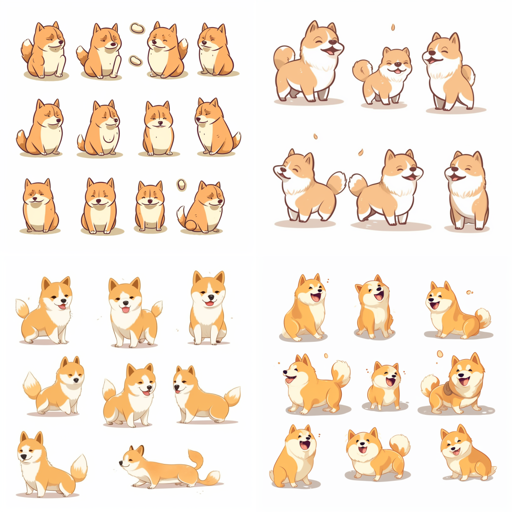

 周报6 生活、句子、写作

 生活

这里记录的是raye在2023年，6.8-6.12这段时间的生活与记录

 回信

蓝信封终于等到了回信啦~, 在一个周日的下午，阳光透过窗帘，打在雪白的桌子上，我正听着舒缓的歌曲，慢慢提起笔，写下对远方小孩的祝福

 surge

最近又开始重新折腾起surge来了， 顺便研究了下如何破解看天下杂志的会员，折腾过程写在这里了，欢迎给个点赞

[https://www.52pojie.cn/forum.php?mod=viewthread&tid=1796217&page=1pid46966807](https://www.52pojie.cn/forum.php?mod=viewthread&tid=1796217&page=1pid46966807)

 pwn

[https://xz.aliyun.com/t/12600](https://xz.aliyun.com/t/12600)

深入研究了一道 `tcache` 缓存投毒的题目，解题及思考过程都记录在这篇文章啦

 英文写作

第一次尝试英文写作，虽然有些磕磕绊绊，但终于完成了，开始慢慢积累medium的follow，希望看到的朋友支持下~

[https://rayepeng.medium.com/how-ast-injection-and-prototype-pollution-ignite-threats-abb165164a68](https://rayepeng.medium.com/how-ast-injection-and-prototype-pollution-ignite-threats-abb165164a68)

 句子

云淡风轻近午天，傍花随柳过前川。
时人不识余心乐，将谓偷闲学少年。
—— 又是一句很喜欢的诗

可能很多事就算是这样，在怔怔地看着一个既定结果时恍然，原来它一直在发生，只是自己没注意到

—— 有点丧的一句话

 胡言乱语

 论原生家庭

我觉得不应该叫原生家庭我，应该叫原生环境
不是你过去的家庭决定了你
而是你过去的环境决定了你

 深圳的雨

不知为何，深圳的雨总是让人捉摸不定
比脾气最差的女朋友还难以把握
此刻我站在街道上，被雨打湿的头发，一滴水落下来

 《无声告白》

我们终此一生，就是要摆脱他人的期待，找到真正的自己

 《可爱的诅咒》

在我们小时候，对大人的愤怒感到恐惧，也对自己得不到爱感到恐惧，但我们又依赖于照顾我们的大人，面对他们的愤怒，我们几乎什么也做不了，唯一能控制的就是自己的行为，于是我们选择了遵守那些不合理的规则来保护自己。

恐惧的记忆会留在我们大脑中一个叫杏仁体的部位，它是人脑的恐惧记忆中枢。当我们再遇到相似的情况时，杏仁体就会产生应激反应，让我们本能地去选择曾经的处理方式。

杏仁体并没有什么时间概念，它不知道我们已经长大了，所以在感到恐惧的时候，我们的大脑基本处在一个孩子的状态，所以我们会本能地选择顺从，这就是可爱的诅咒难以打破的原因。

 论眼高手低

大多数人高估了一年内他们能做的事，低估了十年内他们能做的事。

很多时候，自己往往就会因为那么几十分钟被浪费了然后焦虑不已
其实，真正的坚持在于十年之期
不要焦虑于打翻的牛奶，随时准备后重新开始

 interesting things

最近也开始经营起自己的 tg 频道了，日常分享一些文章及经验，欢迎 subscribe

https://t.me/+4G9ohagz0iE1N2Q1

- [https://vickieli.medium.com/hacking-llms-with-prompt-injections-6a5ebffb182b](https://vickieli.medium.com/hacking-llms-with-prompt-injections-6a5ebffb182b) 这篇讲解LLM prompt injection的文章写的确实很棒，担当的起深入浅出这四个字
- [https://github.com/kilimchoi/engineering-blogs](https://github.com/kilimchoi/engineering-blogs) 这个项目收录了一些互联网大公司的博客
- [https://medium.com/@neonforge/my-most-favourite-midjourney-prompts-and-images-works-best-with-midjourney-v5-63e86b125bba](https://medium.com/@neonforge/my-most-favourite-midjourney-prompts-and-images-works-best-with-midjourney-v5-63e86b125bba) 这个文章的MJ Prompt都很不错，还是要多多研究下mj的绘图技巧

