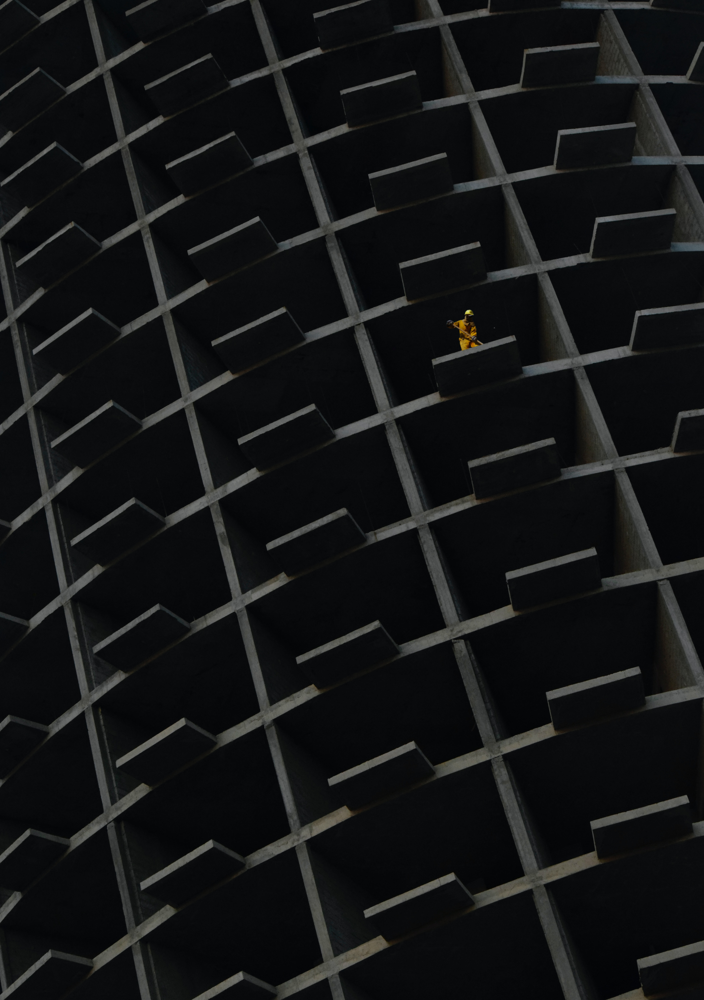

# 周报#7 我们都需要快照

这里记录的是raye在2023年，6.16~7.16日这段时间的记录、思考、故事

最近回忆自己的周报，发现很多文字、很多想法、随着时间的积累逐渐发生了变化

就像网页需要快照一样，我一直很喜欢快照这个词，在我第一次接触到这个略带生涩的术语时，我还未能参透其中的内涵

但我们真的很需要快照，需要在生活这根数轴上，录制下我们的一个个快照。照片或许是最好的一种方式，但它太具象，缺少可以把玩、品味、参悟的空间。文字，无疑是快照记录与呈现的最好方式。它足够清晰又带一点朦胧，它充满情绪却又无足轻重，它虽单一，却千变万化。以文会友，不如说是以快照会友。

写到这里，突然心中有一点触动，泪水就想夺眶而出了。我在言语上不是一个善于表达感情的人，但文字中蕴含的希冀、念想、情感，总给我一种无穷的力量，驱使着我，不断向前。

知音少，弦断有谁听

## 反思

现在是7月15日的晚上10点半，在我回顾完历史发表在xlog上的周报后，我终于开始提笔写6月下旬到7月上旬这段时间的周报了

期间真的经历了很多，我有点感觉是我工作两年多来，遇到的最艰难的一次

具体详情不便透露，但让我深刻体会到了几个关键字：pua、甩锅、信息差、老板

但凡遇到问题，部门之间一定是互相甩锅的。但重点这次不是实际的bug，而是涉及到老板、流程规范的一些问题。

但我觉得最气愤的就是，上级不去直接怼回去，反倒是利用信息差，pua底层员工（pua我都能接受了，但是你好歹怼回去啊）

而且，最让我感到痛苦的是，明明数据就那么多，我想破了脑袋，也觉得找不到更多的问题。

却偏偏要用一些pua的话术，诸如，“啊，我记得不是这样的啦”， “怎么可能数据就这么点，XXX数据不是有好几百条吗”（实际自己也不知道）

若是初入社会的我，或许还会觉得，是我思考的不到位，但是我真的很想反抗，我不想把一个很简单的事情，翻来覆去论证好几遍

而且pua的话术永远是万能的:

当然，我承认，安全的工作永远是最难做的，尤其是在大公司。安全往往是最容易背锅的，这段时间我也见识到了业务的各种骚操作，我以前觉得自己写逻辑实现的很不优雅，结果，干了好多年的老员工，设计思路也不见得好到哪里去。

同事给了我一个词：草台班子

## 关于我

好在还有xlog这样一个博客，可以让我持续不断地去发现新东西，认识新的朋友。

其实我并不是一个很挑的人，我工作的内驱力，来源永远是自身的好奇心。而且我的好奇心是不会区分对待的，只要是我没有理解的事物，我一定是有好奇心，并且抱着莫大的热忱去做的。

但是呢，首先承认我有时候会存在眼高手低的情况，觉得自己懂得很快就没有沉入下去，这是我这段时间反思的一个结果。

铺的太广，导致自己无法聚焦。看的太泛，导致自己无法深入。想得太多，导致自己无法行动。

但是，最近的工作让我无语。我不喜欢在给老板的汇报上去扣各种字眼。用我1~2周的时间，来不断浓缩出一份不到5分钟的ppt展示页。

但这就是社会食物链，营养的转换效率就是这么低

另外还有一个问题，我觉得存在很大的惯性，无法及时从一个事情中抽身，或者说当我工作了很久之后，不愿意去转换一下思路。

其实我觉得这是一个很有必要练习的事情，不是说长时间的专注不行，而是说，人是需要依靠一些身体上的运动，来刺激因为专注而疲惫的大脑。

因为我毕竟不是天才人物，我无法在长时间的专注中，一直保持有新的想法。

也许，就是当众人都开始疯狂地寻找富豪遗失的手表时，往往是最后静下心来，无意中发现的那个小孩，只是因为听到了手表的指针滴答声

## xbox&surge

Surge的授权我很早就买了，但是很长一段时间，我都将其闲置在一旁，并没有深入去研究，只是当一个抓包工具而已（几百元买一个抓包工具我还真富）

最近重新开始研究surge，不管是iPhone还是Mac，都已经总结了一些surge的用法，这块预计会出一篇文章综合介绍一下。

搬家之后，渐渐稳定了下来，于是开始思考手头的设备怎么利用起来，虽然最近xbox的游戏打的少了，但是xbox这最强机顶盒的名头不是虚的。
(xbox支持Netflix、hbo、Apple tv、hulu的4k输出，基本覆盖了我常用的流媒体）

最开始想用surge的远程代理，让xbox代理就好了。但是微软不知道怎么想的，居然没有代理这个功能。于是开始研究下还有无其他方案。

其实也有两种，不得不感慨surge真的功能太丰富了。其一是接替路由器，作为软路由，这个被否决了，因为wifi是和室友公用的。其二是通过增强模式，新增一块虚拟网卡，充当网关。

我选择了第二种方式，同时在配置的时候发现了一个坑：surge的官方文档给的DNS配置是错误的，[https://surge.mitsea.com/others/gateway-mode](https://surge.mitsea.com/others/gateway-mode) ，实际DNS配置应该是这个

这样我的xbox就可以借由mac的分流规则来实现科学上网了：

## 数字日记

Reorx 在这篇博客中提到 [https://reorx.com/blog/sharing-my-footprints-automation](https://reorx.com/blog/sharing-my-footprints-automation) ，他就像是一个生活在赛博空间的机器，执行者信息收集和过滤的工作。因此他想将过滤后的信息都统一起来，于是打造了一套n8n的自动化工作流，聚合信息输入和输出

虽然，但我更愿意称之为这是我的数字日记，这就是我在赛博空间的生活沉淀

目前在大佬博客的帮助下，已经完成了。频道地址：[https://t.me/RayeJourney](https://t.me/RayeJourney)，Raye’s Journey ，意为Raye的赛博空间的行程记录。

考虑到这方面的文章还挺少的，于是自己也打算写一篇来帮助大家完成搭建。

愿我们都有自己的数字日记。

<!-- 

  

 -->

## 蓝信封

7月，已经是和小孩子的第5封信啦！继续坚持下去

## 微信读书&阅读

4月23日那段时间参加了世界读书日的活动，终于在7月收到了微信读书的世界读书日勋章，虽然我觉得不是很好看哈哈哈哈，但是沉甸甸的分量确实很喜欢！🥰

（但是拍的照片太丑啦！🤣

<!-- 

 -->

## 羽毛球

羽毛球也找了教练，目前大班也上了9节了，一对一也上了3节。

改正了一些，主要是：
- 步法，前场开始用垫步，并且也不会再盲目后退被抓吊网前了
- 反手，虽然并不稳定，但是偶尔能打出高质量斜线
- 接杀，正手接杀还需要练习下
- 发球，努力练了一箱球，终于学会在双打的时候反手发球了
- 吊球，训练的时候打的还好，但是实战就有点拉胯
- 搓球，终于学会了网前搓球，这几天和球友的实战中也打出了好几个高质量的搓球（果然是得网前者得天下）

## 讨厌的人

纯发牢骚，诸君随意看看：

有时候真的很讨厌那些喜欢一上来就给别人扣帽子的人

我喜欢交朋友，并且欣赏别人的优点

但是我很难忍受一种人，我觉得可能是基因的天性，最喜欢对别人指指点点，凡事都以自己的是非为是非

因此，我很多时候都不会有深交的朋友，因为价值观不对，而且我不喜欢小圈子，人会被圈子所束缚

所以我经常是从一个圈子，跳到另一个圈子

毕竟朋友难得，但是相同兴趣的搭子还是容易找

## 追剧

Platonic 完结了，这部剧我真的好喜欢，其中埋的几个伏笔，最后结尾也都映照了

最后一集Sylvia和Will还是得分开了，面对着Will在路边买来的送给她的塑料花，Sylvia说道：“这花很假，很塑料。但这意味着它永远不会凋谢。”。类目了😭

由于Apple tv我不知道怎么截图，豆瓣上有一些好玩的图：

其实挚友之间，也是一种柏拉图的关系呢！

The Crown和Card of House 也还在追，慢慢看吧，都是很经典的了。其中既有伊丽莎白女王的苦楚，也有弗兰德为打击政治对手无所不用其极的手段。

The last of us 虽然上映很久了，但是最近才开始慢慢看。男主有够帅+魅力，随行的小女主真的很可爱，真的很爱这部剧

## Newsletter

以后所有的记录就都会自动同步到个人频道啦，[https://t.me/RayeJourney](https://t.me/RayeJourney)

不过也会摘录一些放在博客里：

1. [https://cali.so/blog/guide-for-cloning-my-site](https://cali.so/blog/guide-for-cloning-my-site) 介绍了快速搭建博客，不过我觉得xlog已经很值得了，重点还是持续不断地内容输出
2. [https://mp.weixin.qq.com/s/iK\_JkVRrh5vIRBjnQbDOyw](https://mp.weixin.qq.com/s/iK_JkVRrh5vIRBjnQbDOyw) 讲述如何破解滑动验证码
3. [https://zhuanlan.zhihu.com/p/629476969](https://zhuanlan.zhihu.com/p/629476969) 金山文档都支持云函数部署了，涨姿势
4. [https://www.jianshu.com/p/5685b4a1b77e](https://www.jianshu.com/p/5685b4a1b77e) 安卓网页打开app，本质还是拉起activity
