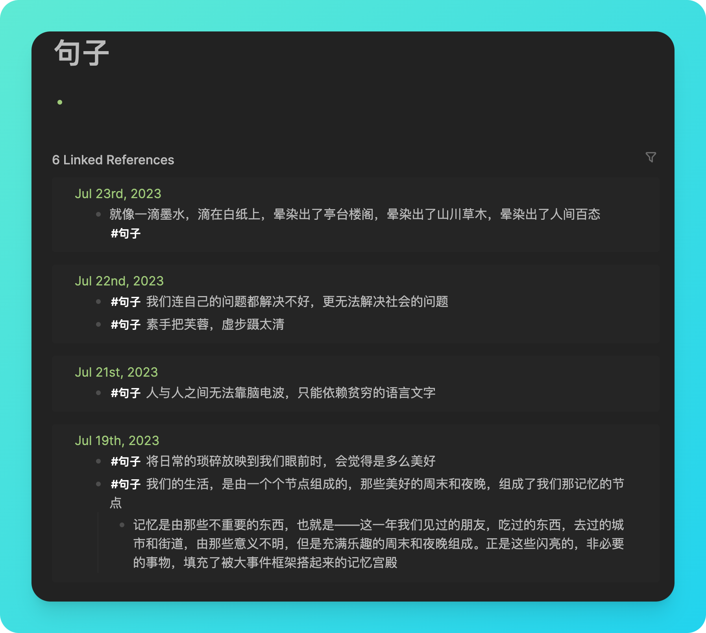
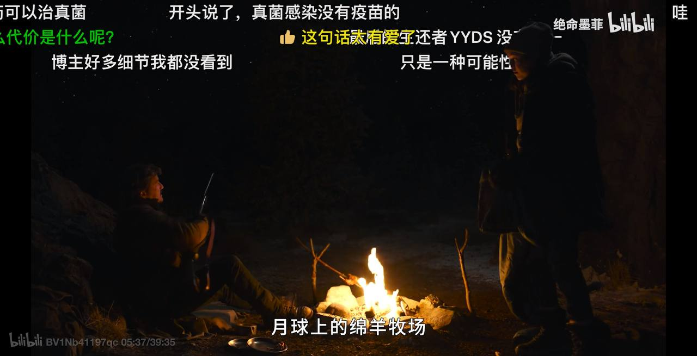

 周报8 一群人聊聊天也没啥不好

本文记录的是raye在7.17 ~ 7.23 这段时间的生活、经历、思考

> 一觞一咏，亦足以畅叙幽情。

当我在写下标题的时候，脑海中第一个想到便是王羲之在1500年前写下的《兰亭集序》，似乎就连孔子，也表达过，愿意与二三子，浴乎沂，风乎舞雩，咏而归。当真是非常向往这种生活了。

可惜生活更多的是一种淡淡的悲伤，欲买桂花同载酒，终不似，少年游。

这周开始听播客，之前不知道是由于什么芥蒂，一直没有听过任何一档播客。可能我对新事物的接触就是那么迟钝吧？我不知道为什么不愿意迈开那一步，像一个战场上的战士，明明没有炮火硝烟，却依旧匍匐不前。

当我打开播客，当我听到：

> 就像一滴墨水，滴在白纸上，晕染出了亭台楼阁，晕染出了山川草木，晕染出了人间百态

我就知道，我已经无法逃离这份属于文人墨客、属于二三子、属于流觞曲水的快乐了

刚巧，本周和零时起意读书会大湾区的书友们也线下见了个面，一起吃了一顿带有潮汕风味的午餐。

一群人，谈天说地，从自动驾驶聊到中美贸易，从无人机比赛到大厂裁员，从风险投资聊到商业本质，除了莫谈国事外，思维跳脱得很🤣

我很喜欢这种感觉，也很怕失去这种感觉。

是为本周周报序

 播客

> 就像一滴墨水，滴在白纸上，晕染出了亭台楼阁，晕染出了山川草木，晕染出了人间百态

语出看理想博客《谁在写我们这一代的故事》，[https://open.spotify.com/episode/2bpqYclJ6MXEntFjXSlzpd?si=e93972c813c3487d](https://open.spotify.com/episode/2bpqYclJ6MXEntFjXSlzpd?si=e93972c813c3487d)

真的太喜欢这段话了，我甚至想仿写一句：

> 就像一弯明月，映照在大海上，折射出了宦游羁旅，折射出了游子思乡，折射出了人间大道

（仿写的不好，见谅了）

于是这一周都沉迷在听播客中，渐渐喜欢上了这种与远方的陌生人，进行一场隔空的灵魂交流。

 书友聚会

本周二书友们就已经开始筹划周末的聚会了，自然也是很期待。我也在读书会中分享过《微积分的力量》，当时准备了好久的讲义，虽然开始讲了好几分钟才发现腾讯会议没有开麦🤣

书友们也分享过很多有趣的书籍（虽然有些由于专业隔阂，我并没有完全认真听🤣）

在序言中已经提到过交流的一些话题，自不赘述，记录下一些观点：
- 中美贸易战，没想到首先是从袜子、内裤这种轻工业产品开打的（因为中国的类似的轻工业成本已经很低了，每年大量的美国订单）。真正高大上的商战，往往都是在没有硝烟的战场，在一些细微到普通人都无法察觉的产业
- 吸管大王，垄断了全行业，但是年利润也只才3亿，延伸到最近深圳在制定高空抛物标准，实际参与标准评估会议的都是一些小公司，而这些小公司背后的利润都很高。（很多小公司，不是默默无闻地死去，就是在默默无闻地赚大钱）
- 商业的本质还是供需关系，只是很多小细节的供需你根本没有察觉到（缺少经商的基因啊）
- 一个行业如果目标特别地明确，那就可能会很卷。反倒是目标不明确，还在探索期，大家都能按时上下班🐶

（本来想放照片，但是我不知道怎么给人脸贴表情包哈哈哈哈😆）

 logseq vs Obsidian vs Notion

简单写写，后面也准备分析下这几个笔记软件的优劣（挖坑.ing）
我的笔记软件变迁路线：

最开始用的笔记软件可能已经忘了，不过最开始熟悉markdown，然后开始用 `Typora`，但是 `Typora` 的文件组织实在是不好用

后来迁移到印象笔记，因为有一个当时觉得很好用的剪藏功能，我还开了一年会员呢，并且联动的马克飞象markdown编辑器也开了一年会员

结果一年没用到，又换成了有道云笔记，确实挺好用的，而且免费

中间用了一段时间的notion，但是感觉操作好繁琐就弃了

后来在同事的安利下，尝试了obsidian，第一次接触到双链笔记，当时觉得好惊艳，于是又开始折腾obsidian

但是obsidian还是依赖传统的文件管理，并不是真正意义上的双链，并且搜索功能我也没搞懂

又切换回notion，notion确实用了很长时间，Apple的备忘录也用过，flow也用过

最近还是准备开始用logseq，发现这个才是真的香啊，有几个功能我必须得说一下：

 日记

我以前觉得每天都要写日记是一种强迫，因为我实在是没什么可写的，但是logseq转换了一种思路

不是让我去回想每天发生了什么，然后记录在日记上

而是，日记就摆在我面前，我今天的一切入口都是从日记出发的

我觉得这确实是一种新的思路，这样我每天的记录也都一清二楚，当我要回顾的时候我也能清楚的知道每天都发生了什么（有个不好的地方，第一次用的人可能会一脸懵，我tm连怎么创建笔记都不知道！）

 标签&页面

我觉得logseq第一次革命了标签的意义

我可以针对每个block都打一个标签，并且这些标签都会被自动关联到标签所对应的页面中

举个例子，比如我每天都习惯收集一些美好的句子

1. 如果在notion中，我可能需要到专门的一个叫 `句子` 的database中，添加一条记录，并且命名
2. obsidian中，我需要创建一个新的page，并且取名
3. logseq中，我则直接复制粘贴，并且加上 `句子` ，就完成了（不用取名真的太好了！）

当我只需要复制，粘贴，打tag，并且这个tag能够自动按时间顺序关联的时候，那种顺滑的感觉别提有多爽了

 Serveless服务与频道管理

最近也开始沉迷serverless服务的部署了，除了n8n、rsshub之外，也部署了几个爬虫服务，同时参考 pseudoyu 的方法，搭建了一个 `uptime` 来进行服务监控。

我的频道，Raye’s Journey [https://t.me/RayeJourney](https://t.me/RayeJourney) ，已经正式上线运营了。

虽然之前因为调试的问题，有时候一口气发了好几十条消息，不过现在已经差不多好了，欢迎关注👏🏻

日常会同步我的网易云、豆瓣、Twitter、xlog、medium、Spotify、Github、YouTube、pinboard、instapaper这些服务

搭建过程都记录在这篇文章啦[https://raye.xlog.app/gou-jian-ge-xing-hua-de-shu-zi-ri-ji--zi-dong-hua-gong-zuo-liu-shi-xian-xin-xi-ju-he](https://raye.xlog.app/gou-jian-ge-xing-hua-de-shu-zi-ri-ji--zi-dong-hua-gong-zuo-liu-shi-xian-xin-xi-ju-he "链接")，如果有问题欢迎tg私戳我 

（ps，最近xlog更新了，但是这里的图标显示有问题，其中一个Telegram我也不知道咋加上去的，实际上是错误的，不要被误导了）

--- 
更新，现在好了，原来是我不小心设置错误了哈哈哈哈😓

 追剧
《The Last of Us》 第一季追完了，我太喜欢这部剧了！（虽然3月就完结了我现在才看完）

艾莉的冷笑话，乔尔性格上的转变，最后一幕乔尔一把枪干翻火萤的场景，配合上悲壮的bgm，忍不住流泪了

这一幕好暖啊，乔尔也会讲冷笑话了🤣

可惜我没法截图，但是推荐B站up的墨菲的讲解，讲的太棒啦！
[ https://www.bilibili.com/video/BV1rP4y1k7b2 ](https://www.bilibili.com/video/BV1rP4y1k7b2) 

 历史

最近关注了安森垚这个up主，有这惊人的语速，但平凡朴实的讲述中，却又能感受到他在语言学，地理学，历史学，数学，中国传统文化等这些领域中有着很高深的造诣。

我最开始是好奇中国各省的产生与渊源，对于中国的地形，如汉中、四川、关中、南阳，这些中学地理课本上并没有讲到过的地形单元，我总喜欢探索背后的一些故事（其实也很三国历史相关啦，毕竟隆中对不就是涉及到了这几个地方吗哈哈哈）

结果在推荐中就看到了他的视频，后面陆陆续续把他讲中国文化视频都刷了一遍，做的真的很棒，增强了我的文化自信 🐶

我前段时间还在思考，周幽王烽火戏诸侯这个事情到底有没有可能，真的感觉很不靠谱啊，他的视频也详细解读了（其实所谓历史，不是现实发生的事，更多的是史官眼中的发生的事，司马迁能秉公执笔，客观的呈现已属实不易，烽火戏诸侯就当一个寓言故事来看吧😆）

[https://www.bilibili.com/bangumi/play/ep515060/](https://www.bilibili.com/bangumi/play/ep515060/) 

 思考

最近总是会莫名的焦虑，尤其是知道自己要做某个事情的时候，但是很多时候自己在忙，没空做。

结果一旦闲下来，又发现自己没了追求，一直拖着不愿意去做。

然后就开始郁闷，开始自我否定，否定完之后，又开始自我打鸡血开始搞事情

总是在这一开一合之间，有时候好累啊

还是要学会与自己和解吧🫠

 Newsletter

以后所有的记录就都会自动同步到个人频道啦, [https://t.me/RayeJourney]

不过也会摘录一些放在博客里：

1. https://github.com/RayWangQvQ/BiliBiliToolPro B 站（bilibili）自动任务工具，有必要搭建一个，不然我的大会员都浪费了
2. https://github.com/F6JO/RouteVulScan Burp路径检测扫描插件，准备熟悉下代码贡献下
3. https://book.douban.com/subject/36170929/《玻璃塔迷案》，这个反转还是有点惊人的，虽然总觉得哪里不对（比如为什么要故意留下线索给医生），但还是很喜欢
4. https://github.com/cfour-hi/gitstars 可以管理自己的Github stars项目，我提了个pr，可以部署到vercel上（其实就是写个云函数的事，很简单，但是踩了一些坑），准备后续分享一下（如果想部署的话可以参考我fork的，https://github.com/rayepeng/gitstars
5. https://mp.weixin.qq.com/s/wFaSLMOdXibubgaIgNV3iQ 如何理解产品经理，写得很深刻

