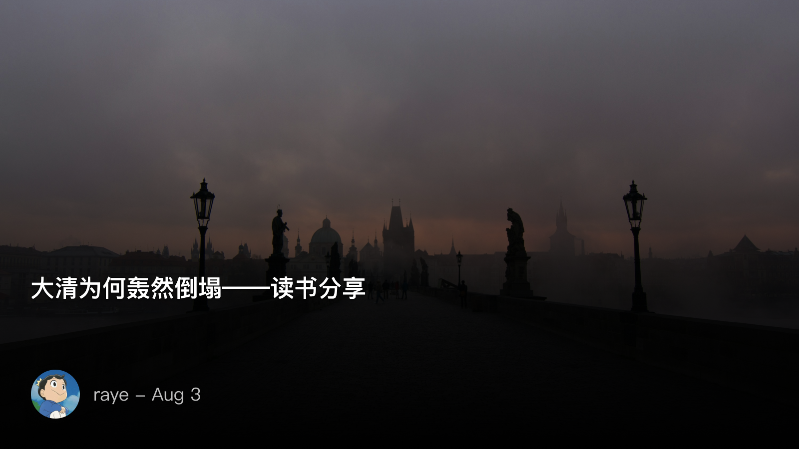

 大清为何轰然倒塌——读书分享

<!--  -->

大家好，我叫raye，应该没有人不认识我了吧，这次草地分享，给大家带来这本《大清为何轰然倒塌》

我还是第一次尝试这种草地形式的分享，时间也比较短，不知道能不能把我想要表达的讲清楚，不过我们还是开始吧

关于中国近代史，我想很多人应该都有一个基本的概念吧，1840年，南京条约签订，有没有谁记得条约内容呢？

我还记得比较清楚，主要就是赔款割地、开放通商口岸（广州福州厦门宁波上海）以及关税协定

中国近代史自此就开始了，而此时懵懂的大清王朝，还不知道，西方早就在1500年文艺复兴，进入了大航海时代，开启了近代史的篇章，我们这个古老的东方文明，已经落后于世界200多年了

那么大家知道，近代中国，“开眼看世界”的第一人是谁呢？没错，就是那位写下“苟利国家生死以，岂因祸福避趋之”的林则徐，这句诗的含义呢，就是说“如果对国家有利，我可以不顾生死。岂能因祸而逃避，见福就趋附呢”。背景则是写于林则徐虎门硝烟，抗击英军有功之后，却被朝中的投降派诬陷，发配新疆伊犁，林则徐在西安和妻子离别的时候，写下了这句诗

这也就导致了，除了知道他主持虎门硝烟之外，我们对于林则徐的了解甚少。李硕老师，也就是写下《翦商》这本书的作者，特地为林则徐写了一篇文章，记录了林则徐在新疆生活的点点滴滴，并将其在文学上的造诣，堪与苏东坡的流放生涯和诗文比肩。林则徐本是东南沿海的福建人，却被贬谪到了大西北，这让我想到了苏轼曾写到的一句词，“家在西南，常作东南别”，林则徐则是，“家在东南，常做西北别”。但他也实际践行了自己的诺言，足迹遍布天山南北，环塔里木绿洲诸城，留下了大量的诗文、日记，在他编写的《四洲志》中，还预言了沙俄将要对中国北方的侵略。

除林则徐外，晚清的汉族大臣们，曾国藩、左宗棠、张之洞、李鸿章，这晚清四大名臣，同样也是晚清四大权臣，各有各的功绩，曾国藩挽狂澜于即倒，打败了太平天国。左宗棠抬棺出征，先北后南，缓进急战，张之洞、李鸿章兴办洋务，这四大权臣，而且是汉人。钱穆先生曾在《中国历代政治得失》中全篇吐槽清朝，认为是一种建立在对汉人压迫之上，维护满族利益的制度。虽然钱老的言语上可能有不妥之处，但满汉势力的平衡则是一直在宣在清朝爱新觉罗氏头上的一把利剑。权力这个玩意，它天生就有排他性，尤其是皇权制度下，一旦你开了个口子，就再也难以收回来了。这也是这本书第一章所提到的，清朝倒塌的原因之一，汉臣势力的崛起

居庙堂之高，则忧其民，处江湖之远，则忧其君。聊完了庙堂，我们来看看江湖，但这所谓的江湖，其实和历朝历代的造反没什么两样。秦末有“大楚兴，陈胜王”，有“王侯将相宁有种乎”，汉末有“苍天已死，黄天当立”，元末有“石人一只眼，挑动黄河天下反”，熟悉的配方，熟悉的味道。如果不出意外的话，这群造反的人又将和庙堂上的权臣们来回拉扯，当然我们都知道，要么就是沦为他们功劳簿上的一笔笔战功，要么就是被后起之秀给摘了桃子。本质上，中国古代是没有革命，之有造反的。因为其本质上，都是“彼可取而代之”，“皇帝轮流坐，明天到我家”。

不过还是要介绍下这三大会党，洪门、青帮、哥老会，如果单说名字可能不知道，但如果说到他们的老大你们就会很清楚了，天地会(洪门)陈近南、青帮杜月笙、哥老会朱德。我们经常在影视剧里可以看到对，这些会党干的基本都是杀人越货的黑社会一类勾当，当然哥老会可能比较好一点。但我们不要忽视了，在孙中山屡次失败的起义中，就是他们在出力。你可以将他们看做唯利是图、我们所不齿的小人，是无法和庙堂权臣、孙中山这一类人堪比肩的，但假设我们生活在那个乱世之中，

既然已经提到了孙中山了，那我们就来讲讲最后一条线，也就是革命党人。这一次我们讲到的是一伙书生，用血肉之躯，打破了“重复重复再重复”的循环，开始第一次将“革命”这个概念给普及开来

为什么说“革命”这个词这么难理解呢？鲁迅写的特别好，他笔下的阿Q说看到革命党“白衣白甲，戴着崇祯皇帝的孝”，你看清朝都200多年了，居然还有人记得崇祯皇帝，认为这些革命党人，你们所谓口中天天的“革命”，还有鲁迅在《药》中所写到的， “他说：这大清的天下是
我们大家的”，
打破旧的思想枷锁，是一件很难的事情，鲁迅怕是深有体会
书中有一句话说的很好：
“社会主义”是给读书人听的，“打土豪分田地”才是留给未庄的阿Q们听的。“消费升级”是个玄学，“拼多多百亿补贴”才是句好口号

我在这本书的点评里写到，读近代史的时候，最痛心的不是签订了多少丧权辱国的条约，而是这其中的人，是写下「我自横刀向天笑，去留肝胆两昆仑」，为中国变法流血牺牲的第一人谭嗣同，是写下「天地方兴三字狱，但期吾道不终孤」，最后在浏阳门外被斩首，时年22岁的刘道一，是写下「秋风秋雨愁煞人」，巾帼不让须眉，在古轩亭口慷慨赴义的秋瑾

顺带一提，谭嗣同也是我老乡，浏阳现在还有一条路就叫嗣同路

《赵氏孤儿》中，公孙杵臼问程婴：“死和把孤儿养大相比，哪个难？”——“立孤与死孰难？

戊戌事败，谭嗣同对梁启超说：“程婴杵臼，吾与足下分任之。”之后从容就义。革命党人，早就将生死置之度外，只是“引刀成一快”固然不易，“同志仍需努力”只有更难。

立孤与死孰易？死易。革命与赴死孰难？革命难。

在革命事业最灰暗的时候，活下来的这些人是最不容易的，其中就有我们的孙中山同志，书中详细介绍了他在革命低谷期所做的种种努力，推荐大家直接去读原文，包括他为了筹措军饷、装备所遇到的各种困难

讲到这里呢，其实我们已经能大体知道，在晚清倒牌的过程中，汉臣、会党、革命党他们所扮演的角色，如果要按照狼人杀来做比方的话，汉臣就是女巫或者守卫，他们可能救错了人，也可能守卫错了人，会党则是平民，在革命党所扮演的预言家的感召下，一齐归票投掉了狼，最终获得了比赛的胜利

可能我的讲述不够严谨，有任何问题都可以跟我讨论，但主讲人一般会自动获得“我说的都对的”buff，哈哈哈哈，欢迎～

