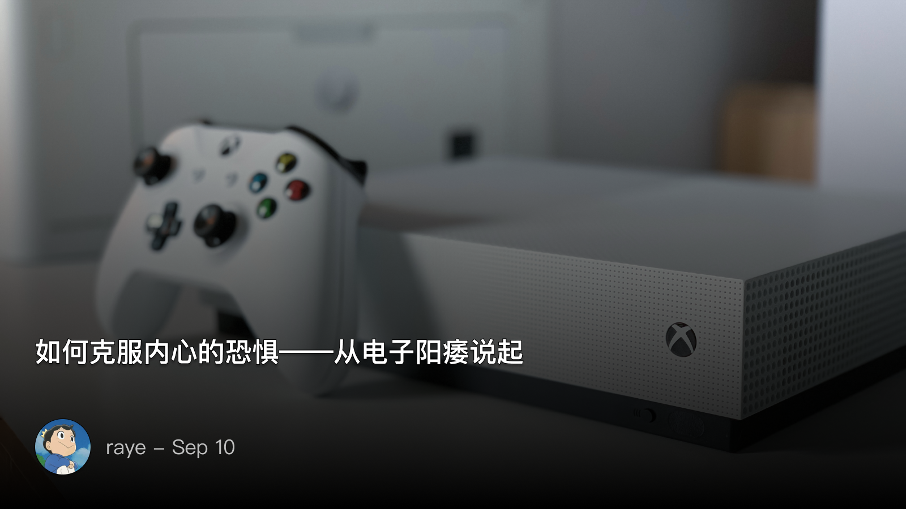

 如何克服内心的恐惧——从电子阳痿说起

<!--  -->

4-6月基本处于电子阳痿状态，简单来说就是所有游戏都提不起兴趣，觉得自己一眼就看透了游戏的玩法，也没有什么新鲜感,，进入游戏后只想着快点完成任务，遇到一点点解谜的困难、或者游戏里迷路了恨不得马上退出

连接手柄，打开游戏，似乎就已经耗费了我所有的心力。看到游戏加载界面的时候就已经产生了无数种想要逃离的冲动。当真正进入游戏的时候，只要遇到一点困难，就会觉得心力憔悴，似乎找到了一个绝佳的逃跑借口

不过我最近已经逐渐脱离这种感觉了，看到谈论电子阳痿，吐槽游戏同质化严重的文章、视频很多，反倒是如何克服电子阳痿的很少

那就来回顾下吧，我是如何克服电子阳痿的

 “该死的”XGP

首先还是要感(吐)谢(槽)一下XGP，我觉得这是我连续几个月也都没打游戏的罪魁祸首

不得不说，在我入坑XBOX之后，XGP会员提供的游戏实在是太多了🥹，多到我都已经失去了探索的动力。配合上XBOX的Quick Resume，我10分钟内能连着切换好几个不同的游戏，p5r boos打不过去了，就切到地平线开会车，开车累就了切到fifa踢会球，再切到脑航员继续探索

看上去画面很美好，但实际上，不断地切换游戏实际上严重浪费着我的精力，RPG类游戏有一个特点，就是需要不断地在游戏中探索，持续深入才能不断刺激多巴胺。而车枪球类游戏，则基本是开一局，立马就能快速获得多巴胺。这恐怕也就是XBOX特别适合玩车枪球的原因了吧

于是XBOX逐渐就沦为了地平线、fifa、光环的启动器了🤣

但是当我某一天发现，我在XGP上看简介都提不上兴趣的游戏，在steam则是好评如潮，并且是我看了一定要加愿望单购买，然后爽玩的游戏

究其原因，还是在于XBOX商店的这些游戏，社区建设实在是太烂了，只看游戏简介完全提不起兴趣

我曾经得出过一个结论，任何产品，只有你参与到社区，真正在其中发表内容，与他人互动，才算融入其中，比如xlog（没注册xlog发表文章的你还在等什么呢🐶

一个缺失了社区的平台，让人觉得枯燥没有生机，熟悉感

反观steam，玩家的评价，简介，视频，直播（虽然不一定去看）等，都让你深切的感受到，这是一个有意思的社区，这是一款有意思的游戏

还有另外一个结论，是以前在某本书上看到的，即，文学作品的有三重理解境界，即作者写作时的理解，读者阅读时的理解，读者的理解反哺作者的理解，其实放在电子游戏上也是这样

我们在可以在饥荒里重现桃花源记的静谧，让本充满凶险的未知世界也变得岁月静好，在hifi rush中跟随音乐舞动，带领伙伴们打败大反派，在p5r中重回高中时代，经历一场甜美的恋爱，在末日美国中经历生存的危机，感受伴侣的信任

这才是游戏的魅力，是我们玩游戏的最初动力

 认识多巴胺

上文提到了多巴胺，这里当然还是推荐去阅读《贪婪的多巴胺》这本书了，书中的定义如下：

> 这种对“下一个”的期待和痴迷叫作“奖赏预测误差”。我们每时每刻都在预测将要发生的事：盲盒里面是什么，下一个短视频是什么，会不会收到生日惊喜……
> 实际发生的事只要好于我们的预期，就会触发一种物质行动起来。这种物质的分泌不是源于“快乐”本身，而是预期之外的好消息带来的兴奋感。
> 这就是多巴胺，它是我们体内种植的原始动力。美国精神病学家丹尼尔·利伯曼更是在《贪婪的多巴胺》中直言：“没有多巴胺，你就不会努力。”

克服电子阳痿，其实本质上是我们对于游戏内要发生的事情已经有了预知，或是知道这个关卡的boss很难打，或是知道玩法是相同的，或是缺少自由活动的空间。

但，玩游戏是可以通过多种方式来获取多巴胺的，而我经常狭隘地理解为，只有新鲜感才是，只要新鲜感一过，那么就认为是在游戏内打工，坐牢，从而极度痛苦

那么有哪些办法可以去探索新的未知呢？我总结了几个：

 学会分析游戏

比如我最喜欢的卡牌肉鸽游戏《杀戮尖塔》，背后的组牌学问就有很多，什么时候该丢弃卡牌，什么时候该升级卡牌，配合哪些遗物，选择拿条路线

再比如klei的《缺氧》，这简直堪比理科生梦寐以求的伴侣（奇怪的比喻增加了🤣），游戏内容庞大到需要时刻查看wiki，类似的还有文明六，其4X游戏的设计理念，Gamker都有很好的分析，当你了解到游戏背后的设计时，你也会被策划的脑洞所惊叹，游戏中某些不起眼的细节，如《最后生还者2》里穿衣服的动作，你才知道原来开发成本居然这么大

 刷成就

我以前其实对成就是没有任何感冒的，玩个游戏就好了，成就更像是一种可有可无的添头，至于要刻意去刷成就，对我来说简直是不可想象的

但是当我真正关注到成就的时候，我才发现很多成就其实很有意思（当然不排除有些成就设计的很沙雕）

根据多巴胺的理论，让自己始终保持新鲜感，所以成就其实不失为一种小阶段的目标，当你看到一个隐藏成就被自己发现，努力直至解锁的过程。你就能意识到，原来成就系统似乎也不再是添头了，而是一种类似里程碑的存在。

顺带吐槽下Switch居然没有成就系统！😅

 看攻略

 不要害怕找攻略会剧透游戏，找攻略本身就是游玩的一环

玩单机游戏的过程，有时候很像是在做阅读理解题目，你的想法和出题人的想法往往不能很好地重合

所以就经常出现，啊这个说明是什么意思？这个引导是在干嘛？当遇到这类困难的时候，会带个我们深深的挫败感

但是我们又往往害怕找攻略，觉得会损害自己的游戏体验。

其实何必呢，优秀的游戏哪怕就是剧透了，你后续在自己尝试的过程中，也能体会到这个游戏背后的思考与传达的主题，更何况一千个读者还有一千个哈姆雷特呢

所以不用担心，遇到过不去的关卡就大胆的寻找别人的攻略吧

 适当“云”游戏

这里当然不是指名词上的云游戏，而是指作为一个云玩家，去云一款游戏

我最开始是讨厌云玩家的（貌似对这类人的风评也一直都很差）

但其实，你可以尝试去云一下，当发现别人玩的很糟糕，或者是弹幕中飘过一段很吸引你的文字时，你也会有一种想要去玩游戏的动力了（好想玩博德之门3啊😭）

 写在最后

其实以上的所有办法，本质上还是依靠一定的好奇心与自驱力去探索的，最大的前提其实是保持充足的精力。只有精力充沛，才能让多巴胺的刺激时刻有效

 最后的最后

如果继续扩展，其实所有的事情，不都是这样吗，只有当你开始转变思路，重新发现其中蕴藏的意义，探索，驱动，奖励，多巴胺就开始起作用了

工作、学习、生活、恋爱、社交，这一切的一切，都是如此，借用《被讨厌的勇气》这本书所说的：

> 你由于太惧怕人际关系所以才会变得讨厌自己，你是在通过自我厌弃来逃避人际关系
> 不愿意为了改变自我而牺牲目前所享受的乐趣——比如玩乐或休闲时间。也就是拿不出改变生活方式的“勇气”，

你不是因为恐惧而不敢去做，那只不过是你的借口，你要拿出的是改变思路、转换视角、重新发现的“勇气”

