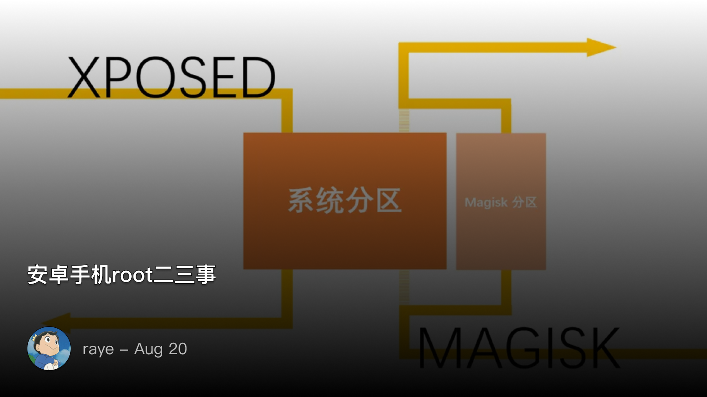
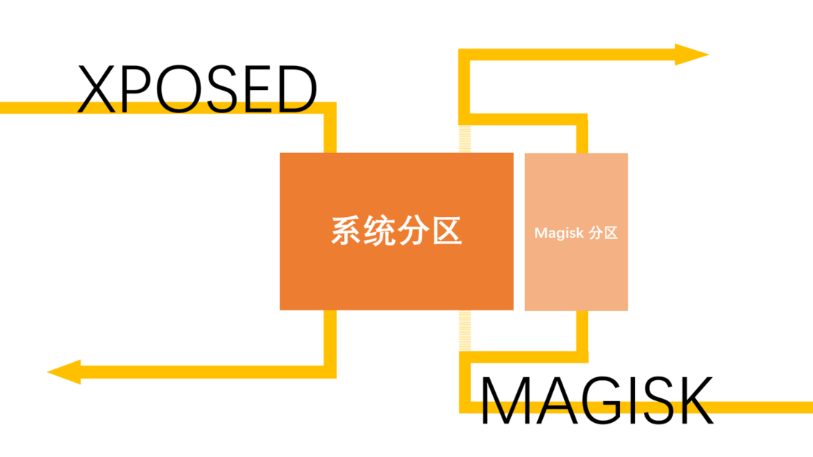
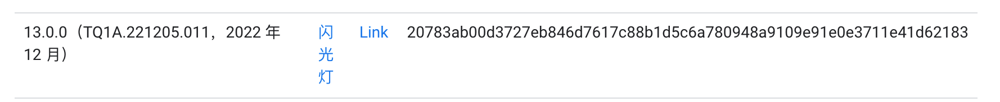

 安卓手机root二三事


<!--  -->


起因是这样的，很久之前（大概1年前吧），有一部Google Pixel5手机，是拿来做测试的。自然是少不了折腾，magisk、太极等都安排上。结果在一次操作失误后，把手机重置了。于是又只能重来一遍，结果在刷入Magisk的时候失败了，导致手机无限重启，当时还挺后悔，想着用不了了，后来就晾在一边没管了。

结果上周，心血来潮给手机充了个电，居然又能用了？时间居然真的可以修复bug吗🤣

https://twitter.com/rayepeng_/status/1691006785803673600?s=20


安卓这块确实不是很熟，于是决定恶补一下这里的知识

 一些概念

1. **OTA**

> OTA（Over-The-Air）映像是指通过无线方式传送到设备上的系统或应用更新包。OTA 更新允许设备制造商、运营商或应用开发者将更新推送到用户设备，而用户无需连接到计算机或使用其他外部工具。

简单来说就是平常系统升级的时候，通过无线的方式去下载获得的包。具体OTA升级原理是要看这个[ android ota升级原理3](https://zhuanlan.zhihu.com/p/70377497)，不过此处我们简单知道概念就好


2. **Magisk**
关于Magisk的原理，可以理解为magisk是挂载一个与系统文件隔离的文件系统来加载自定义内容，为系统分区打开了一个通往平行世界的入口，所有改动在那个世界（Magisk 分区）里发生，在必要的时候却又可以被认为是（从系统分区的角度而言）没有发生过。


<!--  -->


既然跟分区相关，那就得了解下分区是什么
类比Windows磁盘的分区，本质上是在磁盘上去划分一段段连续的存储区域，并且按照一定的格式来组织数据。就像Windows有启动分区一样，回顾下启动过程：

1. CPU执行BIOS初始化、自检等程序，加载磁盘内容到物理内存0x7c00处
2. 从引导扇区的Boot程序开始执行
3. ……

安卓本质上也是一个Linux系统，启动过程自然也是可以类比，那么这里就不难理解安卓的分区了：

- **boot 分区**：包含启动加载器需要的所有信息，如内核。
- **system 分区**：包含 Android 操作系统本身。
- **recovery 分区**：包含恢复模式的代码，用于更新、备份或恢复系统。
- **userdata 分区**：包含用户数据和应用程序。
- **cache 分区**：用于存储临时数据和 OTA 更新。

这些信息往往写在磁盘最开的几个KB中，如果你了解mbr、gpt等磁盘分区表，就不难理解了
在Windows上可以通过WinHex直接查看启动分区的内容，那么安卓如何操作呢？

可以通过dd命令：

```js
adb shell su -c "dd if=/dev/block/bootdevice/by-name/boot_a of=/sdcard/boot.img"
adb pull /sdcard/boot.img
```

由于现在安卓系统支持 A/B 分区方案，即有两个独立的系统分区， `boot_a` 和 `boot_b` ，这样的设备可以在一个分区上运行系统，同时在另一个分区上进行后台更新，然后在下一次重启时切换到新的分区，从而实现无缝的系统更新。

> 注：本质上Linux一切皆文件，boot\_a 实际指向的是 /dev/block 下的设备文件

```js
redfin:/  ls -al /dev/block/bootdevice/by-name/boot_a
lrwxrwxrwx 1 root root 15 1970-01-04 03:33 /dev/block/bootdevice/by-name/boot_a -> /dev/block/sda6
```

那么这里Magisk要做什么也就呼之欲出了，本质上就是提取 `boot.img` 的内容，然后给它打patch，实现一个Magsik的分区

3. **bootloader**

如果还记得操作系统启动流程，那么bootloader实际上一个很重要的功能就是初始化内存、加载磁盘的引导分区。所以只要能进入 `bootloader` 界面，那么手机大概率都是有救的

```js
adb reboot bootloader
```


4. **fastboot**

`fastboot` 类似于adb，可以与设备的 bootloader 通信。主要用来解锁，以及刷入

注意设备必须处于 bootloader 模式（也称为 fastboot 模式）才可以使用 `fastboot`


常用的 `fastboot` 命令：

1. `fastboot devices`：列出连接到计算机的设备

2. `fastboot flash [partition] [filename]`：刷写指定的分区。例如，要刷写 recovery 分区:

```js
fastboot flash recovery recovery.img
```

3. `fastboot boot [kernel] [ramdisk]`：不直接刷写到设备，而是仅从给定的内核/ramdisk 引导

4. `fastboot erase [partition]`：擦除指定的分区

5. `fastboot oem unlock`：解锁设备的 bootloader


 安装Magisk

大体上来说可以分为几个步骤
1. 解锁bootloader
2. patch boot.img 
3. 刷入patch后的boot.img
4. 通过Magisk Manage安装Magisk

第一步要看手机品牌而定，Google在这一块还算是比较开放的
同时，Pixel最好的一点就是，官网已经提供好了设备的image： [下载链接](https://dl.google.com/dl/android/aosp/redfin-tq1a.221205.011-factory-20783ab0.zip?hl=zh-cn)

只需要确定好手机版本号即可（不像小米，还需要有积分才能申请到开发版）


<!--  -->


下载好，解压找到 `boot.img` ，传入手机，通过 Magisk Manage 打patch，导出。

从patch后的img启动，这个操作一般是没有风险的，如果直接 覆盖则可能出问题（不过问题也不太大）


```js
fastboot boot magisk_patched-26100_nRGcd.img
Sending 'boot.img' (98304 KB)                      OKAY [2.521s]
Booting                                            (bootloader) boot.img missing cmdline or OS version
OKAY [1.577s]
Finished. Total time: 4.145s
```

启动之后，此时就能临时获得root权限。当然重启后就会失效，因为重启后还是从原来的 `boot.img` 启动

这时候可以通过Magisk Manage刷入即可，这种方式相对来说更加安全


 问题回顾

后来回顾了下，原来是这个问题：

https://twitter.com/rayepeng_/status/1691376215285010434

也有一些其他的解决方案，如关闭验证等，但是我尝试了没啥用就没管了

[ Magisk boot刷入无限重启问题 ](https://shjian.cc/magisk-boot/)

 Magisk模块推荐（内空）

本来是应该要推荐一些的Magisk模块的，奈何我已经很少用安卓了，安装Magisk的目的也就是为了root而已🤣

[ 刷了 Magisk 之后装什么？我推荐这 20+ 个模块 ](https://sspai.com/post/68531)

 参考

[ 玩机的必备操作 —— Pixel3 安装 Magisk ](https://blog.isteed.cc/post/pixel-3-install-magisk/)
[ [已解决]Pixel 4刷入Magisk在fastboot模式下找不到设备 和如何救砖 ](https://www.bilibili.com/read/cv11351314)
[ [原创] 云手机底层技术揭密 : Android系统启动与Magisk原理 ](https://bbs.kanxue.com/thread-275939.htm)
[ [原创] Magisk学习之刷入vbmeta.img及关闭avb2.0校验 ](https://bbs.kanxue.com/thread-265792-1.htm)


[]()