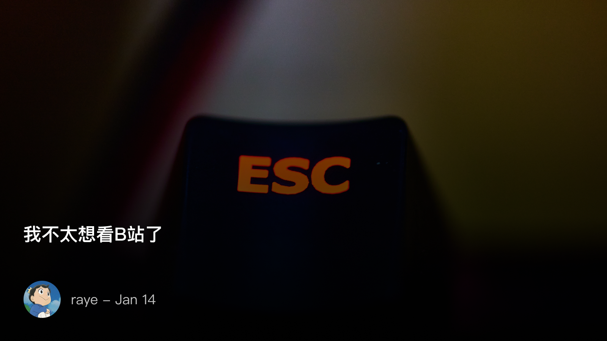

 我不太想看B站了

<!--  -->

本篇为日常记录的一些丧话，只代表那一刻我的观点，与现在的我无关🐶

停止了一段时间刷B站，感觉生活突然变得更有节奏了，也有更多的时间去看自己喜欢的内容了

看来逃避推荐真的是一件很有用的事情

昨天打开B站，首页又给我推荐影视飓风的视频，我往下划拉，大狸子、lks等等，这些我之前经常看的up视频又更新了

那然后呢？其实我也并不关注最新的ps5，lks最近整的新活似乎也没有太吸引我，影视飓风开始科普视频帧率了，这些知识于我又有什么帮助呢？

要是放在以前，这些视频必定是绝佳的放松、休闲、下饭的素材了

但是现在，我更愿意去选择我自己想看的内容，汪曾祺的《人间草木》我还没有看完，《六个说谎的大学生》重读了一遍，《山月记》在书架还一直没看呢。Duo又开始催我记单词了，这些是不是更有价值呢？

又想起了B站当年的青年节宣传片《后浪》，为什么会被人讨厌，因为它只描绘了一种生活方式，只倡导一种生活方式，可真实荧幕下的生活远不止如此，这里既有胆战心惊，时刻躲避城管的小摊贩，也有总结出每个路口红绿灯规律的外卖小哥，以及一个个奔波在路上的你我

我觉得他们都应该被看见，我开始厌恶B站上这些聚光灯下的，和我同龄的up主们

的确，大狸子的创业故事很感人，影视飓风的Tim人也很好。放在现实生活中，绝对是我很想去交往的朋友

他们并没有做什么错事，只是单纯因为出现的次数太多了，似乎每一个人都想要来分担走我的注意力，去霸占我，去给我灌输知识，去**创造知识**来给我科普

或许我并不需要这些，我也有自己的选择，我也需要学习，生活和记录

所以我还是更喜欢博客这种方式，这种随性表达的更新方式。看与不看，选择权都在读者的手中。

