 我的2023年

<!-- 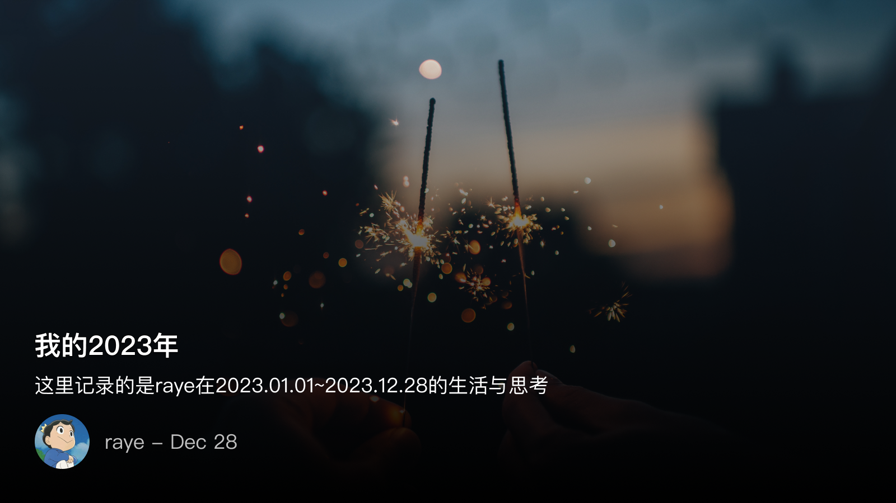 -->

匆匆忙忙的 2023 年也即将接近尾声了，在这一年中有过压力，有过失落，有过每个人都经历过的至暗时刻，有过独自登台的怅惘，也有过把栏杆拍遍的豪情
但不管怎样，总不会忘记记忆中的一些星星点点，正是这些关于挚友、关于阅读、关于旅行、关于失而复得喜悦，关于冥思苦想的明悟，关于上下求索的执迷，纵横交织，忽明忽暗，勾勒出每个人不同的风景线，描绘出独具一格的山光水色
初读到张晓风这一句的时候，只觉的浮躁的心灵瞬间被涤荡了，洗净了。盈盈一水间，莽莽深林处，被行程选择的赶路人，面对这湖光山色，还是值得贪恋几许的吧
我也曾在一篇写过的周报总结中中化用了这句：赶路人，何方走走停停呢？

我感觉写个总结应该还挺有意义的，为什么想写这个话题呢，是看到了樹程Leslie写的这篇 [ 2023 年值得持续阅读的内容平台 ](https://xlog.justgoidea.com/2023-063)虽然不是年终总结，但从他这篇文章中也能收获很多，互联网上每个人都是一个小点点，我们想逃离中心化的大平台，博客的意义，就是这其中的一座座灯塔吧，照亮每一个逃离的旅行者。

于是就拖到了现在，想着还是尽快把23年的总结发出来，其他还有想写的比如23年读过的书、追过的剧、阅读过的好文章就只能等24年我有时间再总结了（毕竟传统意义上过了春节才是新年对吧😀）

 22年给未来的自己的信
2022年12月28日11点19分，你在QQ邮箱写下了这封给自己的信。

时隔一年，时光信使，如期而至。不论时间是否给了你想要的答案，希望你们能在此刻好好聊一聊。

<!-- 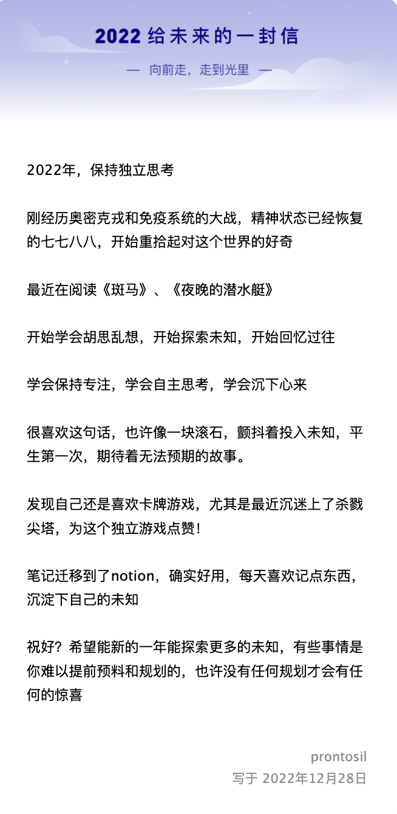 -->

要不是临时拉了一个群提醒我们，我还真就差点忘掉这回事了，未来的我，过去的你，这个对话还挺有意思的

原来那个时候你的id还叫prontosil，我想想，貌似大二时候定的，似乎是在上一门和生物技术相关的选修课，有个药物你肯定还记得，就叫做”百浪多息“，[百浪多息 - 维基百科，自由的百科全书 ](https://zh.wikipedia.org/zh-hans/%E7%99%BE%E6%B5%AA%E5%A4%9A%E6%81%AF)

当时肯定太喜欢这个名字了，我现在也不太清楚这个名字的起源，不过估计是音译的

但它就是好美啊，再势不可挡的海浪，也终将平息下来。即使经历千重的孤独。使人想起《超兽武装》的一句话，”当你经历过这七重孤独，就会成为真正的强者“

《斑马》、《夜晚的潜水艇》果然都读完了，还主持了一次《夜晚的潜水艇》读书分享，超棒！

最近一年，你的胡思乱想也着实挺多的，flomo、备忘录、heptabase、Notion、logseq、微信文件传输助手都记录下来了，不过还是有好多没有被记录下来的，最终飘散为风中的纸屑，再也找不到了吧

”也许像一块滚石，颤抖着投入未知”，估计是你从哪里随手摘录的吧，搜了下果然，就是出自你当时在读的《斑马》

卡牌游戏23年也玩了挺多，《杀戮尖塔》终于使用战士通关了一次，好难哈哈哈。以及23年最新出的肉鸽卡牌游戏阿斯特莱亚，看你买的那么积极，结果游戏时长恐怕俩小时都不到吧

笔记迁移到了Notion，结果年底的时候又迁移到了heptabase，虽然这俩软件在写作体验上都很类似，但是heptabase的白板功能可能更适合你，没事只要写下去，折腾下工具又有啥

23年，你果然探索了很多的未知，工作上的表现可能不是令人满意，有时候不要想太多，把分散的精力稍微集中一点，你想做的事情有很多，慢慢来就好了。

新的一年，祝好，也许没有任何规划的你，依旧能遇到很多意想不到的惊喜

 23年总结

自其变者而观之，则天地曾不能以一瞬

但如果要说2023年有哪些变化，我第一反应是没有，还是往常一样的摸鱼，甚至于这个稿子的开篇都是我在工作摸鱼时候写的，感觉摸鱼对于写作效率的提升是有很大帮助的🤣

以及：

还是会在上班的路上把衣服穿反了，直到吃完早餐回到工位才意识到
还是会在某个深夜开始emo，然后睡不着觉，胡思乱想
还是会抵挡不住下班后小区门口摊位传来的阵阵飘香，在一顿饱餐后开始假装自责
32楼的保洁阿姨和叔叔也都没变，每天早上都要跟她/他打声招呼
工位还是一团糟，那本《习近平谈治国理政》借过来后一页都没翻过

但真就这样么？我尝试在回忆的原野上捕捉一只只断线的风筝，偶尔还是能看到一些被风吹断线后，飘散在地上的零散纸片

记住了小区快递柜的分布，知道哪些柜门弹出的幅度比较小，需要手去抠出来
记住了小区几栋楼的分布，这样外卖小哥问我的时候就能直接指出来了
喜欢上了坐公交车，不紧不慢的听歌，观察城市里的生活
开始听播客了，喜欢一边收拾自己居住的小天地，一边听着世界那头的嬉笑怒骂
通关了p5r，真，现实时间和游戏内同步，主角过了一年，我也玩了一年（XGP入库到退库刚好一年）
开始间歇性疯狂学习英语，半强迫自己直接阅读英文原文，看生肉

茫然惊醒，原来23年就快过完了，我好像一直在虚度光阴，回过头来，晚霞依旧笼罩在这座城市

 23年我写的周报
细数下来，自己也写了有23篇周报了，其实离自己预定的计划还是差了很多的

ps.这23篇周报，刚好和23年重叠，冥冥之中自有天意吧哈哈

<!-- 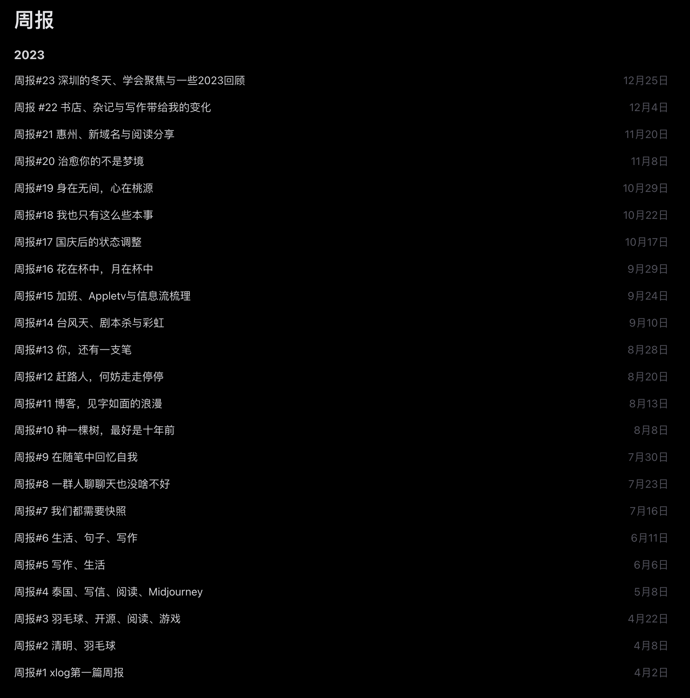 -->

毕竟我当时计划着每周至少一篇技术文章加周报，按照这个频率更新的话，预估23年周报数量要达到30多篇的

我也逐渐意识到，只有真正热爱生活，去挖掘，体会生活中的那些细节，写出来的文字自然而然就会有真情实感，不需要刻意去矫揉和装点

大学时，有幸参加过张晓风老师的一次分享，熟悉我的朋友都知道我的周报中有多次引用张晓风的句子。那还是2018年了，搜了下网上还有相关的报道，[阅读│晓风过处，至真至纯](https://www.163.com/dy/article/ES5JVFST05418WB4.html)，而我当时很不凑巧的连通知都没看到，只能在图书馆外排着队伍，等着看有没有剩余的座位可以捡漏的

印象中，晓风老师讲了很多，但是能让我记下来的却寥寥无几，只记得她最后提到一次吃橘子的经历，说她从来没有吃过那么好的橘子。我想，文学其实本身似乎与现在互联网上推崇的诸如干货等无关，它只是一种单纯的感觉，一种只存在于当下，弥散在那个小小空间的空气分子中

可能你现在读的这篇文章，也并没有什么值得摘录并日后重温的东西，但我还是在想，也许我并不关注最新的ps5值不值得买，也不关注为什么有up决定停止制作25帧的视频，我的注意力可以停留在我这一瞬念中就够了。

 23年我阅读的书

基本还是集中在历史类的书籍，但如果要说2023年我读过的书里最喜欢的一本，恐怕就是《斑马》吧

一些读过的书

历史类：
- 《太白金星有点烦》
- 《失败者的春秋》
- 《大汉帝国在巴蜀》
- 《魏晋风华：轻松读懂《世说新语》》
- 《饥饿的盛世：乾隆时代的得与失》
- 《弃长安》
- 《历史的面孔》

悬疑类：
- 《克莱因壶》
- 《玻璃塔迷案》
- 《六个说谎的大学生》

文学+历史类
- 《大医》 破晓篇和日出篇
- 《中国文化课》

社会类
- 《筚路维艰：中国社会主义路径的五次选择》

心理类
- 《被讨厌的勇气》
- 《蛤蟆先生去看心理医生》

为了时间关系（在2024年元旦之前发出来这篇文章），只能简单的做个罗列了，后面还打算再写一篇总结下这一年的阅读经历吧

<!-- 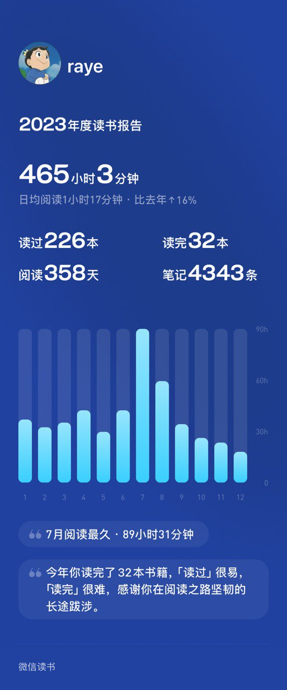 -->

<!-- 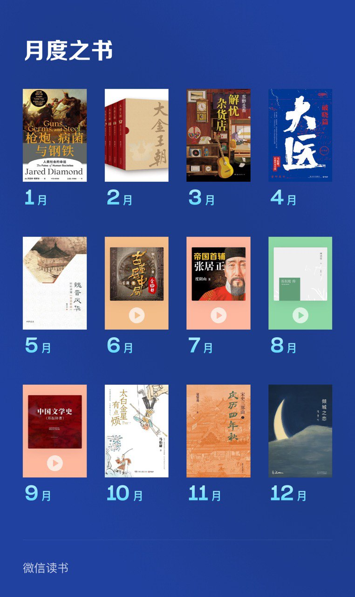 -->

<!-- 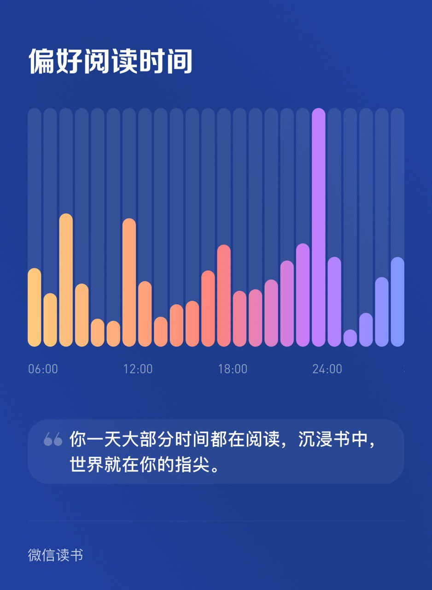 -->

<!-- 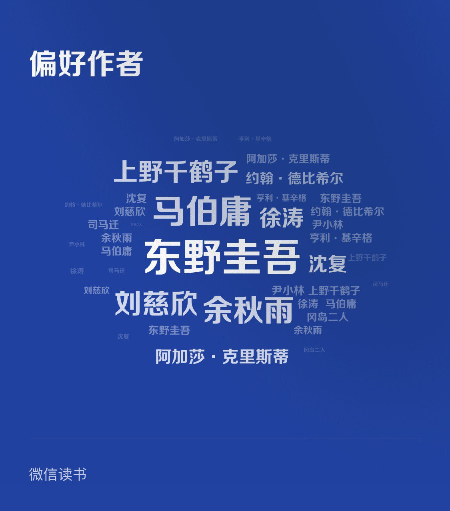 -->

<!-- 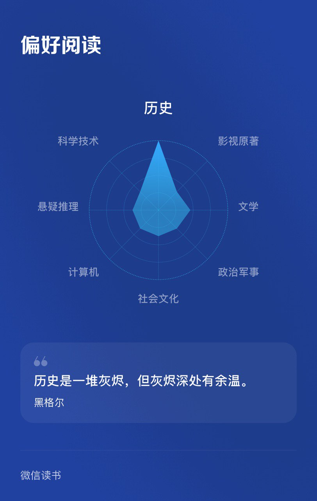 -->

 23年我的工具折腾

毕竟且趁闲身未老，喜欢折腾的心态还是一直没有变的，简单记录下今年折腾了一些啥吧

- surge 虽然很早就买了授权，mac和ios都买了，但其实一直没有正式用起来
- Apple tv + infuse 这个还算简单吧，Apple tv追美剧实在是太方便了
- 各种流媒体：Netflix、HBO、hulu、Disney+等等，不说了都是钱
- steam deck：这个我倒是没折腾，因为累了，64G反正也够用
- 软件方面：主要是Ulysses、heptabase，分别是写作和卡片笔记整理软件

 23年我的运动记录

今年主要还是羽毛球+跑步，偶尔去健身房撸铁
羽毛球细数一下：
- 断了大概预计有10根线吧🤣

🐰年断的第一根线

<!-- 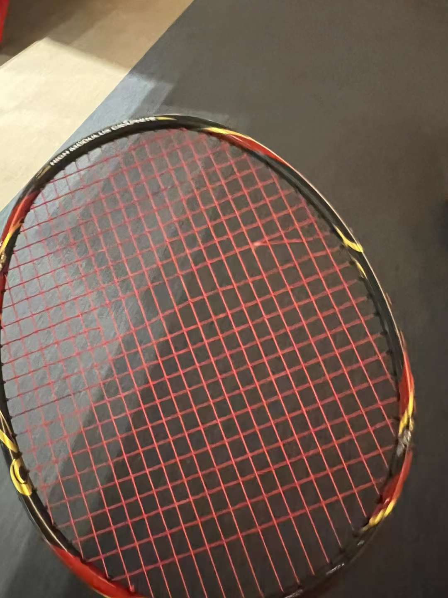 -->

🐰年最后一根线

<!-- 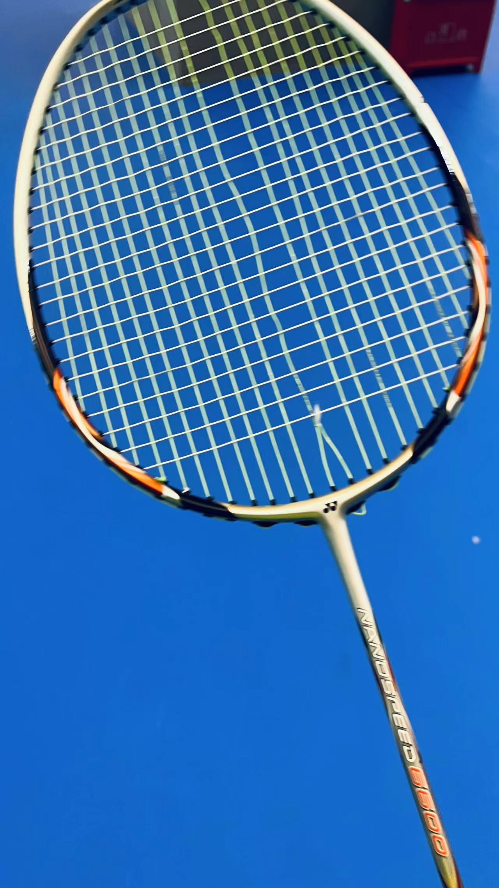 -->

全年总计打了243次羽毛球？？？数了下Fitness的数据把我看呆了哈哈哈哈

<!-- 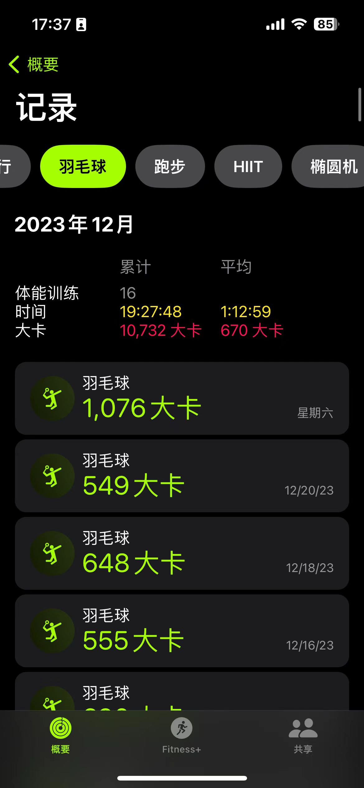 -->

如果Fitness有总结，画风可能是这样的：

你全年打了243羽毛球，你一定很热爱羽毛球吧（配图：不是在打球，就是在去打球的路上🐶

跑步17次，还是太少了

今年由于和网友拼车了Apple one全家桶，也开始喜欢用Fitness+来健身了，Apple的创意很丰富的，尤其是结合了Apple music的音乐，甚至还有Apple tv的《足球教练》特供版，可以看出Apple在内容生态这一方面的野心了🤔

