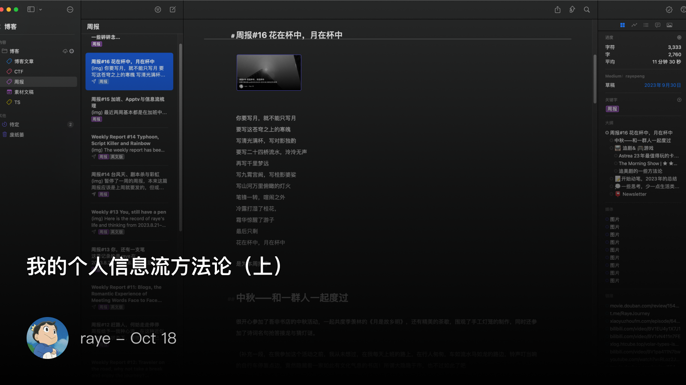
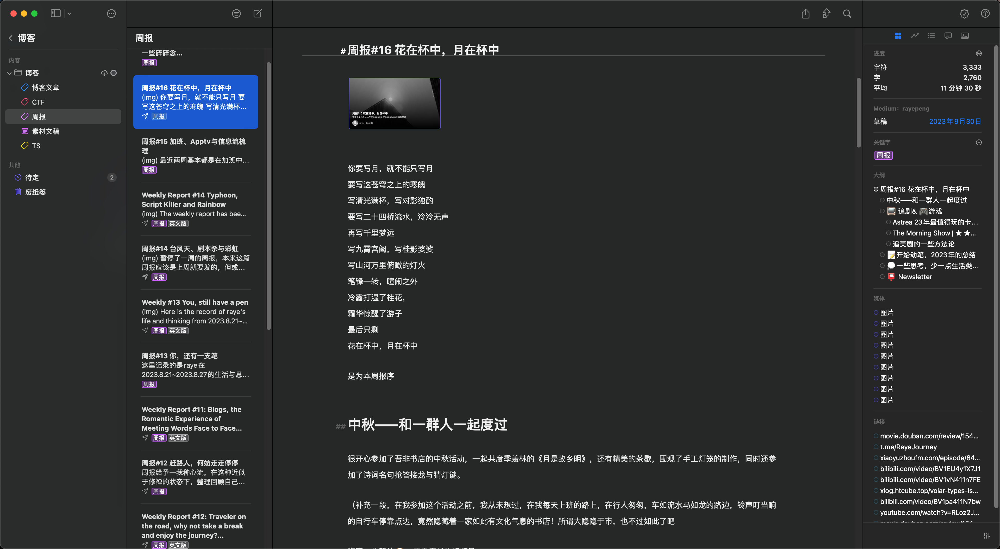
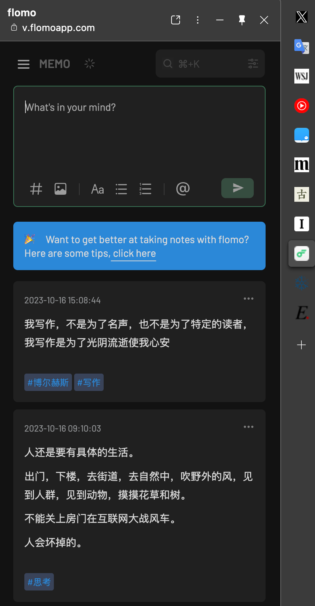

 我的个人信息流方法论（上）

<!--  -->

 为什么要做信息流整理

我是个很懒的人，但是我喜欢记录，喜欢去捕捉穿梭于神经元之间的火花。可能就像种田是根植于中国人的基因中一样，随手记录也是如此。
最早在汉武帝的时候，便设立了起居注的官员来记录皇帝的言行，为后世的史书编写提供材料。我既没有皇帝的权力，也不一定能在历史的书页角落中留下自己的名字。但我还是想为自己拍摄下一个个快照，就像一个连环画一样串联起生活中的点滴，权当做是自己的史记吧

本文则聚焦于我是如何整理自己的信息流的，包括日常信息的获取，信息加工、输出。看到大佬们都在总结自己的信息流管理系统，于是也手痒来总结下，并不聚焦于某一个特定的工具，关注的重点在于我的经验与方法论

ps. 感觉文章写下去会有点长，于是就分为两半吧，先写方法论，再写实践

 方法论

 卡片式笔记

>  减少手工的维护，繁琐的步骤会让人犯错和没有动力

上文提到我是一个很懒的人，这里的懒指的是我缺少去长期维护一个系统的动力，我希望所有的工具都是开箱即用的，并且迁移成本低、自动化程度高。正如DevOps中引入的CI/CD，其本质就是减少手工的操作，繁琐的操作步骤会让人犯错。另外一个很重要的原因则是，我会时不时地摆烂，这更导致我没有任何动力去做一个需要长期坚持维护的系统。我相信不止我一个，人的惰性是天生的，很难摆脱（即使天蝎座+ENFJ人格也不例外🐶

有很多人推崇各种方法去预先组织自己的笔记系统，将其划分为一个个子模块。这对我来说并没有什么作用，除了能画出漂亮的图之外🤣。就如同我写文章，明明规划了一堆的大纲，结果大纲写完后，反倒没有任何下笔的动力了（没错，很多文章就是这个被我咕掉的🥹）

卡片式笔记是最好的解决办法，将一个个想法快速落地为卡片，再结合标签、白板等功能，在一个下雨的晚上，或者是一个闲暇的午后，讲这些点点滴滴串联起来，输出为一篇文章，或将其内化为我自己的知识。

 工具选择

> 减少工具带来的心智负担

选择了卡片笔记的整理方式后，对于工具的选择，我更多关注的是，减少我的心智负担，轻松上手，没有任何多余步骤，不需要去思考在哪里创建文件夹，打什么标签

一旦有了心智负担，就难以沉下心来去记录了

记笔记是一件很私密的事，但我的想法经常在工作的时候冒出来，我肯定是不愿意让同事看到我写下的内容的（毕竟任何方面的思考都有xs🤣。

所以我有几个选择的原则：
1. 一定要支持黑暗模式，因为白色实在是太亮眼了，看个十多分钟我的眼睛就不舒服了
2. 一定不要强制写标题，我最讨厌的就是笔记标题，如同给变量命名一样，并且硕大的标题也就意味着路过的同事能轻易地看到你在干嘛
3. 一定是纯文本，只需要靠文字+快捷键就能基本实现我所需要的一切
4. 一定要能调整字体大小，记笔记是一件很私密的事情，但是工作的时候也常常有想法沉淀，这时我也绝对不希望路过的同事能轻易看到我的记录
5. 一定有完善的搜索，这是必须的，因为都是散乱的卡片笔记
6. 一定具备可玩性，可探索性，长期使用一个笔记软件是很困难的，尤其是没有任何可玩性的，比如记事本，人都是喜新厌旧的，用久了一个软件自然会去想着折腾新的

 专业的事情专业的软件做

写作工具我主要还是用的Ulysses

<!--  -->

好像是还挖了个坑介绍下为什么要用Ulysses写作来着（划掉🐶）

简单介绍下我最喜欢的功能吧：
- 实用的侧边栏：
	- 字数统计及目标设定，看到自己在几天内达到目标还是很有成就感的
	- 关键字及分组，类似于标签管理了，但我觉得这个关键字及分类还挺有用的
	- 批注，这个强烈推荐，我经常文章写到一半，有时要配个图or针对某个细节点完善，但又常常忘记，批注是个很实用的功能。最关键的是这个批注是扩展md语法，没有任何额外操作
- 发布：支持一键发布到medium、ghost、WordPress等地方，不过我现在最常用的就是一键发布到medium了
- 导出：丰富的导出选项，md、text、epub、pdf等格式都支持
- 搜索：搜索很简洁，也很快速实用，配合关键字分组基本随时都能定位到我正在写的文章
- 图片：图片管理可以说很有特点了，不会像其他md文档贴一张图直接占满整个屏幕🤣，也不用自己费劲调整图片的大小了
- 打字机模式：目前体验到的最丝滑的打字机模式了，有时候想法上来了，我能一口气写几千字，配合快捷键不用任何鼠标操作
- 主题：主题这个也很丰富，不过个人感觉默认的黑白配色是我的最爱，也可以单独针对标题等格式进行字体的微调

 提升转化率

> 随时打开随时写，提升笔记转换率

对于一个随时随地都有无穷无尽想法的人来说，要求很简单，随时打开随时写。我想大部分程序员每天用的最多的，除了代码编辑器之外就是浏览器了吧。

而如果你想记笔记，此时光是cmd+tab切换到对应的笔记软件就已经耗费了所有心力了，尤其是工作忙的时候还比较健忘

游戏买量领域里有一个提升买量竞争力的办法，那就是快速转换，如果用户点击了你的链接，还需要面临长达1min的白屏，那么可以想见的结果必然是用户的大量流失，为了提升买量的转化率，小游戏，轻游戏，h5游戏，试玩版才纷纷出现，本质上就是让用户通过广告进来经过短暂几秒即可快速留存并转化

因此，提升转换率，提升想法-\>文字的转化率，才是最重要的

我还是挺喜欢edge浏览器的侧边栏功能的，方便记录（摸鱼），有想法了随时打开记录就好

<!--  -->

 增加信息处理的链路

> 与其事先精心分类，不如增加信息处理的链路

信息接收与整理是并重的，甚至整理才是最重要的篇幅。
我之前陷入了一个误区，即不停地依赖更换笔记工具，来督促自己实现整理，并没有一个整理的方法论
这就导致我记录了大量的信息，散落在不同的笔记软件中，从最开始的印象笔记-\>有道云笔记-\>Notion-\>obsidian-\>logseq
就在我即将要迈入 heptabase 一去不复返的路上，我猛然惊醒，一脚踏入泥淖的同时，另一脚还还没迈出，还剩一丝机会能够逃离这个循环陷阱

我将信息处理分为多级链路：
- 草稿
- 粗加工
- 回顾与精加工
- 整理输出

每一个层级都有可以选择自己趁手的工具，比如我在草稿阶段就会选择直接记录在flomo网页上，微信读书笔记里，粗加工则是记录到logseq中

回顾与精加工则是通过logseq的标签聚合或者白板来整理，最后的输出则是转到Ulysses上

